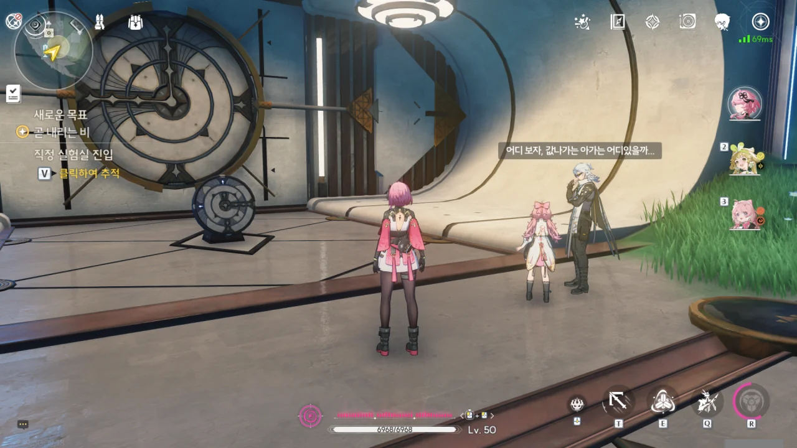
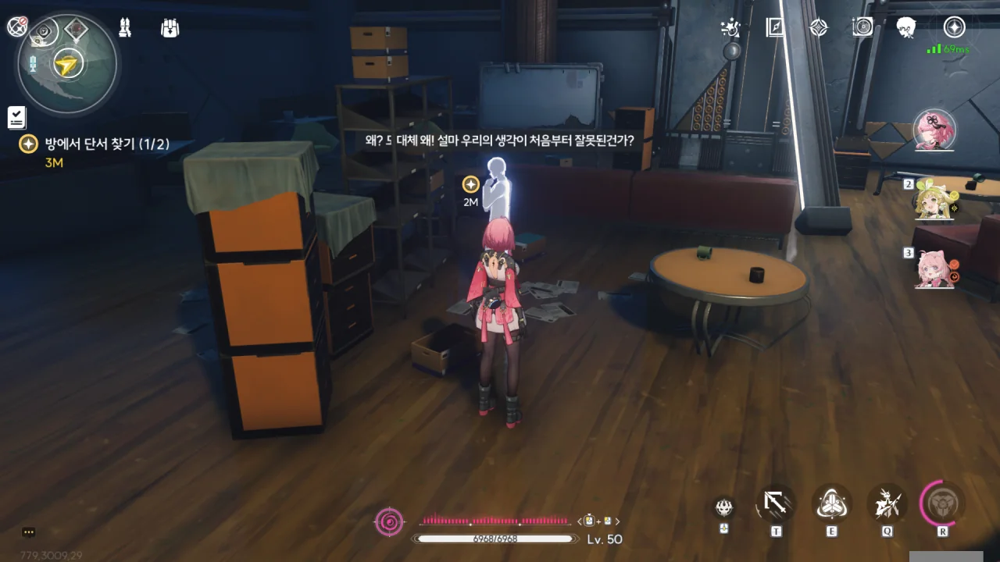
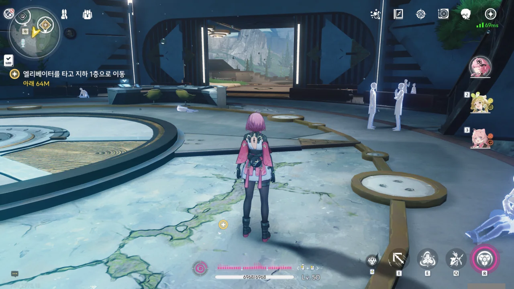



이건 여전하네.

> | | |
> |:--|:--|
> | 알토 | 눈앞에 펼쳐진 광경을 보고 있자니 시 한 수를 짓고 싶네... 큰 호수의 물이 하늘로 올라가... |
> | 앙코 | 앙코 뱃속에서 배를 탈 수 있어! |
> {_borderless=true,_thead=false}

그나마 제대로 된 번역은 다음과 같다.

> | | |
> |:--|:--|
> | 알토 | 큰 호수의 물이 하늘에서 내려와... |
> | 앙코 | 그걸 앙코가 다 마셔버리지! |
> {_borderless=true,_thead=false}

어차피 중국 시와 속담을 갖고 만든 말장난이라, 한국어로 알맞게 옮길 수 없는 문장이긴 하지만, 직역은 너무 심했다. 물이 하늘에서 내려온다는 말을 올라간다는 말로 오역한 건 말할 것도 없고.





직정은 그들이 주력하는 기관술보다, 그들이 벌인 기괴한 실험 때문에 더 유명한, 신비로운 과학 연구 조직이라고 한다.

아무래도 울음새 늪의 이상현상은 그들의 실험 때문에 생긴 것처럼 보인다.



그러더니 갑자기 내레이션처럼 말하기 시작하는 알토.

> 지금은 잘 시간이 아닌데. 왜 자기 전에 들려주는 이야기를 하는 거야?

아니, 대체 애한테 평소 잠자리 동화로 무슨 이야기를 들려주는 거야?





하룻밤 사이 직정 연구원들이 갑자기 사라졌다고 한다. 이건 확실히 의심스럽네.

> 내 실험 결과를 원하나? 원한다면 주지. 직정 유적지로 찾아와라. 내 모든 재산을 그곳에 두었다...

원피스 패러디냐?





여태껏 여러 중추 비콘과 소형 비콘을 보면서, 과연 이걸 누가 설치했을까 궁금해했다. 하지만 여태껏 거기에 대한 별다른 언급이 없어, 그냥 맥거핀처럼 넘어가려나보다 생각했는데, 「검은 해안」이 비콘을 설치한 모양이다.

세계 곳곳에 설치된 소형 비콘은 비명에 대한 데이터를 수집하는 역할을 하고, 이 데이터는 중추 비콘으로 전송된 다음 「검은 해안」에 전달되는 것이라 추측할 수 있다.

직정 사람들이 실종될 때, 직정에 배치된 비콘 역시 손상되었는데, 최근 「검은 해안」의 비명 모니터링 시스템 이상의 원인이 이 손상된 비콘 때문이라는 추측이 나왔다.





그래서 「검은 해안」은 직정에 무슨 일이 생긴 건지 파악하고 손상된 비콘을 회수하기 위해 알토와 앙코를 파견했다.

물론 알토는 검은 해안의 임무보다, 직정 유적지에서 찾을 수 있을지도 모르는 보물에 더 관심이 많다.



잔상이 한꺼번에 너무 많이 나와서 그런 건지, 알토의 잔상 감지기가 잔상에 아무런 반응을 하지 않는다.

이거... 설마 나중에 있을 일에 대한 복선은 아니겠지?







분명 저번에 여기 왔을 때에는 이 문이 열려 있었고, 그대로 아래층으로 내려가 '조립식 로봇'이라는 거대한 보스와 싸울 수 있었다. 그런데 왜 지금은 문이 닫혀 있나 궁금해했는데, 알토가 저번에 실수로 보안 장치를 건드려, 대문이 닫힌 거라고 한다.

앙코의 핀잔주며 팔짱을 낀 모습도, 어쩔 수 없다는 듯이 어깨를 으쓱이는 모습도 귀엽다.

> 어디 보자, 값나가는 아가는 어디 있을까...

으휴... 속 다 보인다.





그리 어려운 퍼즐은 아니었다.





직정 사람들이 역행비를 만드는 법을 연구하고 있었던 거냐며 놀라워하는 알토. 역행비가 뭐길래?



하늘바다에서 내리는 고밀도의 울림 에너지가 바로 역행비라고 한다. 역행비에 젖은 사람들은 과거 빗속에서 일어난 일들의 환영을 볼 수 있다고 한다. 신기하네, 에너지는 위에서 아래로 흐르는데, 정작 빗방울은 아래에서 위로 흐른다니.

지금 밖에 끊임없이 내리는 비 역시 직정의 연구로 인한 것일 거라고 말한다.





역행비는 총 세 단계로 이루어져 있다.

1. 가랑비: 우리가 아는 가랑비와 다르지 않음
2. 「서스펜드」: 빗방울이 공중에 멈춘다

마지막 세 번째 단계가 무엇인지는 듣지 못했다.

과거에 있었던 일을 환영으로 다시 볼 수 있다는 역행비의 특성 때문에, 자기 인생의 특정 경험을 재현하거나 이미 죽고 없는 사람을 다시 보고 싶은 사람들이 개인 단위로 역행비에 대해 연구했다고 한다. 

하지만 여기 직정의 역행비 연구는 규모도 규모거니와, 연구가 상당히 진행된 것으로 보인다.



건물의 전원을 복구할 수 있는 방법을 찾아야 한다.



연구 비망록을 보면, 여기서 역행비 연구를 진행한 세력은 직정이 아닌, 직정이 남긴 시설을 이용한 것에 불과한, 별개의 연구 집단인 것으로 보인다. 그렇지 않고서야 '이 고대의 기관술'이란 말을 쓸 리 없잖은가.

이 집단은 헤이센 교수를 주축으로 하여, 외부의 방해를 받지 않고 연구를 진행할 수 있는 환경인 울음새 늪으로 이전했다.





대체 무슨 기관을 말하는 건지 이해하지 못해서, 대충 "폭력으로 만든 기적이죠"라고 대답했다.





앙코는 그냥 귀엽다.



이곳으로 이주한 지 얼마 안 된 시점의 연구원들의 환영인가 보다.







잔성회? 잔성회가 왜 여기서 나와? 정확히 누구인진 모르겠지만, 이 연구 시설은 잔성회의 후원을 받아 만들어졌다. 잔성회가 자금을 댔기 때문에, 이들의 실험 방향은 잔성회의 통제를 받을 수밖에 없다. 이들이 목격했다는 「기적」, 「신의 자취」는 대체 뭐였을까?

그나저나 '헤이센'인지 '하이슨'인지 하나로 통일해 줬으면 좋겠다.

이 남자는 자신들의 생각이 처음부터 잘못된 것이었는지 고뇌하고 있다.





2단계에 성공했다는 「인공 역행비」. 시설 로비에 있는 정체된 물방울이 바로 이걸 말하는 건가 보다. 하지만 이 남자가 말하는 '이 문명'이 어떤 문명을 말하는 건지 잘 모르겠다. 잔성회 간부인 스카도 저번에 '새 문명'을 언급했거든.

「인공 제어 무음구역」이라는 말을 보면, 여기서 인공 역행비뿐만 아니라 인공 무음구역까지 연구한 모양이다. 대체 왜...?









'실험체 AO38'이 정확히 무엇인진 모르겠지만, '「신」의 문명'을 언급하는 걸 보면, 잔상 같은 게 아닐까 생각된다.

그도 그럴 게, 스카가 밝힌 잔성회의 목적은 명식을 모아 세상에 「진정한 비명」을 가져와 새로운 세상을 여는 것이다. 그런 잔성회가 아무 이유 없이 이 연구 조직을 후원했을 리 없다. 분명 이들의 연구에서 잔상 혹은 비명을 이끌어낼 무언가를 보았기 때문에 이들을 후원했겠지. 즉, 이 연구원들이 생각하는 「신」이라는 것이 비명일 가능성이 높아 보인다.

아무튼, '실험체 AO38'의 주파수가 항상 「배고픔」의 특징을 보이며, 그 탓인지 연구실 물건이 이유 없이 사라지거나 한밤중 실험실에서 이상한 소리가 들린다는 이야기를 나누는 두 연구원.



여기선 또 '헤이센' 교수라고 적어놨네.

37번 실패했는데 37명의 연구원이 목숨을 잃었다고 한다. 설마... 인신공양 같은 걸 한 건 아니지? '사람으로 만든 ■■' 같은 건 그리 보고 싶지 않은데...



'헤이젠' 교수 ㅋㅋㅋㅋㅋㅋ... 헤이젠 교수는 가족과 함께 하기 위해 돌아갔다고 적혀있지만, 그 밑에 적혀 있는 내용을 보면, 다른 연구원들과 마찬가지로 실험체에 흡수당한 모양이다.

아무튼, 이들이 벌인 실험의 끝은 모두가 실험체에 먹히는 결말로 끝났다.



얼씨구, 이젠 잔상까지 나오네.







헤이센 교수로 보이는 남자의 독백이다.

> 그들은 우리의 「과거」이기도 하지만, 또한 우리의 「미래」이기도 합니다.
> 과거의 미래에서 온 사람이여... 다시 한번 우릴 구해주십시오...

뭔가 이해하기 어려운데... 아무튼, 이 남자는 자신에게 남은 시간이 얼마 없다는 사실에 조급해하다 잘못된 길로 접어들었고, 그걸 알아차렸을 때에는 너무 늦었다고 말한다.





응? 방금 뭐였지? 분명 역행비 속의 환영일 뿐인 존재가 방랑자를 똑바로 바라보다 사라졌다. 게다가 저 여자, 맨 처음, 방랑자의 가슴팍에 손을 박아 넣은 그 여자잖아. 게다가 흰색 일색이던 다른 환영과 달리 이 환영은 색깔이 어느 정도 살아있다.

대체 뭐가 어떻게 돌아가고 있는 거지?





알토는 방랑자에 대해 짐작하고 있었던 게 있던 모양인지, 저 여자가 익숙하다고 방랑자가 말하자 "역시..."라고 말한다.

데이터 비콘 신호 발원지는 저 밑에 있다고 한다.

아까는 없었는데, 로비에 사람들의 환영이 보인다. 그들과 대화할 수는 없었지만.





아, 그래. 이럴 것 같더라. 그 보스를 괜히 여기에 집어넣었을 리 없지.

> 우와, 엄청 큰 철판 괴물이다.

ㅋㅋㅋㅋㅋㅋ 하지만 저 철판 괴물이 데이터 비콘을 삼켜버린 모양이다.



철판 괴물의 눈에 불이 들어오더니, 바닥으로 떨어진 다음 덤벼든다.





아하, 알토의 역할은 적의 약점 파악이고, 앙코는 직접적인 전투를 맡는 거였구나. 평소에도 이런 일이 잦았던 것 같다.

이 녀석의 약점? 그냥 때리면 죽는다. 어때, 정말 간단하지? 처음 만났을 때에도 그냥 때리니까 죽더라고.



응, 앙코 엄청 강해. 그러니까 내가 메인 딜러로 쓰고 있지.









여기 연구원들은 직정과 관련 없는 별개의 연구 조직의 구성원이라는 점을 제외하면, 꽤 괜찮은 추측을 해냈다.



아, 그래. 드디어 질문 타임이다.







「검은 해안」은 비명을 연구하고 관측하는 기관이며, 각국의 비콘과 연결되어 있다.

'검은 해안'은 실존하는 지역으로, 아주 거대한 흑석으로 이루어져 있으며, 「검은 해안」이 쓰는 엄청난 양의 에너지는 전부 이곳의 흑석에서 충당한다고 한다. 「검은 꽃」 역시 '검은 해안'에서 나오는 울림 에너지의 영향을 받아 만들어진 거라고 한다.

'검은 해안'이 왜 비명을 관측하고 예측하는데 좋은 위치인지는 잘 모르겠지만, 「검은 해안」은 각지에서 수집한 비명의 조석 시간을 통해 비명의 발생 법칙을 요약하고 이에 대한 조기 경보를 각국에 제공해 이에 미리 대비할 수 있도록 돕는다고 한다.









「검은 해안」 역시 방랑자를 계속 지켜보고 있었다. 이들이 방랑자를 미행한 것 역시 금희와 마찬가지로 방랑자를 신뢰할 수 있는지 없는지 확인하기 위해서였고.

「검은 해안」에 온갖 실력자가 모였다는 건 좀 신기하네. 그런데 왜 카멜리아 같은 변태를...?









> 좀 제정신이 아닌 것 같아 보이긴 해도, 어엿한 우리 조직의 구성원이야.

'좀 제정신'이 아니라 '많이 제정신'이라고 말해야 할 것 같은데...

카멜리아가 이번 임무를 수락한 건 오직 방랑자 때문이라고 말하는 걸 보면, 검은 해안 역시 카멜리아의 유별남을 이미 잘 알고 있는 모양이다.







비명 모니터링 시스템의 예측에 따르면, 다음 「명식」의 부활 장소가 금주였기에, 이 정보를 금주에 전달하기 위해 금주에 온 것이라고 한다.

「명식」은 한 지역을 붕괴시킬 수 있을 정도로 강력하다고 한다.



> 제가 검은 해안과 무슨 관계가 있는 거죠?



알토는 검은 해안의 초청 멤버라, 검은 해안의 비밀에 대해서는 잘 모른다고 한다.

하지만 이번이 방랑자가 처음 깨어난 것이 아니라는 것과, 이전에 깨어났던 장소가 검은 해안이라는 정보를 알려주었다.





검은 꽃이 검은 해안으로 가기 위한 열쇠라니, 이건 좀 신기하네.

이들도 금희와 마찬가지로, "잠깐동안 몇 마디 나눈 걸 갖고 우리에게 합류하길 바라는 건 아냐"라고 말한다. 그에 비해 잔성회는 "너, 우리에게 합류해라! 안 하면 콱!"이라고 대놓고 협박하는 걸 보면, 아직 갈 길이 멀었다.





데이터 비콘을 검사하던 알토가 뭔가 이상을 느끼더니 바깥으로 뛰쳐나갔다.



> 알림
> ***
> 긴 스토리에 진행할 예정입니다. 지정된 임무 지역을 벗어나면 현재 임무 프로세스가 중단되고 마지막 저장 지점에서 중단된 임무를 이어서 진행할 수 있습니다.
{.bq}

원신에서 이런 식의 알림 메시지가 나온 건 폰타인이 처음이었지. 다만 원신에서 본 메시지는 '현재 임무 지역을 벗어나면 임무 경험이 저하될 수 있습니다'라는, 한발 늦은 메시지였다.

검색해 보니 어차피 여기서 제5막이 끝난다고 하니, 여기서 잠깐 끊기로 했다.
