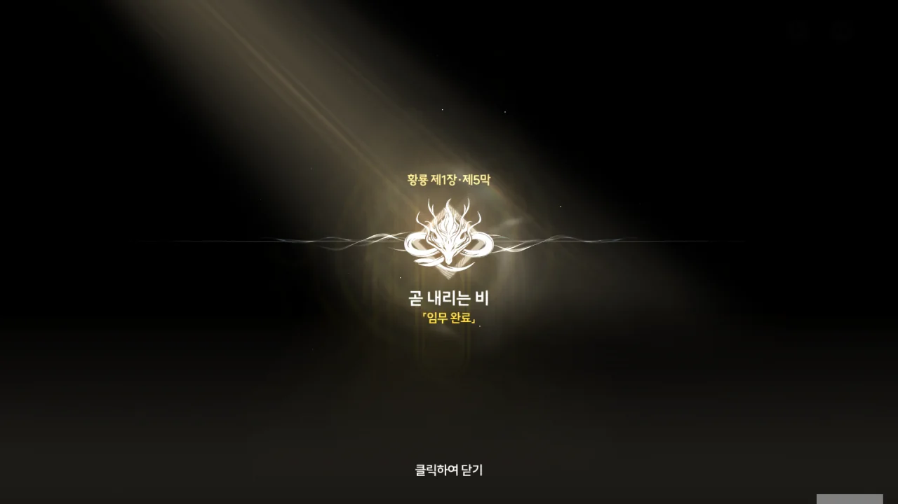
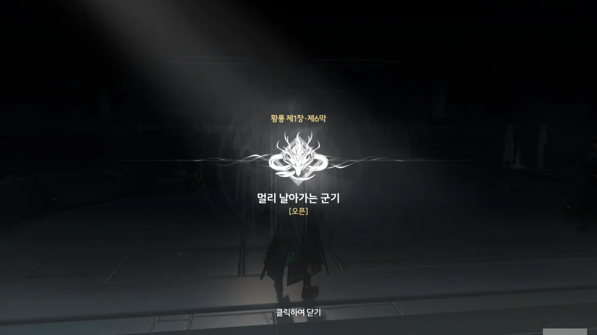





알토를 따라 밖으로 나와보니, 비가 억수로 내리고 있다.

그냥 폭우였으면 했지만, 안 좋은 예감은 이럴 때에만 항상 들어맞는다. '고작 그 정도로 역행비라고? 이게 바로 진정한 역행비다!'라고 말하는 듯이, 진짜 역행비가 내리고 있다.



> 방랑자, 금주가... 잔상류가 쳐들어왔어요!

뭣? 잔상류가? 잔상류는 전방에서 잘 막고 있는 거 아니었어?

설마 북락 광야에서 잔상류를 막고 있던 야귀군 부대가 전멸한 건 아니겠지? 방랑자가 가야 할 곳이 바로 거긴데...

제1장 황룡 제5막 \[곧 내리는 비\] 완료. 이 부분은 굳이 이전 글에 붙여 넣을 필요는 없겠네.







금주에 잔상류가 쳐들어왔다길래, 북락 광야에 있던 야귀군이 전멸한 줄 알았다. 그런데 이 상황을 보니, 그건 아니었나 보네. 그럼 대체 금주로 쳐들어온 잔상류는 어떻게 들어온 걸까?

'하늘바다'라는 말이 허언이 아니라는 듯, 정말 하늘에 거꾸로 뜬 바다가 조용히 일렁이고 있다. 저번에도 내가 이런 장면을 본 적 있었나?

전투원의 수가 500이라 했으니, 여기 있는 부대의 규모는 대충 대대 정도일 것이다. '역행비 저항제'는 역행비로 인한 환각을 줄여주는 효과가 있지만, 환각을 완전히 막아주진 못하는 모양이다.



역행비가 잦은 지역과 관련이 깊을수록, 환각과 실제를 구별하기 힘들어진다고? 그런 사람들은 눈앞에 있는 사람이 진짜 사람인지 「유령」인지 도저히 분간할 수 없겠네...

역행비는 단순히 희끄무레한 유령을 보여주는 게 아니라, 사람에 따라서는 실제와 구별할 수 없는 환각을 보여주는 것이었다. 이건... 굉장히 위험한데.

제1장 황룡 제6막 \[멀리 날아가는 군기\] 시작.

군기가 멀리 날아간다... 영어명인 Grand Warstorm와 비교하면 굉장히 불길한 제목이다.

이 제목을 보고 생각난 건 반지의 제왕 영화에서 로한의 깃발이 바람에 풀려 날아가는 장면이었다. NG 장면이었지만, 로한의 운명이 경각에 달했음을 묘사하는 것처럼 보여 그대로 썼다고 하더라고.

금주의 운명도 경각에 달하는 건가?







본래 역행비는 단순한 환상만을 보여주는 현상이지만, 「곡도 전쟁」 당시 내린 역행비는 명식의 힘 때문에 예기치 못한 효과를 부수적으로 지녔던 모양이다. '피로 얼룩진 또 다른 칼날', '금주가 두 번 다시 감당치 못할 비극'이라고 하는 걸 보면, 역행비 때문에 유혈사태가 벌어진 건 확실하다.





군대에서 레이스가 마지막으로 열린 건 3년 전. 3년 전, 어떤 큰일이 있었음이 분명하다.







본래 흑석 무기는 공명자가 써야 제 성능을 발휘할 수 있지만, 공명 어빌리티가 없는 비공명자를 위한 흑석 무기도 한때 개발한 듯하다. 하지만 비공명자에게 주는 과부하 문제 때문에 비공명자를 위한 흑석 무기의 출력은 크게 제한되어 있었고, 그 탓에 실제 전투에서 큰 효용을 보지 못한 것으로 보인다.

가서림 장군의 뒤를 이은 기염은 공명자를 전투부대로, 비공명자를 지원부대로 재편성해 이러한 비효율을 크게 개선했다.







3년 전, 가서림 장군이 세운 북락 광야 지형에 대한 배치 방침은 여전히 유효한 것 같다. 다만 기염 말처럼, 적 전력의 변화를 고려해 전략의 재구축이 필요하겠지만.





음? 이 검, 가서림 장군이 쓰던 검 아냐? 검신과 칼자루 연결부에 감긴 검은 사슬, 검신의 검은 불꽃 무늬... 양양이 이야기보따리를 풀 때 나온 영상에서 묘사한 가서림 장군의 검의 특징과 일치한다.

영상에 나온 가서림 장군의 검은 본래 굉장히 컸지만, 영상 마지막에 땅에 박혀 보랏빛 불꽃에 휩싸이더니 이렇게 가느다란 검으로 변했다.





> 일부 공명자에게 배포했고, 나머지 비공명자들도 준비됐습니다.

어? 뭔가 좀 이상한데. 현재 야귀군 전투부대의 대다수는 공명자이다. 그런데 이 군사가 하는 말은 그와 정반대잖아. 기염이 주먹을 꽉 쥔 것을 보면, 그 역시 군사의 말에서 이상한 점을 눈치챈 모양이다.

설마, 이 군사는 진짜가 아니라 역행비로 인한 유령인 건가? 장군이 되기 전, 기염의 직책이 군의관이었다고 들었는데...







그럼 그렇지. 기염이 군사에게 그 군의관의 이름을 묻자, 기염의 이름이 튀어나온다. 그와 동시에 군사의 모습 또한 다른 유령과 마찬가지로 희끄무레하게 변하더니, 그가 죽을 때의 모습을 재현하고는 사라졌다.

이 환각, 정말 질이 나쁘네...





이번엔 기염 뒤에 가서림 장군의 환영이 나타난다. 이름이 '???'로 되어 있지만, 환영이 하는 말을 들어보면 가서림 장군의 환영임을 알 수 있다.





지금은 대역죄인 취급받는 가서림 장군이지만, 당시 그의 판단이 틀렸다고 할 수는 없다.

여태껏 금주를 위협해 오던 명식, 무상선주가 북락 광야에 나타났다. 만약 이 명식을 제거할 수 있다면, 금주는 더 이상 잔상류와의 끝없는 소모전을 강요받지 않을 수 있다.

기염이 우려했다는 역행비 역시, 역행비로 인해 나타난 환영은 그저 환영일 뿐 물리력을 행사할 수 없다고 알려져 있었으니, 비가 심상치 않다고 한 기염의 우려는 그저 기우로 생각되었을 것이다.

군사 환영이 말했듯이, 지금이 유일한 기회라고 사람들이 생각한 건 어찌 보면 당연한 일이다.





> 이 전투의 대가가... 열 명, 백 명, 천 명의 희생이라고 할지라도... 우린, 반드시 승리할 거다.

지휘관은 병력 손실을 너무 두려워해서도 안되지만, 반대로 이렇게 병력 손실을 아무렇지도 않게 생각해서도 안된다.

저번에도 말했다시피, 병력은 곧 현재와 미래의 노동력이다. 만약 그 모든 병력을 명식에 꼬라박아 이겼다고 해도, 현재와 미래의 노동력을 상실한 금주가 과연 얼마동안 버틸 수 있을까? 베이비붐도 엄연히 한계가 있다.



'지금까지 한 말, 전부 헛소리인 거, 아시죠?'라고 말하듯, 가서림 장군 환영의 뒤에 잔상이 나타났다. 딱 봐도 기염을 노리고 있다.

이렇게 대놓고 '너 한 번 엿 먹어봐라'라고 잔상을 꺼낸 이상, 저 환영의 말은 까맣게 잊어버려도 좋을 것 같다. 환영의 말에 영양가가 조금은 있을 줄 알았는데, 까고 보니 제로 칼로리였다.





쯧, 잔상은 한 번으로 족하지 않나? 왜 자꾸 장소를 옮겨가며 잔상을 꺼내는 거야? 사람 귀찮게...







> 우리가 싸우는 이유는 주변의 모든 것을 지키기 위해서입니다.
> 그들을 소중히 여기는 것은 나약함이나 두려움이 아닌... 믿음 때문입니다.
> 하지만 승리는, 끝없는 희생 위에 세워져서는 안 됩니다.

기염은 자신이 생각하는 바를 가서림 장군의 환영에게 말한 후, 환영을 자신의 검으로 갈라 없애버린다. 어휴, 속 시원해.





전방 무음구역에서 고밀도 주파수가 감지되었으며, 「달빛」 역시 차츰 채워지고 있다고 한다.

&nbsp;

하늘에 뜬 달이 비정상적으로 크다. 저 달은 진짜 달이 아니다. 아마 명식과 관련한 환상이겠지.

진짜 달이 저렇게 가까이 다가왔다면, 모행성의 로슈 한계를 넘었을 가능성이 매우 크다. 로슈 한계를 넘은 천체는 천체 앞면 부분에 걸리는 중력 가속도와 뒷면 부분에 걸리는 중력 가속도의 차이 때문에 주욱 늘어지다가 결국 찢어지게 된다. 이러한 붕괴는 천체의 조각을 이루는 물질 자체의 전자기적 결합력이 중력보다 더 커질 때까지 계속된다.

물론 모행성 역시 멀쩡하진 않을 것이다. 모든 천체는 중력을 지니고 있으므로, 천체의 중력에 의해 모행성의 지표면이 뒤집어진다. 천체의 기조력 때문에 조수 간만의 차가 급격히 늘어나 밀물과 썰물 때마다 지표면이 깨끗하게 물로 정리될 수도 있다.





> 「달빛」이 차오를 때, 떠돌던 이가 돌아온다... 「용의 뿔」의 예언도 곧 펼쳐지겠군.

기염 역시 「용의 뿔」에게 어떤 이야길 들은 걸까? 이 이야기는 처음 듣는데.



잔뜩 몰려온 잔상들이 진을 친 병사들에게 달려드는 대신, 진지 앞에 가만히 서서 대기하는 모습을 본 기염이 이 잔상들에게 지휘관이 있음을 눈치챘다.

이 많은 잔상들이 그냥 덤벼들어도 위험할 텐데, 지휘관의 지휘를 받으며 움직인다고?





붉은 옷을 입은 한 여자가 붉은 꽃 같은 걸 손에 들고 마치 지휘하듯 휘두르자, 잔상들이 물에서 솟아 나와 진격한다. 잔상들의 눈이 붉게 빛나는 걸 보니, 이 여자가 잔상들을 조종하고 있는 것으로 보인다.

&nbsp;

여자의 생김새를 보고 혹시나 해서 이전 글을 뒤져보았다.

* 방랑자가 잔상의 시야에서 본, 물에 어렴풋이 비치던 붉은 옷의 여자  
  손에 붉게 빛나는 뭔가를 들고 있는 것밖에 보이지 않았다
* 소원 연못 마을에서 스카 다음으로 나타난 잔성회 간부  
  스카에게 "네 즉흥적인 생각만으로 남에게 폐 끼치지 말고"라고 말한 여자
* 지금 보이는 여자

이 셋은 모두 동일인물이었다.

뭐야, 그러면 저번에 카멜리아가 잡았다던 '잔성회의 그 녀석'은 대체 누군데? 설마, 금주에 잔성회 간부가 셋 이상 있었던 거야?





붉은 옷의 여자가 요사스럽게 빛나는 거대한 달을 등지고, 손에 든 붉은 꽃을 높이 치켜드는 장면에 이어 곧바로, 속살이 보랏빛으로 빛나는 거대한 구체가 작은 탑 뒤에 있는 장면이 나왔다.

보통 이런 건 서로 연관이 있음을 보여주기 위한 건데... 설마 저 보라색 구체가 명식인 건 아니겠지?



그리고 가운데 있는 이거... 저번에 연구원 시뮬레이션 영역에서 본 녀석 아냐?
