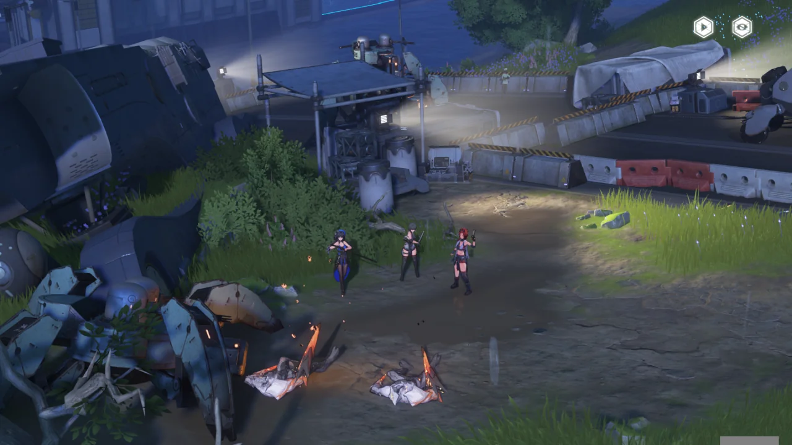
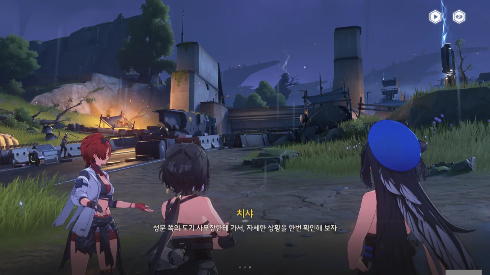

북락 광야에서 기염이 잔상을 상대하던 그 시각, 금주성 앞은 밀려온 잔상을 처리하느라 여념이 없다.



「달빛」이 차오르고 있다. 지금이 금희가 말한 '그 순간'인 것 같은데.

> 폭우가 역류할 때 깨어난 자는 북락 광야에서 기염 장군을 찾아라. 반드시.

역행비가 세차게 내리고 있으니, 바로 지금이 '폭우가 역류할 때'잖아.



금주성은 이미 비상 계획에 따라 민간인을 대피시키고 있다. 미리 녹화해 둔 금희의 영상을 통해, 민간인의 피난을 돕고 있다.



양양의 통신을 듣고 곧바로 금주성으로 돌아온 방랑자가 아니었다면 잔상과 한참을 더 싸웠어야 했을 거라고 치샤가 말한다.

여기서 도기를 처음 만나는 거구나.

잠깐 TMI. 도기의 영어 이름은 'Taoqi'이다.







양양과 치샤는 부상을 입었음에도 쉬지 않고 물자를 계속 나르려고 하는 순찰관을 보살펴야 해서, 방랑자만 먼저 앞으로 보냈다.





벨리나는 자신의 공명 어빌리티를 이용해 부상자들을 치료하고 있다.

> 여기 약용 식물이에요. 상처를 입으면, 그 자리에 붙여 주세요. 유용하게 쓰세요...

벨리나의 말을 들으며, 나는 벨리나가 말만 이렇게 하고, 아무것도 주지 않을 줄 알았다.



그런데 정말 아이템을 준다! 다만 악용을 막기 위해서인지, 게임을 껐다 켜도 아이템은 한 번밖에 주지 않았다.







금주성에서 도장과 찻집을 운영하는 연무는 자신의 가게를 부상자를 위한 임시 응급 구호소로 흔쾌히 제공한다.

놀랍게도, 도기는 물론이요 연무 역시 여기서 처음 보는 것이다. 왜 명조 스토리가 이렇게 되었는지는 조금 나중에 설명하겠다.



연무는 속성 공격력을 올려주는 아이템을 준다.





시뮬레이션 연습장 교관인 엄언 역시 성 밖으로 나왔다. 다만... 그냥 병사들에게 조언을 해주려고 나온 느낌이다.



알토가 도기에게 「보호 실드」의 상황을 묻고 있다. 금주성을 보호하던 「보호 실드」가 잔상류의 습격 때문에 한차례 손상을 입은 건지, 도기가 '「보호 실드」를 복구했다'라고 말한다.

서로 말을 놓는 걸 보면, 알토와 도기는 서로 이미 알고 있던 사이인가 보다.

방랑자에게 팔을 힘껏 흔드는 앙코, 귀여워...



> 음... 우리 만난 적 있었나?

아마 이 부분은 자학 개그인 것으로 생각된다.

&nbsp;

사실 현재의 명조 스토리는 [한번 갈아엎은 결과](https://arca.live/b/wutheringwaves/107988434)라고 한다.

본래 명조의 임무는 현재의 '조수 임무', '얽힌 별 임무', '위험한 임무' 모두를 포함한 '조수 임무' 하나밖에 없었다고 한다. 지금은 금주성에 도착하자마자 산화를 만나러 가지만, 처음엔 금주성에 도착한 다음 호환광산 이야기, 지옥불기사 이야기(위험한 임무), 사자탈 이야기(얽힌 별 임무) 등을 완료한 다음에야 산화를 만나러 갔다.

이 방식은 플레이어블 캐릭터를 캐릭터 배경 설정과 함께 플레이어에게 자연스럽게 소개할 수 있다는 장점이 있지만, 반대로 메인 스토리의 진행이 지나치게 늘어진다는 단점 역시 갖고 있다.

이를 지적받은 쿠로게임즈는 기존 '조수 임무'를 분리해, '조수 임무'는 방랑자의 이야기에만 집중하도록 하고, 캐릭터별 스토리와 지역보스 스토리를 각각 '얽힌 별 임무', '위험한 임무'로 분리했다. 이 조치 자체는 옳은 결정이었지만, 이번엔 너무 많이 덜어냈다.

도기는 원래 방랑자가 금주성에 도착하자마자 방랑자 일행에 합류해 동행하는 캐릭터였지만, 지금은 잔상류의 금주성 습격 이후에 만나는 캐릭터가 되었다. 기염 역시 마찬가지로, 기염은 본래 방랑자와 함께 스카에 맞서 싸운 사이지만, 지금은 아직 만나지도 못한 사이다. 제일 불쌍한 건 단근인데, 단근의 스토리는 반디의 군세 스토리와 엮여 있었지만, 반디의 군세 스토리가 조수 임무에서 떨어져 나오면서 아예 분량이 통째로 삭제되었다.

그래서 앞으로도 종종 이렇게 '상대와 처음 만나는데 묘하게 익숙한 상황'이 발생할 거란 이야길 들었다.



「보호 실드」는 역행비가 금주성 내에 영향을 미치는 걸 차단하기 위해 만든 방어 시설이다. 만약 보호 실드가 손상되면, 금주성 내에 잔상이 나타날 수도 있다고 한다.



역행비의 본질은 하늘바다에서 내리는 고밀도의 울림 에너지인데, 다른 주파수를 흡수 병합해야만 살아갈 수 있는 잔상에게 있어 고밀도 울림 에너지는 좋은 영양원이라고 한다.

알토의 말을 들어보면, 포도당처럼 성장에 도움은 안 되지만, 살아갈 수 있는 에너지는 확실히 공급받을 수 있다는 느낌이다.





고밀도의 울림 에너지 때문에 사람들은 역행비 속에서 과거 있었던 일에 대한 환영을 보게 된다.

기염은 '역행비가 잦은 지역과 관련이 깊을수록, 환각과 실제를 구별하기 힘들어진다'라고 말했는데, 알토의 말에 따르면 역행비 뿐만 아니라 일반 강우 역시 환영을 보는 데에 영향을 준다고 한다. 이걸 피하려면 전 인류가 땅 밑에서 살아야 할 것 같은데...?

게다가 역행비가 내리는 영역이 넓어지면 여러 사람의 기억이 동시에 환상으로 구현된다고 한다.





금주 전체가 전쟁을 대표하는 명식과 싸우는 전쟁터라, 역행비가 최종 단계에 도달하면 나타나는 환영에 전투 중인 병사와 잔상이 포함될 거라고 한다.

> 그냥 「유령」이면 무서울 게 없지 않나요?

아까 기염이 말하길, 역행비가 '피로 얼룩진 또 다른 칼날'이 되었다고 말했다. 그냥 유령은 아닐 것 같아...







본래 역행비가 만드는 유령은 과거 있었던 일을 기계적으로 반복하기만 할 뿐, 사람에게 피해를 주지는 않았다. 하지만 명식에 의해 강화된 역행비는 사람에게 실질적인 피해를 줄 수 있는 유령을 만들 수 있게 되었다.

3년 전 있었던 「곡도 전쟁」 당시, 북락 광야에서 싸우던 잔상과 야귀군 외에도, 역행비에 의해 유령 잔상과 유령 야귀군이 나타나 서로 싸워댔다고 한다. 실제로 사람에게 피해를 줄 수 있는 유령이 서로 싸워대며 주변에 피해를 입히니, 아비규환이 따로 없었다고 한다.



「곡도 전쟁」은 인류가 「명식의 힘에 의해 강화된 역행비」를 처음 관측한 사건이며, 당시 장군이었던 가서림이 전송한 영상 덕분에 각국이 역행비를 막는 장벽을 개발하는데 박차를 가하게 되었다. 다들 민간인이 가득한 지역에 잔상이 나타나 깽판을 치는 걸 보고 싶지 않았을 테니 말이다.





「검은 해안」은 명식, 「달빛」, 역행비가 서로 관련이 있을 거라 생각하고 있지만, 이를 뒷받침할 증거가 부족해 아직 추측에 불과하다고 말한다. 다만 빈번하게 발생하는 잔상류와 역행비가 명식의 부활과 밀접한 관련이 있다는 건 파악했다고 한다.



이번에 「달빛」이 순식간에 차오른 건 명식의 부활이 얼마 남지 않았다는 의미가 된다. 어쩌면 3년 전 「곡도 전쟁」이 다시 재현될 수도 있다.



> 명식의 부활은 독립적인 사건이 아니야. 그들의 사이에는 일종의 끈끈한 혈통이 존재해.

혈통...? 번역이 좀 이상한데.

아무튼, 금주의 명식이 부활하면 다른 지역의 명식도 덩달아 같이 부활할 거라고 한다. 이건 많이 큰일인데.





「검은 해안」 소속인 알토와 앙코는 테티스 기지로 돌아가 비명 모니터링 장치를 재조정한 후, 금주에서 일어난 일을 다른 나라에 알리기 위해 떠났다.

이제 한동안 앙코는 못 보겠구나...





도기가 '잔상류가 언제 쏟아져 나와도 이상하지 않다'라고 말하자마자 잔상류가 금주성으로 달려온다. 저놈들, 양반 되기는 글렀네.





성문 위에는 장총을 든 병사가, 성문 아래에는 근거리 무기를 든 사람들이 버티고 서서 잔상류를 맞이한다.





플레이어가 직접 조작할 수 있는 캐릭터는 방랑자, 치샤, 양양, 능양뿐이며, 나머지 캐릭터들은 알아서 로프도 쓰고 스킬도 쓰는 등, 완전 자율로 움직인다. 뭔가 좀 신기해...



연각 레벨이랑 데이터 스테이션 레벨 올리겠다고 수많은 잔상을 잡고 다녔으니, 손에 익지 않을 수 없다.





「달빛」이 3년 전 「곡도 전쟁」 때와 거의 비슷하게 차올랐다. 정말 「곡도 전쟁」이 재현되려는 걸까?



금희가 통신을 걸어 현장의 상황을 파악한다.





미리 대책을 세워둔 덕에 그럭저럭 일이 순조롭게 흘러간다고 말하는 금희에게 「용의 뿔」은 찾았냐고 물어보았다.

> 영윤으로써, 항상 「용의 뿔」에만 의존할 순 없으니까요. 이것은 제 결정이고, 책임이기도 해요.

분명 저번에 "「용의 뿔」 없이 저 혼자 결정한다면, 그 선택이 옳다고 확신할 수 없어요"라고 말해놓고서... 지금 다시 생각해 보니, 이건 지금 「용의 뿔」이 금주에 없다는 기밀을 섣불리 입 밖에 내뱉는 선택지를 고른 내 잘못이다.

금희가 황룡 수도로 가서 원조를 신청했다고 한다. 천공부와 연구원에서 보낸 사람이 이미 도착해 있을 거라고 하는데... 그게 누구지?



지금이 저번에 말한 바로 '그 순간'이라고 금희가 말해준다. 북락 광야로 갈 시간이라는 거네.





> 기나긴 밤을 넘어 무사히 돌아오세요, 방랑자.

오, 이 표현 마음에 든다. 외적을 막은 영웅으로 칭송받느니 뭐니 하는 건 별로 와닿지 않는데, 저 말은 가슴에 바로 꽂힌다.



방랑자 혼자 북락 광야로 보낼 줄 알았는데, 방랑자와 함께 양양도 보낸다.

되돌아보니, 방랑자는 양양과 가장 많은 시간을 함께 보냈다. 처음 무음구역에서 크라운리스와 싸울 때에도, 소원 연못 마을에 갈 때도, 북락 광야에 갈 때도 양양과 함께 했다. 커뮤니티에서 '양양이야말로 정실'이라는 말이 왜 나오나 했는데, 이것 때문이었구나.

기염이 있는 군영까지 가려면 무음구역을 지나쳐야 한다고 한다. 보통 이런 말이 나오면 거기서 전투가 일어나던데...



재미 삼아 치샤를 마소방이라 불러보았다. 음, 이런 맛이었구나...



분위기 파악 못하는 잔상이 훈훈한 분위기를 망쳐놓았다.







양양은 여전히 금주성을 걱정한다. 걱정 마. 다들 이렇게 잘 버티고 서있잖아?





이제 기염 장군을 만나러 갈 시간이다.
