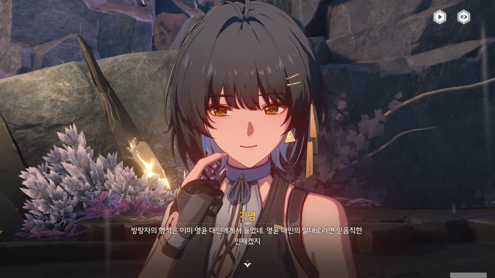
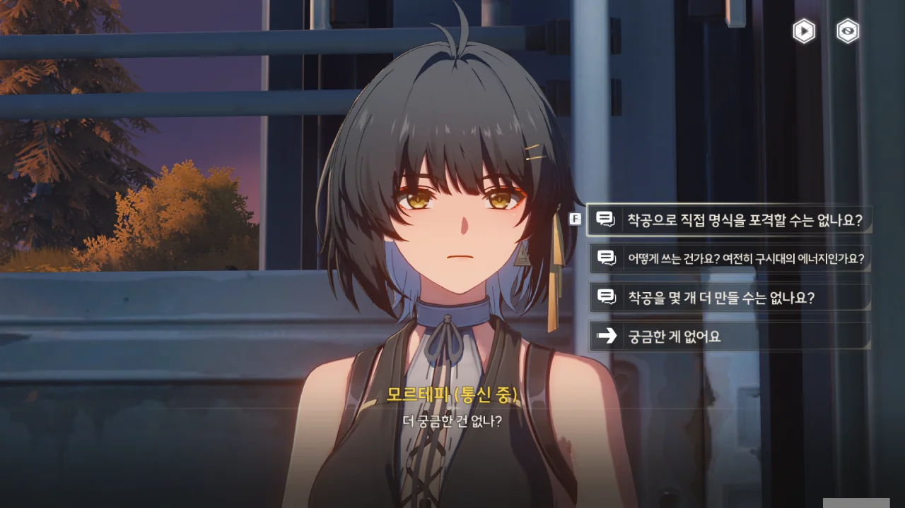



잔상류의 지휘관이 공격 명령을 내린 건지, 잔상류가 군영 안까지 들어와 병사들을 공격하고 있다. 하지만 전원 공명자인 병사들의 실력 역시 만만치 않아, 잔상류의 공세를 그럭저럭 잘 막아내고 있다.





기염이 직접 나서서 군영 내의 모든 잔상을 처리했다.

이곳뿐만 아니라 금주성 역시 잔상류의 습격을 받았다는 걸 기염은 이미 알고 있는 모양이다.





> 영윤의 지시에 따라 「보호 실드」를 개방했어. 주민은 안전구역으로 대피시켰고.

실드를 '전개'한 게 아니라 '개방'했다고? 대체 왜? 제발 이게 오역이길 빈다.

설지는 연구원에서 관리와 모니터링 중이고, 모르테피는 천공부에 도착했다고 한다. 이게 어떤 의미인진 잘 모르겠지만.

그리고 드디어 기염에게 방랑자와 양양이 그쪽으로 가고 있다는 정보가 들어왔다.





방랑자와 양양이 올 길은 주파수 파동 밀도도 높고 잔상의 부활 흔적도 많기 때문에, 기염은 그들이 올 길을 직접 터주기로 했다.



뇌운의 비늘? 그게 왜 여기서 나와?



기염이 무음구역 쪽으로 걸어가는 장면이 나온다.



방랑자와 양양 역시 여기까지 오며 많은 전투를 겪었나 보다.



이 앞에 있는 무음구역을 통과해야 기염이 있는 군영에 갈 수 있다.



야귀군 유령이 보여, 그들이 무슨 말을 하고 있나 듣기 위해 가까이 갔더니 유령은 사라지고 잔상이 나타났다.

날 속인 거니?



'이번은 괜찮겠지'라고 생각하며 한번 더 다가갔는데, 이번에도 역시 잔상이 나타났다.

앞으론 유령이 보이면 그냥 지나쳐야겠다. 두 번은 속아도 세 번은 안 속아.





이 '정양'이라는 사람은 역행비의 영향을 많이 받아 진짜와 환상을 구별하지 못하게 된 건지, 진짜 동료인 '아준'을 유령으로 오해해 총으로 쐈다가 그대로 멘탈이 바사삭 부서졌다.

아마 3년 전 「곡도 전쟁」에서 있었던 일이겠지?



무음구역 인근에서 부상당한 병사를 확인했다. 사진을 찍지는 못했지만, 양양이 괜찮다고 했으니, 저건 유령이 아닐 것이다.







잡석 고지 물자 수송대는 잡석 고지 군영에 보급품을 전달하기 위해 이동하던 중, 이 무음구역을 통과하게 되었고, 역행비 때문에 부활한 뇌운의 비늘에 의해 전멸했다고 한다.





비겁하게 은신했다가 방랑자의 뒤를 치려던 뇌운의 비늘을 기염이 막아준다.



너, 약하잖아. ㅋㅋㅋㅋㅋㅋ

자꾸 은신을 써대는 통에 귀찮긴 했는데, 별문제 없이 잡았다.





뇌운의 비늘은 번개가 전사한 병사들의 잔향을 흡수해 만들어진 잔상이라고 한다. 이젠 하다 하다 자연현상까지 잔상을 만드는 거야?



드디어 방랑자와 기염이 정식으로 만났다.

> 당신은 역행비 유령인가요?

아니, 이 선택지는 너무 무례하잖아 ㅋㅋㅋ





기염이 방랑자를 만나자마자 곧바로 야귀군의 차후 계획을 알려주겠다고 한다.

> 저에게 바로 야귀군 전략에 대해 말해주는 건가요?

기염이 방랑자를 보는 건 이번이 처음일 텐데, 방랑자를 너무 쉽게 믿는다.

> 방랑자의 행적은 이미 영윤 대인에게서 들었네. 영윤 대인의 말대로라면 믿음직한 인재겠지.

뜻밖의 곳에서 칭찬을 듣자, 방랑자가 부끄러운 듯 볼을 긁적인다.

기염은 아무 이유 없이 방랑자를 만나자마자 신뢰한 게 아니라, 이전에 금희에게서 들은 방랑자의 행적을 통해 방랑자를 신뢰하게 된 것이다.

금주 사람들은 금희의 말을 마치 온 세상의 진리라도 되는 것처럼 여기는 것 같던데, 그래서 그런 건가...? 그 사람들, 금희가 팥으로 메주를 쑨다고 해도 믿을 것 같아 보였거든.





기염이 방랑자와 양양에게 역행비 저항제를 나눠준다.

방랑자가 '내가 역행비 유령일 수도 있지 않느냐'라고 묻자, 기염은 역행비 유령이 만들어지려면 대상이 역행비의 영향을 받은 적이 있어야 하며, 비가 내리는 곳과 밀접한 연관이 있어야 한다고 말한다. 하지만 방랑자는 금주에는 초행인 데다, 얼마 전에야 운릉 협곡에서 깨어났기 때문에, 이 조건에 부합하지 않는다고 한다.

여기까지 올 때 역행비를 실컷 맞으며 역행비의 영향을 잔뜩 받았으니, 앞으로 비가 내리는 곳과 엮이지만 않으면 방랑자가 역행비 유령이 될리는 없겠다.



뭐? 「용의 뿔」이 기염에게 방랑자가 북락 광야로 올 것이며, 명식에게서 잃어버린 힘을 되찾아야 한다고 말했다고? 잃어버린 힘?





기염이 장군이 된 건 금희가 영윤으로 취임하기 이전이었다. 기염이 장군이 되던 날, 기염은 「용의 뿔」에게서 예언 하나를 들었다. 이건 금희도 아마 모를 예언이다.

> 「달빛」이 완성되면, 「돌아온 자」를 도와 명식을 마주하고, 명식에게서 명식을 물리칠 힘을 되찾아라.

저번에 기염이 중얼거린 "「달빛」이 차오를 때, 떠돌던 이가 돌아온다"가 바로 이 이야기였던 모양이다.





저 달은, 예상했던 대로, 진짜 달이 아니라 명식이 만들어낸 「허영의 달」이라고 한다. 저 달이 가득 차면 명식 「무상선주」가 깨어날 것이다.

무상선주는 병기의 주파수를 제 힘으로 만드는 명식인 데다, 그동안 있었던 수많은 전쟁으로 꽤 많은 힘을 얻었을 테니, 무상선주를 하루빨리 처치해야 손실을 줄일 수 있다.



암, 이런 건 빨리빨리 처리해야 속이 편하다고.



기염이 여기까지 오며 길을 청소한 덕분에, 편하게 군영까지 갈 수 있다.







호수에서 웬 거대한 조각상이 솟아오르더니, 자기 주변에 반투명한 보호막을 씌웠다.

보호막을 쓰다니, 겁쟁이가 틀림없다.



저건 무상선주가 각종 병기, 건물, 바위의 파편 등을 모아 만든 조각상이라고 한다. 인류를 농락하기 위해 만든 건지, 금주 전체를 내려다보는 구도를 취하고 있다.

곡도 전쟁을 통해 무상선주의 힘을 약화시켜 조각상을 물밑에 가라앉혔는데, 이번이 무상선주의 힘이 다시 강해진 탓에 조각상 역시 다시 수면 위로 떠오르게 되었다.







놀랍게도 감심이 잡석 고지 군영에 있었다. 치원을 금주성에 데려다준 후, 보급대를 따라다니며 적잖은 도움을 준 모양이다.





분석 결과, 북락 광야의 잔상은 무언가에 의해 인위적으로 만들어진 잔상이라고 한다. 그리고 그 잔상을 만들어내는 게 바로 저 조각상이라고 한다.

무상선주 녀석, 조각상을 만든 목적이 티배깅이 아니라 잔상 공장을 만들기 위해서였구나.





얼떨결에 방랑자 역시 전략 기획에 참가하게 되었다.

현재 선봉부대 병력은 다음과 같이 나뉜다.

* 원거리 화력타격 능력을 갖춘 장거리 작전 부대 (공린 지휘)
* 근접 작전에 능한 근접전 작전 부대 (악휘 지휘)
* 기염, 방랑자, 양양, 감심으로 구성된 돌격 소대

어디 하나 나무랄 데 없는 부대 배치다.





명식의 힘 때문에 척후가 도달할 수 있는 곳은 북락 협곡과 배후지 경계의 절벽이 한계다. 하지만 3년 전 곡도 전쟁 당시 입수한 정보에 따르면, 북락 광야 뒤에는 공중에 떠있는 폐허가 하나 있다고 한다.

북락 광야 양 옆에는 절벽이 있어, 그 가운데로만 군대가 지나갈 수 있다. 이 제한사항은 아군뿐만 아니라 적군에게도 적용된다.





여기서 일어나는 전투 하나하나가 무상선주에게 힘을 실어주는 행위이기 때문에, 방랑자를 포함한 돌격 소대를 최대한 안전하고 빠르게 조각상으로 보내는 것이 최우선 사항이다.





원거리 화력 투사가 가능한 원거리 작전 부대는 당연히 절벽 위로 보내야지. 그래야 아래에 있는 부대를 효과적으로 엄호할 수 있을 것 아닌가.





아무리 생각을 해봐도, 근접 작전 부대는 그냥 적에게 정면돌격을 시키는 수밖에 없다.

근접 부대가 전선을 형성하고 유지하기만 해도 이후 운신의 폭이 넓어진다. 원거리 작전 부대는 절벽 위에서 원거리 원호를 해줄 수 있을 것이고, 돌격 소대는 일점돌파를 통해 조각상까지 단숨에 도달할 수 있겠지.

이 작전은 근본적으로 참수작전이니, 이게 맞을 것이다.





우회 전술을 쓰기엔 양 옆에 절벽이 있어 불가능하고, 엄호를 받으며 돌격하는 건 전선 유지에 도움이 안 된다. 일점돌파를 통한 신속한 적진 통과만이 조각상으로 가는 가장 빠른 길로 보인다.





방랑자를 포함한 돌격 소대가 창끝이 되어 전진하고, 그 뒤를 근접 부대가 엄호하며 적 방어선을 두들긴다. 원거리 부대는 장거리 화력 지원을 맡는다.



응? 왠 「착공」? 「표면파 장벽」은 또 뭐야?

> 이상한 지식이 또 늘어나네요...

이 선택지를 너무나도 고르고 싶었지만, 착공이 뭔지 묻는 게 더 중요해 보였다.





조각상이 둘러쓴 보호막은 무상선주가 북락 광야에 남아있는 무기의 힘을 원활히 흡수할 수 있도록 만든 것인데, 분열포와 착공을 통해 그 보호막을 부술 수 있는 모양이다.



우와, 모르테피, 정말 오랜만이다.





착공을 가동할 준비는 끝났지만, 착공의 배터리가 파괴되어 착공을 가동할 수 없는 상황이다. 예비 충전 단자가 있긴 하지만, 단자 역시 망가져 있는 건지, 단자 먼저 수리해야 착공을 충전할 수 있다.





무상선주가 착공의 공격을 피할 수도 있고, 기껏 공격을 맞춰도 치명상을 줄 수는 없다고 한다.

하지만 착공은 무상선주의 보호막만큼은 확실히 찢을 수 있다.







모르테피의 말을 들어보니, 뭔가 번역이 잘못된 것 같다.

착공은 금주가 처음 세워졌을 때 만들어졌는데, 그 당시 기술로 이 정도의 무기를 만든 건 정말 대단하다고밖에 말할 수 없다고 한다.

착공에 들어가는 에너지를 금주성으로 돌리면 금주성을 천공도시로 만들 수도 있을 거라고 한다. 흠... 왜 자꾸 드라켄 레이저 천공기가 생각나는 거지?







착공을 더 만들 수는 있지만, 아무리 빨리 만들어도 명식이 완전히 부활하는 게 더 빠르다고 한다.

착공으로 명식에게 치명상을 줄 수 없다면 착공을 더 만들어 더 많은 화력을 투사하면 될 거라 생각했는데, 그 방법도 불가능하다.





> 이런 엄밀한 전술적 계획을 필요로 하는 치명적 무기는... 황룡 수도의 단속이 심할 거야.
> 그 사용 권한이... 과연 허가될 수 있을까?

착공의 사용 허가가 떨어지지 않는다는 건 황룡이 금주와 함께 자살하겠다는 말이랑 다를 바 없지 않아? 천공을 쓰지 못해 명식을 제때 처리하지 못하면 전 세계의 명식이 잇달아 같이 깨어날 텐데 말이다. 게다가 알토 말에 따르면, 명식은 지역 하나를 붕괴시킬 수 있을 정도로 강력하다면서.

모르테피가 이런 걱정을 한다는 것 자체가 황룡의 수뇌부에 뭔가 문제가 있음을 의미한다. 권위주의적 관료제라던가, 뭐 그런 것 말이다.







설지가 연구원에서 북락 광야의 잔상 활동 모니터링 결과를 통해 비교적 안전한 경로를 알려주겠다고 한다.

하지만 잔상이 이미 착공을 공격하기 시작했고, 설사 착공을 공격하는 잔상을 모두 물리친다 하더라도 착공이 에너지를 충전하는 동안 착공을 보호해야 한다.





방랑자와 양양은 착공을 탈환하고 예비 충전 단자를 수리해 착공을 충전하는 임무를 맡았다.

기염은 근처 잔상들의 이목을 끌어 착공 쪽으로 향하는 압력을 줄여보겠다고 한다.

감심은 군영에 남아 군영을 보호하기로 했다.



또 안내 메시지가 나왔다. 저번 메시지에 나왔던, '긴 스토리를 진행할 예정'이라는 말이 허언이 아니라는 듯, 이번 이야기는 정말 길었다.

좀 쉬었다가 해야지...
