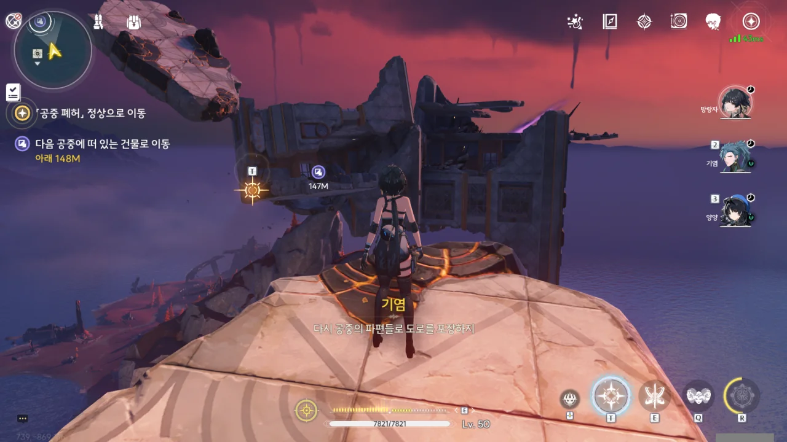
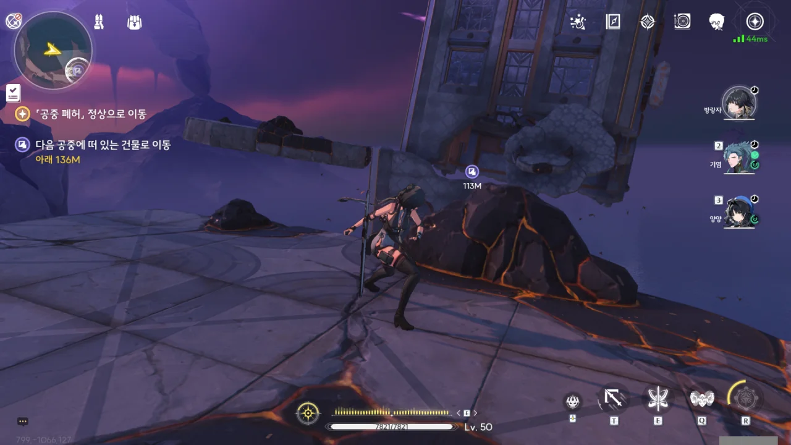





양양과 함께 내려와 보니, 이미 잔상이 착공 포대를 점령했다고 한다.

착공을 공격하러 온 잔상이 엄청나게 많았던 모양인지, 착공을 지키던 병사들은 그 잔상들이 군영으로 가지 못하게 구역 자체를 봉쇄하라고 말했다. 구역이 봉쇄되면 잔상들과 함께 갇힌다는 걸 알면서도 말이다.



아, 이게 착공이었어? 맵에 있는 비콘을 모두 열러 다닐 때, 이걸 보고 '여기가 바로 그 「황룡 아카이브」인 건가?'라고 생각했는데... 「황룡 아카이브」 만큼은 아니지만, 중요 시설이긴 했네.

잔상이 이곳을 점령하자마자 곧바로 착공을 파괴했을 줄 알았는데, 아직 포대는 멀쩡해 보인다.







착공을 지키던 병사들은 단 한 명을 제외하고 전부 전사했고, 남은 한 명 마저 상처가 깊어 오래 버티지 못할 것 같다. 그걸 본 양양의 눈이 파르르 떨린다.

여태껏 양양은 감수성이 높은 모습을 자주 보여왔는데, 양양의 오버클럭 리포트에 따르면, 양양의 높은 감수성은 심인성 과부하로 인한 오버클럭의 후유증이라고 한다.







부상이 심했던 병사는 갖고 있던 복구 키를 방랑자에게 넘긴 후, 그대로 힘이 다해 눈을 감는다.





임무 목표가 '습격해 오는 잔상 처치 및 「착공」 보호'라고 쓰여있어, 방금 받은 복구 키를 이용해 예비 충전 단자를 수리하고 「착공」 충전 절차를 시작해야 하는 줄 알았다. 그런데 아무것도 하지 않았는데도 착공이 충전되고 있다고?

아무튼, 곳곳에 나타나는 잔상을 차례대로 격파했다.



기염과 감심이 도착한 건 착공 충전이 모두 완료된 후였다. 그런데 기염이 멈췄다고 말하는 게... 설마 역행비야? 아직 빗방울이 거꾸로 내리고 있는데?





정말로 역행비가 그쳤나 보다. 역행비가 그치면서 북락 광야의 잔상 수가 급격히 감소했다고 한다.

착공의 충전 역시 완료되었지만, 모르테피의 말에 따르면, 착공의 발사에 소모되는 에너지의 양이 너무 많기 때문에, 이번 발사가 실패할 경우, 다음 발사를 제시간 안에 맞출 수 없을 거라고 한다.







금희가 영윤의 권한으로 착공 발사 허가를 받았다. 그래, 지금 이걸 허가해주지 않는다는 건 다 같이 죽겠다는 말이랑 다를 바 없다니까?

당연한 말이겠지만, 발사 허가를 받았다는 건 그에 대한 결과까지 함께 책임진다는 말과 같다. 금희 말처럼, 만약 착공의 발사가 실패하면 그 책임까지 모두 금희가 짊어지게 되는 것이다.

> 하나의 목적으로... 함께 달려왔으니까요.

여기서 금희가 말한 '하나의 목적'은 무상선주의 격파를 말하는 건가?









처음 착공이 에너지 충전이 필요한 대포라는 말을 들었을 때, 난 착공이 전자기력을 이용해 탄환을 가속해 발사하는 레일건이나 코일건일 줄 알았다. 그런데 실제 작동하는 착공의 모습을 보니, 별도의 탄환을 쓰지 않고 에너지 자체를 모아 발사하는 무기였다. 이러니까 에너지를 대량으로 소모하지...

그래도 대량의 에너지를 때려 부은 효과 하나는 확실한 건지, 조각상의 보호막이 착공 한 발만에 완전히 벗겨졌다. 너무 쉽게 벗겨져서 오히려 이상할 정도다.





조각상의 보호막이 벗겨졌으니, 이제 저번에 짠 작전대로 움직일 시간이다.





> 1시 방향, 낙석 주의!

'갑자기 웬 돌?'이라고 생각했는데, 돌로 된 잔상이 하늘에서 떨어졌다. 아, 그러면 낙석 맞네.

당초 계획대로, 전선은 근접 부대에게 맡기고, 돌격 소대는 계속 전진하기로 했다.







잔상이 쉬지 않고 계속 달려들자, 감심이 남아 잔상을 저지하기로 했다.



이렇게 경사가 완만한 비탈길을 굳이 이렇게 미끄러져 내려가야 했을까...? 심지어 플레이어가 회피 등으로 미끄럼 상태에서 벗어나는 걸 막기 위해, 플레이어의 스태미나를 강제로 0으로 설정했다.

내 장담컨대, 다음에 여기 왔을 때에는 이렇게 미끄러지지 않고 정상적으로 걸어 다닐 수 있을 것이다.





소형 비콘이다! 아마 이게 이번 임무의 중간 세이브 포인트 역할도 겸할 거다.

> 이곳의 비콘은 사용 가능하군... 보호 기능도 완벽하니, 여기서 정비하지.

이상하다... 난 여태껏 소형 비콘의 보호를 받은 적이 없는 것 같은데...



잔상의 공세가 너무 강해, 지금 돌격 소대는 아군과 떨어져 고립되어 있는 상태다.





감심이 걱정되지만, 명식의 영향 때문인지 감심과 연락이 닿지 않는다. 모두를 믿고 계속 앞으로 나아가는 수밖에 없다.



로프를 이용해 사물을 잡아당길 수 있다. 기왕이면 적도 잡아 끌어당길 수 있으면 좋을 텐데...



조각상이 떠오를 때 주변 건물과 함께 도로도 같이 들어 올린 건 좋았지만, 마구잡이로 들어 올린 탓에 도로 곳곳이 끊어졌다.

이제부터 꽤 튼튼한 잔상이 나오기 시작한다.







잔상과 전투를 하며 체력이 조금 닳았는데, 기염의 약초를 받자 체력이 모두 회복되었다.

여기까지 오며 겪은 여러 번의 전투마다 캐릭터들의 체력이 닳곤 했는데, 이렇게 휴식을 취하거나 약을 바르는 묘사가 나온 후에는 체력이 완전히 회복된다. 스토리 진행 중 플레이어의 체력 회복에 대한 독특한 접근이다.



> 이 허공에 떠 있는 파편... 이걸로 도로를 포장할 수 있겠어.

뭐요? 도로를 포장한다고요?

'도로를 포장한다'는 오역인 건지, 방랑자가 하는 건 공중에 떠있는 잔해를 끌어와 올라탄 후, 건너편을 잡고 잔해를 끌어당기는 것이었다. 마치 잔해를 뗏목처럼 이용하는 것이다.



계속 앞으로 나아가야 하는데, 흑석이 길을 막고 있어 더는 나아갈 수 없는 상황이다.



오, 이건 새로운 정보다. 다른 단말기는 명식의 영향 때문에 통신이 불가하지만, 방랑자의 단말기는 특별한 방법을 쓰면 명식의 영향권 안에서도 통신이 가능하다고 한다.



모르테피가 여태껏 돌격 소대를 멀리서 관측하고 있었던 모양인지, 길이 막힌 상황을 알고 있다며, 천공을 이용해 길을 뚫어주겠다고 한다.

조각상의 보호막을 뚫을 때보다는 천공의 출력을 낮게 조절하겠지만, 그래도 위험하니 멀리 떨어져 있으라고 한다.



마침 옆에 있던 잔해를 이용해, 안전한 곳으로 대피했다.





천장을 막고 있던 잔해가 천공의 포격으로 인해 부서져 떨어져 내린다.

앞으로도 계속 천공을 쏠 수 있으면 좋겠지만, 충전된 에너지가 부족해 앞으로 딱 한 발만 더 발사할 수 있다고 한다.

저 "도로를 포장하지"라는 말을 볼 때마다 매우 불편하다. 으으, 이래서 내가 조수 임무를 미루려 했던 건데!





앞에 보호막을 두른 튼튼한 잔상이 있었는데요, 없었습니다.

허술하게 서 있는 벽을 무너트려 깔아뭉개자, 그대로 죽어버린다. 역시, 자연의 섭리 앞에 장사 없다.



이게 바로 여기였구나. 처음 이 짤을 보고 얼마나 웃어댔는지. 영상 마지막의 당황한 듯한 카메라의 좌우 움직임이 핵심 포인트이다.



음, 이거 재미있는데. 일반 필드에서는 쓸 수 없는 특별한 기믹이라는 게 많이 아쉬울 정도야...



보스바에는 '음험한 백로', 화면 좌측의 임무 안내에는 '음흉한 백로', 기염의 말에는 '흉폭한 백로'... 대체 이 녀석의 정확한 이름은 뭘까?

예전에 누군가가 '저 백로에 달린 머리 세 개의 이름이 각각 음험한 백로, 음흉한 백로, 흉폭한 백로다'라고 말했는데, 터무니없는 말임에도 꽤 그럴듯하게 들리더라. 이게 다 번역을 통일하지 않은 쿠로 게임즈 잘못이다.

&nbsp;

보스를 신나게 때리던 중, 화면 상단의 보스바가 사라지더니 보스가 이렇게 아무런 공격도 하지 않고 제자리에 가만히 서게 되는 신기한 버그에 걸렸다.

보스 주변을 빙글빙글 돌아도 보고, 한 대씩 툭툭 쳐보기도 했는데, 여전히 아무런 반응이 없어 게임을 재실행해야 하나 생각했다.

그런데 자포자기하는 심정으로 보스를 계속 때리니, 보스가 기절한다. 아, 보스바가 사라졌을 뿐, 보스의 체력은 여전히 유효하구나. 그대로 보스를 때려눕혔다.



조각상에 가까이 다가갈수록 강력한 잔상이 많이 나온다.

> 나 혼자서는 빠르게 처리할 수 없네.

보통 적이 많이 나오면 '힘에 부친다'라는 말이 나오는데, 기염은 '적을 빨리 처리할 수 없다'라고 말한다. 그러니까, 잔상이 아무리 많이 나와도 시간만 충분하다면 전부 처리할 수 있다는 말이다. 오오, 기염 장군...

이거, 진짜 마음에 든다. 이렇게 발판을 뗏목 삼아 먼 거리를 건너가는 기믹, 분명 나중에도 쓰이겠지?



아래에서 올라오는 상승 기류를 건물 파편이 막고 있다. 로프로 잡아당기면 건물 파편이 아래로 흩어져 떨어진다.



그런데 상승 기류를 막는 파편이 좀... 많다?



심지어 이번 파편은 여러 번 당겨야 부서진다.





기껏 건물 위로 올라왔지만, 조각상까지의 남은 거리가 너무 멀다.

> 방랑자. 착공의 마지막 폭격 방향을, 결정해 주게. 우릴 위해 새 길을 만들어 주게.

어... 설마 착공의 폭격을 맞고 떨어지는 돌덩어리를 밟고 올라갈 생각인 거야?



조각상의 가슴에 있는 저 돌이 자꾸 신경 쓰인다.





건물 옥상에 올라온 지 얼마 되지도 않았는데, 아래에서 잔상들이 득시글대며 올라오고 있다.









아까 감심이 그랬던 것처럼 기염이 남아 잔상을 막으려 하자, 양양이 대신 나선다.

양양 말처럼, 현재 인원 중 양양보다 방랑자와 기염이 더 강하니, 양양이 여기 남아 시간을 버는 게 합리적인 선택이긴 하다.



양양이 이 많은 잔상을 상대로 혼자서 버텨낼 수 있을까 걱정되지만, 지금은 그걸 고민할 시간에 한시라도 빨리 조각상으로 접근해야 한다.





방랑자가 뭔갈 조작한 걸까, 조각상의 가슴에 있던 돌이 반으로 쩍 갈라졌다.



그리고 거길 천공이 타격하자, 조각상의 가슴에 구멍이 뻥 뚫렸다.





아니, 진짜였네. 방랑자와 기염이 떨어지는 돌덩이를 발판 삼아 조각상을 향해 달려간다.



오... 기염이 날아오는 돌조각을 그대로 반으로 갈라버리며 돌진한다.





난 이 장면이 마음에 들더라.

다른 게임이었다면 바위에 부딪힐 위험에 처한 방랑자를 구하기 위해 기염 홀로 바위를 두 동강 냈을 것이다. 하지만 여기선 기염과 방랑자가 힘을 합쳐 거대한 바위를 두 동강 낸다.

방랑자가 단순한 짐덩이가 아니라, 기염만큼 강하다는 걸 보여주는 장치인 것이다.





조각상의 가슴에 들어오니, '명식 여기 있소'라고 말하는 듯한 균열이 보인다.





바로 여기에 명식이 있다. 그럼 잡으러 가야지.

임무 목표는 '「하늘의 봉화」 진입'이라 써놓고, 정작 던전 이름은 「크라운리스 조각상 · 심장」이라고 적어놨다. 대체 뭐가 맞는 거야?
