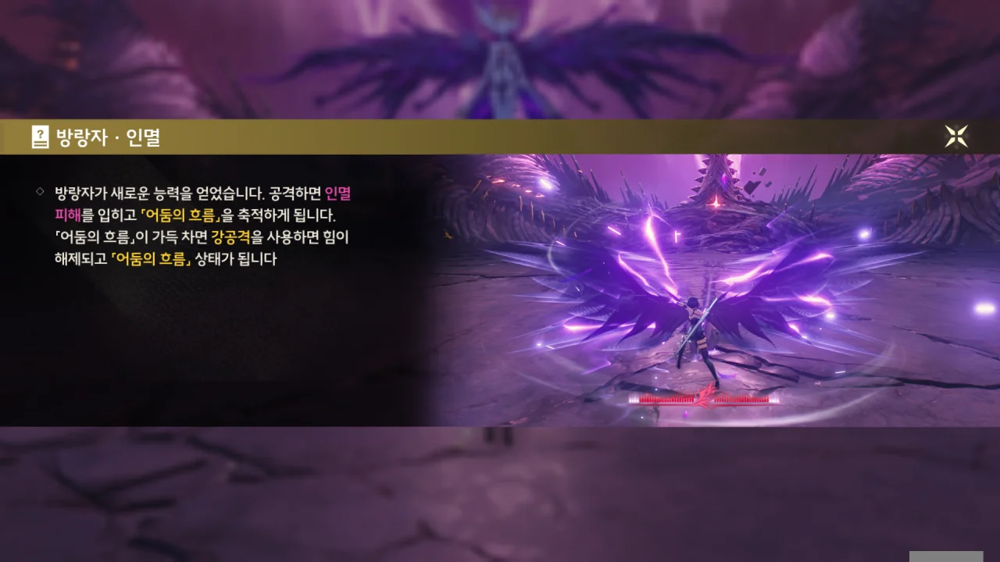
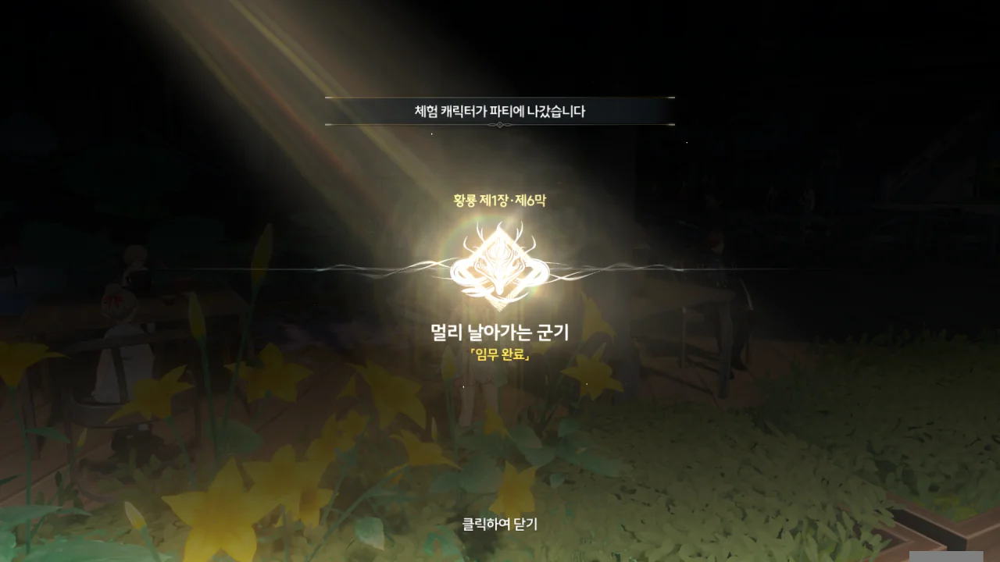
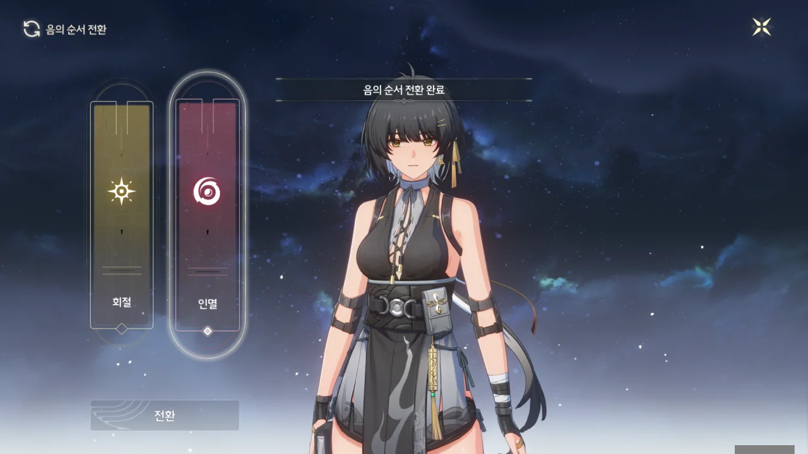



아, 여기, 크라운리스를 흡수한 후 봤던 곳이다. 크라운리스가 명식과 관련이 깊은 잔상이라, 크라운리스를 흡수할 때 명식의 위치 또한 볼 수 있었던 모양이다.

그러니까 밖에 뜬 「허영의 달」은 말 그대로 환상에 불과하고, 이게 진짜 본체란 말이지...



방금 전까지만 해도 아무것도 없던 탑 밑에 크라운리스가 나타났다.

> 주파수가 명식으로 재구성됐네.

크라운리스는 그냥 잔상 아냐? 그런데 주파수가 명식으로 재구성되었다고? 그러면 이게 우리가 찾던 「무상선주」라는 거야?



방랑자를 돌아보는 크라운리스의 표정이... 뭔가 반가워하는 것 같다? 아, 설마 리벤지 매치를 기다려왔던 거야?

처음 만났을 때에 비해 크라운리스의 몸에 뭔가 이것저것 더 붙은 것 같다 생각했는데, 예전 글을 다시 확인해 보니 크라운리스에 달라진 점은 없었다. 그럼 왜 크라운리스가 좀 더 커진 것 같다고 생각한 거지?



> 전투... 흡수... 진화...

와, 잔상이 말도 하네!

크라운리스를 처음 만났을 때에는 이름이 그저 '???'이었는데, 지금 보니 '크라운리스 · 속이 빈 달의 희생품'이라고 적혀 있다.

희생품...? 이거 조금 불안한데. 크라운리스의 격파된 주파수가 「달」로 흘러 들어간다는 묘사도 있고...



크라운리스를 처형했다! 평소에도 이런 식으로 조건만 충족하면 적을 일격필살할 수 있는 기믹이 있으면 좋을 텐데...







크라운리스의 주파수가 달로 흘러들어 가더니, 달이 공중으로 부상한다.

저 눈깔, 대체 어디서 본 건지 기억이 나지 않아 이전 글을 뒤져보니, 곡도 전쟁을 설명하는 영상에서 봤었다. 영상에서 저 눈깔이 흰색 파동을 내뿜으니 강화된 역행비가 내렸다. 설마, 저게 명식의 본체인 건가?





마치 알을 낳듯, 눈깔에서 새로운 적이 튀어나왔다.





> 단념하라... 접근하라..

이 놈도 말을 하네. 그런데 왠 뜬금없이 "접근하라"야? 아, 설마 가까이 다가와서 더 때려달라는 의미야?

기염의 말을 들어보면, 이 녀석은 곡도 전쟁에서 흡수한 주파수로 만들어진 잔상인 것 같다. 그런데 이 녀석, 시뮬레이션 영역에서 나왔던 그 녀석 아냐?



방랑자와 기염이 조금 어루만져주자, 보스가 쓰러진다.

가슴팍에 빛나는 저거... 설마 약점인가? 뭔가가 저렇게 빛난다는 건 '날 있는 힘껏 때려주세요'라고 말하는 것과 다름없잖아.





하지만 명식이 쓰러진 보스에게 주파수를 불어넣어 주자, 보스가 비명을 지르며 부활하더니 실 같은 것에 붙들려 공중에 붕 뜬다.

아니, 이러면 명식을 격파하지 않는 이상, 이 녀석을 때려눕히는 게 불가능하다는 거잖아.





> 적의 공격이 뒤에 있는 「달」을 피하고 있네... 저 「달」이 핵심인 게 분명하네!

그야 보스가 우리랑 달 사이에 있으니까 그렇지. 당연한 소리를 신기하다는 듯이 말하네.

이 명식은 전쟁 자체에서 힘을 얻는다는 말이 허언이 아니란 걸 증명하려는 듯, 기염의 용창까지 복사해서 플레이어를 공격한다. 일반 공격을 연타하는 것만으로도 격추가 가능하다는 게 조금 짜게 식지만.





지금까지의 공격은 그저 힘을 모으기 위한 시간 벌이였다는 듯이, 플레이어의 양 옆에 높은 절벽을 세우고 그 사이로 거대한 레이저를 내리꽂는다.





이대로 방랑자가 거대한 레이저를 얻어맞는 건가 싶었는데, 기염이 안간힘을 쓰며 레이저를 막고는 힘이 다해 쓰러진다.



보스의 입꼬리는 변함없이 그대로인데, 저렇게 보니까 방랑자를 비웃는 것처럼 보인다.







방랑자가 칼을 집어넣더니, 그대로 보스를 향해 달려들어, 보스를 감싸고 있던 보호막을 주먹으로 일격에 없애버린다.



방랑자 손등에 있는 성흔이 매우 밝게 빛난다. 설마, 맨 처음 크라운리스에게 했던 것처럼 보스를 통째로 집어삼키려는 건가?





방랑자의 손등으로 주파수가 빨려 들어가고 보스가 비명을 지르는 걸 보면, 정말 그러려는 것 같다.





금주성을 비롯한 여러 곳에서 열심히 잔상을 막아내고 있는 모두가 짧게 스쳐 지나가는 걸 보면, 방랑자가 이들을 생각하며 안간힘을 있는 힘껏 쓰는 것으로 보인다.



오, 방랑자의 등 뒤에 검은 날개가 돋아났다. 설마 이게 「용의 뿔」이 말한 '방랑자의 잃어버린 힘'인 건가?







보스도 이대로 당할 수는 없다는 듯, 방랑자를 쳐내더니 방랑자에게 칼을 휘둘러 찍어 내린다.

오... 이게 인멸 방랑자인 건가?

각종 공격으로 「어둠의 흐름」 변신 게이지를 채우고, 강공격을 통해 「어둠의 흐름」 강화 상태에 진입하는 방식으로 보인다.



> 어머니... 병기가 필요합니다... 더 많은... 더 강한... 병기...

어머니...? 잠깐, 그러면 저번에 시뮬레이션 영역에서 "우리 엄마 곁에서... 떨어져..."라고 말한 건 대체 누구야? 난 여태껏 이 보스가 그 말을 한 건 줄 알았거든.

그나저나 보스 이름이 '무망자 · 절멸의 병기'였구나.



오, 기염이다! 그새 기운을 차린 건지, 방랑자를 내리치려는 무망자의 공격을 그대로 맞받아친다.



> 너희들에게... 같은 결말을...
> 반드시 피로... 처참한 복수를...
> 전쟁의 불길은 멈추지 않으리라... 우리는... 반드시 돌아올 것이다...

아, 시끄럽고 빨리 죽기나 하쇼.





방랑자가 무망자에게 달려들자, 무망자는 칼을 거꾸로 들고 달려드는 방랑자를 내리찍으려 한다.



무망자가 방랑자를 찍으려던 순간, 기염의 공격이 무망자의 칼을 맞춰, 무망자가 칼을 놓쳤다.







빈 틈을 놓치지 않은 방랑자의 검이 무망자 가슴팍에 있던 노란색 물체를 시원하게 갈라버린다.

아주 좋아 죽으려고 하네.





지레 겁을 먹은 건지, 무망자가 쓰러진 걸 본 명식이 장막 뒤로 천천히 물러나 도망친다.



마치 '날 먹어주세요'라고 말하려는 듯이, 무망자 가슴팍에서 보라색 빛이 밝게 빛나고 있다. 방랑자의 성흔 또한 이에 반응한 듯 밝게 빛나고 있다.





하지만 그건 무망자의 함정이었던 건지, 방랑자가 가까이 다가가자 무망자가 거대한 폭발을 일으키며 터진다.





폭발을 향해 오른손을 내미는 방랑자. 어... 이런 것도 흡수할 수 있는 건가?





방랑자가 눈을 떠보니, 눈앞에 작은 생물이 나타나 보랏빛 폭발을 말 그대로 전부 먹어치우고 있다.



보라색 폭발이 엄청 맛있었나 본지, 부른 배를 슥슥 문지르며 주변을 둘러본 다음에야 방랑자와 기염을 발견한다.





방랑자에게 엄청 반갑게 달려드는 미지의 생물. 대체 이 녀석은 뭘까? 엄청 귀엽긴 한데, 왜 갑자기 나타난 건지 잘 모르겠다.

똑바로 된 말은 하지 않았지만, 이 목소리는 분명 예전에 크라운리스를 흡수할 때 배고프다고 한 녀석, 시뮬레이션 영역에서 '우리 엄마 건들지 마!'라고 한 녀석의 목소리와 똑같다. 설마, 그게 다 이 녀석이었던 건가? 만약 그렇다면, 크라운리스를 흡수한 게 바로 이 녀석일 게 분명하다.

이마에 난 붉은색 성흔, 오드아이, 성흔 모양 눈동자... 방랑자와 관련이 깊은 건 확실해 보인다. 설마 이 녀석, 설지의 우담처럼, 방랑자의 공명 어빌리티에서 나온 생물인 걸까?



무상선주는 이미 도망친 지 오래다. 내 짐작이지만, 무상선주는 도망칠 시간을 벌기 위해 무망자를 자폭시킨 것으로 보인다.

그런데 무상선주는 전쟁의 명식이잖아. 그런데 전쟁을 피했다고? 거 이름값 정말 못하네.





기염이 방랑자 품에 안긴 이 수수께끼의 생물에 대해 물으려던 찰나, 녀석은 빛으로 변하더니 방랑자 손등의 성흔 속으로 쏙 들어가 버렸다.

그러니까 이 녀석은 여태껏 방랑자 성흔 속에 있다가 방금 나온 거란 이야기네.





명식이 사라지자, 먹구름이 걷히고 잔상들이 순식간에 사라졌다.







무상선주가 힘을 잃고 도망쳤기 때문에, 조각상 역시 힘을 잃고 다시 추락했다.

건물 밖으로 나오니, 건물 바로 앞까지 진격하는 데 성공한 근접 부대와, 멀지 않은 곳에서 안도하는 원거리 부대가 일행을 맞아준다.



잔상을 지휘하던 잔성회 간부는 분하기라도 한 듯이 정면을 노려보며 입을 꾹 다물고 있다.

'에베베~ 꼽냐? 꼽지?'라고 놀리고 싶어지는 표정이다.



그 시각, 금희는 눈보라가 치는 산을 홀로 오르고 있다.

금희 몸 곳곳에 흰 비늘이 보이는 걸 보면, 공명 어빌리티를 무리하게 쓰고 있는 게 아닐까 걱정된다. 공명자가 공명 어빌리티를 심하게 써 오버클럭이 일어나면 공명 대상의 특징이 몸 곳곳에 나타난다고 하던데, 금희 역시 공명 어빌리티를 과도하게 써 「용의 뿔」의 특징이 몸 곳곳에 나타나고 있는 게 아닐까 걱정된다.



금주성으로 돌아온 방랑자를 카멜리아가 몰래 내려다보고 있다.

대체 이 녀석이 잡았다던 잔상회 녀석은 대체 누구였던 걸까?







방랑자의 빛나는 성흔이 마치 숨 쉬듯 커졌다 작아졌다 한다.

설마 그 녀석이 방랑자의 성흔 속에서 잠을 자며 숨 쉬는 걸 보여주는 건 아니겠지?

아무튼, 제1장 황룡 제6막 \[멀리 날아가는 군기\] 완료!

아, 정말 긴 임무였어...

방랑자의 속성을 바꾸는 걸 '음의 순서 전환'이라고 하나 보다.

인멸 방랑자가 그렇게 세다길래, 한동안은 인멸로 다닐 생각이다.
