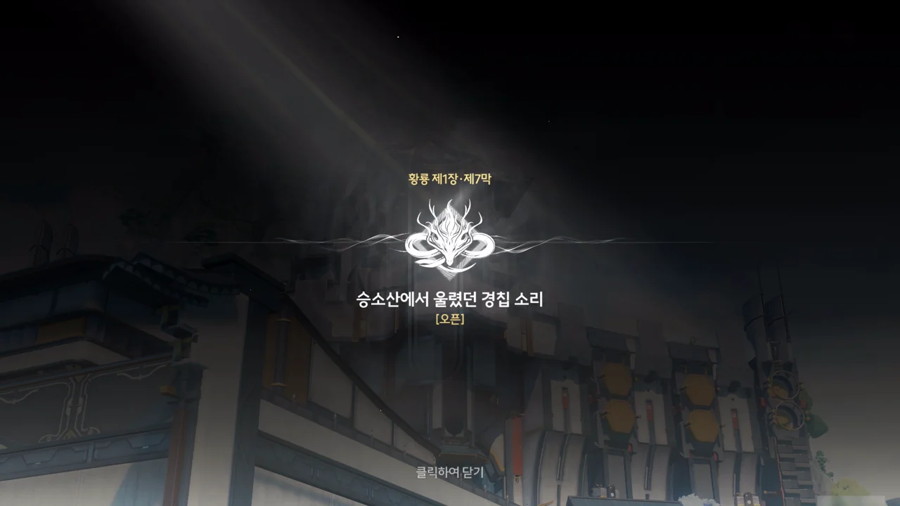
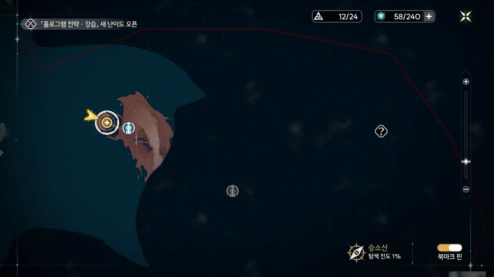





쪼꼬미~~돼지~~가 혼자 식탁에 놓인 음식을 다 먹어치울 동안, 방랑자는 뭔가 깊은 생각에 빠져있다.







꿈속에서의 방랑자는 「용의 뿔」과 함께 용 모양 산으로 날아갔다. 그곳에는 잔상이 매우 많았지만, 「용의 뿔」이 마을의 시간을 바깥과 다르게 만든 덕택에 사람들과 마을을 구할 수 있었다. 「용의 뿔」이 친 결계 바깥에서 보는 산속의 시간은 결계 바깥보다 느리게 흘러갔는데, 그 덕택에 잔상이 결계 안으로 들어오지 못한 것이다. 하지만 방랑자는 그 시간의 흐름 차이를 무시하고 그 결계를 자유롭게 드나들 수 있었다.

여기서 방랑자의 특이 체질이 또 나오는 건가? 처음에는 잔향을 흡수하는 체질이 나왔고, 이제는 시간 결계를 무시하는 체질이 나왔네.

> 나와 친구가 되었다는 거 자체가 이미 대단한 능력을 가졌다는 거야!

뭐라 애써 부정을 하고 싶은데, 보통 평범한 공명자는 몸속에 에코를 담고 다닐 수 없지... 그래, 네 말이 맞다!







방랑자가 꿈속에서 「용의 뿔」에게 들은 지명은 '승소산'이었다.

방랑자와 쪼꼬미의 대화를 옆에서 듣고 있던 할아버지가 설마 승소산을 모르는 거냐고 묻자, 쪼꼬미가 혹시 승소산을 아는 거냐고 달려든 탓에 할아버지를 놀라게 했다.

에코가 말을 하는 게 흔한 일은 아니지만, '리'로 시작하는 이름의 나라에는 말을 할 줄 아는 에코가 제법 있는 모양이다. 지금까지 공개된 나라는 '황룡'과 '신 연방' 두 나라가 전부인데, 저 '리'로 시작하는 이름의 나라가 또 다른 나라의 떡밥인 건지, 아니면 황룡이나 신 연방의 다른 주 이름을 잘못 번역해서 나온 오역인 건지 잘 모르겠다.

새로운 단어가 나와도 이게 떡밥인지 오역인지 의심부터 해야 한다는 게 좀 슬프네.





다른 할아버지가 울음새 늪 동쪽 바다에 있는 승소산은 산 전체가 「용의 뿔」의 모양을 따라 조각한 것 같이 보이는, 금주 선대의 조상 땅이라고 알려준다. 다만 승소산에 실제 가본 사람은 없으며, 승소산을 찾으려 한 사람들은 바다 안개에서 길을 잃거나, 다시는 돌아오지 못했다고 한다.

뭔가 도시전설 같은 느낌이 나는데... '도시전설인 줄 알았는데 그곳은 실존하는 장소였다'라는 건 게임에서 많이 볼 수 있는 클리셰다.





쪼꼬미 역시 최근 들어 동남쪽에서 굉장히 강력한 주파수 에너지가 풍기는 냄새를 느꼈다고 한다. 하지만 그 냄새는 뭔가 이상하고 부자연스러운 느낌이었다는데, 만약 그 냄새가 승소산에서 온 거라면, 시간이 느리게 가는 승소산의 특징 때문에 그런 느낌을 받은 것일 수도 있다. 시간이 느리게 가는 건 이상하고 부자연스러운 일이니까.





방랑자가 전에 수호신을 보았다는 건 처음 눈을 떴을 때 수호신 조각상을 보고 본 환상을 말하는 거겠지?

금희가 수호신을 찾으러 가면서 소식을 전해주겠다고 약속했는데, 여태 변정으로부터 아무런 연락이 없으니, 직접 변정으로 금희를 찾아가 수호신에 대해 물어보기로 했다.

제1장 황룡 제7막 \[승소산에서 울렸던 경칩 소리\] 오픈!



쪼꼬미는 나온 지 얼마 되지도 않았는데 벌써 졸리다고 들어가 버렸다.





변정에 찾아가 보았지만, 방랑자를 맞이하는 건 금희가 아니라 산화였다.

금희가 승소산에 간 후, 며칠째 연락이 끊긴 상태라고 한다.





황룡 아카이브에 함정을 파 스카를 잡았을 때, 스카는 금희에게 수호신을 이미 가뒀다고 말했다. 그리고 그를 뒷받침하듯, 금희와 수호신의 감응이 끊겼고.

수호신이나 금희에게 변고가 생긴 사실이 알려지면 금주가 큰 혼란에 빠질 것이 분명하기에, 금희는 수호신의 안위를 확인하기 위해 마지막으로 수호신이 목격된 승소산으로 홀로 향했다.

그리고 그 후 지금까지 연락이 끊겼다는 말이지...









방랑자가 금희를 돕기 위해 승소산에 가겠다고 말하자, 산화는 승소산으로 가는 길을 안내해 줄 「안내인」이 울음새 늪 근처 나루터에 있을 거라고 알려준다.

산화가 마지막으로 금희와 연락했을 때, 금희는 힘든 걸 애써 정신력으로 감추는 듯했다고 한다. 여태껏 연락이 없는 것도 그렇고, 분명 승소산에 무슨 일이 생긴 게 틀림없다.





쪼꼬미가 느끼기에, 승소산 쪽에서 풍기는 이상한 냄새는 향기롭긴 하지만 먹을 수 있는 것 같지는 않았다고 한다. 먹을 수 없다는 건... 잔상이 아니란 건가?

쪼꼬미가 주파수 소화라고 하는 걸 보면, 북락 광야에서 무망자에게서 흡수한 막대한 양의 에너지가 아직 다 *소화*되지 않은 모양이다. 그걸 처리하는데 필요한 에너지의 양 역시 상당한 건지, 자꾸만 졸리다고 하네.

쪼꼬미가 나와 활동하는 데에는 에너지가 필요하고, 흡수한 주파수를 소화하는 데에도 에너지가 필요하다. 하지만 쪼꼬미의 에너지 총량이 너무 적은 탓에, 둘 중 하나만 하는 데에도 힘에 부치는 것으로 보인다.





울음새 늪 나루터라고 하길래 난 용산 나루에서 출발하는 줄 알았다. 그런데 무음 구역 근처에 있는 나루터에서 출발하네?







응? 장리가 여기서 나온다고?

저번에 황룡 아카이브에서 금희가 장리와 통화할 때, "이번엔 제가 바둑돌이 되겠어요"라고 말한 게 바로 이걸 말한 거였어? 게다가 통화가 끝나고 금희가 독백한 "바둑을 두는 자 또한 하나의 바둑돌일 수 있는 법" 역시 여태껏 장리가 배후에서 일을 조종하다가 이번 일을 계기로 현장에 나서게 되었다는 걸 말해주고 있다.

와... 그나저나 쮸쮸복어...







> 어떤 지역의 시간은 다른 곳에 비해 매우 느리게 흘러가지만, 그 지역을 벗어나면 그동안 밀렸던 시간이 한 번에 밀려들어와, 순식간에 늙어버린다
{.bq}

이런 내용의 설화는 전 세계적으로 널리 퍼져있다. 중국에서 시작되어 한국에 전해진 '신선놀음에 도낏자루 썩는 줄도 모른다'라는 설화나, 일본의 우라시마 타로 전래동화, 미국의 립 반 윙클 소설, 아일랜드 신화의 영웅, 오신 막 핀의 이야기 등이 여기에 포함된다.

승소산 지역의 시간 배속은 정상 시간의 10배. 방랑자와 동행하겠다는 장리는 자신의 수명이 깎일 것까지 감수하고 방랑자와 동행하겠다고 하는 것이다.







승소산의 느린 시간 흐름은 전적으로 「용의 뿔」의 시간 제어 능력에서 비롯되는 것인데, 만약 잔성회가 「용의 뿔」을 가두는 바람에 「용의 뿔」의 시간 제어 능력이 통제를 벗어나게 되었다면, 승소산은 뒤틀린 시간 안에 갇혀 더 이상 돌이킬 수 없는 지경이 될 거라고 말한다.

> 방랑자가 이미 대국의 첫수를 둔 이상 「안내인」으로서 제가 함께 가는 건 당연한 거겠죠.
> 승소산의 이번 대국에서 방랑자는 없어서는 안 될 존재일지도 모르니까.

장리가 왜 이렇게 방랑자에 집착하는 건가 궁금해했는데, 장리 캐릭터 스토리에 그 답이 있다고 하더라.



> 사부님은 항상 누군가를 찾아다녔던 것 같다.
> 어린 장리는 연로하신 사부님을 따라 황룡을 유랑했다. 덕망이 높은 어르신은 더 이상 제자를 받지 않겠다고 했지만, 이왕 어린 제자를 받은 거, 마지막 순간까지 모든 학식을 다 전해주려고 했다. 어르신은 바둑 두기를 좋아했다. 떠도는 생활에 지칠 때면 사부님과 장리는 그 자리에 앉아 바둑을 두기 시작한다. 사부님은 바둑을 통해 장리에게 많은 것을 가르쳐 준다. 하지만 가끔은 장리와 끝내지 못한 바둑을 복기하며, 매번 중반쯤에 깊은 생각에 빠지기도 한다.
> 이때마다 항상 바둑을 같이 뒀던 옛 친구의 얘기를 꺼낸다. 사부님이 장리를 제자로 받아들인 것도 사부님의 옛 친구를 찾기 위해서이다. 하지만 그분의 이름이 뭔지. 어디에 사는지는 사부님도 모른다.
> "아직 때가 아니다."
> 임종을 예감하던 날 사부님은 들고 있던 기보와 일기장을 장리에게 건네며 제자에게 뜻을 전했다.
> "모든 인과는 모두 바둑 속에 있다."
> 제자는 사부님의 뜻을 이어받아 계속 전진하였다.
> "... 천인(天人)은 세상에 태어나, 건곤을 손에 쥐며, 육체에 잔향을 흡수한다."
> "... 구름과 노을이 가물가물할 때 금색 눈동자를 가진 기인과 만난다."
> "... 용의 별자리와 나란히 서서 격 없이 지낸다."
> 그녀는 사부님이 남긴 일기장을 따라 조금씩 앞으로 나아가며, 여러 곳에 그 사람의 흔적이 존재한다는 것을 발견했다. 때로는 이야기꾼이 전하는 멋진 이야기 속에, 때로는 역사책 속에 기록된 몇 마디의 글 속에 --- 그 존재는 견고한 초석이나 등대와 같이, 비바람에 흔들리는 문명 속에서 사람들을 더 나은 미래로 인도한다.
> 그 사람이 세상에 남긴 흔적은, 마치 알아채기 어려우면서도 또 질기고 긴 비단실처럼, 보통 사람의 수명보다 훨씬 긴 세월을 역사와 낱낱이 엮어낸다.
> "그 특별한 사람의 출현은 반드시 네가 알아차릴 만한 징후를 동반한다. 그 사람은 세상을 바꿀 수 있는 진정한 능력을 가진 사람이다."
> 천하태평의 소원을 이루려면 멀고 먼 환상만으로는 부족하다. 그녀는 반드시 충분히 높고 먼 곳에 서있어야 하고, 자신이 추구하는 미래에 닿을 수 있는 충분한 힘을 가져야만, 많은 이들이 그녀에게 맡긴 희망과 약속을 완수할 수 있다. 그래서 그녀는 4개국을 유랑하고 열심히 배우며, 비록 길이 멀고 험난하더라도 포기하지 않았다.
> 장사가 된 후 그녀는 황룡 아카이브에 들어갈 수 있는 권한을 얻었다. 수많은 기록 속에 드디어 제일 중요한 정보를 획득했다.
> 정보가 가리키는 곳은 황룡 변경의 요충지에 위치한 금주였다.
> &nbsp;
> 모든 게 수호신의 예언처럼, 귀객이 금주에 방문하여 국면을 타개하고 전쟁을 끝내고, 금주를 지킨다 --- 전적과 전설에서만 나타나는 흐릿한 뒷모습, 이제야 뚜렷한 모습이 나타났다.
> 정식으로 만나던 그날, 그녀는 명정에서 금주로 황급히 돌아갔다. 그 귀객이 항구에 서서 비 속을 헤매고 있는 것이 보였다.
> --- 그 귀객이 용의 별자리의 말대로 나아간다면 우리는 언젠가 만날 것이다.
> 바로, 지금이다.
> 그녀는 복잡한 눈빛을 감추고 그 사람에게로 한 발짝 한 발짝 다가갔다. 영조 문양이 그려진 종이우산은 기울어지면서 두 사람의 눈이 마주쳤다. 그 순간 오직 가랑비가 우산 위를 두드리는 소리만 들려왔다.
> 그녀는 미소를 지으며 묻는다.
> "--- 비 때문에 여기에 갇힌 거예요?"
{.bq}



기억을 잃기 전의 방랑자는 장리의 스승과 친구였다고 한다. 장리의 스승은 평생 자신의 친구를 찾아다녔으나 결국 찾지 못했고, 그의 소원은 장리에게 이어졌다.

장리가 사부의 일기장에 남은 방랑자의 흔적을 조사해 보니, 방랑자의 흔적은 보통 사람의 수명보다 훨씬 긴 세월 곳곳에 녹아 있었다. 더 많은 정보를 얻기 위해 노력한 끝에 장사가 된 장리는 황룡 아카이브에서 방랑자의 마지막 흔적이 금주에 있음을 알게 되었고, 모든 지위를 버리고 금주로 가 금희의 스승이 되어 조용히 방랑자가 다시 나타날 때를 기다렸다.

방랑자가 금주에 나타나 명식을 격퇴해 평화를 되찾자, 장리는 스승이 그토록 찾아다니던 친구가 바로 방랑자임을 확인하게 되었다.

그리고 그 방랑자가 승소산에 가기 위해 나루터에 서있는 모습을 보자, 장리는 뛰는 가슴을 애써 진정시키고 첫인사를 나눈다.

"비를 피하고 있는 건가요?"

&nbsp;

자신과 스승이 평생 찾아다니던 사람을 만났으니 당연한 반응이다.





방랑자가 변정에 와 금희의 행방을 물을 것을 예상했는지, 사실대로 말해달라고 장리가 산화에게 당부했다고 한다. 수호신과 긴밀한 관계가 있는 방랑자가 이 일에 개입하는 것만으로도 잔성회의 계획을 크게 흔들 수 있기 때문이라고 한다.

스카 말대로, 방랑자는 너무 인기가 많다.





> 글쎄요? 하지만 방랑자 말고 또 누가 있을까요?
> 이 답을 찾기 위해 저는 정말 많은 노력을 기울였어요.

장리의 캐릭터 스토리를 잘 요약해 주는 두 문장이다.





뭐, 가는 수밖에 없겠지.











길상 할아버지가 말한 대로, 짙은 바다 안개를 뚫고 배가 승소산으로 나아간다.

승소산의 용 모양 조각을 본 방랑자가 머리를 스치는 고통에 얼굴을 찌푸리자, 장리가 자장가 같은 노래를 불러주어 방랑자를 진정시킨다.





드디어 승소산에 도착했다. 하지만 아직 시간 결계를 지나온 건 아니라, '세월의 해변'을 넘어야 한다고 한다.

금희의 상태가 지금 어떤지 모르니, 신속하게 금희를 만나야 한다.

이번 버전에 추가된 신지역, 승소산의 표면적 넓이는 그리 커 보이지 않는다. 하지만 승소산에는 지하 구역이 있으며, 복잡하게 얽힌 지하 구역은 지도가 없다면 길을 잃기 십상이라고 한다.
