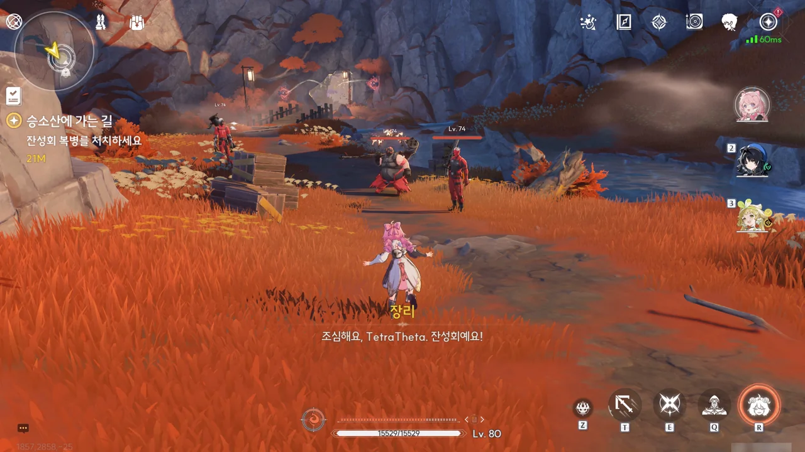
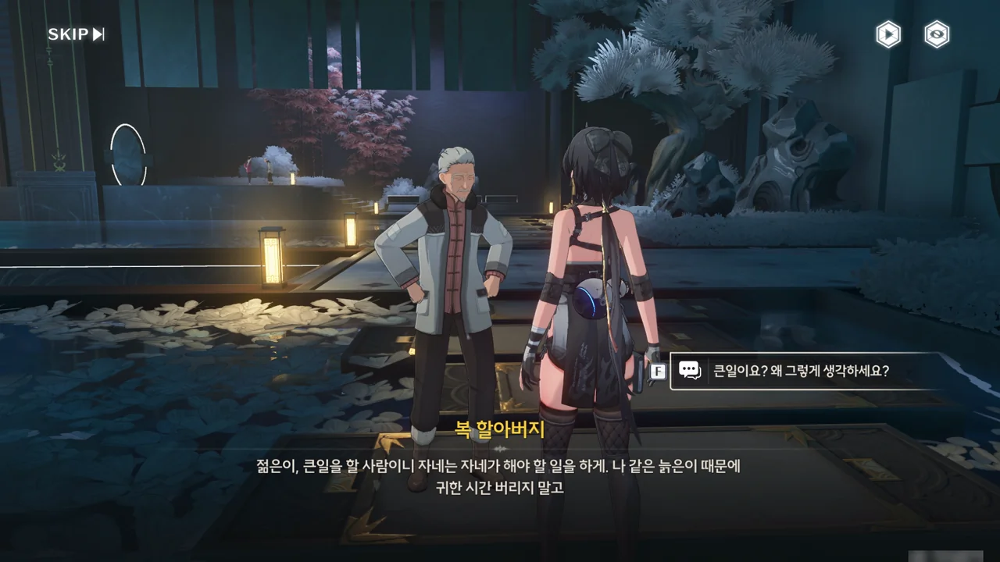



앞으로 나아가야 하는데, 다리가 끊겨 있다.

로프를 걸만한 장소도 보이지 않는데, 설마 글라이더로 반대편까지 건너간 후, 절벽을 기어올라야 하는 걸까?





그때 옆에 있던 작은 웅덩이에서 작은 장치가 떠오른다. 직정의 발명품, 「역류계」라고 한다.

역류계는 「용의 뿔」의 시간 제어 능력을 모방해 만든 장치로, 좁은 범위의 시간을 되돌려 물건을 복원할 수 있다고 한다.

그러면 무너진 다리의 시간을 돌려 다리를 다시 멀쩡하게 만드는 게 지금 이 역류계의 사용법이 되겠네.







일찍이 직정 사람들은 승소산의 기묘한 시간 흐름에 매혹되어, 승소산과 바깥의 시간 차이로 인해 순식간에 죽어버릴 수 있음에도 이를 감수하고 승소산에 올랐다고 한다. 그리고 연구 끝에, 직정 사람들은 수호신의 능력을 모방한 「역류계」를 만드는 데 성공했다.

승소산의 시간 흐름에 흥미를 가졌으면서도 승소산에 입산하지 않은 직정 연구원이 없지는 않았을 텐데, 어째서 역류계와 비슷한 물건을 승소산 바깥에서는 단 한 개도 볼 수 없었던 걸까? 어쩌면 장리의 추측처럼, 역류계는 승소산에서 멀어지면 제 기능을 하지 못하는 것일지도 모른다.





응, 쉽네. 이런 퍼즐은 옛날에 다른 게임에서도 몇 번 해봤다고.



금주 본토에서는 사운드박스를 모으는 것이 목표였다면, 승소산에선 정풍의 종을 모으는 것이 목표가 된다.



직정 사람들은 승소산과 바깥의 시간 차이로 인해 순식간에 죽을 수 있었음에도 이를 감수하고 승소산의 독특한 시간 흐름을 연구했다. 진리가 자신의 목숨보다 우선했기에 그런 선택을 한 것이겠지만, 자신의 목숨을 그런 것에 기꺼이 내던질 수 있다는 것 자체가 그들의 비범함을 증명한다. 보통 사람은 자신의 목숨을 제일 우선시할 테니까.



잔성회가 여기에서도 깽판을 칠 거라고는 예상했지만, 승소산 초입부터 길을 막고 있을 줄은 몰랐다. 잔성회 이 녀석들은 방랑자 인생에 도움이 단 일도 안 된다니까.





동굴의 입구를 막고 있는 건 직정의 또 다른 발명품, 「광선 차단막」이다. 「광선 차단막」에 연결된 「빛의 장막」을 공격해 닫으면 「광선 차단막」을 해제할 수 있다.

순간 '이 차단막이 있으니 저 너머에는 잔성회가 없는 것 아닐까?'라고 기대했지만, 차단막을 풀기 쉽다는 건 잔성회 역시 이 차단막을 풀고 그 너머로 들어갔을 가능성이 있다는 것이다.





결계 너머로 들어온 방랑자와 장리. 방랑자는 별다른 이상이 없지만, 장리는 어디 문제라도 생긴 건지 머리를 짚고 있다.

이상하네. 지금까지 들었던 시간 결계에 대한 정보대로라면, 시간 결계 안에서 밖으로 나갈 때 갑자기 나이를 먹게 되는 현상이 생긴다. 그런데 그 어디에도 시간 결계 안으로 들어갈 때에도 뭔가 문제가 생긴다는 말은 없었거든. 대체 장리의 어디가 아픈 거지?







눈앞에 펼쳐진, 마치 시간이 멈춘 것처럼 보이는 이 광경은 수호신이 감금된 탓에 시간의 흐름이 구속력을 잃고 뒤틀린 탓에 생긴 것이라고 한다.

시간 결계 바깥과 비교해 그저 느리게 흘러가던 결계 내부의 시간 흐름이 마구잡이로 뒤엉켜, 어떤 곳은 시간이 완전히 멈추고, 다른 곳은 시간이 지나치게 빠르게 흘러가거나 역행하기도 한다고 한다. 이 상황에서 결계 바깥으로 나갈 시, 기존의 10배의 대가가 아닌 100배나 1,000배의 대가를 치러야 할 수 있다.

결계 내부의 시간이 뒤죽박죽이 되었다는 건, 몸의 부위와 같은 작은 영역에서도 시간의 흐름 차이가 날 수 있다는 말이다. 가령, 팔에 걸린 시간은 결계 바깥의 1/100이지만, 다리에 걸린 시간은 결계 바깥의 1/1,000인 경우가 있을 수 있다. 그 상태에서 결계 바깥으로 나가면, 팔에 걸리는 시간 보정보다 다리에 걸리는 시간 보정이 훨씬 더 커, 다리가 순식간에 바스러질 수도 있다.





이렇게 시간 흐름이 뒤엉킨 곳에선 단말기를 통한 통신조차 힘들기 때문에, 승소산 시간 결계 내부에 위치한 마을, 홍진 마을로 이동해 직접 정보를 얻어야 한다.



지금 이렇게 멈춘 것처럼 보이는 서리노루의 시간은 시간 결계 바깥의 속도보다 10배 느리게 흐르는 승소산 시간 결계 내부의 시간보다 훨씬 더 느리게 흘러가고 있는 것이다.





장리는 자신이 자유롭게 움직일 수 있는 게 수호신이 완전히 갇히기 전, 간신히 상황을 억제했기 때문일 것이라며, 만약 자신이 방금 전 서리노루처럼 시간에 갇히게 되더라도 상관 말고 계속 갈 길을 가달라고 부탁한다.





홍진 마을 역시 시간 흐름의 뒤틀림에서 벗어날 수는 없었던 건지, 모든 것이 정지한 유령 마을처럼 변해있었다.







방랑자가 꿈에서 홍진 마을을 봤다고 말하자, 장리는 방랑자가 꿈속에서 본 건 실제 있었던 일이라고 알려준다.

100여 년 전, 잔상류가 황룡을 침범했을 때, 홍진 마을 역시 잔상의 침입을 받아 전멸할 뻔했다고 한다. 하지만 그때 「용의 뿔」이 하늘에서 내려와 시간 결계를 친 덕분에 잔상을 격퇴하고 마을을 지킬 수 있었다.





운 좋게 시간에 갇히지 않은 잔성회가 남아있었던 건지, 홍진 마을 곳곳에 잔성회가 돌아다니고 있다. 기왕 갇히는 거, 전부 다 갇혀버렸으면 좋았을 것을.





바닥에 남은, 금희가 공명 어빌리티를 쓴 흔적을 따라 마을 깊은 곳까지 가보기로 했다.



시간에 갇힌 건 잔성회뿐만이 아니었다. 홍진 마을의 주민 역시 시간에 갇혀 꽁꽁 얼었는데, 대부분 마을을 습격한 잔성회에게서 도망치는 모습 그대로 굳어버렸다.





분명 산화가 금희의 상태가 별로 좋지 못한 것 같다고 말했는데, 이렇게 공명 어빌리티를 자주 쓴 것으로 보아, 금희가 상당한 무리를 하고 있는 모양이다.

가장 유력한 상황은 금희가 홍진 마을 사람들의 피난을 돕기 위해 공명 어빌리티를 남발했다는 것이다. 그렇다면 피난한 주민들은 어디에 있는 거지?





금희의 흔적이 연못가 주변에서 끊겼다.





연못 한가운데 있는 돌탁자 위의 꽃병을 돌리자, 연못의 발판이 재배열되며 폭포 뒤로 가는 길이 열렸다.





이곳 역시 광선 차단막이 길을 막고 있다. 폭포 뒤에 있는 광선 차단막... 아마 여기에 마을 사람들이 있을 것 같다.

그런데 이런 곳에서 총 캐릭터를 강요하는 건 좀 너무하지 않나?











역시, 차단막 뒤에 피난한 마을 사람들이 모여 있었다.

홍진 마을의 지도자는 '신이'라는 사람으로, 변정의 요직에 있다 사임하고 홍진 마을로 와 지도자가 된 모양이다.





복 할아버지라는 사람은 방랑자를 보더니 큰일을 할 사람이라며 자신 같은 늙은이 때문에 귀한 시간을 버리지 말고 해야 할 일을 하라고 조언한다. 그러면서도 "혼란 속에서 새로운 기회를 잡을 수 있을지도 모르겠다"라는 말을 한다.

확실히 금주와 승소산은 「용의 뿔」 문제 때문에 혼란스러운 상황에 빠져있다. 이게 늙은이의 지혜라는 건가...





금희를 찾아 홍진 마을에 온 것이지만, 정작 금희는 조금 전 직정 유적, 고천관으로 향했다고 한다.



회상 속 금희는 부상자를 치료하기 위해 공명 어빌리티를 과하게 쓰고 있다. 「용의 뿔」의 능력이 시간 조종이니, 부상자의 시간을 되돌려 부상을 치유하는 방식을 쓰는 게 아닐까 한다.

하지만 공명 어빌리티의 과도한 사용 때문일까, 금희의 몸 곳곳에 용의 비늘이 나타나고 있다.









뒤틀린 시간과 잔성회의 습격을 피해 이곳 밀실에 숨은 마을 사람들.

금희가 자신의 공명 어빌리티로 잔성회와 뒤틀린 시간으로부터 안전한 밀실을 만들었지만, 수호신의 상태가 악화됨에 따라 금희의 공명 어빌리티 역시 약해지고 있어, 이 밀실을 만드는 것이 금희가 할 수 있는 전부라고 한다.

이 문제를 해결하기 위해선 뒤틀린 시간이 터지기 전에 수호신의 위치를 알아내야 한다.







시간의 흐름이 뒤틀렸을 때, 신이가 「용의 뿔」이 동면실인 「용의 안식처」로 날아가는 것을 보았다고 한다. 「용의 안식처」에는 방어 시스템이 있어, 수호신이 들어오면 작동하도록 되어있는데, 이를 이용해 잔성회의 움직임을 관찰하고 「용의 안식처」 주변을 포위하고 있던 일부 잔성회를 처치했다고 한다.

현재 봉쇄된 「용의 안식처」를 다시 열기 위해선 고천관에 있는 「심핵」을 이 밀실로 가져와야 한다.

신이가 몸 상태가 좋지 않은 금희 대신 「심핵」을 가져오겠다고 했으나, 금희가 자신이 미끼가 되어 잔성회를 유인하겠으니 여기 남아 밀실과 마을 사람들을 지켜달라고 하는 바람에 단념하고 여기 남기로 했다.





「용의 뿔」은 금희와 자신 사이에 전쟁이 있을 것을 예견했으며, 금희가 수호신보다 더 강한 존재로 성장해야 금주의 미래가 진정으로 금주 사람들 손에 달리게 될 것이라 했다고 한다.

그게... 가능한 일인가?







잔성회가 「용의 뿔」을 「용의 안식처」에 가뒀다고 하는 걸 보면, 「용의 안식처」가 봉쇄된 건 방어 시스템의 일환이 아닌, 잔성회가 무슨 수작을 부린 탓으로 보인다.

잔성회가 지대한 관심을 보이는 방랑자와 장리가 고천관으로 가 금희를 찾으면 마을에 있는 잔성회 병력 대다수가 마을을 떠나 고천관으로 갈 테니, 신이는 마을에 남은 잔성회 병력을 처리해 달라고 장리가 부탁한다.

> 승소산에서 나와 다시 승소산으로 돌아온다라, 영윤 대인과 이곳의 인연은 어쩌면 이미 정해진 일일지도...

응? 설마 금희의 고향이 승소산이었던 거야? 그러면 금희가 승소산 밖으로 나온 게 대체 언제인 거지? 승소산에 오래 머무를수록 나이를 빨리 먹게 될 테니, 금희가 승소산 밖으로 나온 건 금희가 아주 어릴 시절일 수밖에 없을 텐데 말이다.
