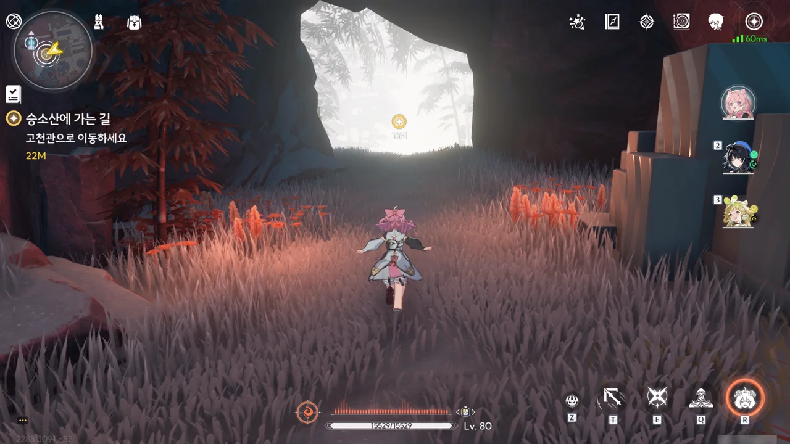
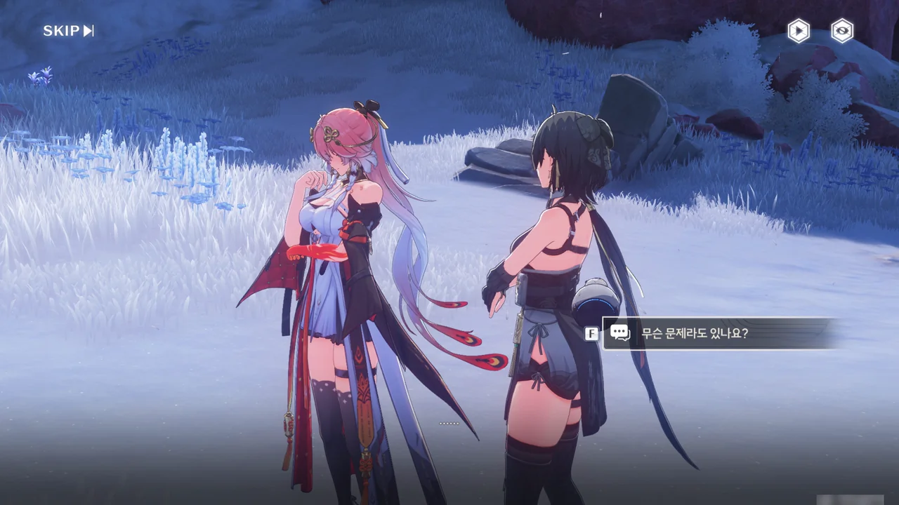









나가는 길에 만난 두 사람.

우찬은 바깥에 아직 구하지 못한 사람이 있다는 것에 죄책감을 느끼고 있다. 과거 홍진 마을의 지도자였던 복 할아버지가 신이에게 지도자 자리를 넘기려 할 때, 홍진 마을에 대해 모르는 사람에게 지도자 자리를 넘겨서는 안 된다며 소리 높여 반대했던 것이 바로 우찬이었는데, 이번 사건에서 신이가 옆에서 지휘해주지 않았다면 우찬은 사람들을 구하기는커녕 자기 목숨마저 잃었을지도 모른다고 말하고 있다.

100년이 넘는 세월 동안 살아온 복 할아버지는 비록 마을 지도자 자리 --- 그걸 '장사'라고 부르는 건가? --- 에서 내려왔지만, 여전히 마을에 큰 영향력을 행사한다고 한다. 복 할아버지의 조언을 들었을 때, 그냥 마을의 노인이 해주는 조언인가 보다 하고 넘겼는데, 알고 보니 전 마을 지도자의 조언이었던 것이다.

여기는 차단막이 보이지 않는데, 아까 신이가 "밀실의 옆문을 개방하겠다"라고 한 게 바로 이걸 말하는 것이었나 보다.





금희가 수호신에게 선택받은 건 그녀의 공명 어빌리티 때문이다. 그녀가 변정에서 수호신의 공명자로서 보살핌과 가르침을 받은 건 그녀가 어느 정도 성장한 후였다. 신이와 만난 건 바로 그때였고.

승소산의 시간 속도는 정상 속도의 1/10이다. 즉, 금희가 승소산에서 3년을 보냈다면, 승소산 바깥으로 나왔을 때 금희의 나이가 30살이 되어야 한다는 말이다. 만약 그보다 더 오랜 시간을 승소산에서 보냈다면, 나이를 더 먹었을 테고. 그런데 장리의 말을 보면, 금희 역시 승소산 시간 결계의 영향을 받지 않는 것으로 보인다.

금희의 주파수가 방랑자와 같다는 게 이것까지 포함한 거였어?



'도약 장치'라고 적고 '점프대'라고 읽는 장치가 있다. 이거, 재미있더라고! 끼얏호우!





고천관으로 가는 입구가 차단막으로 막혀있다. 이걸 해제하기 위해선 절벽에 있는 세 개의 「빛의 장막」을 비활성화해야 한다.





시간 제어 기술은 평범한 --- 장리 같은 사람이 평범한지는 둘째치고 --- 사람이 빠르게 이해하고 활용할 수 있는 것이 아닌데, 직정 사람들은 과연 어떻게 시간 제어 기술을 재현한 건지 장리가 궁금해하고 있다.

어쩌면 장리의 추측대로, 수호신이 자발적으로 직정 사람들에게 이해하게 쉽게 알려준 걸지도 모르겠다.







원반의 한쪽 끝을 고에너지 흑석으로 부순 후, 원반을 잘 돌려서 세 「빛의 장막」이 동시에 드러나게 조절한 후, 그 셋을 비활성화하면 된다.



고천관 안에는 직정이 발명한 것으로 보이는, 잔상 시뮬레이션이 돌아다니고 있다. 이거, 황룡 아카이브에서도 비슷한 걸 본 적이 있었지... 황룡 아카이브 역시 직정의 손길이 닿았던 걸까?











'잔상' --- 시뮬레이션이나 진짜나 어차피 때리면 똑같이 맞는다 --- 을 모두 처리하자, 「빛의 무늬」 앞에 있던 「빛의 운석」의 잠금이 풀린다. 그걸 누르자, 빛의 무늬의 별 중 하나가 꺼졌다.

이제 두 개 더 누르면 되겠네.





장리가 바닥에서 금희의 핏자국을 발견했다. 금희의 상태가 생각보다 더 심각한 모양이다.















직정 사람들이 쓴 것으로 보이는 보고서가 있다.

승소산에 오기 전부터 「용의 뿔」은 부상으로 인해 '주파수 누락', 즉 시간 제어 능력의 일부 상실을 겪고 있으며, 그 탓에 간섭한 시간의 흐름을 원래대로 되돌리지 못하고 있다.

만약 용의 뿔이 사망하는 등의 이유로 시간 흐름이 통제를 완전히 벗어나게 된다면 승소산 결계 내부에 갇혀있던 억제된 시간 흐름이 금주 전체로 퍼져나갈 수 있기 때문에, 「기인」 --- 기억을 잃기 전의 방랑자로 보인다 --- 은 직정 사람들과 협업을 통해 용의 뿔의 부상을 회복하고자 했다.

하지만 당장은 「용의 안식처」로 능력 상실의 정도를 정체시키는 것 정도가 한계였으며, 용의 뿔의 시간 제어 능력을 회복시키는 데에는 결함 없는 공명체인 '완성된 「역류계」'를 이용하기로 연구 방향을 잡았다고 한다.

현재 역류계의 복원 범위가 승소산 전체 넓이에 비해 턱없이 적은 것으로 보아, 역류계를 완성시키는 데에는 실패한 모양이다. 인공 공명 장치가 실패했으니, 이제 남은 건 공명자 --- 금희 --- 를 통해 용의 뿔을 회복시키는 것뿐이다.









앞에 놓인 퍼즐을 풀어 또 하나의 별을 꺼트렸다.



엘리베이터를 타고 아래층으로 내려간다.

















아까 발견했던 보고서 이후에 작성된 것으로 보이는 일지다.

인공 공명 장치, 「역류계」의 원리는 공명의 근원 --- 「용의 뿔」을 말하는 건가? --- 에 강한 충격을 주어 역류계와 동일한 주파수로 공명하게 만들어 공명 효과를 일으키는 것이다. 역류계가 제대로 기능하기 위해선 용의 뿔과의 공명이 반드시 필요한데, 용의 뿔이나 승소산과 거리가 멀어지면 공명 효과를 일으킬 수 없게 된다. 인공적으로 만든 장치의 한계 상, 역류계가 담을 수 있는 공명 에너지 역시 크게 제한되는 것은 말할 것도 없고.

그래서 직정 사람들은 '2차 공명'이라는 가설을 제시했다. 단순히 공명의 근원에 충격을 줘 공명 효과를 이끌어내는 게 아니라, 두 주파수를 의도적으로 충돌시켜 더 강한 공명 효과를 이끌어내는 것이다.

하지만 역류계를 대상으로 한 실험은 단 한 번도 성공하지 못했다. 모든 역류계가 공명 에너지를 견디지 못하고 산산이 부서진 것이다. 사람으로 치면 오버클럭에 빠져 죽은 것이다.

하지만 과부하에 빠진 역류계가 붕괴하기 직전, 「기인」이 「용의 뿔」에게 어떤 명령을 내리자 역류계가 짧은 시간 동안 왜곡된 시간을 되돌리는 데 성공했다. 그 역류계는 곧바로 붕괴해 버렸지만, '2차 공명'의 가능성 자체는 확인된 셈이다.

하지만 「용의 뿔」의 강력한 공명 에너지를 오버클럭 없이 견딜 수 있는 공명자가 과연 몇이나 있을까? 있기는 한 걸까?





일지와 멀지 않은 곳에서 금희가 홀로 잔상을 상대하고 있다. 가뜩이나 몸 상태도 좋지 않은데 공명 어빌리티까지 억지로 쓰다 보니, 금방이라도 정신을 잃을 것만 같아 보인다.









장리와 방랑자가 여기까지 올 줄은 전혀 예상치 못했던 건지, 금희가 제법 놀라는 모습을 보여준다.







금희 역시 장리와 방랑자가 본 그 문서들을 읽은 모양이다.

현 상황을 타개할 유일한 방법은 금희가 「용의 뿔」과 격돌하여 2차 공명을 이끌어내 「용의 뿔」의 시간 제어 능력을 복원하는 것이다. 그리고 그걸 위해 자신이 감수해야 할 위험 --- 오버클럭으로 인한 사망 --- 까지 금희는 이미 알고 있다.





'공명'이라는 건 참 모르겠다.

대부분의 공명자는 '공명 대상'과의 공명 형태가 *단순*하다. 무생물 혹은 현상과 공명한 경우는 말할 것도 없고, 생물과 공명해보았자 몸 어딘가에 그 생물의 특징이 일부 나타나는 정도에 그친다. 설지의 「우담」처럼 울림 생물의 형태로 공명 에너지가 나타나는 경우도 간혹 있지만, 그건 매우 드물고, 그 생물조차 공명자에 기원했다는 느낌이 더 강하다.

하지만 금희의 경우는 다르다. 금희가 공명하는 건 기존에 존재하고 있던 생명체, 「용의 뿔」이다. 기존에 존재하는 생물과 공명할 경우, 금희의 경우처럼 그 생물과 서로 마음이 통하게 되는 걸까?









장리가 금희에게 앞으로의 계획을 생각해 둔 게 있냐 묻는다.

「용의 뿔」과 대결하여 2차 공명을 이끌어내겠다는 금희에게 2차 공명을 시도할 경우 과부하로 산산이 조각난 「역류계」와 다름없는 신세가 될지도 모른다고 경고한다. 만반의 준비를 갖추고 2차 공명을 시도해도 그 성공 확률을 가늠할 수 없는데, 지금 금희처럼 몸 상태가 좋지 않은 상태에서 2차 공명을 시도하는 건 제 명을 재촉하는 것과 다름없다고 말한다.





금희가 장리 역시 추구하는 일을 위해 목숨을 건 적이 있지 않았느냐고 말하지만, 장리는 거기에 대고 '살아야 더 많은 것을 할 수 있다'라고 대꾸한다.

솔직히 말해, 이 부분은 둘이 무슨 말을 하고 있는 건지 잘 이해가 되지 않는다. 때로는 금희가 자신의 죽음을 전제로 수호신의 부상을 회복하겠다고 말하는 것으로 들리고, 때로는 금희가 어떻게든 살아서 2차 공명을 완수해 보이겠다고 말하는 것으로 들린다. 금희가 둘 중 어느 방향으로 말하고 있는 건지 도저히 알 수 없으니, 둘의 대화를 해석하는 것이 힘들 수밖에.

이게 다 번역을 개떡으로 하는 쿠로게임즈 탓이다. 본사 직원이 직접 번역을 하면 뭐 하나? 번역 품질이 외주보다 못할 때가 더 많은데.







장리는 방랑자가 직정 기록의 「기인」이자 「용의 뿔」과 함께 싸운 기록 속 영웅이라며, 금희와 방랑자 둘 모두가 있어야 승소산의 상황을 바꿀 수 있기에 방랑자를 데려왔다고 말한다.

잔성회가 어떻게 용의 뿔을 가둔 건지 아직은 잘 모르니, 용의 뿔을 만나려면 잔성회가 용의 뿔을 가둔 방법을 먼저 알아내야 한다.



역류계 퍼즐을 풀었더니 보스로 용비늘의 기축이 튀어나온 건에 대하여.

이 녀석, 많이 아프다. 나보다 레벨이 낮아서 조금 방심했는데, 보호막 때문에 무적이더라고...





마지막 「빛의 운석」을 활성화했다. 이제 들어가는 일만 남았다.

여태껏 퍼즐을 푸느라 지친 플레이어를 달래주려는 걸까, 내려가는 길을 미끄럼틀로 만들어놓은 덕택에 재미있게 내려갈 수 있었다.

나중에 여길 다시 거슬러 올라가려니까 제법 길더라고.



그래, 이게 바로 「심핵」이라는 거구나.











장리가 「안내인」인 자신의 역할은 여기 까지라며, 자신은 여기에 남아 방랑자를 뒤쫓아오는 잔성회를 막겠다고 말한다. 그러면서 앞으로의 길은 금희와 방랑자에게 맡긴다는 말을 남긴다.























와... 이건 진짜 영상으로 봐야 한다. 열심히 사진을 찍긴 찍었는데, 이 전율을 뭐라 말로 표현하기 힘들다.

장리가 멋지고 이쁘고 아무튼 쩔어요. 잔성회를 전부 처리한 후 웃는 장리가 뇌쇄적이에요... 헤으응...



이제 방랑자와 금희 손에 승소산, 그리고 금주의 미래가 달렸다.
