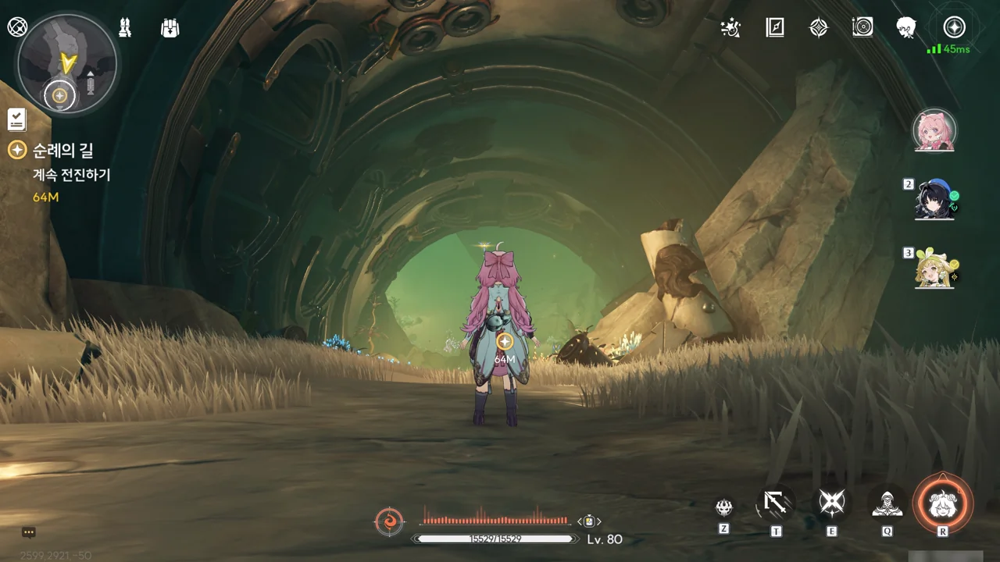
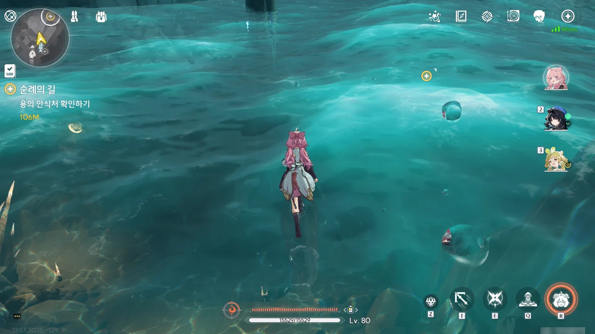
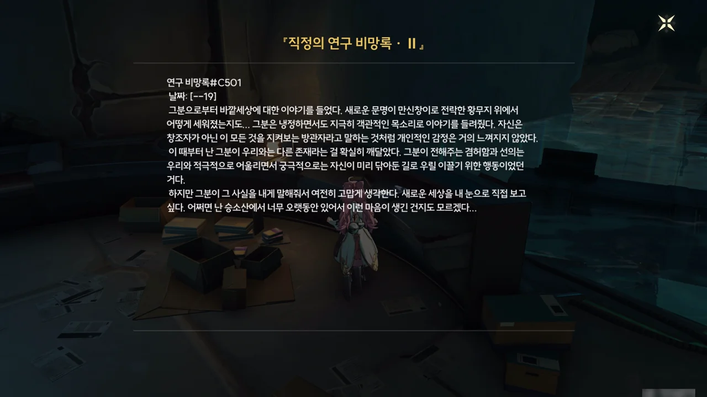



고천관에서 「심핵」을 회수해 돌아왔다.







좋아, 이제 「용의 안식처」로 가는 길이 열렸다.











신이가 사로잡은 사이보그 포로에게서 뽑아낸 정보에 의하면, 잔성회는 개조한 「역류계」와 「빛의 무늬」를 이용해 「용의 뿔」을 「용의 안식처」에 가뒀다고 한다.

잔성회의 원래 계획은 역류계를 개조해 과충전 한 후, 그 에너지를 승소산에 돌아온 용의 뿔에 충돌시켜 용의 뿔을 일격에 죽이는 것이었으나, 이에 실패하자 용의 뿔이 용의 안식처에서 회복하는 걸 막기 위해 곧바로 용의 뿔을 빛의 무늬로 용의 안식처 안에 가뒀다고 한다. 용의 뿔이 용의 안식처에 갇히게 되자, 금희와 용의 뿔 사이의 공명이 약해졌고.

이를 위해 소수 인원을 몰래 승소산에 잠입시키는 것도 꽤 위험천만한 일이라, 일반적인 적이라면 과충전 한 역류계를 용의 뿔에게 쓰는 것을 끝으로 준비한 계획이 모두 바닥났을 것이다. 하지만 잔성회는 역류계를 사용한 작전이 실패할 것에 대비해 빛의 무늬로 용의 뿔을 가두는 계획도 준비해 두는 치밀한 모습을 보이고 있다. 그야말로 smartass라는 말이 어울리는 녀석들이다. 이런 녀석들이 제일 귀찮은데...

금희와 방랑자가 용의 뿔과 만나기 위해선 우선 용의 뿔이 갇힌 빛의 무늬를 해제해야 한다. 다만 홍진 마을 사람들이 보기에 용의 뿔이 상당한 부상을 입은 것으로 보여, 용의 뿔을 꺼낸다고 해서 모든 일이 잘 풀릴 것 같지는 않다.







이미 승소산에 왔을 때부터 「용의 뿔」은 부상을 입어 왜곡한 시간 흐름을 되돌리는 능력을 상실한 상태였다. 「용의 안식처」로 여태껏 부상의 정도가 심해지는 걸 억제하고 있었는데, 이번 잔성회의 공격으로 용의 뿔의 부상이 한층 더 심해졌으니, 신이 말대로 잔성회의 계략은 금주 사람들에게 치명타를 날린 것이나 다름없다.



신이는 「용의 뿔」이 승소산에서 금희를 데려와 변정에서 키우도록 한 이유가 금희가 시간 제어법을 바로잡고 금주 문명이 계속 이어지길 바라서였다는 것과, 금희가 오버클럭으로 죽을지도 모르는 2차 공명을 선뜻 시도하겠다는 것에 놀라워하고 있다.







> 이번에 승소산에 오니까 주변이 모두 익숙하다고 느꼈어요. 기억 한켠에 묻혀 있던 추억이 한꺼번에 떠올랐죠.

설마 「용의 뿔」이 금희의 기억을 건드려, 승소산에서 있었던 일을 모두 잊게 만든 걸까? 그 기억이 다시 떠오르는 트리거는 금희가 다시 승소산을 방문하는 것이고...









승소산 용 모양 산기둥 아래에 있는 「용의 안식처」로 향한다.

「용의 안식처」로 가는 길에 이런 인공적인 구조물이 잔뜩 널려 있다.

구조물의 양식이라고 해야 할까, 생긴 모습이 직정의 것과는 조금 다른 것이, 어쩌면 「용의 뿔」이 금주에 처음 왔을 때 타고 온 무언가가 아닐까 생각된다.







드디어 「용의 안식처」에 도착했다.

여기에 잔성회가 잔뜩 진을 치고 있을 줄 알았는데, 아무것도 없이 그저 고요하기만 하다.

바닥에 고인 물은 시간을 따라 흐르지 않고, 마치 딱딱한 바닥처럼 굳어 있다.

음... 어째 승소산은 '그 게임'의 특정 지역이 연상되는 퍼즐이나 기믹이 참 많단 말이지...

거기서도 분명 '장치를 조작해 특정 영역의 시간을 조작하는 퍼즐'이나 '물 위를 걷는 기믹'이 있었거든.







이 「빛의 무늬」는 의사소통 역시 차단하는 건지, 이 벽 너머에 분명 「용의 뿔」이 있음에도 아무런 의사소통을 할 수 없다.





역류계를 이용해 바닥에 고인 물을 빼자, 그 밑에 갇혀 있던 잔상이 하나 드러난다.

내 장담컨대, 지금 저렇게 봉인되어 있는 저 잔상과 나중에 싸우게 될 거다.



마지막 「빛의 운석」이 무슨 돌에 막혀, 부술 수 없다. 다른 길을 찾아볼 수밖에.











와, 이게 가능한 일이었다고?

과거 잔상이 승소산에 쳐들어 왔을 때, 금희의 어머니는 죽음을 무릅쓰고 금희를 지키려 했으나, 잔상을 이기지 못하고 숨을 거두었다. 공명자의 기운을 감지한 「용의 뿔」이 서둘러 달려왔지만, 홀로 남은 금희 역시 목숨을 잃은 지 오래였다. 금희의 시신을 회수한 용의 뿔은 7일 밤낮을 몰두해 시간을 되돌린 끝에 금희를 다시 살려내는 데 성공했다.





금희에게 있어 「용의 뿔」은 생명의 은인이자 자신을 키워준 부모와 같다.

자신이 한 번 죽었다 다시 살아났다는 걸 주워들은 적이 있는 금희는 용의 뿔이 왜 자신과 일전을 치를 운명인 자신을 시간을 되돌려가면서까지 구한 건지 궁금해했었는데, 이번 일로 그 이유를 알게 되었다. 부상을 입어 시간 제어 능력을 일부 상실한 용의 뿔과 달리, 용의 뿔과 같은 주파수를 지닌 금희는 시간 제어 능력을 온전히 사용할 수 있기 때문이다.





다만 「용의 뿔」이 생각한 금희와의 격돌은 지금보다 먼 훗날의 일이었기에, 여태껏 금희에게 모든 걸 설명하지 않았다고 한다.

하지만 지금은 용의 뿔도 금희도 상태가 좋지 않기 때문에, 그나마 몸이 성할 지금이 아니면 훗날을 기약할 수 없게 되었다.















「용의 뿔」과 격돌하지 않는 방법도 있다고 방랑자가 금희에게 말하자, 금희는 그런 생각을 단 한 번도 하지 않은 건 아니지만, 자신에게 소중한 것들이 있는 고향, 금주를 포기할 수 없다고 말한다.

자신이 오버클럭으로 인해 겪을 고통은 지금 뒤틀린 시간 속에 갇힌 생명들이 느낄 고통에 비하면 아무것도 아니며, 지금 여기서 앞으로 나아가지 않는다면 금주는 분명 멸망의 길을 걷게 될 테지만, 용의 뿔과 싸운다면 수호신은 물론이요 금주의 모두를 지킬 수 있으니 이득이라고 말한다.

그래, 이런 걸 원했어! 이전에 장리가 잔성회와 싸우는 장면에서 느낀 전율이 '장리가 이뻐서'라고 말한다면, 지금 내가 느끼고 있는 전율은 '금희의 그 마음가짐이 너무 찬란해서'라고 말할 수 있을 것이다.

정말 방랑자의 정체가 뭘까? 솔라리스의 평범한 사람들 --- 공명자를 포함한 --- 과는 확연히 다른 존재임은 확실하지만, 방랑자가 어디서 온 건지와 같은 것에 대해선 전혀 짐작할 수조차 없다.





빛의 운석을 가로막고 있던 잔상도 처치했겠다, 이제 「용의 뿔」을 가둔 봉인을 풀기만 하면 된다.







「용의 뿔」의 봉인을 푸는 건데, 대체 왜 방랑자와 금희가 공중에 떠오르는 걸까?









드디어 「용의 뿔」이 봉인에서 풀려났다.



아니, 이 녀석 여성체였어?

> 어자, 아니 방랑자라고 불러야 할까요?

방랑자를 어자(御者)라고 부르는 「용의 뿔」. 어자가 무슨 뜻인지 검색해 보니 '마차를 부리는 사람', '사람이 탄 말을 부리는 사람'을 일컫는 말이라고 한다.

어... 그러면 직정 문서 속 방랑자가 그랬듯, 방랑자에게 「용의 뿔」에 명령을 내릴 권한이 있다는 건가?



> 기억을 잃은 「어린아이」여, 그대는 운명을 건 싸움의 칼날을 세울 건가요? 아니면 편안한 꿈결에 몸을 숨길 건가요? 미래의 씨앗은 지금부터 떨어질 겁니다.

아예 대놓고 자신과 싸울 건지 묻고 있다.

방랑자가 설명을 요구해도, 모든 일이 다 끝난 후에 설명해 주겠다면서, 지금은 개입하여 선택하고, 그 증인이 되어야 한다고 말한다.

















지금이 본래 의도했던 때는 아니지만, 「용의 뿔」이 모든 진상을 금희에게 알려준다.

용의 뿔은 본래 '천지와 함께하며 영생을 누리는 일족' --- 용의 뿔을 포함한 수호신이 이변이 없는 한 영생한다는 걸 말하는 것으로 보인다 --- 이지만, 과거에 치유 불가능한 부상을 입었다. 본래라면 부상이 점차 심해져 죽었겠지만, 「용의 안식처」 덕분에 생명을 유지할 수 있었다. 하지만 앞서 직정 문서에서 보았듯, 용의 안식처는 용의 뿔의 부상의 정도가 심해지는 걸 막는 정도밖에 할 수 없기에, 잔성회의 공격에 의해 부상이 심해진 지금, 용의 뿔의 목숨은 경각에 달하게 되었다.

과거 용의 뿔이 잔상류를 막기 위해 승소산의 시간 흐름을 뒤틀었을 때, 승소산에는 언제 터질지 모르는 '뒤틀린 시간 흐름의 범람'이라는 시한폭탄이 설치된 것과 다름없게 되었다. 만약 용의 뿔이 필사적으로 이를 통제하지 않았다면 뒤틀린 시간은 승소산을 넘어 금주 전역을 덮쳤을 것이고, 그렇게 되면 금주 전역이 승소산에 처음 들어왔을 때 우리가 보았던, 시간 속에 갇힌 생물들의 모습처럼 정체되고 뒤틀릴 것이었다.

그런 일이 일어나는 걸 막기 위해, 용의 뿔은 며칠 후 자신의 남은 목숨을 바쳐 금주의 시간을 동결할 계획이다. 외부에서 보기에 시간이 멈춘 것처럼 보인다는 점에선 '뒤틀린 시간 흐름 범람'과 별반 차이가 없지만, 적어도 금주 사람들이 뒤틀린 시간 속에서 고통받는 일은 없게 되는 것이다.

비록 금주가 시간 속에서 얼어붙더라도, 황룡의 다른 지역 사람들이 이를 해결할 방법을 찾을 수 있을 것이다. 그게 언제가 될지는 아무도 모르지만.

그리고 이것이 용의 뿔이 생각하는 유일한 해결책이다.













만약 황룡 사람들이 단시일 내에 금주의 시간 정체를 풀 방법을 찾지 못하게 된다면, 시간이 지남에 따라 금주는 점차 사람들로부터 잊혀 결국 아무도 금주를 구하지 않게 될 거라며, 금주의 운명을 불확실한 미래에 맡길 수 없다고 금희가 「용의 뿔」의 계획에 반대한다.

그러자 용의 뿔은 무수한 가능성 중 이 방법이 가장 효과적이고 안전한 방법이며, 자신이 죽기 전에 뭐라도 해야 한다고 대답한다.

금희가 2차 공명 이야기를 꺼내자, 용의 뿔은 지금 금희가 느끼고 있는 고통은 오버클럭이 가져다 줄 고통에 비하면 아무것도 아니라며, 자칫하다간 금희가 오버클럭에 빠져 빈 껍데기가 되어 시간의 균열에 끌려가 영원한 고통 속에서 살게 될 거라고 경고한다.

&nbsp;

금희가 용의 뿔을 부모와 같이 여기듯이, 용의 뿔 역시 금희를 자식처럼 생각한다는 느낌을 지울 수 없다. 음... 그러면 용의 뿔 입장에서 지금 상황은 '기껏 자식을 키워놨더니 자기 상사와 같이 나타난 상황'인 건가?





이건 금희가 홀로 감내해야 할 싸움이고, 여기서 방랑자가 도와줄 수 있는 건 없다.

방랑자가 할 수 있는 건 그저 금희와 「용의 뿔」의 싸움의 증인이 되어, 금희의 공명의 힘이 고갈되어 주파수가 극한에 도달해 생사의 갈림길에 섰을 때, 용의 뿔에게 시간 제어 능력을 허락해 주는 것뿐이다.









겉으로 봐선 「용의 뿔」이 금희에게 2차 공명의 위험성을 강조하고 '과연 네가 내 힘을 이어받을 수 있겠냐?'라고 말하는 것 같지만, 내 눈에는 이 상황이 용의 뿔이 금희 뒤에 있는 방랑자에게 '저 진짜 이럴 수밖에 없어요?!'라고 자신의 행동의 정당성을 설파하는 것으로만 보인다.









> 반드시 죽는 것도 아니지 않나요!
> 영영 돌아오지 못해도, 영혼이 사라져도 좋아요. 하지만 단순한 죽음을 바라진 않아요.
> 제 목숨이 붙어 있는 한, 잠깐이라도 시간을 제어하는 능력을 계승할 수 있다면 존재하지 않는 금주의 미래와 당신을 지킬 수 있을 거라고 믿고 있어요.

그래!!! 바로 이거야!!! 오늘따라 금희 얼굴에서 빛이 나는 것 같네.

결전의 장소는 승소산 정상으로 정해졌다.
