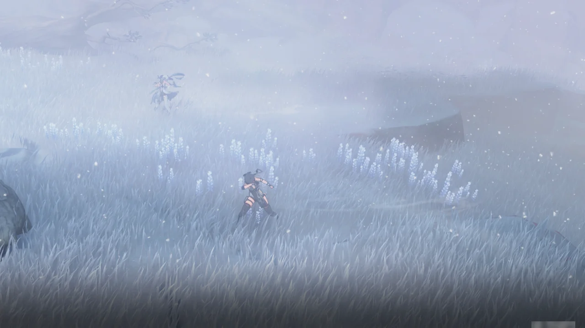
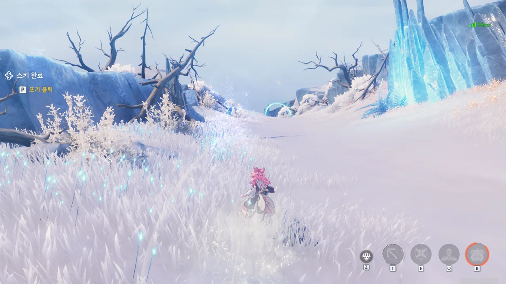
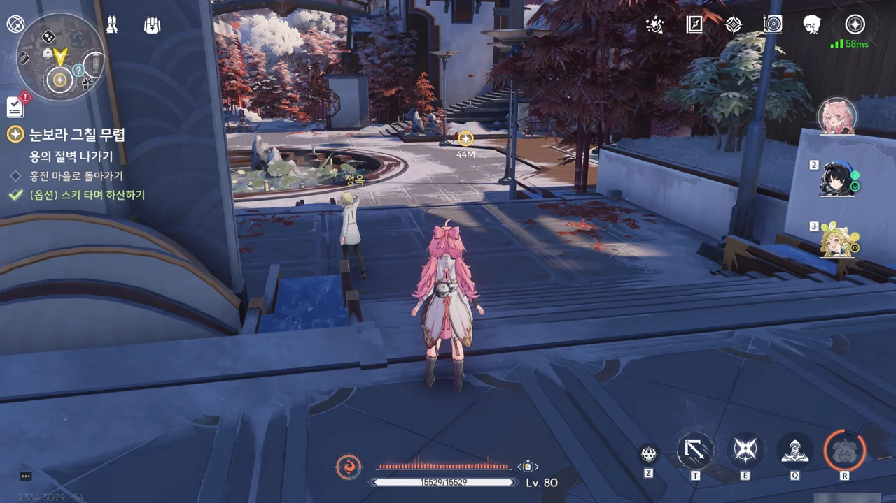
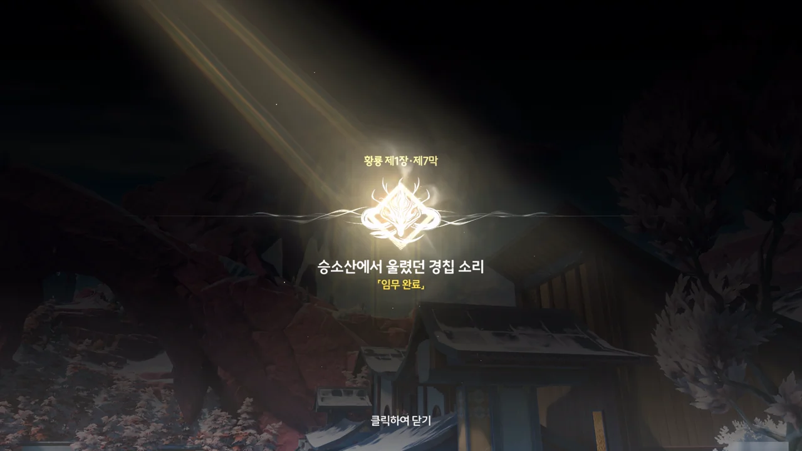

승소산 정상으로 가는 길에는 눈보라가 몰아치고 있다.





> 「어자」, 이번에는 당신이 어떤 선택을 할지 궁금하군요.

이 말은 기억을 잃기 전의 방랑자가 예전에 어떤 중요한 선택을 했다는 건가?

그 선택이 무엇이었는지 나중에 이야기를 풀 것 같으니, 저 대사를 머릿속에 담아두기로 했다.











회상 속 금희가 질문에 답하며 "빛나는 촛불이 있으니까"라고 말할 때, 앞서 나가는 방랑자의 모습에 화면에 들어온다. "쉽지 않기 때문에 어둠 속에서 유난히... 밝게 보이는 거겠죠"라고 말할 때에는 미끄러져 넘어질 뻔한 금희를 방랑자가 붙잡아 일으켜 세워주며 함께 「용의 뿔」과 마주하는 장면이 나온다.

이거, 아무리 봐도 방랑자가 그 "빛나는 촛불"이라는 거잖아...

과거 기록에 나타난 방랑자의 이전 행적이 분명 그렇게 평가될 정도이긴 하지만, 정작 내가 본 방랑자의 행적은 기억을 잃고 금주에 나타난 이후가 전부인지라, 이런 평가는 너무 부담된다. 마치 지나치게 기름진 도넛을 먹는 느낌이야...







앞으로의 일은 세 경우 중 하나가 될 것이다.

1. 금희가 2차 공명에 성공해 「용의 뿔」의 시간 제어 능력을 이어받아 승소산의 시간 흐름을 회복한다.  
   * 금희: 생존
   * 방랑자: 생존
   * 용의 뿔: 생존
2. 금희가 2차 공명에 실패해 스스로의 목숨을 대가로 승소산의 시간 흐름을 회복한다.  
   * 금희: 사망
   * 방랑자: 생존
   * 용의 뿔: 생존 (여전히 부상 상태)
3. 금희가 「용의 뿔」과 싸우지 않아, 용의 뿔이 스스로의 목숨을 대가로 승소산을 포함한 금주의 시간을 멈춘다.  
   * 금희: 생존 (멈춘 시간 속에서 활동 가능)
   * 방랑자: 생존 (멈춘 시간 속에서 활동 가능)
   * 용의 뿔: 사망

금희가 2차 공명에 성공하는 것 역시 방랑자가 제때 개입해 용의 뿔의 시간 제어 능력 양도를 허가해 줘야 가능한 만큼, 이번 일의 성공 여부는 방랑자의 손에 달려 있다 해도 과언이 아니다.







금희는 준비라면 아주 오래전부터 해왔다며, 피눈물로 황룡의 평안을 지켜낸 금주 사람들을 위해서라도 금주의 미래는 밝아야 하기에 자신이 이 자리에 서있는 것이라고 답한다.





방랑자가 「용의 뿔」의 으로 향하는 문을 연다.



필드에 들어서자마자 필드가 조금 넓은 것 같다 생각했는데, 정말 그랬던 건지, 「용의 뿔」에게 단숨에 접근할 수 있도록 도와주는 로프 포인트가 용의 뿔 머리 위에 거의 항상 나타나 있다.





아잇, 기껏 체력을 다 깎아 놨더니 2 페이즈야? 스카 그 녀석도 페이즈가 두 개더니, 명조 보스는 페이즈를 여러 개 쓰는 게 아주 기본인 건가?





「용의 뿔」이 비겁하게 멀리서 에너지 광탄만 쏘아대는데, 방향키를 아무리 눌러도 금희가 움직이질 않는다. 결국 용의 뿔이 쏜 광탄을 고스란히 전부 얻어맞아야 했다.

설마 이거 맞고 패배하는 게 정상 루트인 거야? 이거 맞아?



> 일반 공격 버튼을 클릭하여 「용의 뿔」이 발사한 「빛의 비행」을 막아보세요
{.bq}

아이 싯팔! 이걸 이제 알려주면 뭐 어쩌자는 거야?! 이런 건 진작에 알려줬어야지! 개쓰레기 게임 같으니라고.









오... 큰 거 오나?





그때, 금희의 이마에 뿔이 돋아난다. 설마 이거, 2차 공명인 건가?









「용의 뿔」이 방랑자에게 시간 제어 능력 양도 여부를 다시금 묻자, 방랑자는 잠시 금희의 모습을 돌아본 후, 오른손을 들어 이를 허가한다.

금희가 흰색 구체에 손을 뻗는 모습이 어디서 많이 본 것 같다 생각했는데, RE 엔진 로고 그림과 거의 똑같다.



정작 명조는 RE 엔진이 아닌 언리얼 엔진으로 만든 게임이란 말이지.











지금까지 「용의 뿔」과 치열하게 싸운 건 그저 금희의 공명 어빌리티를 한계까지 끌어내기 위함이었다는 듯이 --- 그게 2차 공명의 시작 단계이긴 하지만 ---, 흰색 광채가 구체에 닿은 금희의 손을 타고 올라온다. 피부가 벗겨지는 연출은 폼이 아니라는 듯이, 금희가 굉장히 고통스러워하고 있으며, 금희 등에 새겨진 성흔 역시 이전과 비할 바 없이 밝게 빛나고 있다.









금희가 2차 공명에 성공한 건지, 승소산을 둘러싸고 있던 시간 결계가 벗겨지고, 뒤틀린 시간 속에 갇혀 있던 여러 생물들이 무사히 본래 시간 흐름으로 돌아왔다.



> 「어자」의 선택은 이미 땅에 뿌리를 내렸습니다.
> 금희, 약속을 이행하겠습니다. 예언에 존재하지 않는 금주의 미래를, 그대와 금주의 백성들에게 돌려드리지요.

금희, 성공했구나!





금희는 2차 공명 때문에 탈진해 쓰러진 상태이다. 금주에서 조금 쉬면 괜찮아질 거라고 하는 걸 보면, 그냥 지쳐 쓰러진 정도인가 보다.







'한때' 방랑자는 금주 문명의 인도자인 수호자 「용의 뿔」의 「어자」, 즉 용의 뿔을 통제하는 사람이었다고 한다. 기억을 잃기 전의 방랑자는 용의 뿔과 함께 금주를 세운 후, 용의 뿔에게 금주에 머물며 문명을 번창시키고 쇠퇴하지 않도록 보호하라는 명령을 내렸다.

하지만 용의 뿔이 알고 있는 것은 이것이 전부였다. 심지어 용의 뿔이 알고 있는 것 역시 방랑자가 알려준 것이라고 한다.

대체 방랑자의 정체가 뭐길래...?









과거 방랑자는 「용의 뿔」에게 음의 영역을 여는 「열쇠」를 넘겨주며, 자신은 역사의 참여자로서 문명의 발전에 개입하고, 선택하고, 증인이 되어야 한다고 말했다고 한다.

저 말을 들으니, 무슨 게임이었는지는 잘 기억나지 않지만, 한 나라의 왕이 되어 온갖 대소사를 결정하여 나라를 경영하는 게임을 즐겨하는 어떤 사람이 한 말이 생각난다.

자신은 게임이 지루해지면 조작을 멈추고 시간을 돌린다고 했었다. 황금빛 미래를 바라보고 있던 나라는 어느새 황폐해지고, 왕가였던 자신의 가문은 한때 신하였던 가문에게 왕관을 빼앗겨 신하 신세가 된 모습이 눈앞에 펼쳐진다고 했다. 그렇게 몰락한 가문의 통제권을 다시 쥐어, 느슨해진 게임 플레이에 활기를 불어넣는다고 했던가?

설마 방랑자도 그런 식으로 '게임'을 하고 있는 건 아니겠지?

> 저 역시 묻고 싶군요. 시간 제어 능력을 금희에게 계승할 수 있었던 건 저의 메커니즘 때문인가요?
> 제 능력을 전하는 일이나, 저의 삶, 저의 죽음까지, 모두 「어자」의 허락을 받아야 하는 건가요?

저렇게 말하니까 뭔가 굉장히 미안해지는데... 자신의 죽음까지도 다른 누군가에게 통제당하는 건 그리 좋은 기분이 아닐 것이다.









「용의 뿔」은 시간 제어 능력을 금희에게 계승한 후, 그녀의 능력으로 승소산의 시간 흐름을 원래대로 복구했다고 말한다. 아울러 시간 제어 능력과 함께 금주의 권력도 금희에게 계승했으니, 자신은 앞으로 금희의 보좌역으로 남을 거라고 말한다. 이제 금주의 미래는 금주 사람 손에 달린 것이다.

만약 2차 공명과 관련한 정보를 금희에게 미리 알려주었다면 2차 공명을 이루기 위해 필요한 힘과 마음을 기르는 데 도움이 되기는커녕 오히려 방해만 되었을 것이기에 여태껏 금희에게 아무런 정보도 알려주지 않았다고 한다.

사실 이번 일 자체가 잔성회의 공격 때문에 서둘러 진행한 것이기에, 용의 뿔의 판단이 틀렸다고 할 수는 없다.









본래라면 승소산 시간 결계가 풀리면서 홍진 마을 사람들의 시간 흐름 역시 원래대로 되돌아와, 많은 사람들이 순식간에 늙거나 죽었겠지만, 금희가 공명 어빌리티로 홍진 마을 사람들을 보호하고 있기 때문에, 그들이 승소산을 떠나지만 않는다면 밀린 수명을 지불할 필요가 없을 거라고 한다.

승소산의 시간 흐름이 다시 정상으로 되돌아왔다는 건, 앞으로 승소산에서 태어나는 사람들은 시간 결계에 의해 타 지역에 비해 10배 느린 시간을 살지 않게 된다는 말이다. 즉, 이들은 승소산을 떠나도 순식간에 늙거나 죽지 않는다. 용의 뿔 말처럼 홍진 마을 역시 머지않아 정상 궤도에 오를 수 있을 것이다.











「용의 뿔」이 방랑자 손등의 성흔 속에 있는 쪼꼬미를 감지했다.

쪼꼬미가 느꼈다는 그 부자연스러운 냄새가 바로 용의 뿔의 주파수 냄새라고 한다.







「용의 뿔」은 쪼꼬미가 자신의 숨결 --- 아마 본질을 말하는 거겠지? --- 과 비슷하면서도 다른 존재라며, 과거 방랑자가 생각한 바가 있기 때문에 쪼꼬미가 지금 방랑자의 성흔 속에 살고 있는 거라고 말해준다.

용의 뿔은 더 궁금한 게 있다면 방랑자가 이 세상에 처음 발을 내디딘 곳인 검은 해안에 가보라는 말을 남기고, 금주로 돌아갔다.



> 승소산은 더 이상 금단의 구역이 아니에요. 홍진 마을의 날씨도 이전과 크게 다를 겁니다.

그렇게 말해도 홍진 마을은 잠깐 방문한 게 전부라서 잘 모를 것 같은데...

내려가는 데 심심해하지 말라고, 이번에도 또 미끄럼틀을 만들어두었다.

가끔 일일 토벌 임무가 미끄럼틀 종착지에 나타나기 때문에, 이 미끄럼틀은 의외로 자주 이용하게 된다.

사람들이 돌아다니는 것 빼곤 달라진 게 없는 것 같은데...





이야기꾼 아저씨가 나와 내레이션을 한다는 건 이번 조수 임무가 곧 끝난다는 신호이다.







쯧, 이래서 잔성회는 귀찮다니까.

승소산의 위기는 해결되었지만, 잔성회는 손해를 본 것이 별로 없다. 오히려 이번 일을 통해 여러 정보를 얻어갔다.

* 2차 공명을 이용하면 수호신과도 맞서 싸울 수 있다.
* 「역류계」와 같은 인공 공명 장치를 만드는 것이 가능하다.

잔성회가 이 정보로 무슨 흉계를 꾸밀지 생각하니, 벌써부터 눈앞이 아득해지네.

> 수확이 아름다운 음표들처럼 가득하네!

북락 광야에서 잔상들을 통제할 때 마치 지휘자처럼 꽃을 휘두르던 녀석다운 말이다.

> 가자. 감옥에 너무 오래 놔두면 안 되잖아.

게다가 이 녀석, 스카를 탈옥시킬 계획인가 보다. 지금 스카가 탈옥하면 잔성회에 금주 황룡 아카이브의 위치가 들어가게 되는데...?

아무튼, 제1장 황룡 제7막 \[승소산에서 울렸던 경칩 소리\] 완료.

이번 엔딩은 뭔가 깔끔하게 끝나지 않고 미래에 있을 위기에 대한 떡밥을 같이 던지며 끝난 터라, 밥을 먹다 만 느낌이다.

&nbsp;

흐... 조수 임무 사진은 다 글로 써 옮겼는데, 아직 1.2 버전 이벤트 임무 사진이 산더미처럼 쌓여 있다. 이건 언제 다 하지?
