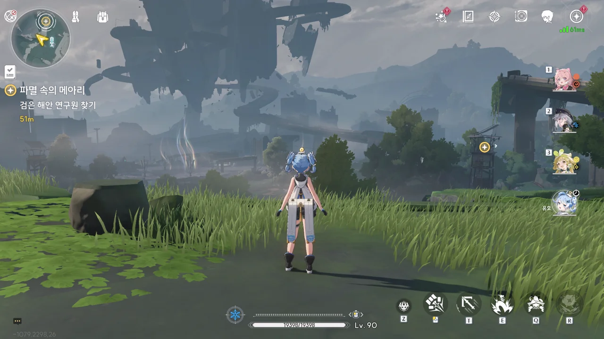
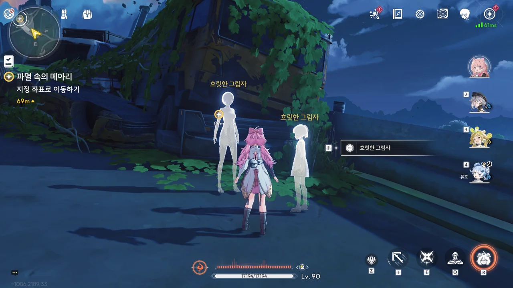
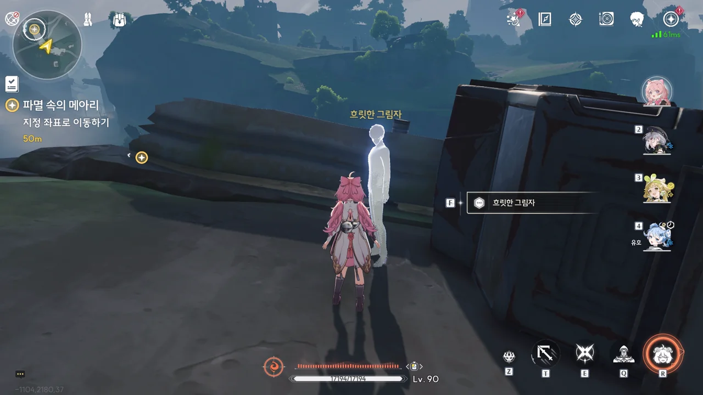
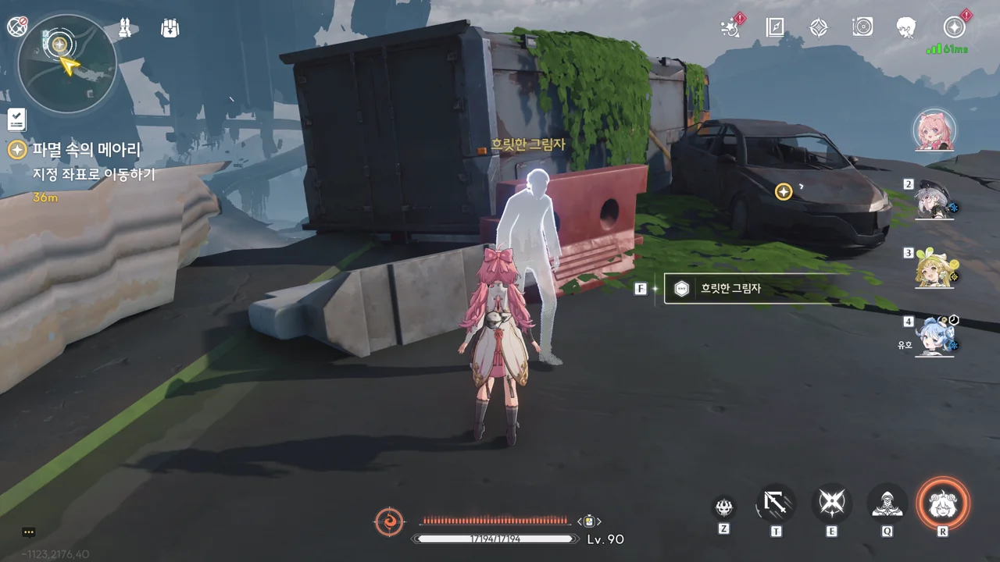
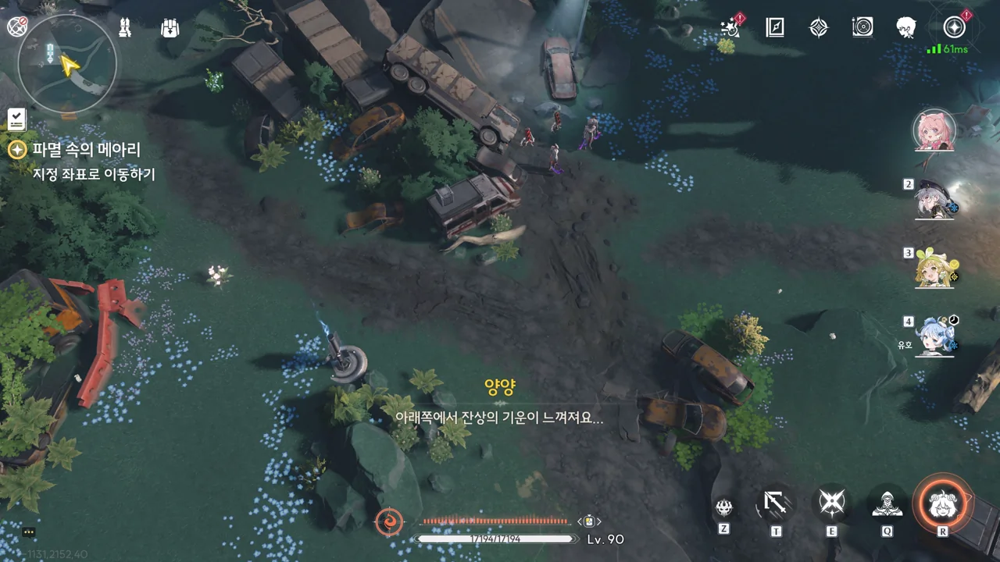
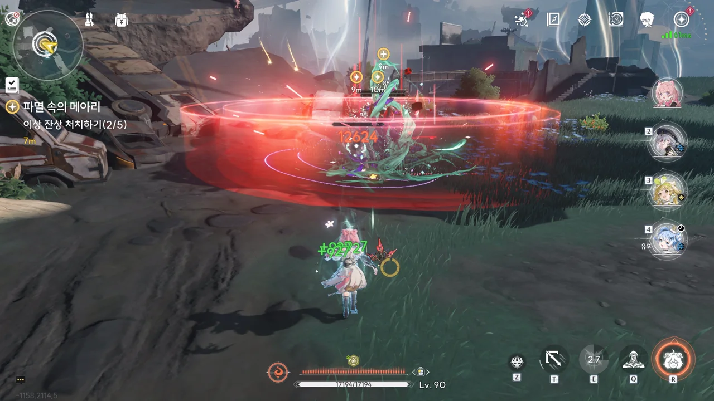
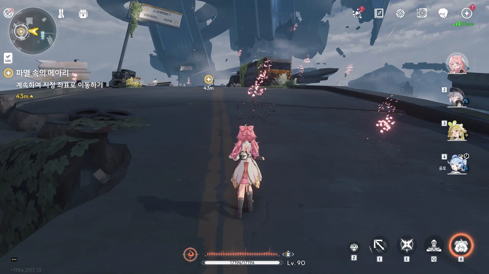

사실 2.0 버전이 열리자마자 2.0 버전 스토리를 밀고 싶었다. 하지만 명조의 오역이 어디 한둘이어야지. 그래서 최소 며칠은 두고 리나시타 스토리를 밀 생각이다. 이미 채널에서 2.0 버전 오역이 한가득이라는 이야길 듣기도 했었고...

그럼 그동안은 무얼 해야 하나? 미루고 미뤄왔던 1.4 버전 스토리 글을 써야 한다... 마음 같아선 1.4 버전 스토리를 통째로 유기하고 2.0 스토리로 바로 넘어가고 싶지만, 1.4 버전 스토리에 인질로 잡힌 파수인이 너무 강했다.

대체 과거의 방랑자는 뭘 하고 다녔길래 오만곳에 정실이 넘쳐나는 거야?





양양과 처음 보는 사람이 함께 서있다. "여기서 야귀를 보게 될 줄이야"라고 하는 걸 봐선, 야귀군 소속은 아닌 게 확실한데... 대체 누구에게서 방랑자 이야기를 들은 걸까?





골동품 분야의 전문가, 유호는 시장에 풀린 승소산 골동품에서 승소산과 관련한 단서를 전혀 발견할 수 없자, 그것들의 출처가 승소산이 아닌 귀허항시가 아닐까 추측하고 있다.

그런데 그게 방랑자와 대체 무슨 상관인거지? 방랑자는 양양의 이야길 듣고 여기 온 건데 말이다.

&nbsp;

그나저나 '유호'라는 이름 참, '우효'랑 헷갈리기 쉬운 이름이다. 금태양이랑은 전혀 닮은 점이 없는 것 같지만!



양양은 검은 해안에게서 귀허항시의 환경 모니터링을 하고 싶다는 연락을 받자, 이전에 방랑자가 검은 해안에 가고 싶어 한다는 걸 기억하고 방랑자를 귀허항시로 불렀다.





음, 오늘도 양양의 정실 무브먼트, 잘 봤습니다.
사실 양양의 정실 무브먼트는 조금 이상한 면이 없잖아 있다. 금희나 장리, 카멜리아 같은 다른 *정실* 캐릭터들은 전부 과거, 기억을 잃기 전의 방랑자와 연관점이 하나라도 있는 것에 반해, 양양은 이전 방랑자와의 연관점이 단 하나도 없다.

한마디로, 양양은 마치 방랑자에게 첫눈에 반한 것처럼 행동하고 있는 것이다. 실제로 그런 경우가 아예 없는 건 아니겠지만, 정작 화면 너머로 이 모든 걸 보고 있는 나는 양양에게 이유 없는 호감을 받는 것 같아 기분이 묘하거든.

&nbsp;

양양이 방랑자에게 호감을 갖고 있다는 걸 눈치챈 유호가 양양을 놀려댄다. 저 고양이 입도 그렇고... 유호 속성에 '소악마'가 포함되어 있었던 건가?







아무튼, 유호가 일행에 합류하게 되었다. 양양과 방랑자는 귀허항시에서 환경 모니터링을 하고 있는 검은 해안 사람들을 만나러 가는 거고, 유호는 귀허항시에서 온 것으로 추정되는 골동품의 진짜 출처를 알아보기 위해서 가는 거다.

그나저나 유호가 얼마나 강한지는 잘 모르겠지만, 명식도 때려잡은 방랑자에게 '호위'가 필요하긴 한 걸까? 이미 귀허항시 지역 임무도 끝냈다고.

새로운 캐릭터가 나왔으니 한번 써보라는 걸까? 유호가 체험 캐릭터로 파티에 들어왔다.

잠깐 써보긴 했는데, 뭔가 마음에 들진 않더라고.







검은 해안의 흑화집사, 니아를 만났다. 아직 검은 해안에 가입하겠다고 완전히 결정한 것도 아닌데, 어째서인지 방랑자가 검은 해안에 가입할 거라는 이야기가 퍼진 모양이다. 앙코야, 대체 무슨 말을 하고 다닌 거니?









니아를 비롯한 검은 해안 사람들이 귀허항시에 온 건 「테티스 시스템」의 지시에 따라 환경 모니터링을 통해 「이상 파라미터」를 측정하여 이곳에 숨겨져 있는 이상 주파수를 확보하기 위해서라고 한다.
귀허항시에서 무슨 일이 일어나고 있는 건진 몰라도, 지금 상황을 그대로 방치했다간 이곳에 또 다른 「비명」이 일어날 수 있다고 한다.

이전부터 응답이 없는 「수용원」들의 상태를 직접 확인하고 싶지만, 니아는 이곳에 남아 모니터링 장비를 관리해야 하기 때문에, 방랑자와 양양에게 그들의 현 상황을 대신 확인해 달라고 부탁한다.





「이상 주파수」는 일반적으로 '남겨진 울림'이나 에 기생하는 주파수를 뜻하나, 이번 상황에서의 이상 주파수는 '이상 중력'을 뜻한다. 귀허항시가 파괴된 것 역시 이상 중력 때문이었으니, 이번에 찾아야 할 이상 주파수 역시 이상 중력 속성을 띄고 있다는 것이다.







역행비가 내리고 있는 것도 아닌데, 유령이 나타났다. 조수 임무를 너무 오랜만에 해서 그런가, 대체 이 유령들이 왜 나타난 것인지 알 수 없다.

북락 광야에서 나타난 유령들은 역행비의 영향으로 인해 나타난 것인데, 역행비를 부르는 건 분명 명식 「무상선주」였었지. 귀허항시가 파괴된 이유는 명식이 아니라 「비명」 때문이었던 것으로 기억하는데... 





얼씨구. 이번엔 잔상들이 과거 귀허항시에 있었던 사람들의 말을 흉내 내고 있다.

잔상이 사람 말을 흉내 내는 건 죽은 사람들이 남긴 주파수를 흡수해서라고 알고 있다. 하지만 귀허항시 사람들이 죽은 건 수백 년 전의 이야기일 텐데? 그때 죽은 사람들의 주파수를 흡수한 잔상이라면 수백 년 동안 존재해 온 잔상이란 건데, 그런 잔상이 이런 잡몹일 리가 없잖아.

옛날에 누가 이번 조수 임무에 얽힌 설정을 일반 상대성 이론, 블랙홀과 엮어서 설명해 준 글을 읽었는데, 그 글에서 말하길 귀허항시를 파괴한 「비명」은 블랙홀의 특성을 갖고 있고, 그 탓에 과거에 있었던 일이 시공간의 왜곡을 통해 현재로 다시 튀어나올 수 있다고 했던 것 같다.

정말 그런 거라면 과거의 유령이 나타난 일, 잔상이 과거 사람의 말을 흉내 내는 일 모두가 설명이 되긴 하는데...

이번 잔상에 이상한 점이 하나만 있는 건 아니다. 이번 잔상들 중 일부는 이렇게 곧바로 죽어 사라지는 게 아니라 가만히 정체해 있다가 폭발을 일으키고 사라진다.

음... 분명 이전에 화염꽃 문제를 해결한 것으로 기억하는데... 왜 화염꽃 꽃가루가 떠다니는 거지?









니아가 말해준 곳으로 가보았지만, 거기에 있는 건 붉은색 아우라에 감싸여 죽은 검은 해안 사람들밖에 없었다. 아까 잔상이 내뿜던 붉은 영역도 그렇고... 설마 이 모든 게 귀허항시의 이상 주파수 때문인 건가?





방랑자를 「뭇별의 조율자」라고 부르며 나타난, 죽은 사람들처럼 붉은 아우라를 두른 의문의 검은 해안 사람.

목소리에 에코가 들어간 점, 자신을 단수가 아닌 복수로, '중력의 원천'으로 칭하는 것으로 보아 원래의 의식 대신 그 '이상 주파수'의 집단의식 같은 것이 말하고 있는 모양이다.





그러다가 이번엔 정신을 차린 건지, 에코 없는 본래의 목소리로 자신의 이름이 '오르디'라고 밝힌다.

시간이 없다고? 그게 대체 무슨 말이지?







그러다가 다시 집단의식 같은 것에 주도권을 뺏기기라도 한 것인지 다시 목소리에 에코가 깔리며, "구원의 목적은 아무도 구원을 필요로 하지 않는 것"이라며 방랑자를 꾀어내고 있다.

> 저희의 「비명」을 들으셨습니까?

중의적인 대사다.
「비명」은 솔라리스에 재앙을 불러오며, 그로 인해 사람은 비명을 지른다.
그래서 「비명」은 듣는 것이다.

&nbsp;

저게 '구원'을 운운하는 걸 보면 데스티니에서 본 '어둠'이 떠오른다.

> 우린 너의... 구원이다.
{.bq}

그런데 보통 '구원' 운운하는 녀석치고 제대로 된 녀석은 없었거든.







뭐라고 해야 할까. 지금 상황은 방랑자를 '삼키려고' 하는 '중력의 원천'의 집단의식에 '오르디'가 안간힘을 써 반발하고 있는 것으로 보인다.

그나저나 대체 유호에게서 뭘 찾을 수 있다는 거지?





유호가 갖고 있던 검은 해안의 물건에 이상 주파수가 기생한 것으로 보인다. 이유는 잘 몰라도, 검은 해안에 대한 강한 집착을 보이고 있다는데... 대체 이게 무슨 일인 거지.





일단 흑화집사들의 시신을 수습하고, 니아에게 이상 주파수가 기생한 검은 해안의 물건에 대해 알리기로 했다.



> **번호 HL-1**
> ***
> 검은 해안에 각 지역 수호신의 상태를 알려주는 장치. 번호는 HL-1, 표시 상태는 0이다.
> ***
> 검은 해안은 비명과 명식에 대항하는 주역인 솔라리스 각 지역의 수호신들이 좋은 컨디션을 유지하도록 해야 할 의무가 있다. 검은 해안의 감시를 속일 수 있는 방법이 존재하기도 하는 것 같지만...
{.bq}

HL은 아마 황룡, HuangLong의 약자일 것이다. 번호 순서는 모르겠지만, HL-1은 「용의 뿔」을 지칭하는 것일 테고. 상태가 0 혹은 O인 이유는 잘 모르겠다. 이런 부류의 값은 저 '상태'가 정확히 무엇을 의미하는지에 따라 의미하는 바가 달라지니까.

그나저나... 검은 해안의 감시를 속일 수 있는 방법이 존재한다고? 이거, 나중에 있을 일에 대한 떡밥은 아니겠지?







다급히 귀허항시를 벗어나는 양양과 방랑자, 유호. 갑자기 일어난 지진에 방랑자가 양양을 붙잡아주자, 양양이 감사를 표한다. 방랑자가 미처 챙기지 못한 유호는 그대로 땅에 넘어졌고, 입이 아주 부루퉁해졌다. 음, 귀엽네.











그 틈을 타 방랑자 일행을 잔상이 습격하려 하자, 이를 푸른색 나비를 통해 지켜보고 있던 파수인이 나서 방랑자 일행을 구해준다.

> 집에 온 걸 환영해요.

집...?













귀허항시가 아닌 다른 곳에 홀로 쓰러져 있는 방랑자. 그 옆에서 파수인이 방랑자가 어디에 있든 자신은 여기서 방랑자를 기다릴 거라고 말한 후 사라졌다.

방랑자가 "다시 이곳에 돌아왔다"라고 말하거나, 이곳이 "종착점이자 시작점인 곳"이라고 말하는 걸 보면... 방랑자는 원래 검은 해안 출신이었던 걸까? 그렇다면 왜 검은 해안이 종착점이자 시작점인 걸까? 설마 이 세계는 루프 하는 세계인 걸까?
