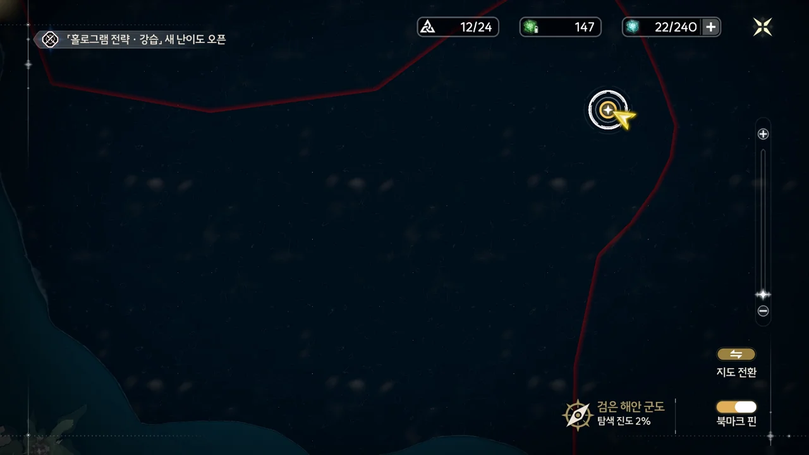
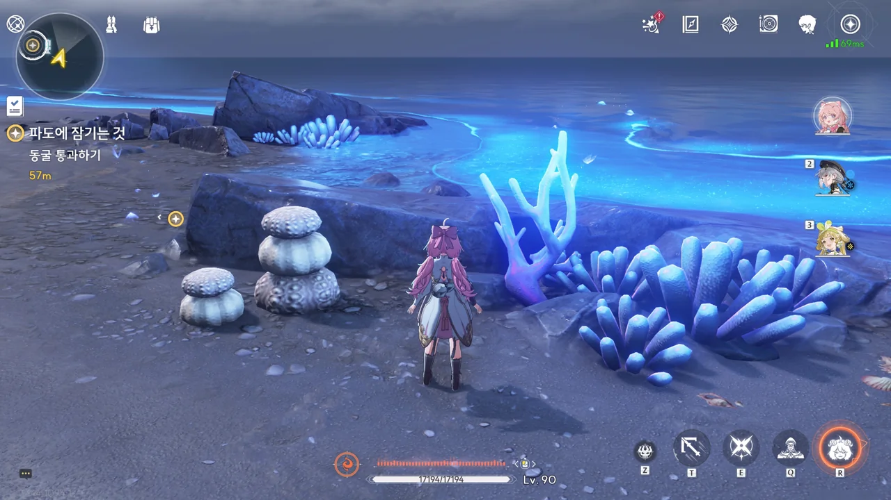
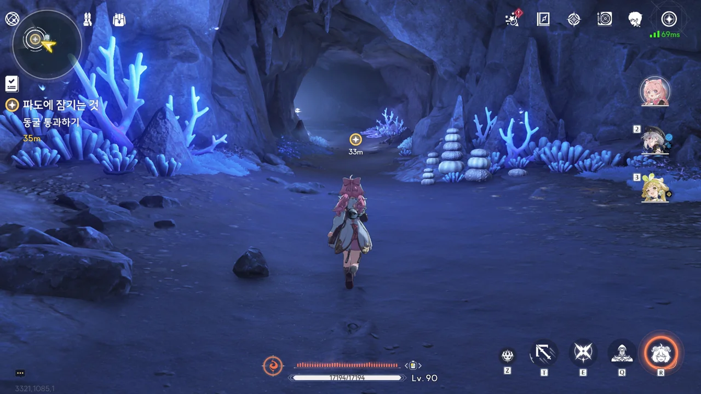
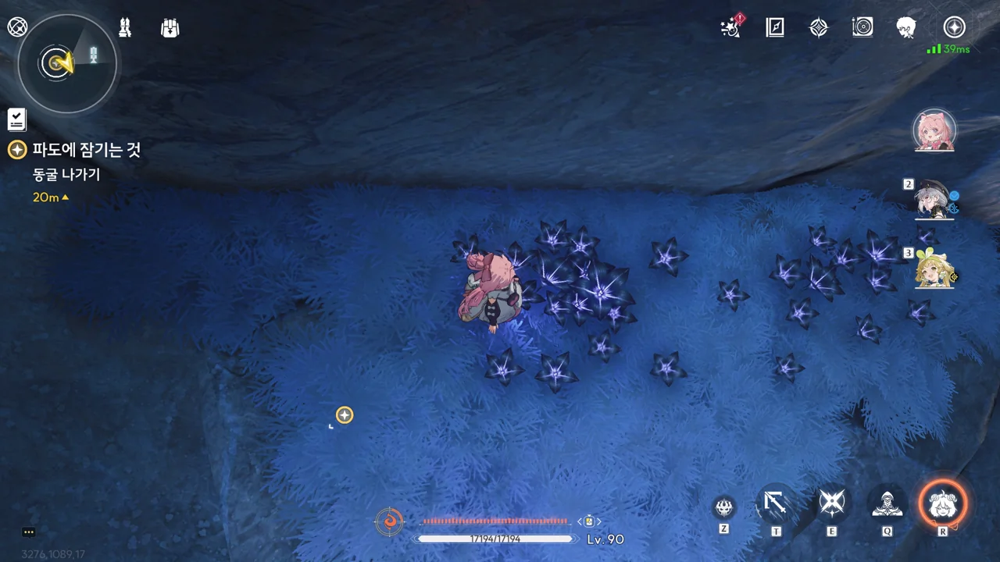
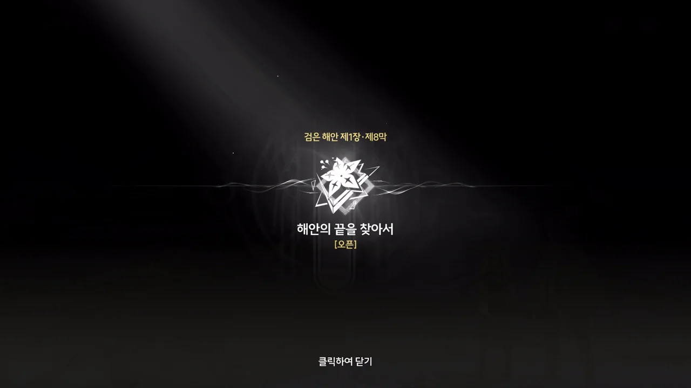
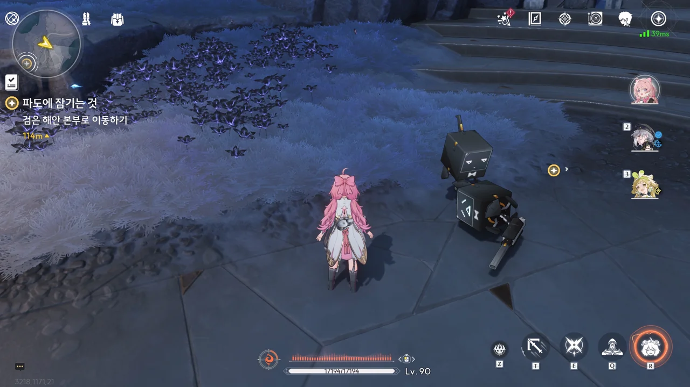
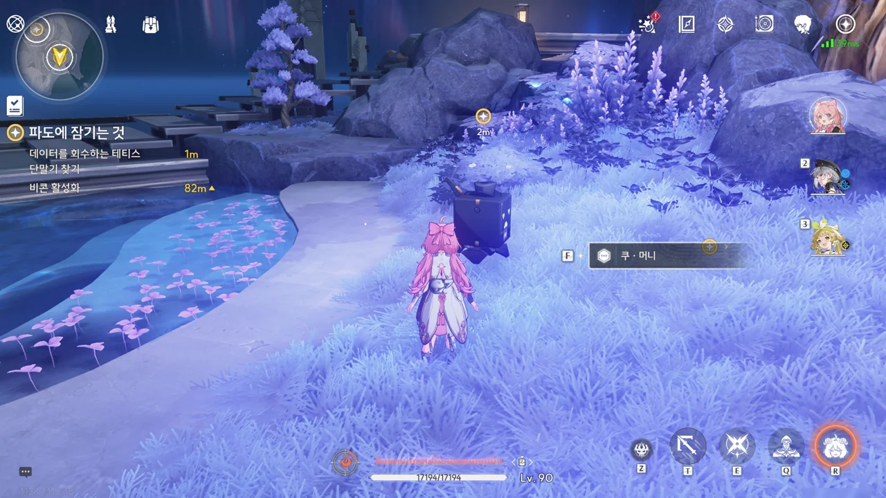
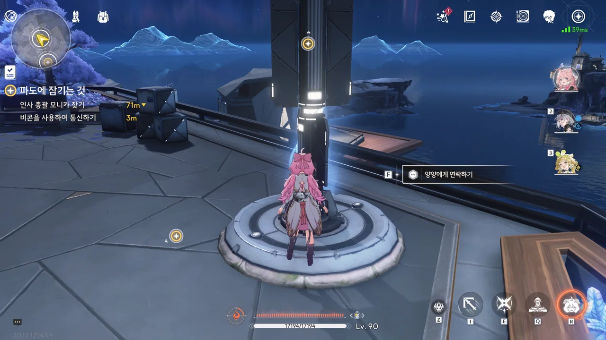
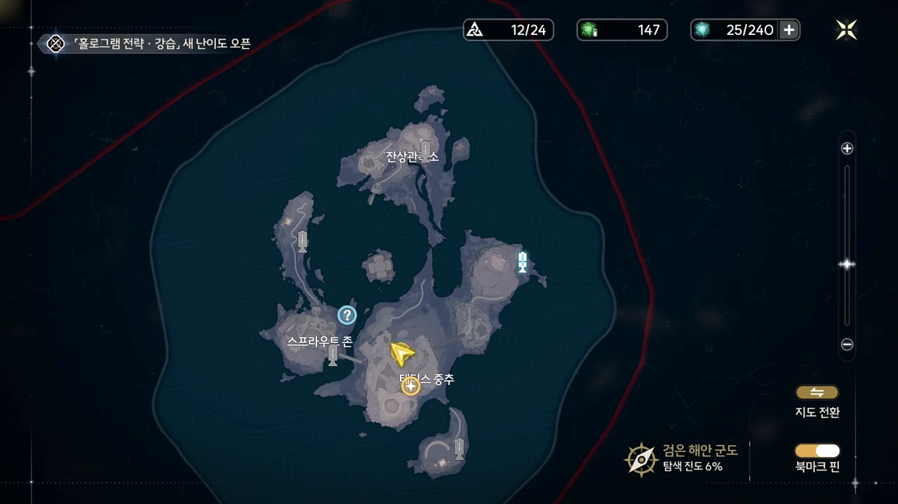

지도를 열어 보니, 여기가 검은 해안 군도라고 알려 준다. 검은 해안 지역의 북동쪽 끝자락에서 시작하는 모양인데, 이거.



검은 해안에 자라 있는 이 산호, 어째 여파의 산호나 잔진의 산호처럼 생겼다. 여파의 산호나 잔진의 산호처럼 투박하게 모가 난 것은 아니지만, 색 조합이라 해야 할까, 그런 부분에서 닮았다고 생각한다.

보통 산호는 이렇게 지상에 자라는 것이 아니라 물아래에서 자라는 것인데, 지상에서 산호처럼 생긴 걸 보니 뭔가 기분이 묘하다. 마치 물속을 걷는 것 같달까.

동굴을 걷다가 검은 꽃을 발견했다. 검은 해안 사람들이 달고 다니는 검은 꽃은 검은 해안 지역에서만 자라는 꽃이라고 했던가? 그러면 이런 꽃을 따다 달고 다니는 걸까?







동굴 밖으로 나오자, 마치 기다렸다는 듯이 알토가 나타났다. 겉으로는 우연찮게 만난 것처럼 말하지만, 알토 저 녀석이 아무 이유 없이 여기서 죽치고 앉아 있을 리가 없잖아. 안개까지 짙게 깔아놓고 말이야.

저기 너머에 있는 건물이 '검은 해안'의 본진인가 보다.







알토에게 그동안 있었던 일들을 알려주었다.

일단 알토 말로는 '오르디'는 검은 해안 사람이 아닐지도 모른다고 한다. 분명 입고 있는 옷은 검은 해안 흑화집사의 옷이었는데 말이지.

유호가 갖고 있던 칩 같은 물건은 검은 해안이 각 지역 수호신들의 상태를 탐지하기 위해 세계 곳곳에 설치해 둔 「레지스터」인데, 본래 승소산에서 「용의 뿔」의 상태를 탐지하고 있어야 할 물건이 왜 귀허항시에서 이상 주파수를 복사하고 있는 건지 의아해하고 있다. 어... 누군가가 그걸 승소산 골동품으로 팔아치워서?









귀허항시에서 방랑자 일행을 구해주고 방랑자를 검은 해안으로 데려온, 옅은 푸른색 옷을 입은 사람은 '파수인'으로, 검은 해안의 수호자이자 검은 해안 리더의 *배후*에 있던 사람이라고 한다.
기록에 따르면, 파수인은 검은 해안의 가장 위급한 순간에만 자신의 진짜 모습을 드러내고, 리더를 도와 검은 해안 전체를 이끌었다고 한다.

보통 '배후에 있다'라고 하면 흑막이라는 느낌을 주는데, 파수인의 다른 설명을 들어볼 때, '배후에 있던 사람'이란 서술은 오역이 아닐까 생각된다. 정황상 '배후'가 아니라 '보좌'가 더 어울릴 것 같은데.

일단, 목적지는 「플라워 룸」이다. 테티스 시스템에 「레지스터」를 돌려주고, 방랑자의 과거에 대한 단서를 얻기 위해 말이다.





갑자기 검은 해안 전체가 지진이라도 난 것처럼 흔들린다. 테티스 시스템이 고장 났다고? 우리 목적지 중 하나가 거기 아니었어?

제1장 검은 해안 제8막 \[해안의 끝을 찾아서\] 오픈. 이번 오픈 메시지는 상당히 늦게 나왔다.

여태껏 '황룡 제1장'이라 써왔는데, 황룡과 별개의 지역인 검은 해안도 제1장에 들어가는 걸 보면 지역과 장은 큰 연관이 없는 것으로 보인다. 그러니 올바른 표현은 '황룡 제1장'이 아닌 '제1장 황룡'이 된다. 덕분에 예전에 썼던 글을 다시 수정하게 되었네.

테티스 시스템뿐만 아니라 검은 해안의 전반적인 상황도 그리 좋지 않은 모양이다. 작은 깍두기 로봇이 어디 고장이라도 난 것처럼 쓰러져 있거든.

&nbsp;

잠깐. 그러고 보니, 이 로봇들 생긴 모습이 쿠로 게임즈 로고랑 비슷하게 생겼는데.



&nbsp;









아까 방랑자가 검은 해안으로 왔을 때, 양양과 유호가 보이지 않아 내심 걱정하고 있었는데, 그 둘은 금주성으로 무사히 전송된 것 같다. 아마 그것도 파수인이 한 거겠지.

검은 해안 시설은 거대한 흑석 위에 세워져 있어, 흑석이 방출하는 주파수 때문에 통신이 어렵다고 한다. 방금 유호와 통신이 닿았던 건 기적에 가까운 현상이었나 보네.

이름이 「쿠 · 머니」라고? 뭔가 이름부터 돈을 몹시 밝히게 생긴 이름인걸.







여기 있는 로봇들은 테티스 시스템과 직접적으로 연결되어 있어 사람 말을 주고받을 수 있다고 한다. 테티스 시스템은 검은 해안의 모든 기능을 총괄하는 슈퍼컴퓨터이며, 검은 해안이 수행하는 비명 예측 및 해결, 조기 경보 발령 등이 모두 테티스 시스템을 통해 이루어진다고 한다.

그리고 쿠 머니는 검은 해안 경비 총괄이자, 로봇들의 리더라고 한다. 정작 본인은 '악덕 상인'이라 불리는 걸 싫어하는 모양이다.







유호가 갖고 있던 카드인지 칩인지 모를 물건을 쿠 머니에게 건네주었다. 여기 로봇들은 어떤 상황에서도 테티스 시스템과의 통신을 유지할 수 있다고 하니, 여기 담긴 정보는 테티스 시스템에 잘 전송되었을 것이다. 음, 그러면 일단 한 건 해결인가.











귀허항시에 파견된 흑화집사들이 목숨을 잃었다는 말에 크게 당황하며 거기에 대체 무슨 일이 생긴 거냐고 묻는 쿠 머니. 악덕 상인이라 불리긴 해도 근본이 글러먹은 녀석은 아니라고 생각했는데, 클램 코인 공명자를 발견하면 수익을 쿠 머니 7, 방랑자 3으로 나누자는 말을 듣고 역시 근본부터 글러먹은 녀석이라 생각을 바꾸게 되었다.

테티스 시스템에는 중력 조절 능력을 가진 공명자나 '오르디'라는 이름과 관련한 기록이 없다고 한다. 그럼 대체 그녀는 뭐지?







갑자기 방랑자에게 검은 해안 멤버를 위해 준비한 활동비라며, 거금을 건네주는 쿠 머니.

오늘부로 쿠 머니 지지를 철회한다. 오늘부터 지지관계에서 벗어나 쿠 머니와 나는 한 몸으로 일체가 된다. 쿠 머니에 대한 공격은 나에 대한 공격으로 간주하겠다. 충성충성. 언제나 돈은 옳다!







쿠 머니 말처럼, 갑자기 눈앞에 닥친 일이 너무 많아졌다.

귀허항시에서 일어난 비명을 대비하기 위해 금주에 조기 경보를 내려야 하고, 거기서 죽은 흑화집사의 시신 회수나 상황 전파 등을 위해 검은 해안의 인사 담당자, 모니카와 대화해야 한다. 검은 해안이 모든 정보를 테티스 시스템에 기록하지는 않는 모양인지, 모니카를 통해 '오르디'에 대한 추가 정보를 알아보아야 하고, 여기 온 처음 목적인, 방랑자의 과거에 대해서도 알아봐야 한다.

어우, 머리야.





쿠 머니가 엄선한 음악을 들을 수 있는 음악 플레이어를 얻었다. 17초짜리 음악이 하나 들어있긴 한데... 대체 이걸 어디다 쓰는 거지?

노래 내용은... 대체 왜 이걸 임무 아이템으로 준 건지 알 수 없다고밖에 말 못 하겠다.





검은 해안의 로봇의 '설정'은 전부 테티스 시스템이 정해주는 것이라고 한다. 단순히 역할 지정만 하는 게 아니라 성격까지 부여하다니, 테티스 시스템은 의외로 인간적인 면모가 있나 보네.

오, 정말 비콘에서 양양에게 연락을 할 수 있네.

처음 검은 해안에 도착했던 곳이 동쪽의 활성화된 비콘 쪽이었으니, 꽤 먼 길을 걸어온 셈이다.







양양과 치샤는 금주에 내려진 조기 경보에 따라 금주성의 방어를 강화하고 혹여나 발령될 계엄령을 따를 준비를 하고 있다고 한다. 귀허항시에서 죽은 흑화집사들의 시신 역시 검은 해안에 인도할 거라고 한다.

&nbsp;

이 사진을 찍을 때에는 그냥 아무 생각 없이 넘겼는데, 실제로 계엄령을 보게 될 줄은 몰랐다. 아니, ■■ 왜 그게 진짜냐고.

난데없이 금희에게 '계엄령' 태그가 붙은 건 덤이다.











여기는 그래도 상황 전파가 빠른 건지, 금주에서 무슨 일이 일어났는지 다 알고 있다.

정황상, 파수인에 의해 금주성으로 전송된 양양과 유호가 먼저 야귀군에 귀허항시의 상황에 대해 알렸고, 금주성에서 검은 해안으로 연락을 취한 모양이다. 검은 해안 역시 해당 정보에 따라 테티스 시스템이 금주 지역에 조기 경보를 내릴 수 있다고 응답했고, 그 결과 금주성 전체가 비명에 대항하기 위한 준비를 마치는 중인 것이다.

다만 귀허항시에서 가져온 데이터를 테티스 시스템에 전송했음에도 테티스 시스템이 정상으로 돌아올 기미를 보이지 않고 있다. 보통 기계가 고장 나면 껐다 켜는 게 큰 도움이 되던데, 테티스 시스템도 한번 껐다 켜야 하는 모양이다.











모니카에게 귀허항시에서 있었던 일을 이야기해 주며 '오르디'라는 이름의 흑화집사에 대해 아는 것이 있냐고 물어보았다. 모니카는 검은 해안의 인사 담당자니까, 어디선가 들어본 기억이라도 있을 것이라 생각했던 모양이다.

검은 해안의 배신자는 손에 꼽을 정도로 적기 때문에, '오르디'가 검은 해안의 배신자일 확률은 매우 낮다고 한다. 배신자, 없는 건 아니었구나.
그런데 검은 해안을 배신했다고 하는 사람들은 대체 뭘 원해서 검은 해안을 배신했던 걸까? 이념적 차이 때문에 검은 해안을 배신했다고 한다면... 검은 해안과 상반된 이념을 가진 조직은 내가 아는 한 잔성회가 유일한데 말이다. 검은 해안에 초청될 정도로 유능한 사람이 그런 또라이 모임 조직에 들어갈 이유가 대체 있긴 한가?



> | | |
> |:--|:--|
> | 모니카 | 만약 '오르디'가 이상 주파수에 기생하고 있는 거라면, 흑화집사들의 죽음은 '오르디' 때문일 확률이 커요. |
> | 방랑자 | 그 이상 주파수, 방금 테티스 시스템에 데이터와 함께 전송했는데요? |
> {_borderless=true,_thead=false}

아차차!







마치 '에사크타!'라고 말하듯이, 검은 해안 전체가 또다시 흔들린다. 이젠 진짜 테티스 시스템에 문제가 없는 건지 직접 가서 확인해봐야 한다.

「플라워 룸」에 있는 「조정 장치」 역시 최우선 순위로 보호해야 할 것인지, 방랑자에게 플라워 룸에 가 쿠쿠 남매를 찾아 달라고 말한다.











검은 해안의 크고 작은 사건들의 판단과 해결을 전부 테티스 시스템에 의존하고 있기 때문에, 테티스 시스템이 완전히 고장 나 버린다면 검은 해안은 임무를 수행할 수 없게 된다고 한다.

게다가 검은 해안이 모아 온 정보의 보관 역시 테티스 시스템에 맡기고 있기 때문에, 방랑자의 과거에 대해 알고 싶다면 더더욱 테티스 시스템을 복구해야 한다.

한 가지 놀라운 점은, 알토나 모니카가 테티스 시스템의 최고 관리 권한을 갖고 있지 않다는 건 이해할 수 있지만 테티스 시스템과 직접적으로 연결된 쿠 머니마저 최고 관리 권한을 갖고 있지 않다는 것이다.

그럼 대체 누가 최고 관리 권한을 갖고 있는 거지? 설마 파수인인가?
