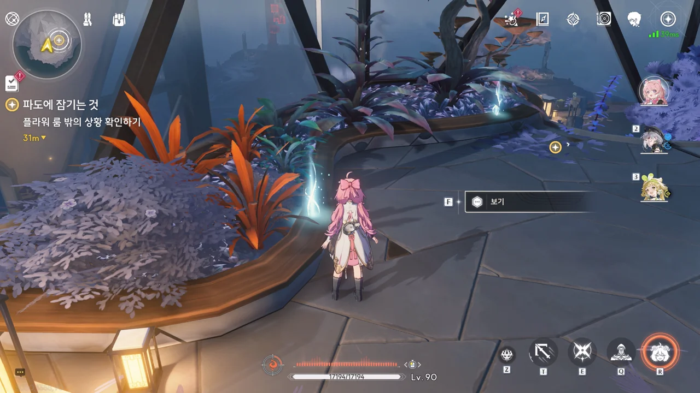





이름이 「쿠 · 워터」와 「쿠 · 플랜트」라니... 이들도 「쿠 · 머니」처럼 역할에 따라 이름이 정해진 모양이다.

저번에 로봇들 생김새가 쿠로 게임즈 로고와 비슷하다 말했는데, 그걸 고려할 때 이 로봇들의 이름은 이런 규칙으로 정해지는 게 아닐까 생각된다.

* 쿠: '쿠로 게임즈'의 약자
* ■■■: 역할에 따른 명사

그러니까 쿠 워터는 식물에 물을 주는 역할, 쿠 플랜트는 식물을 심고 키우는 역할, 뭐 그런 거겠지.







쿠쿠 남매에게 조정 장치가 어디에 있냐 묻자, 저 위에 있는 피아노가 조정 장치라고 알려준다.

피아노가 조정 장치라고? 조정 장치가 '조정'하는 건 분명 테티스 시스템 혹은 검은 해안의 제반 시스템일 텐데... 그걸 피아노로 조정한다고?







갑자기 방랑자에게 꽃을 한 송이 심어보라고 권유하는 쿠쿠 남매. 검은 해안의 모든 멤버들은 플라워 룸에 꽃을 심도록 초대된다고 한다. 대부분 자신의 고향에서 나는 꽃을 심지만, 방랑자처럼 자신의 고향을 기억하지 못하거나 떠도는 여행자의 경우, 검은 해안을 의미하는 검은 꽃을 대신 심는다고 한다.

그나저나 앙코는 고향의 꽃을 가져온 적이 없었구나... 앙코는 신 연방 출신이었을 텐데, 거기서 달리 무슨 일이 있었던 걸까? 앙코 얽힌 별 임무를 아직 하지 않아서 자세히는 모르겠다.











쿠쿠 남매에게 혹시 방랑자가 이전에 검은 해안에 살지 않았냐고 묻자, 낯이 익지만 기억이 나지 않고 테티스 시스템에 저장된 데이터에도 기록이 없다고 답한다.

하지만 테티스 시스템은 분명 방랑자를 알고 있음이 틀림없다. 조금 전까지만 해도 남아있던 기록이 테티스 시스템에 의해 삭제되었고, 더는 의심할 여지를 주지 않겠다는 건지, 쿠쿠 남매에게 플라워 룸을 떠나라고 명령까지 내렸다.

쿠쿠 남매가 사라졌으니 이제 뭘 더 물어볼 수도 없다. 그냥 조정 장치나 살펴봐야지.













조정 장치의 정체는 스스로 연주하는 피아노였다. 방랑자가 손이 기억하는 선율을 연주하자, 파수인과 함께 한 과거의 기억의 편린이 방랑자의 머릿속을 스쳐 지나간다.

피아노를 연주할 때 소리와 주파수에 마음을 담아야 한다고 말하는 걸 보면, 이 피아노는 단순히 건반 연주로 테티스 시스템을 조율하는 게 아닌 모양이다. 피아노 자체는 주파수를 이끌어내기 위한 일종의 매개체이고, 테티스 시스템을 조율하는 건 거기서 나오는, 마음이 실린 음률, 즉 주파수인 모양이네.



또다시 검은 해안이 요동친다. 그런데 저 붉은 기둥... 아까 전에도 있었던 건가?







쿠쿠 남매가 말했던 대로, 플라워 룸에는 검은 해안의 멤버들이 심어놓은 꽃이 여럿 있다.

카멜리아가 무슨 꽃을 심은 건지는 모르겠지만, 꽃과 함께 '운명의 씨앗'이라고 적어두었다. 그거, 방랑자와 처음 만났을 때에 한 말이었지?
알토는 '파키라 아쿠아티카'라고 이름 붙인 나무를 심었다. '파키라'가 무얼 뜻하는 건진 모르겠지만, '아쿠아티카'는 분명 물과 관련한 이름이겠지.
앙코는 고향의 꽃 대신 다른 꽃을 심은 모양이다. "동화 속 꽃"은 앙코 얽힌 별 임무를 해봐야 알겠는걸.









아까 그 붉은 기둥은 역시 정상이 아니었다.

테티스 연산을 구성하는 「스테디 앵커」가 불안정해진 건지, 검은 해안 지하에 수용되어 있던 이상 주파수들이 밖으로 빠져나왔다. 문제는 이 빠져나온 이상 주파수가 검은 해안에 널린 흑석과 공명하여 스스로를 실체화할 수 있다는 거다. 역으로 실제 하는 것이 데이터로 변할 수도 있고.

알토와 모니카는 안개 거암에 있는 스테디 앵커로 향하며, 검은 해안의 통신 중추가 있는 스프라우트 존에 있는 스테디 앵커를 부탁했다.

스프라우트 존(Sprout Zone)이라... 여기서도 식물과 관련한 용어구나.
