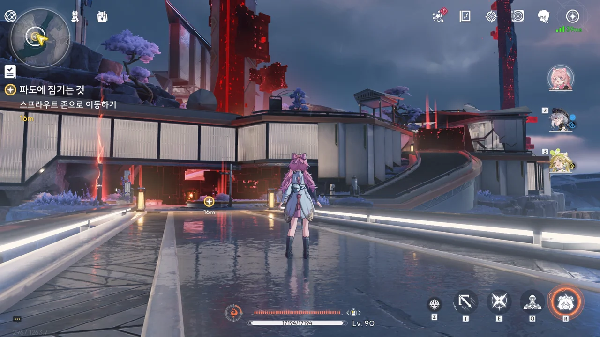

붉은색의 큐브들이 잔뜩 나타나서 길을 틀어막고 있다. 이게 그 이상 주파수가 실체화한 건가?

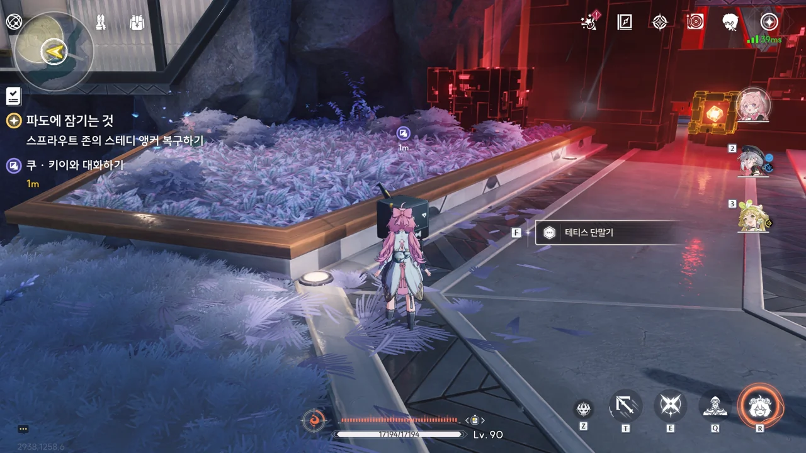

이 녀석은 이름이 그냥 '테티스 단말기'이네. 이 로봇들을 통틀어 '테티스 단말기'라고 칭하는 건가?







「스프라우트 존」은 검은 해안 멤버들이 평소 주거하거나 휴식하는 곳이며, 여기 있는 스테디 앵커를 통해 세계 각지에 퍼져있는 검은 해안 비콘과 연결한다고 한다.

방랑자가 해야 할 건 「쿠 · 키이」를 통해 테티스 시스템에게서 권한을 부여받아 오염 데이터를 회수하는 것이다. 단, 이 권한은 쿠 키이와 가까이 있을 때에만 작동하기 때문에, 오염 데이터를 회수할 때에는 쿠 키이와 함께 있어야 한다.

그나저나 이름이 「쿠 · 키이」라니. 이름을 「쿠 · 키(Key)」로 했다간 쿠키가 되어 맛있어질 테니 조금 길게 늘인 모양이다.



응? 최고 권한이 감지되었다고? '알고 보니 방랑자가 검은 해안의 최고 관리자였답니다!' 같은 전개는 아니겠지, 설마?





오염 데이터 제거 자체는 별 것 없어 보인다. 그냥 가까이 가서 '쿠 키이 비이이임!' 하고 외치면 오염 데이터가 사라진다.

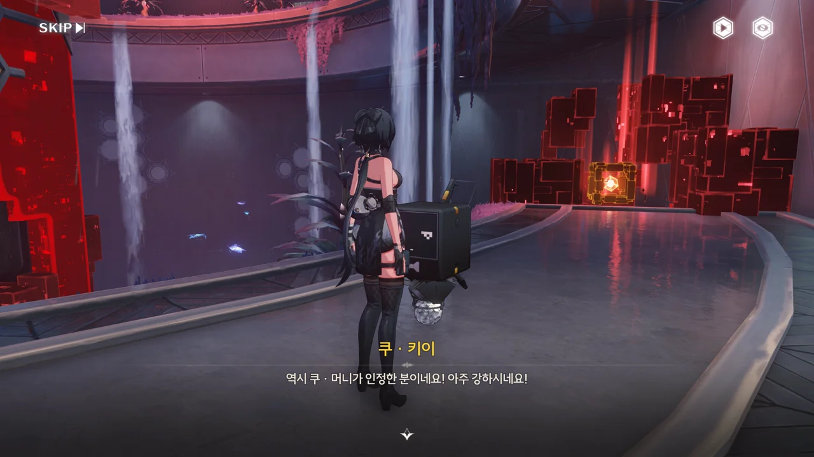



인증 키가 일회용이라는 말은 아마 쿠 키이 빔을 계속 사용하며 전진할 수 없다는 말로 보인다. 그게 가능했으면 여기에 가만히 앉아서 360도 전방위로 보이는 오염 데이터란 오염 데이터에 죄다 빔을 쏘고 다녔겠지.



오염 데이터를 제거하는 건 매우 간단했다. 아직까지는 튜토리얼이라는 걸까.

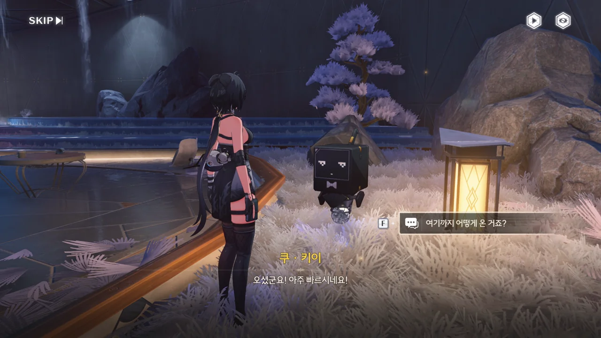





응? 아까부터 계속 여기에 있었다고? 설마 쿠 키이는 하나의 개체가 아니라 여러 개체가 하나의 의식을 이루는 구조인 걸까? 로봇이니까 그런 구현이 불가능한 건 아닐 거 아냐.





스테디 앵커 주변을 둘러싼 발판을 밟고 꼭대기에 있는 오염 데이터를 제거하자, 스테디 앵커를 둘러싸고 있던 오염 데이터가 모두 사라졌다.

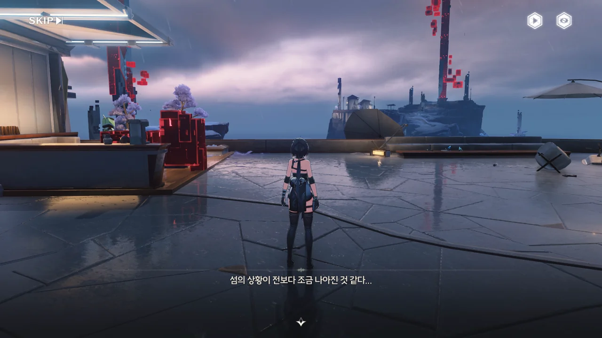

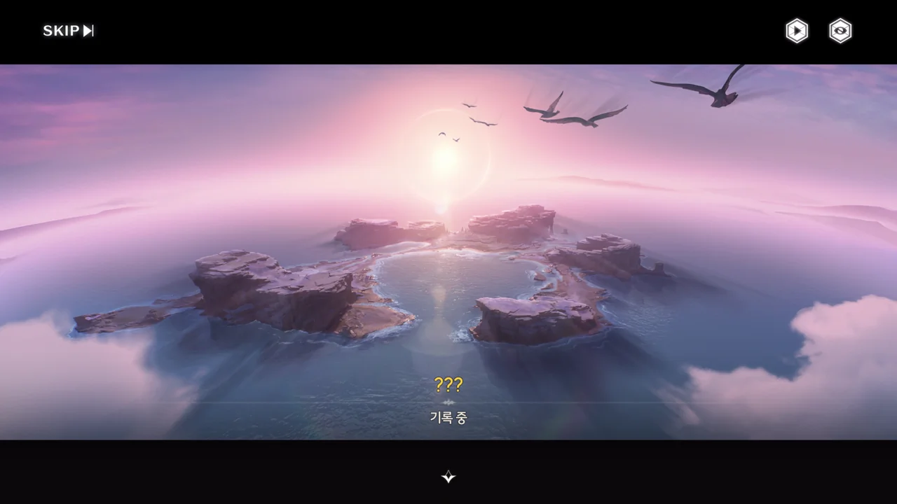







갑자기 방랑자의 머릿속에서 재생되는 누군가의 기억. 방랑자가 익숙한 것 같다고 생각하는 걸 보면 방랑자의 기억일 확률이 커 보인다.

여긴 「검은 해안」 시설이 세워지기 전의 검은 해안 군도로 보인다. 화자의 말에 따르면 검은 해안 군도를 포함한 솔라리스 전체가 모종의 기술을 통해 루프 하는 상황인 것으로 보인다. 다만 "시간이 흘러도 흑석이 닳아 없어지지는 않네요"라는 말로 미루어 보아, 이 루프는 정말로 시간을 되돌리는 게 아니라 단순히 저장된 특정 과거 시점의 정보를 현재에 다시 불러오는 식의 루프로 보인다.

와, 그러면 대체 방랑자의 현재 나이와 기대 수명은 대체 어떻게 되는 거지? 세계가 몇 번이고 루프 할 동안 계속 살아왔다는 거잖아. 방랑자가 금주가 세워지기 이전부터 존재해 온 사람이란 걸 알게 되었을 때부터 방랑자가 평범한 사람은 아닐 거라 생각하고 있었지만, 이건 뭔가 그걸 넘어서는 것 같은데.





다음 행선지는 「아스트리아의 눈」이다. 솔라리스의 하늘바다를 관측하는 임무를 맡고 있기 때문에 흑석의 출력이 더 강한 데다, 인공물 역시 적게 배치해두었다고 한다.

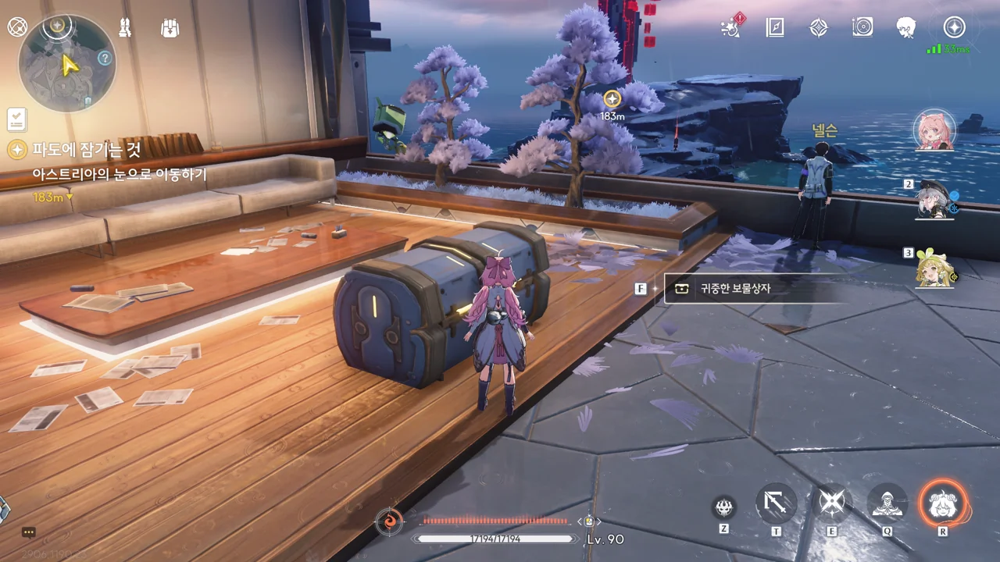

하지만 일단 이 맛있는 상자부터 먹고 가야지.

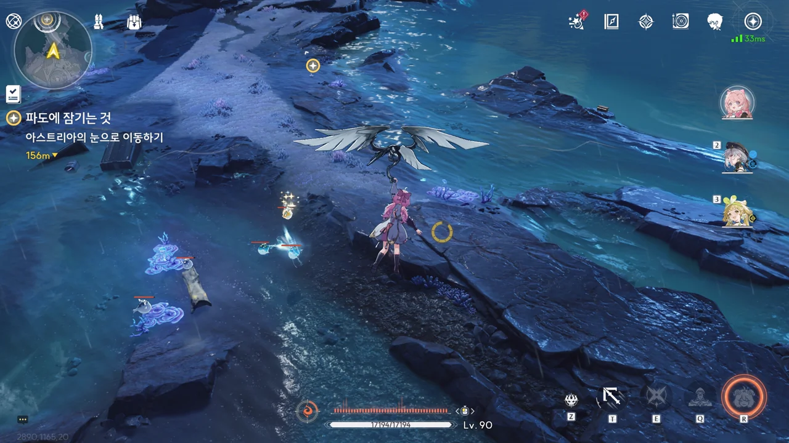

잔상들이 아주 활개를 치고 있다. 이상 데이터에서 나온 잔상은 몸 주위에 붉은 아우라가 있으니, 이 녀석들은 그냥 검은 해안에 나타난 일반 잔상이라는 건데... 다들 평소 주변 정리를 잘 안 하는구나?

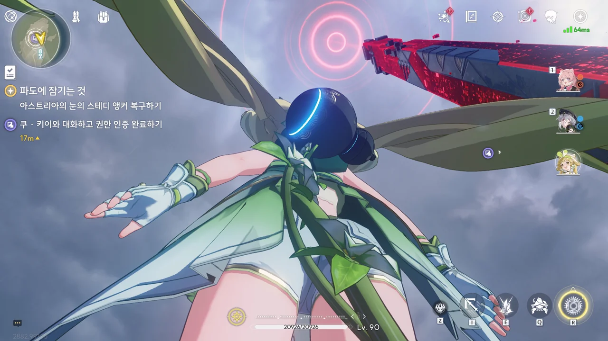

원래부터 스테디 앵커에 헤일로가 떠있었는데 오염 데이터 때문에 붉게 변한 건지, 아니면 저 붉은 헤일로 자체가 오염 데이터 때문에 나타난 건지 잘 모르겠다.

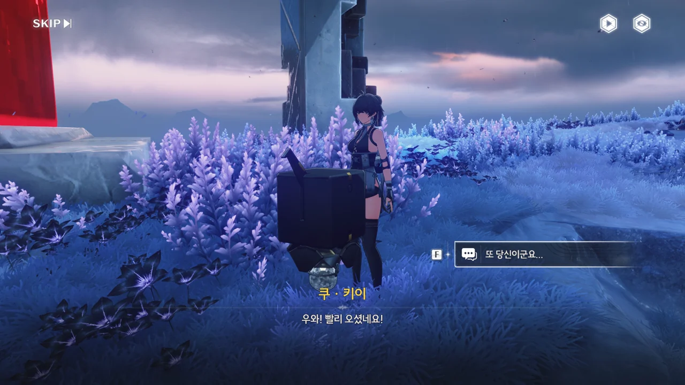







뭇별... 저번에 오르디가 방랑자를 '뭇별의 조율자'라고 부른 것도 그렇고, 어째 방랑자가 별이랑 자주 엮이는 것 같다.

&nbsp;

원신도 그렇고 명조도 그렇지만, 유달리 중국 게임에서 별을 강조하는 건 조금 신기하다고 생각한다. '뭇별'이란 '많은 별'이란 뜻을 갖고 있는데, 자주 쓰이지 않는 이 단어가 두 번씩이나 등장한 건 결코 우연이 아닐 테니까.

예전에 누가 '거긴 대기 오염 때문에 평소 별을 아예 보지 못해서 그런 거 아니냐?'라며 농담으로 한 말이 생각나네.





이번엔 스테디 앵커 등반에 로프 포인트가 추가되었다. 시점 역시 백뷰에서 사이드뷰로 바뀌었다.







오염 데이터를 제거하려 하자 갑자기 잔상이 나타나 방랑자를 포위했지만 별문제 없이 전부 제거하고 오염 데이터를 처리할 수 있었다.

갑자기 아레나에 가두는 건 조금 신선했어.

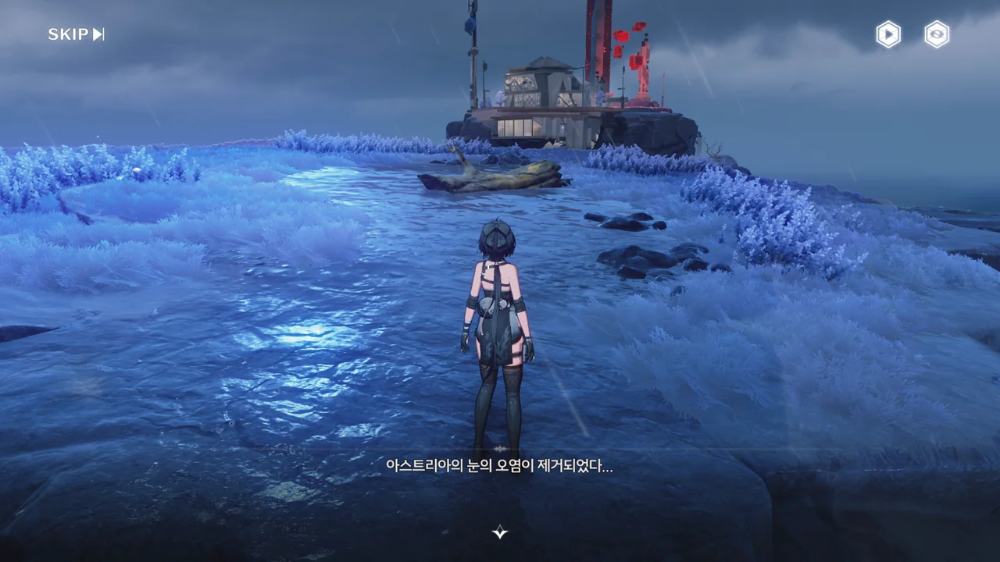







또다시 누군가의 기억을 보았다.

검은 해안 사람들이 다 함께 힘을 합쳐 무언가에 대항하고 있는 모습이다. 그렇게나 루프를 반복했음에도 비명의 완벽한 예측은 아직 불가능한 모양이다.
설정을 너무 많이 꼬아놔서인가, 각 용어가 뜻하는 바는 기억하지만 각 용어들 간의 상관관계가 잘 기억나지 않는다. 원래 하늘바다와 무음구역에 대한 예측이 불가능했던가?

검은 해안이라는 조직이 세워진 이유가 비명에 대항할 더 많은 사람을 모으기 위해서였 다라... 그렇다면 검은 조직은 설립 이후 여태까지 그 설립 의의를 잊지 않은 모양이다. 역사가 오래된 조직이 그 최초의 설립 의의를 잃고 변질하는 것이 클리셰인데, 이건 좀 귀하다.











이번엔 세계 각지의 잔상을 관측해 비명을 연구하는 「잔상관측소」에 잔상이 몰려왔다. 평소 잔상 데이터의 저장, 수집, 전송을 담당하던 곳이라, 이번 데이터 유출에 의해 실체화된 잔상이 특히 더 많다고 한다.



잔상이 여럿 나타나긴 했는데, 별문제 없이 제거할 수 있었다. 등반만 하면 심심해할까 봐 잔상과의 전투도 넣어주는구나.

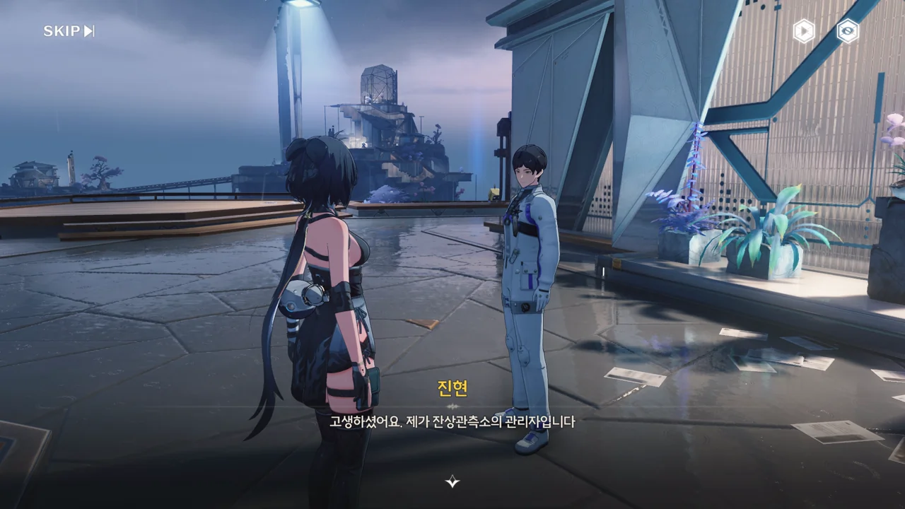







잔상관측소의 관리자, 진현은 오염 데이터와 잔상 데이터가 흑석의 영향으로 실체화하는 것을 보고, 역으로 데이터를 주입해 스테디 앵커 주변에 상승 플랫폼을 만들었다고 한다.

단순히 상황을 막는 것이 아니라, 역으로 이용하다니 보통 머리가 아니다.



잔상이 있었는데요. 없었습니다.

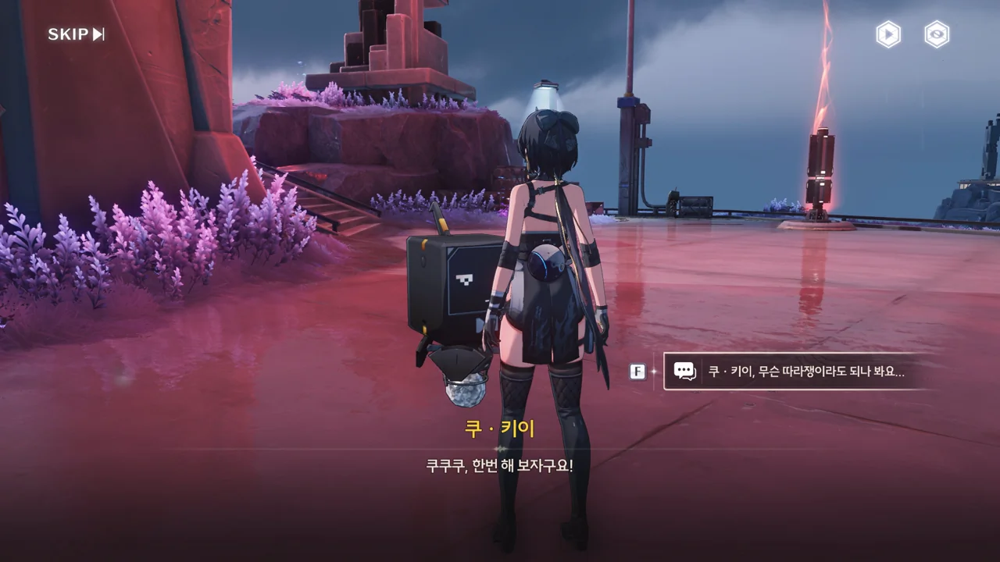





이제 이 스테디 앵커만 정화하면 끝이다.







역시나 이번에도 스테디 앵커 꼭대기에 있는 오염 데이터를 제거하려는 방랑자를 아레나에 가둔다. 하지만 어림없지.



모든 스테디 앵커의 오염을 제거하자, 군도 한가운데에서 자그마한 섬이 솟아오른다. 저거, 포탈인가?







오... 그러니까 파수인은 방랑자가 기억을 잃고 운릉 협곡에 누워있을 때부터 방랑자를 계속 지켜봤다는 거구나.





방랑자가 다친 줄 알고 자신의 수리용 부품과 엔진 오일을 주려는 쿠 키이. 방랑자는 로봇이 아니라 사람이라서 그게 필요 없긴 한데, 마음만은 고맙다.

모든 구역의 스테디 앵커 복구 작업이 완료된 모양이다.





'오르디'가 굉장히 자연스럽게 서있길래 깜짝 놀랐다.





모니카가 찾아본 결과, '오르디'는 몇백 년 전, 귀허항시를 파괴한 비명에 휩쓸려 사망한 검은 해안의 군의관이었다고 한다.

저번에 테티스 단말기들이 테티스 시스템에 접속해 기록을 살펴봤을 때, '오르디'에 대한 기록이 없었다고 말했었다. 그런데 테티스 시스템 외의 장소에 별도로 기록을 해둔 것으로 추측되는 검은 해안 인사 담당자의 기록에는 '오르디'에 대한 정보가 정확히 존재하네?

쿠 머니와 쿠쿠 남매의 건에서 느끼기도 했지만, 테티스 시스템이 의도적으로 방랑자와 '오르디'에 대한 정보를 차단하고 있음이 분명하다.





이거, 아무리 봐도 오역이 조금 섞인 것 같은데...

'오르디'는 귀허항시가 파괴될 때의 기록을 담은 것으로 추측되는, 테티스 시스템의 「멸망의 별」의 집단의식의 일부라고 한다.

"블랙홀 바깥의 사건의 지평선"은 명백한 오류 혹은 오역이다. 왜냐면 사건의 지평선은 블랙홀의 경계면을 뜻하고, 블랙홀 역시 사건의 지평선 내부를 뜻하거든. 차라리 "블랙홀 바깥의 강착원반"이라고 했으면 더 그럴듯했을 것이다. 하지만 모든 블랙홀이 강착원반을 갖고 있는 건 또 아닌데...

아무튼, '오르디'로 대표되는 이 집단의식은 테티스 시스템에 의해 영원히 "뫼비우스의 띠"처럼 특정 상황을 반복하고 있는 모양이다. 엄밀히 말해, 귀허항시의 비명은 블랙홀의 특성을 갖고 있는 것뿐이지, 실제 블랙홀이 아니라서 그런 게 가능한가 보다.







예상했던 대로, 귀허항시에서 방랑자 일행을 구해준 건 파수인이 맞았다. 다만 "제멋대로 행동해서 죄송하다"라고 하는 걸 보면, 원래 해서는 안될 행동이었나 보다. 아마 그 기준은 과거 기억을 잃기 전의 방랑자가 세운 거겠지?

눈치 빠른 알토는 일찌감치 자리를 비켜줬다.













앞서 방랑자가 본 기억 속에서 그랬듯이, 방랑자는 아주 오래전 검은 해안 군도에 「검은 해안」이라는 조직을 세웠고, 파수인은 그때부터 계속 방랑자의 조수로서 방랑자를 도와 검은 해안을 관리했다고 한다.

하지만 어떤 이유에서인지, 방랑자는 자신의 모든 걸 내려놓고 홀로 이곳저곳을 떠돌기로 결심했다.
세상을 홀로 떠도는 것 역시 오래전부터 계획해 오던 것이었는지, 방랑자는 「검은 해안」을 설립할 때부터 테티스 시스템에 조직 관리를 일임한 채 사람들 앞에서 모습을 드러내지 않았다고 한다.
이후 방랑자가 자신의 기억을 지우고 검은 해안을 떠나면서, 검은 해안의 공식적인 리더는 테티스 시스템이 되어버렸다.

파수인이 "끊는다"라고 표현한 걸 보면, 이전부터 무언가가 계속 반복되어 왔다고 추측할 수 있다.
아까 오르디가 말한 "뫼비우스의 띠"와 연관해 생각하면, 귀허항시의 비명을 이용해 만든 「멸망의 별」을 계속 이용하는 것 자체에 무언가 문제가 있는 걸까? 그때 당시 비명에 의해 죽은 사람들의 주파수가 이상의 원인이고, 이걸 해결할 수 있는 건 현재 검은 해안의 리더인 테티스 시스템의 권한보다 높은, "최고 권한"을 가진 것으로 추측되는 방랑자뿐이라고 하면 말이 될 것 같은데.









> 금주는 솔라리스 여정의 시작점일 뿐이에요.
> 검은 해안을 통해 솔라리스 전역으로 갈 수 있을 거예요.

흠, 그러면 앞으로 금주를 제외한 다른 지역을 갈 때에는 검은 해안에서 시작하게 되는 걸까?

일단 방랑자가 금주에서 눈을 뜬 것 자체가 기억을 잃기 전 방랑자가 세워둔 계획에 따른 것임은 확실하다. 이후의 일이 어떻게 흘러갈지조차 과거의 방랑자가 세워둔 계획의 일환일 것이고.
뭔가 기분이 참 묘하네. 대체 과거의 방랑자는 얼마나 잘난 사람이었기에...

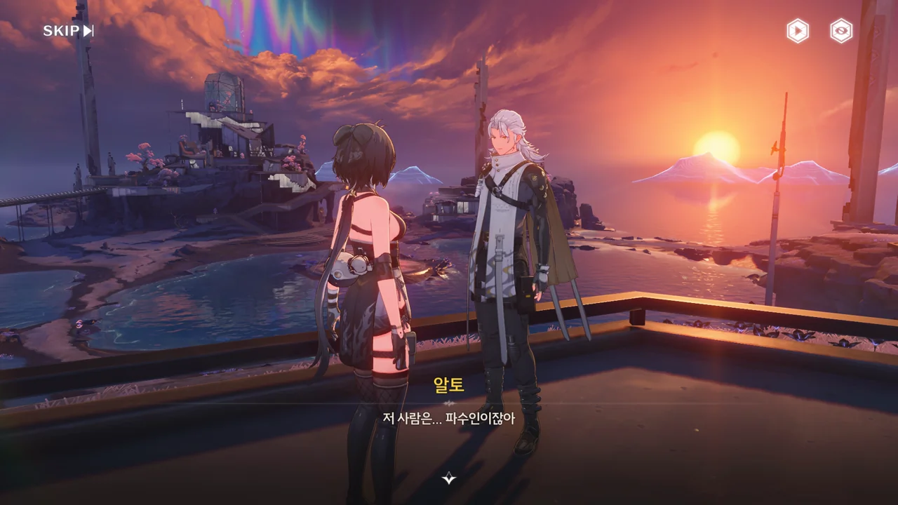





알토 말에 따르면, 파수인이 방랑자 앞에 나타난 것 자체가 방랑자가 검은 해안에 있어 매우 중요한 사람임을 나타낸다고 한다. 정보 상인을 자처하는 알토조차 이번이 파수인을 보는 처음이라고 하지 않는가.

일단 검은 해안 지하로 가보면 뭐라도 알 수 있을 것만 같다. 지금은 뭐가 뭔지 조금 혼란스럽거든...
