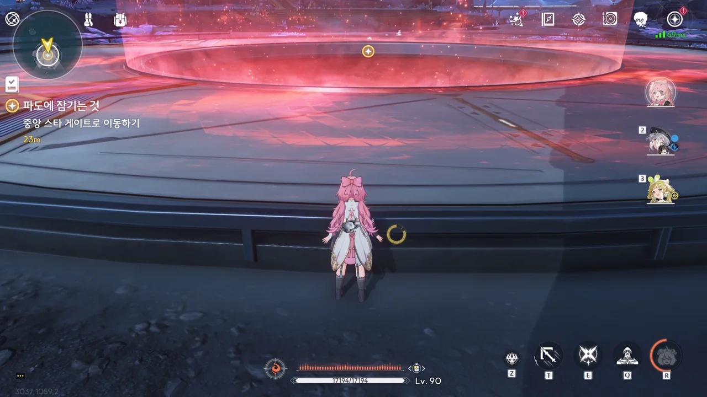
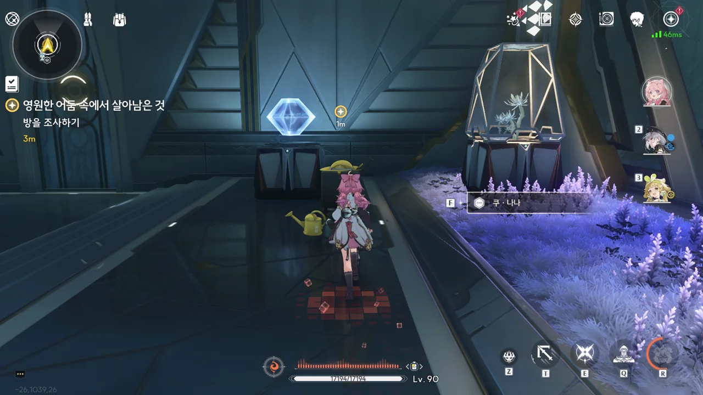
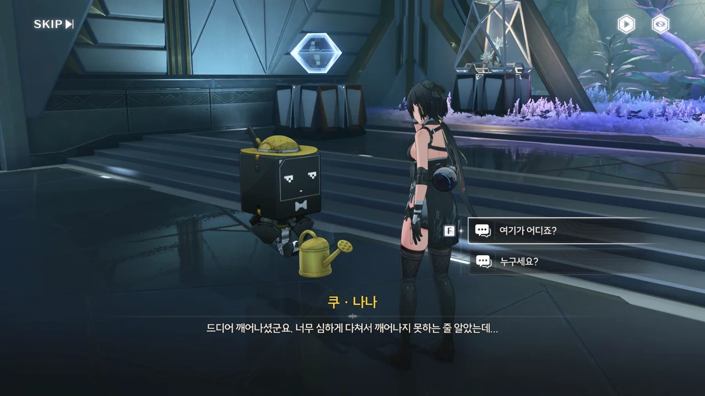
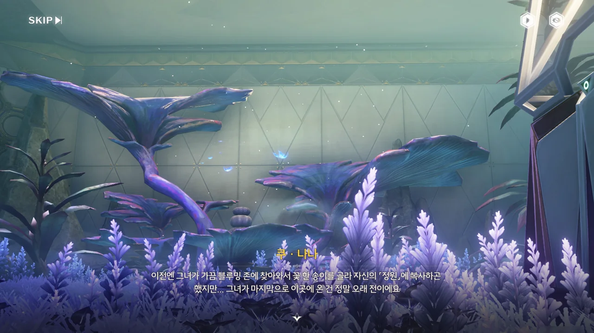
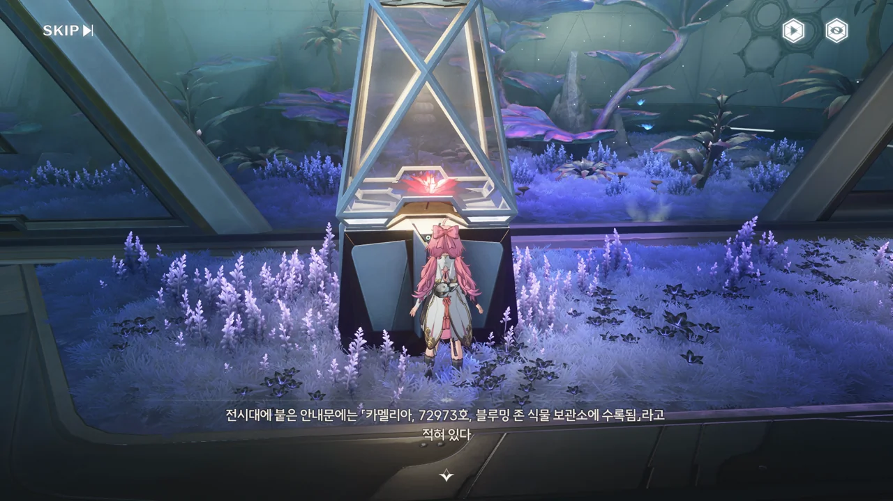
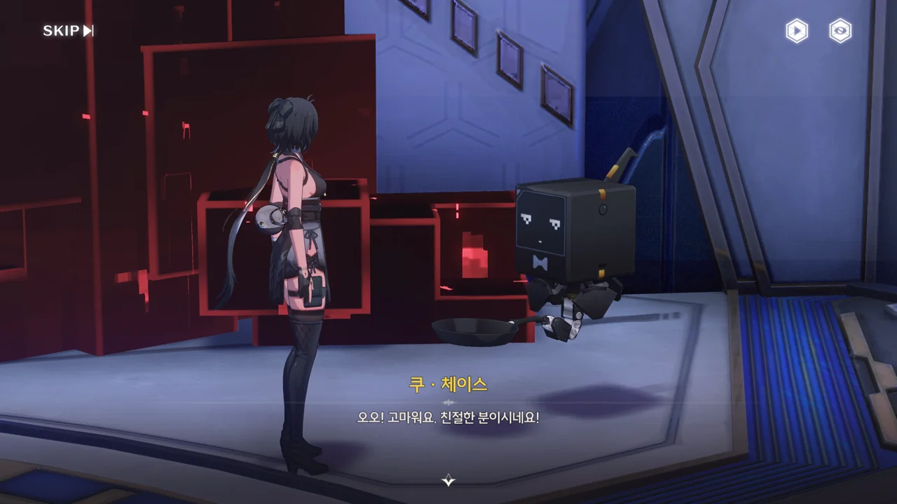
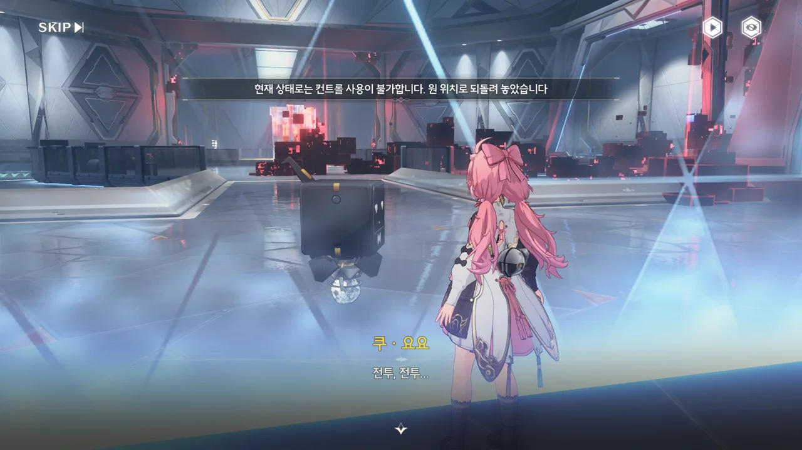
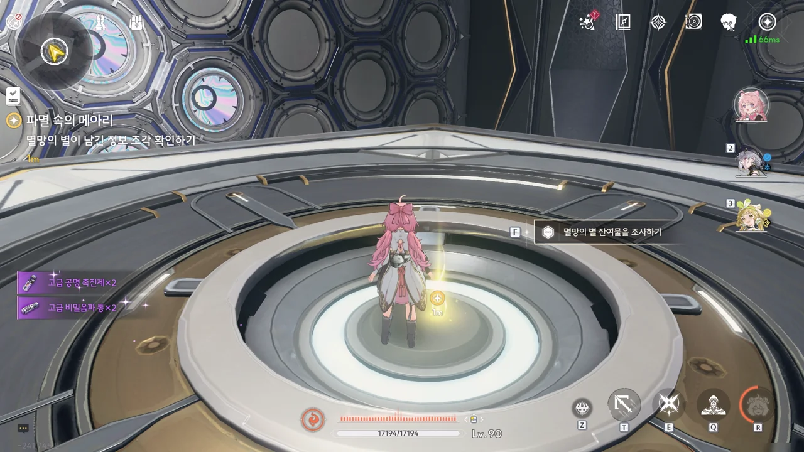

검은 해안 지하로 가는 통로라더니, 정말로 땅에 구멍이 뚫린 것처럼 생겼다.



















와... 이런 느낌, 게임을 막 처음 시작했을 때가 생각나네.

깊은 물속에서 막 빠져나왔다고 생각했는데 실상은 뒤집어진 바닷속에서 고개를 내민 것이었다는 걸 깨닫고 소름이 돋았는데 말이다.

「쿠 · 나나」? 단말기의 이름에서 역할을 유추할 수가 없다. 여기 단말기들은 다른 이름 규칙을 쓰는 건가?

일단 '나나' 하면 일본어의 7이 제일 먼저 생각나는데...





포탈 안에서 대체 무슨 일이 있었는지 모르겠지만, 떨어지는 과정에서 방랑자가 크게 다쳤었다고 한다. 지금은 괜찮은 것 같지만.

여기는 검은 해안 지하에 위치한, 씨앗 은행 「블루밍 존」이다. 씨앗 은행은 씨앗을 저장할 때 빼곤 들어올 일이 없으니, 여기에 오는 게 파수인 뿐이라는 게 이해가 되지 않는 건 아니다.







그런데 그 파수인마저도 약 20년 전을 마지막으로 블루밍 존에 발길을 끊었다고 한다.
20년 전이면 금주에 어린이를 대상으로 한 '피열'이란 질병이 유행했었다는 것과, 백신 운송에 방랑자가 관여했다는 것 정도밖에 기억나지 않는다.

테티스 시스템의 오류를 해결하려면 데이터 센터를 복구해야 한다고 한다. 데이터 센터는 데이터와 별들을 모아두는 곳이지만, 고장 난 상태로 꽤 오랫동안 방치되어 있었던 모양이다.
방랑자가 없을 동안 파수인이 데이터 센터를 복구하려 한 모양인데, 쿠 나나가 저렇게 말하는 걸 봐선 실패한 것 같네.



> 카멜리아의 꽃이라니요?
> 일련번호로 보아 상당한 양의 꽃씨를 가지고 돌아왔다.
{.bq}

진짜 번역 꼬락서니하고는... 왜 설명문에 대화체가 쓰인 거냐?

모든 검은 해안 멤버들은 플라워 룸에 꽃을 심도록 초대된다고 했으니, 여태껏 검은 해안은 최소 72,973명의 멤버를 받아들였다는 말이 된다. 방랑자처럼 고향의 꽃 대신 검은 꽃을 심은 사람들은 중복으로 제외되었을 테니...

대체 파수인이 찾는 '자신에게 대체할 수 없는 어떤 꽃'이란 어떤 꽃인 걸까?









쿠 키이에게 포탈건 기능이 생겼다. 비록 원하는 곳에 포탈을 만들 수 있는 건 아니지만, 있는 게 어디냐.

'포탈' 하니까 갑자기 생각나는 게 하나 있다. 정확히 무슨 게임이었는지는 기억나지 않지만, 최근에 출시한 어떤 게임에 '임의의 장소에 포탈을 설치할 수 있는 캐릭터'가 출시된 적이 있다.
사람들이 그 캐릭터로 위아래에 포탈을 생성한 다음, 거길 통해 무한히 떨어지며 재미있게 노는 영상을 보고 누군가가 "그거, 밸브 게임, 포탈에서 14년 전에 이미 했던 건데 ㅎㅎ 귀엽네"라는 식으로 코멘트를 달았더라고.



이 명조의 핵심 설정 중 하나인 건 잘 알고 있지만, 이건 정말 이해할 수가 없네. '음의 영역'이 音인지 陰인지도 잘 모르겠고.
그래서 대충 뭉뚱그려서 아공간(亞空間)과 비슷한 특성이라고 이해하기로 했다.



나만 검은 해안이 테티스 시스템에 지나치리만큼 의존하고 있다고 생각하는 건가? 테티스 시스템이 고장 났다고 엘리베이터까지 고장 나는 건 너무한 것 같은데.





파수인이 "여기가 바로 검은 해안의 진짜 모습이에요"라고 말한 걸 보면, 바로 여기에 '검은 해안'의 핵심 시설이 모여 있나 보다.

파수인의 몸은 으로 되어 있다고 한다.
만물은 주파수로 이루어져 있는데, 그중 순수하고 완전한 주파수가 농축되어 만들어진 것이 바로 소노라라고 한다. 그러니까... 파수인은 인조 생명체, 뭐 그런 건가?

파수인은 테티스 시스템의 연산 핵심을 담당해야 하기 때문에 제자리를 벗어날 수 없지만, 소노라의 특성을 이용해 원하는 곳에 투영, 그것도 주변과 상호작용할 수 있는 투영을 만들어낼 수 있는 것 같다.





여기 보이는 별하늘은 진짜 별하늘이 아니라, 솔라리스의 과거, 현재, 미래의 비명을 별하늘의 형태로 기록한 것이라고 한다. '오르디'가 방랑자를 '뭇별의 조율자'라고 부르던데, 그게 이 별하늘과 관련이 있는 걸까?

아, 이 별하늘의 정식 명칭은 '스텔라 매트릭스'이다.
여기서 그냥 별하늘이라고만 이야기하고 끝내서, 나중에 '스텔라 매트릭스'라는 용어를 마주쳤을 때 그게 무얼 뜻하는 건지 조금 생각해보아야 했다.





방랑자의 질문에 파수인은 직접적으로 대답하지 않는다. 설마 이것도 방랑자가 포기한 과거와 연관이 있는 걸까?

파수인은 과거를 포기하기 전의 방랑자가 '뭇별의 조율자', '문명의 인도자', '검은 해안의 리더' 등 다양한 이름으로 불려 왔다며, 그중 어느 이름이 가장 마음에 드냐고 묻는다.
역으로 파수인은 방랑자를 어떻게 불렀냐고 묻자, 파수인은 수많은 세월 동안 방랑자의 본명으로 방랑자를 불렀다고 말해준다.

잠깐 생각해 보자.
정황상, 방랑자는 테티스 시스템이 만들어지기 이전부터 살아온 사람이다. 파수인의 나이 역시 테티스 시스템과 비슷하거나 조금 더 많을 것이다.
방랑자의 과거 기억으로 미루어 보아, 지금의 솔라리스는 루프를 반복하고 있다. 파수인과 테티스 시스템은 과거 루프의 기억을 그대로 갖고 있을 확률이 높다. 방랑자 역시 과거 루프의 기억을 갖고 있었겠지만, 과거의 기억을 버리는 과정에서 그 기억도 같이 버렸다.
파수인은 귀허항시에서 방랑자가 위험에 처하자, 과거 방랑자가 내린 지시를 어기면서까지 방랑자를 구할 정도로 방랑자를 매우 특별히 생각하고 있다.

... 이거 어디서 많이 본 클리셰 같은데.

> 병실에서 깨어나보니 나는 기억상실
> 자신을 내 여자친구라고 주장하는 여자가 내 옆에 앉아있음

... 이거 조금 무서운데. 조금만 삐끗해도 집착 얀데레 각이잖아, 이거.







하늘에서 붉은 무언가가 혜성처럼 떨어진다. 저게... 블랙홀이라고? 블랙홀의 크기가 정말 작다면 저게 말이 안 되는 건 아닌데...

테티스 시스템의 작동 방식에 대해 설명하는 글을 읽은 적이 있는데, 테티스 시스템이 솔라리스를 관측하는 방식은 실시간으로 솔라리스를 관측하는 게 아니라, 별하늘을 통해 간접적으로 구현한 유사 솔라리스를 관측하는 것이라고 한다. 그리고 그 과정 속에서 발생한 쓰레기 데이터는 블랙홀 속으로 던져 넣어 폐기한다고 한다.

현실의 유사 구현을 통한 간접 관측... 어디서 비슷한 개념을 들어본 것 같은데...

그나저나, 그러면 지금 저 「멸망의 별」에는 귀허항시가 멸망할 당시의 데이터뿐만 아니라 솔라리스의 과거, 현재, 미래 데이터가 전부 섞여 있는 건가?





지금 검은 해안과 귀허항시에서 일어나고 있는 이상 현상의 근원이 저 멸망의 별이니, 저걸 조율자의 전당에 가져가 보정하면 테티스 시스템의 이상이 해결될 거라고 한다.





> 검은 별은 이미 지하에 가둬놓은 것 같네요.
> 게다가... 지하로 통하는 문은 인위적으로 닫혔어요.

...? 여기 말고도 다른 지하가 있는 건가?









멸망의 별이 추락한 「오류수용소」로 향하는 길에 잔상이 잔뜩 깔려 있다. 테티스 단말기들이 열심히 응전하고는 있지만, 잔상들이 너무 강력한 탓에 별 도움이 되지 못하고 있다.

그나저나 「쿠 · 체이스」가 말한, "파수인도 노력하고 있잖아요"가 대체 무슨 뜻일까?





오류수용소의 소장 이름이 '베아트리체'였구나.

모 게임에서 등장한 악역 때문에, 베아트리체라는 이름만 보면 흠칫하게 된다.
크아악, 내 머릿속에서 나가, 눈깔괴물!

















다른 사람과 달리, 이 남자 혼자만 저번에 귀허항시에서 본 시체들처럼 온몸에 붉은 아우라를 두르고 있다. 이상 주파수에 과도하게 노출되었다는 의미였던가, 저게.

알고 보니, 오류수용소에 떨어진 멸망의 별 때문에 수용소 지하에 보관되어 있던 이상 주파수가 탈주해 실체화하자, 통제실이 이상 주파수에 먹히는 걸 방지하기 위해 지하로 통하는 문 열쇠를 뽑아 오는 자살 임무에 이 남자가 자원했고, 임무를 성공적으로 마쳤으나 정작 본인은 이상 주파수에 오염되고 말았던 것이다.

... 영웅적 희생이라는 건가. 오염 주파수에 심하게 노출되었으니, 이 남자 역시 귀허항시의 흑화집사들과 같은 결말을 맞을 것이다.





> 검은 별은 이미 지하에 가둬놓은 것 같네요.
> 게다가... 지하로 통하는 문은 인위적으로 닫혔어요.

... 진짜 게임 꼬락서니하고는. 이젠 스크립트 중복이네?
아마 아까 보았던 두 대사는 여기 나왔어야 할 대사가 오류로 인해 먼저 나온 것으로 보인다.
이야, 멸망의 별이 게임까지 고장 내버리네.





음, 열쇠를 찾은 건 좋은데, 나갈 방법이 없다.

마침 다른 단말기가 다가오고 있다. 어떻게 문을 열 방법이 없을까?







「쿠 · 요요」가 바깥에 있던 데이터 오염을 장벽 안으로 전송시켜 준 덕분에 오염을 제거하고 나갈 수 있었다.





쿠 키이의 레이저 빔은 포탈을 통과할 수 있다!

이러니까 진짜 포탈 하는 느낌이네.





오류수용소를 점거하고 있던 이상 주파수, 제거 완료!











파수인은 오염 주파수에 과도하게 노출되어 회복할 가능성이 희박한 수용원에게 곧 괜찮아질 거라는 거짓말을 했다며, 자신 역시 과거의 방랑자가 그랬듯 '슬픔'이라는 감정을 가져야 하는 거냐고 물어본다.

글쎄... 난 저게 파수인이 사람의 감정을 학습하는 거라고 생각하는데. 늘 무표정이던 파수인에게도 따뜻한 심장이 있다는 증거겠지, 아마.











현재 테티스 시스템이 사용하고 있는 멸망의 별은 과거 귀허항시를 파괴한 비명이라고 한다.

방랑자는 비명 예측에 비명 --- 사람 주파수 함유 --- 을 써야 하는 이 모순적인 상황이 마음에 들지 않았던 건지, 자신의 기억을 지우고 방랑길에 떠났으며, 방랑자의 뒤를 이어 테티스 시스템의 최고 권한을 받은 파수인 역시 방랑자의 뜻을 따라 비명을 이용하지 않고 비명을 예측하는 방향으로 노선을 바꾸었다고 한다.

하지만 일단 당장 저 멸망의 별 문제를 해결해야 추가적인 희생자가 나오지 않을 것이다.
그러려면 수용소에 있는 멸망의 별을 회수해 조율자의 전당으로 가져가, 테티스 시스템에 다시 주입해야 한다. 이전의 방랑자가 꺼려했던 그 방식으로 돌아가야 하는 것이다.







그래도 파수인이 이번엔 모든 걸 바꿀 거라고 말하는 것으로 보아, 이번 사건을 계기로 무언가 바뀌었으면 좋겠다.
'오르디'가 말했듯이, 멸망의 별 속에 갇힌 주파수는 영원히 그 속에 갇혀 있을 수밖에 없으니까.



이 멸망의 별은 시공간을 왜곡시킬 수 있는 '중력' 속성을 갖고 있기 때문에, 주의해서 다뤄야 한다고 한다.

다행스럽게도 파수인이 텔레포트 게이트를 열어주어, 멸망의 별에 곧바로 다가갈 수 있다.







멸망의 별에 가까이 다가가니, 갑자기 지옥불 기사가 나타나 싸움을 건다.
용융 피해 저항이 있는 적에게 용융 피해를 줘서 잡아야 한다니... 에반데.

아무튼, 지옥불 기사를 잡으니 멸망의 별 주파수가 다시 안정폭 안으로 억제되었다고 한다.





아니, 왜 그걸 먹으려고 하는 거야...

하지만 포포가 주파수의 '맛' 하나는 제대로 보았다. 저기엔 귀허항시에서 죽은 사람들의 주파수 역시 섞여 있을 테니까.





이건 또 새로운 정보네.

난 포포가 방랑자와 붙어 다니게 된 계기가 프롤로그에서의 일 때문인 줄 알고 있었다. 그런데 알고 보니 포포가 수천 년 동안 주파수의 형태로 방랑자와 붙어 다녔다고?







아까도 말했지만, 포포 이 녀석, 주파수의 특징 하나는 잘 본다.

* "양념이란 양념은 다 때려 부은 괴식 같다": 실제로 여러 사람의 주파수 역시 함께 섞여 있다
* "까딱하면 빠져버릴 것 같은 구멍처럼 생겼다": 블랙홀의 특성을 지녔다







파수인이 포포때문에 몸에 느껴지는 이상 증상이 없냐 물었지만, 잘 모르겠다.
오히려 이상 증상은 포포가 더 많이 느끼는 것 같던데. 틈만 나면 배가 고프다고 하질 않나, 매번 나올 때마다 졸리다고 하질 않나...



> **스텔라 매트릭스 코어**
> ***
> 비명의 핵심 요소를 압축 저장한 스텔라 매트릭스 코어. 조율자의 전당으로 가져가 다시 업로드해야 한다.
> ***
> 별들도 울부짖을 수 있다면, 아마도 전 세계에서 가장 비통한 소리가 될 것이다.
{.bq}

... 아무리 봐도 '오르디' 이야기잖아.



멸망의 별을 회수한 자리에는 오르디가 마지막으로 작성한 것으로 보이는 보고서가 놓여 있다.

그런데 대체 '테티스 번호'의 'K-125(폐기됨)'이 뭘 의미하는 거지? 대체 뭘 폐기한 거지?



> 하지만... 이건 제 약속이기도 해요.

갑자기 뜬금없이 나타난 파수인의 대사. 이것도 아까 전처럼 잘못 출력된 대사로 보이는데...

대체 파수인은 누구와 무엇을 약속한 걸까.
