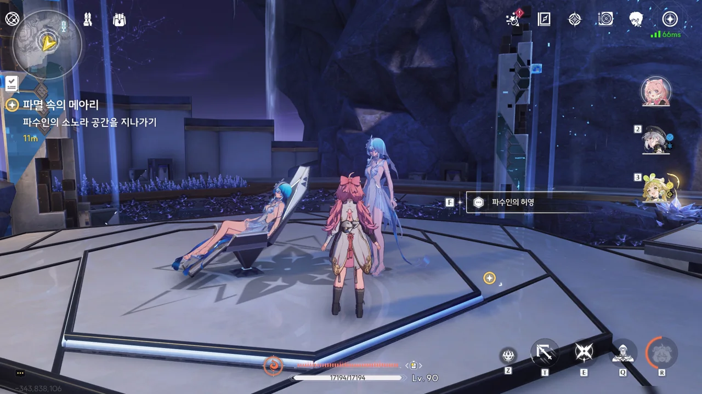
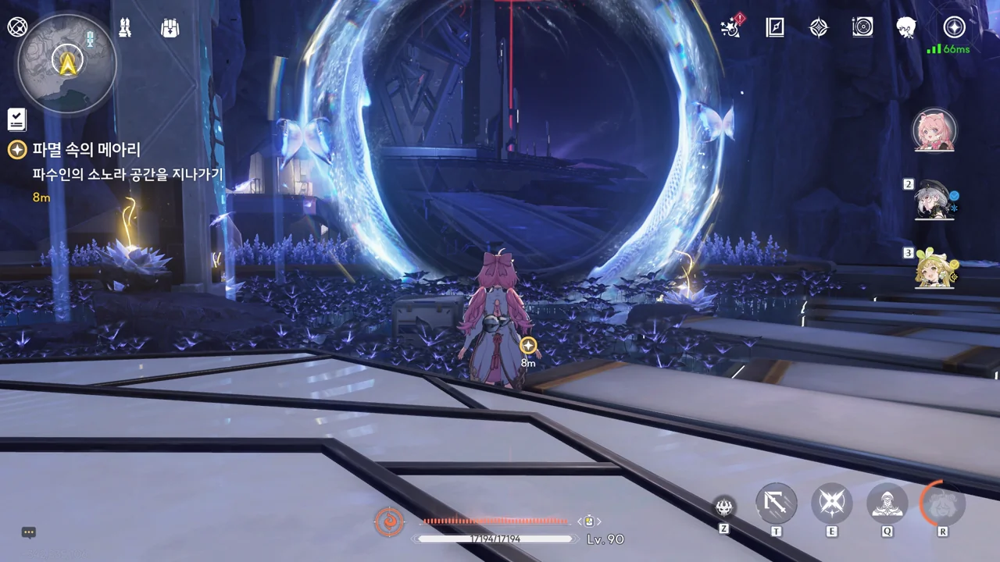
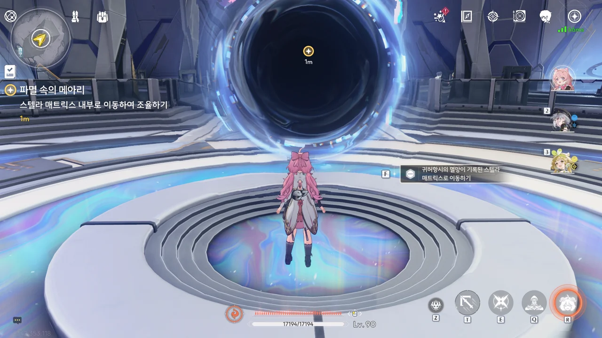
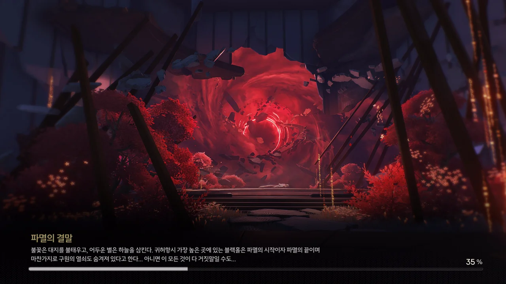



「쿠 · 로고스」라... 진리(Logos)에 대해 고민하고 있는 걸 보니, 이름값을 하는 녀석이다.









이곳은 파수인의 개인 정원이자 그녀가 테티스 시스템의 연산에 참여해 스텔라 매트릭스 전체를 관찰하는 곳, 「에이도스 가든」이다.

파수인은 계속 여기에 머물고 있었지만, 여태까지는 자신을 구성하는 소노라를 이용해 자신의 모습을 감추고 있었던 모양이다.





















> 이건... 비명이에요. 도시를 파괴하는 원흉...
> 건물을 무너뜨리고 문명을 파괴하고 모든 걸 집어삼키죠. 모든 생명이 사라질 때까지...
> 수없이 많은 사람들이, 수없이 많은 비명으로 사라지고 그 속에 남은 그들의 절망, 불안, 집념... 분노, 후회까지... 테티스 시스템의 데이터베이스에 모일 거예요.
> ...
> 저는 테티스 시스템의 중추고, 검은 해안의 소유니까요. 제 소노라는 이런 감정을 담는 데 최적화돼 있어요.

파수인이 테티스 시스템의 연산에 참여한다는 건, 비명에서 나온 사람들의 감정을 걸러낸다는 의미로 보인다.
테티스 시스템은 비명에서 감정을 걸러낸 순수한 데이터만을 가져가 비명을 예측하는데 쓰고, 걸러낸 감정은 파수인의 소노라에 담아두는 것이다. 연산 중 발생한 잉여 데이터는 멸망의 별에 던져 버리고.

파수인이 자신을 주체(Subject)가 아닌 객체(Object)로 말하는 것이 조금 안타깝다.



방금 방랑자가 본 장면은 파수인이 자신의 소노라를 제어하는데 실패해 생긴 결과인가 보다.

테티스 시스템이 귀허항시에 일어난 비명을 가져다 멸망의 별로 삼은 후, 그때 상황을 무한히 반복해 앞으로 있을 비명을 예측한다 했으니, 파수인에게 쌓인 감정의 양 역시 엄청날 것이다.
그리고 그것의 편린을 방랑자가 잠시 맛본 것뿐이고.





파수인의 말에 따르면, 파수인이 직접 비명을 겪는 건 아니지만 검은 해안 사람들이 가져다주는, 비명과 관련한 이야기를 통해 간접적으로 비명을 경험하는 모양이다.

그런데 고작 전해 듣는 이야기만으로 그렇게 정밀한 환상을 보여줄 수 있을 리가 없잖아. 혹시 파수인이 비명의 감정을 처리하는 건 무의식에서 진행되는 일인 걸까?











자신이 임무를 제대로 수행하지 못하고 사람들의 감정을 이해하지 못해 이런 일들이 생겼다며 자책하는 파수인. 자신의 모든 것을 바쳐서라도 무한히 반복되는 운명의 속박에서 방랑자를 구해내겠다며 다짐한다.

... 파수인의 사랑이 무거워... 대체 무엇이 파수인을 저렇게 필사적으로 만든 걸까?





파수인 본체 곁에 파수인의 허영이 있는 모습을 보자니 조금 묘한 기분이 든다.

> 제 영혼까지... 저한테도 존재한다면.

'영혼'의 존재 자체는 믿지 않지만, 여기 솔라리스는 사람의 기억과 소망이 주파수의 형태로 남기도 하는 곳이다. 그게 영혼과 다를 게 뭐가 있을까.
아, 이건 너무 유물론적인 관점인가?

이제야 발견한 건데, 파수인이 열어주는 소노라 포탈 테두리에는 파수인을 상징하는 나비가 포함되어 있다.
혹시나 해서 이전에 파수인이 열어준 소노라 포탈에도 똑같이 나비가 있나 확인했는데, 역시나 거기에도 나비가 있더라고.



남은 데이터 잔상들이 조율자의 전당에 모여드는 게 왜 그들의 사명을 완수하는 거지?







그러니까 테티스 시스템이 멈추면서 스텔라 매트릭스가 조각나 검은 해안 지하 곳곳에 떨어졌고, 거기에 담긴 주파수들을 파수인이 하나하나 *달래고* 있었다는 건가?
... 정말 명조의 주파수 관련 설정은 이해하기 어렵다니까.

아무튼, 방랑자가 가져온 멸망의 별 핵심을 다시 조율하면 테티스 시스템이 정상화될 거라고 한다.















멸망의 별을 기존 백업된 귀허항시의 데이터로 다시 조율하자, 에이도스 가든에 누워있던 파수인이 눈을 떴다.

이제 *리디렉션* 된 스텔라 매트릭스 안으로 들어가 테티스 시스템의 *리디렉션 데이터*를 가져오는 일만 남았다.
어... 그러니까 그게 뭔데? 제발 이해할 수 있는 말로 해줘...

멸망의 별이 통제되면서 자신에게 가해지는 연산 부담이 크게 덜어졌으니, 방랑자와 함께 스텔라 매트릭스로 들어가겠다고 파수인이 말한다. 아직 몸에 손상이 다소 있지만, *다수의 소노라를 연결하면* 복구할 수 있다고 한다.

> 아무 일 없을 거고 누구도 다치지 않을 거예요.

음... 왜 난 이 말이 불안하게만 느껴지는 거지?

그러니까 여기에 들어가면 귀허항시가 멸망할 당시 어떤 일이 있었는지 알 수 있는 거겠지?

> **파멸의 결말**
> ***
> 불꽃은 대지를 불태우고, 어두운 별은 하늘을 삼킨다. 귀허항시 가장 높은 곳에 있는 블랙홀은 파멸의 시작이자 파멸의 끝이며, 마찬가지로 구원의 열쇠도 숨겨져 있다고 한다...
> 아니면 이 모든 것이 다 거짓말일 수도...
{.bq}

아니 왜 더 불안하게 '이 모든 게 다 거짓말일 수도'라고 하는 거야...
