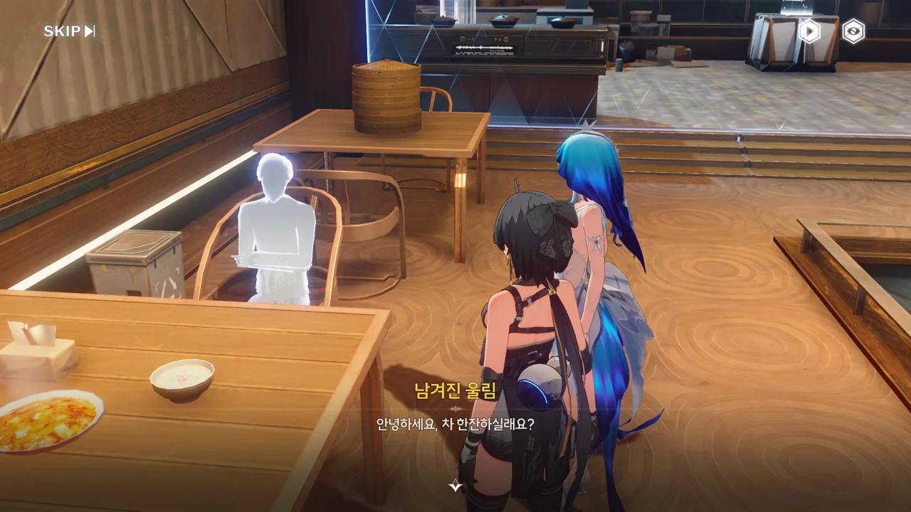
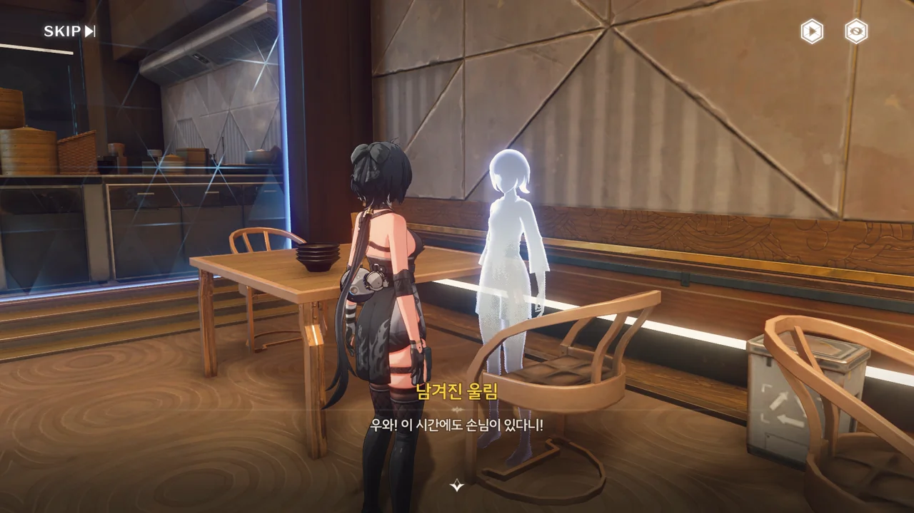
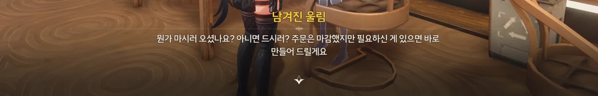
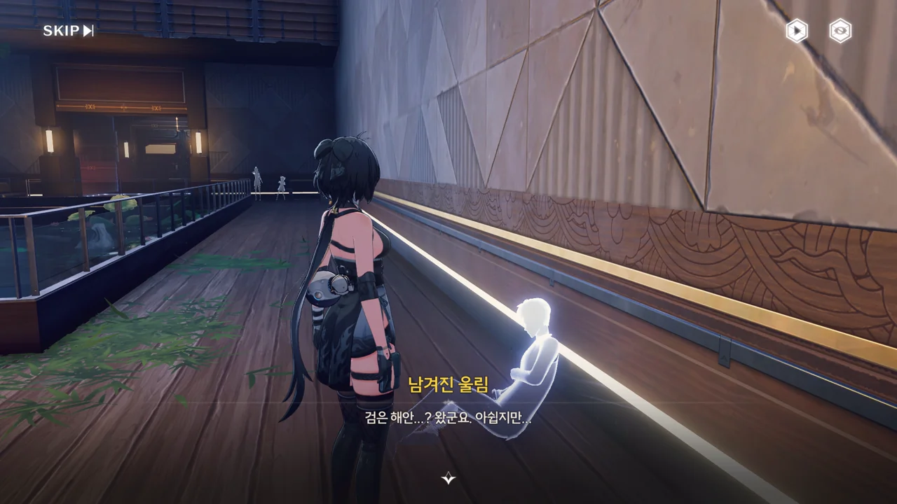
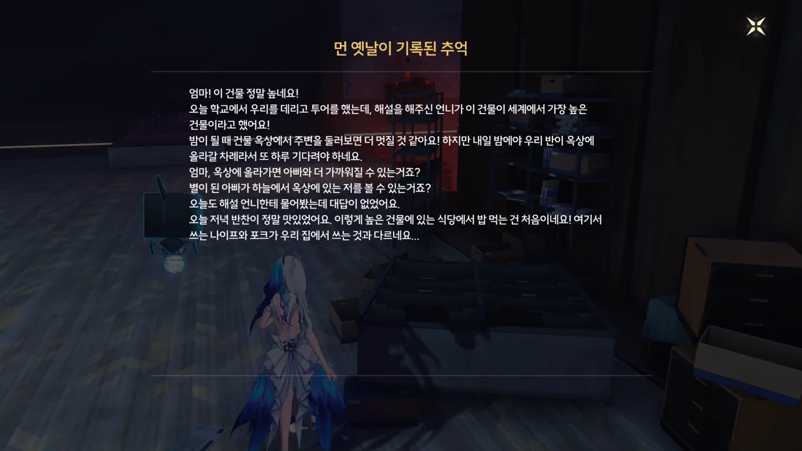
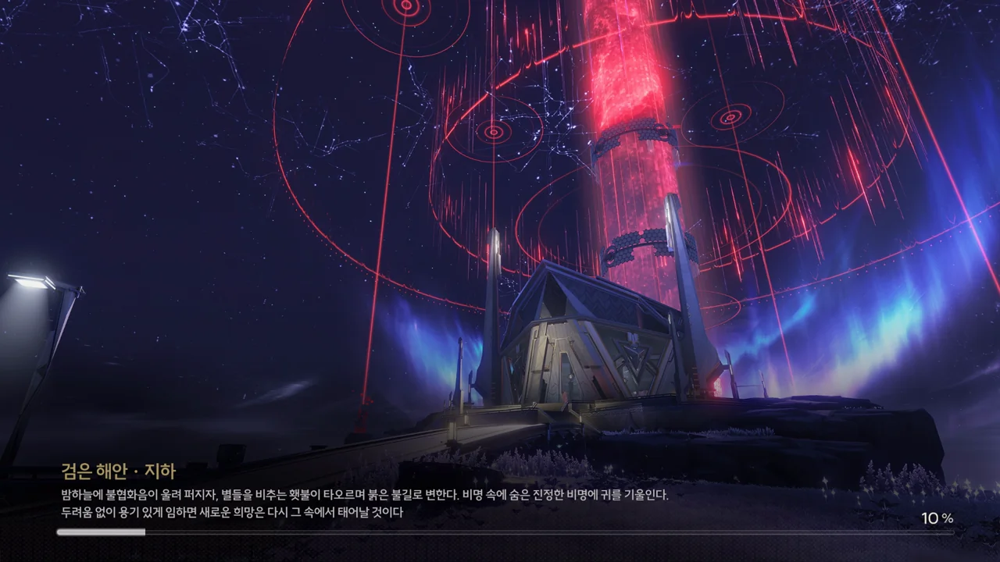
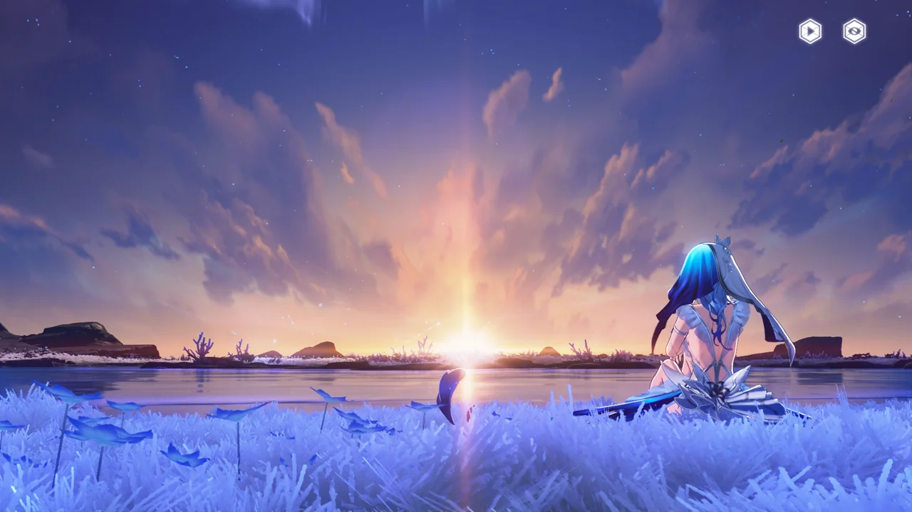
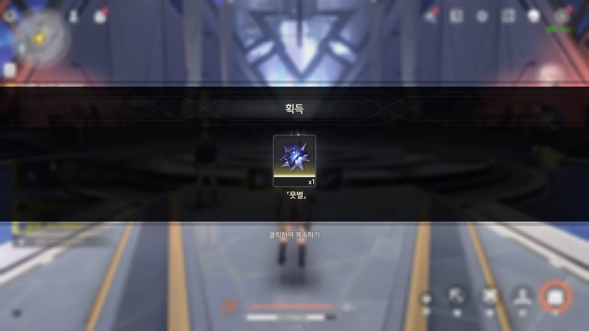
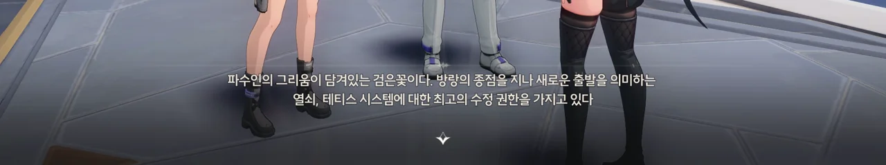
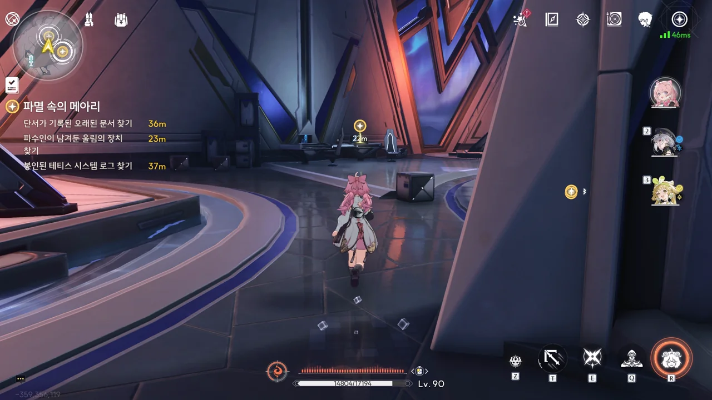









며칠 전에야 알게 된 건데, 도시 '귀허항시'의 이름은 '귀허'라고 한다. '항시'는 항구도시라는 의미일 뿐이고.
난 여태까지 '귀허항'이 도시 이름인 줄 알고 있었는데.

「비명」이 솔라리스를 덮치기 전, 인류가 바란 건 광활한 우주와 *공명*하는 것이었다. 하지만 비명이 찾아오자, 문명은 붕괴했고 인류의 기술력 역시 쇠퇴하고 말았다.
지금 인류는 우주 진출은커녕 솔라리스의 땅 위에 서서 끝없이 몰려오는 잔상을 겨우겨우 막아내고 있을 뿐이다.

&nbsp;

"우주와 *공명*하는 것"이란 말은 대체 무슨 의미일까?
내가 알기로, 비명 이전, 솔라리스의 과학 법칙은 지구의 것과 차이가 없었으나, 비명 때문에 뒤틀려 지금의 주파수 기반 과학 법칙이 되었다던데.
비명 이전의 사람들이 우주와 *공명*하길 원했다는 파수인의 말은 마치 비명 이전에도 주파수 기반 과학 법칙이 존재했음을 암시하는 것만 같아 보인다.





파수인은 귀허항시에 직접 가본 적이 없다. 그녀가 귀허항시에 대해 알고 있는 건 전부 과거의 방랑자가 직접 겪은 걸 파수인에게 알려준 것에 불과하다.

파수인의 말에 따르면, 과거의 방랑자는 귀허항시가 '문제의 핵심'이자 끝없는 루프를 끊을 *구원의 열쇠*가 숨겨진 곳이라 생각한 것 같다. 그러면 방랑자는 여태껏 수도 없이 귀허항시가 멸망하는 장면을 보아온 걸까?





지금 방랑자와 파수인이 보고 있는 건 파수인이 역산 끝에 구현한, 「비명」이 찾아와 멸망하기 한 시간 전의 귀허항시이다. 앞으로 나아갈수록, 시간 역시 가속해 멸망이 가까워진다고 한다.
그리고 방랑자가 찾아야 하는 테티스 시스템 리디렉션 데이터는 그 멸망의 순간에 숨겨져 있다.





파수인은 테티스 시스템이 아닌 자신의 질문이라며, 이렇게 끊임없이 반복되는 과거와 미래의 이야기 속에서 대체 방랑자가 무엇을 겪고 느꼈는지를 묻는다.

과거의 방랑자가, 루프 이전의 방랑자가 어떤 행보를 걸었는지에 대해 자세히는 알지 못한다.
하지만 방랑자가 과거와 미래의 기억을 포기하고 검은 해안을 나와 방랑길을 걸은 건 이번 루프가 처음인 것으로 보인다.
그렇다고 방랑자가 여태껏 검은 해안 어딘가에 숨어 다른 사람과의 접촉을 거부한 것도 아니다. 짧게는 장리의 스승이, 길게는 금주의 설립이나 피열 백신 수송처럼 분명 검은 해안 외부와의 접촉이 존재했다.

그렇다면 대체 왜 방랑자는 이전과는 다르게 자신의 기억을 포기한다는 결정을 내린 걸까? 무엇을 보았기에?



예전에 귀허항시 임무를 진행했을 때, 임무 목표였던 화염꽃의 핵인 성흔의 위치 역시 귀허항시에서 가장 높은 건물의 꼭대기였던 것으로 기억한다. 건물의 옥상은 아니고, 그냥 남은 잔해 중 가장 높은 곳이었지. 이번에 우리가 가야 할 곳과 동일한 곳이다.

아마 이건 우연의 일치가 아닐 것이다. 화염꽃 성흔 역시 비명으로 생긴 것일 테니.







포탈건, 아니 쿠 키이가 업그레이드되었다. 이 공간은 순수한 소노라로 되어 있기에, 마찬가지로 소노라로 이루어진 파수인이 텔레포트 게이트의 효과를 더 끌어올릴 수 있다는 설정이다.

포탈건으로 따지면 기존에 쓰던 파란색 싱글 포탈건에 주황색 포탈건이 추가된 느낌이네.









찻집을 발견한 파수인이 방랑자에게 차를 좋아하냐고 묻는다. 차에 대해 많이 아는 건 아니지만 차 본연의 맛을 싫어하지는 않기에 "당연하죠"를 골랐는데, 탁자 위에 놓여있던 건 쓴맛이 나는 차였다. 윽, 난 쓴맛은 좋아하지 않는데.

블루밍 존의 씨앗 은행에도 찻나무 씨앗이 있다며, 찻나무를 플라워 룸에 심어 기른 후, 찻잎을 자신의 소노라에 넣어두어 방랑자가 원할 때 언제나 꺼내쓸 수 있도록 하려는 파수인을 뜯어말린다.

저번에도 말했지만, 파수인의 사랑이 너무 무거워...! 방랑자가 파수인의 행동을 만류하자 "당신의 기쁨이 가장 중요해요"라며 납득하는 것조차 무겁게만 느껴진다.



찻집이라고 하기에 차나 커피, 케이크같이 음료와 디저트를 파는 가게라고 생각했는데, 여기는 마파두부 같은 식사도 같이 팔고 있다.
음료와 디저트만으로는 가게 월세를 내기 빠듯한가 보다.





여기 남은 울림들은 역행비로 인해 나타나는 유령과는 다르다는 듯이, 방랑자와 파수인을 제대로 인식하고 있다.

사실, 그래서 더 짠하다. 여기 이 울림들은 끊임없이 반복되는 한 시간이라는 쳇바퀴 속에서 그 반복을 눈치조차 채지 못하고 그저 살아갈 뿐이니까.



앞으로 나아가자 잔상이 나타나기 시작한다. 수백 년 전 귀허항시가 멸망할 때에도 이렇게 잔상이 나타난 걸까?











현재 시점은 귀허항시 멸망 10분 전이다.

이미 귀허항시에 비명 조기경보를 내린 방랑자 --- 당연하다는 듯이 이때에도 존재하고 있었다 --- 는 검은 해안에서 동원할 수 있는 모든 인력을 귀허항시로 보내 사람들이 황룡으로 대피할 수 있도록 도왔으나, 예상보다 더 빨리 찾아온 비명에 검은 해안 사람들을 포함한 수많은 사람들이 명을 달리하고 말았다.

오르디는 귀허항시에 파견되어 대피 작업과 인명 구조에 참여한 흑화집사였으나 다른 검은 해안 멤버, 미처 대피하지 못한 사람들과 함께 때 이른 비명에 삼켜지는 최후를 맞게 되었다.

이곳은 과거의 귀허항시를 구현한 장소인 만큼, 오르디 역시 이 앞에 존재할 것이다. 하지만 파수인은 과연 그녀와 만나도 좋을지 고민하고 있다. 현재의 귀허항시에 나타나 방랑자를 습격한 이상 데이터 속 집단의식 중 하나가 바로 오르디였으니까. 이 앞의 오르디가 만약 그 오르디라면, 또다시 방랑자를 습격할지 모르지 않은가.





... 이런 게 바로 방랑자가 "이유 없는 희생은 없어야 해요"라고 말한 이유일 것이다.

어디서 들은 건지, 정확한 내용이 무엇이었는지 전혀 기억나지 않는 글귀가 하나 떠오른다.

> 사람이 한 명 죽는 것은 비극이다. 하지만 사람이 수천 명 죽는 것은 그저 숫자에 불과할 뿐이다.

그건 아마, 그렇게 많은 사람들이 죽었다는 사실을 우리 뇌가 받아들이고 싶어 하지 않아서라고 생각해.



등장하는 퍼즐이 점차 포탈의 그것을 닮아가고 있다. 이젠 운동량을 활용한 퍼즐까지 나왔네.















다른 울림들은 희끄무리한 모습을 취하고 있는 것에 반해, 오르디는 검은 해안 흑화집사의 모습을 온전히 간직하고 있다. 주파수가 오염되었다는 뜻의 붉은 아우라를 두르고 있는 건 여전하지만.
방랑자를 자신의 멘토이자 따라야 할 사람이라 부르며, 드디어 여기로 찾아왔다고 반기는 걸 보면, 파수인의 걱정대로 일이 흘러가지는 않을 모양인가 보다. 이전에 만났던 기억도 갖고 있는 것 같고.

귀허항시를 파괴한 비명이 '중력'의 특성을 가진 것 때문일까, 오르디는 무한히 반복되는 멸망의 별 속 루프를 기억하고 있었다. 자신 역시 계속되는 비명으로 인해 고통받고 있음에도 불구하고, 흑화집사로서의 사명을 잊지 않고 마찬가지로 고통받는 다른 울림들을 보살피고 있었다.
그리고 오르디가 멸망의 별 내부에서 주파수를 제어한 덕분에 멸망의 별이 여태껏 폭주하지 않고 작동할 수 있었다.

&nbsp;

현시점에서 비명을 인위적으로 만들어낼 방법은 없다. 그 대표적인 예시가 바로 울음새 늪의 직정 유적지에서 이루어진 인공 역행비 실험이다. 비명도 아니고 비명의 부차적 이상현상, 역행비조차 제대로 만들어내지 못하는 게 현재 인류의 기술력이다.

비명을 인공적으로 만들 수 없었기에, 테티스 시스템은 비명을 이해하고자 이미 발생한 비명을 가져다 쓰기로 결정했다. 그래서 귀허항시를 파괴한 비명을 멸망의 별 형태로 가공해 가져온 후, 그 안에서 귀허항시의 멸망을 통제 가능한 범위 내에서 재현하기를 반복해 필요한 비명 데이터를 뽑아내었고, 그 데이터를 기반으로 다른 비명을 분석하거나 예측했다.

의도는 좋았으나, 테티스 시스템의 결정에는 그 끊임없는 멸망 속에서 고통받을 사람들의 감정이 전혀 고려되어 있지 않았다.















오르디가 끝없는 고통을 겪으며 멸망의 별 내부에서 멸망의 별을 제어한 끝에 알아낸 것이 몇 가지 있다.

* 비명은 완전히 예측 불가능한 것도, 제어가 불가능한 것도 아니다.
* 테티스 시스템은 비명 예측에, 비명과 마찬가지로 주파수로 이루어진, 사람들의 감정 역시 사용하고 있다.

오르디의 말이 정답이었던 건지, 오르디가 말을 다 끝마치기도 전에 테티스 시스템이 멸망의 별과 함께 오르디를 비롯한 사람들의 울림을 초기화하려 한다. 마치 찔리기라도 한 것처럼 말이야.
결국 오르디는 "중력은 구시대의 마지막 진리"라는 말과 함께, 자신들을 해방시켜 달라는 부탁을 남기고 사라졌다.

&nbsp;

테티스 시스템이 뭔가 숨기고 있다는 건 진작에 알고 있었다. 그래도 그걸 끝까지 숨기겠다고 이렇게 할 줄은 몰랐다. 그야, 테티스 시스템은 인류를 위한 거니까.

지금 테티스 시스템이 비명을 예측하기 위해서 필요한 건 비명 그 자체뿐만이 아니다. 거기에 희생된 사람들의 주파수 또한 비명을 예측하는데 필요한 '재료'이다.

이건 방랑자가 말한, "이유 없는 희생"이다. 이 사람들이 대체 무슨 죄가 있어 이 영원한 고통을 받아야만 한단 말인가? 이들은 비명에 죽는 것도, 영원한 비명에 고통받는 것에도 동의한 적 없다.

&nbsp;

어쩌면 '비명을 이용한 비명 예측'에는 사람의 주파수가 필수불가결한 존재일지도 모른다.

쿠로 게임즈의 전작, '퍼니싱: 그레이 레이븐'에 나온 설정에 따르면, 지구의 '퍼니싱 바이러스', 솔라리스의 '비명'은 모두 '문명에게 부여된 시련'이라고 한다.
문명을 이루는 건 사람이다. 즉, 문명을 노린다는 건 사람을 노린다는 말과 동일하다. 그렇다면 '문명에게 부여된 시련'의 발생이 사람을 필요로 한다는 말 역시 성립하는 것 아닐까?

만약 그렇다면, 이전에 인공 비명, 인공 역행비를 만드는 데 실패한 이유가 바로 여기에 있을지도 모른다. 사람을 갈아 넣지 않았기 때문에. 비명은 사람을 노리고 나타나기 때문에.
비명을 이용한 비명 예측 역시 사람을 갈아 넣지 않으면 이루어질 수 없는 것 아닐까?

이 건물이 세계에서 가장 높은 건물이라는 정보를 보자마자 바벨탑이 생각난 건 우연이 아닐 것이다.



응, 또 운동량 퍼즐이야.





> Once you're at this point, move them slowly from side to side and eventually the **momentum** will end up with...

'Yeltsa Kcir'는 'Rick Astley'를 거꾸로 쓴 것이고, 1987년은 Never Gonna Give You Up이 발표된 해이다. 이걸 알게 되고 난 후, 영상이 두 배는 더 재미있어진 것 같더라고.









5분 안에 건물의 높은 곳, 비명이 위치한 곳까지 올라가야 한다.
중간에 잔상들이 나오는데, 이 잔상들을 잡지 않으면 다음 층으로 올라가는 로프 포인트가 나타나지 않는다.

> 그것은 인간을 변이 시키고 잔상으로 만들었어요...
> 영원히 대지 위에 갇히게 하죠...
> 도망가세요...

'그것'은 과연 무엇일까? 평범한 상황에서라면 「비명」이 정답이겠지만, 지금 이 상황에서는 '테티스 시스템' 역시 정답으로 볼 수 있다고 생각한다.
사람의 입을 빌어 나왔어야 할 대사가 임무 목표로 나타난 이유가 과연 무엇 때문일까? 테티스 시스템이 오르디를 비롯한 사람들의 울림을 초기화시킨 것 때문 아닌가.



저게 귀허항시를 멸망으로 이끈 비명의 모습인가 보다. 블랙홀이라고도 불린다는 말처럼, 귀허항시의 모든 것을 빨아들이고 있다.





주변에 있던 모든 잔상들을 제거했다.













> 「프로그램 복사」 완료.
> 「핵심 주입」 대기 중...
> 「목표: 최고 관리자」

갑자기 테티스 시스템 이 썅년이 방랑자를 빨아들이기 시작한다.

심연을 오랫동안 들여다보고 있으면 심연 역시 네 속을 들여다볼 것이라고 하던데, 아무래도 테티스 시스템 역시 비명을 너무 오랫동안 쓴 탓에 비명이 되어버린 모양이다.
그렇지 않고서야 테티스 시스템이 *주입*하려는 최고 관리자, 방랑자가 눈앞의 비명으로 빨려 들어갈 리 없지 않은가!

파수인이 방랑자를 붙잡아보지만, 테티스 시스템이 "「집행」 개시. 최고 권한 정책."이란 말과 함께 방랑자를 강제로 비명 속으로 끌어당겨 삼켜버린다.











이대로 끝나버리는 건가 싶었는데, 파수인이 경계를 깨고 들어와 방랑자 대신 블랙홀에 빨려 들어가 버렸다.

대체 테티스 시스템의 「예비 방안」이 뭐지? 설마 방랑자를 빨아들이지 못했다면 대신 파수인을 빨아들일 생각이었던 거야?

> **검은 해안 · 지하**
> ***
> 밤하늘에 불협화음이 울려 퍼지자, 별들을 비추는 횃불이 타오르며 붉은 불길로 변한다. 비명 속에 숨은 진정한 비명에 귀를 기울인다. 두려움 없이 용기 있게 임하면 새로운 희망은 다시 그 속에서 태어날 것이다.
{.bq}

이거, 분명 지금 상황을 의미하는 것 같은데... 무슨 의미인지 잘 모르겠다.



테티스 시스템 제일 깊은 곳에 위치한, 방랑자와 파수인 단 둘만을 위한 해안에서 파수인과 만났다.

대체 이게 어떻게 된 일이지? 분명 파수인이 아까 블랙홀 속으로 빨려 들어가는 걸 봤는데.





먼 옛날, 방랑자는 스텔라 매트릭스에 새겨진 데이터를 「뭇별」이라 정의했고, 그 별하늘에는 비명뿐만 아니라 인류 역시 반짝여야 한다고 말했다고 한다.
방랑자의 옛 호칭 중 하나가 분명 '뭇별의 조율자'였지...? 검은 해안의 테티스 시스템 조율 장치는 피아노였고.

> 그 별만 보면, 비명으로 가득 찼던 제 마음도... 더없이 평온하고 따뜻해졌죠.

파수인의 마음은 「비명」뿐만 아니라 '비명'으로도 가득 찼을 것이다. 그야, 「비명」 속에는 그 안에 갇힌 사람들이 지르는 비명이 가득 담겨있었을 테니까.
이번 조수 임무에서는 「비명」과 '비명'을 이용한 말장난이 제법 자주 등장하는 것 같단 말이지...







검은 해안을 지키고, 테티스 시스템의 지시를 충실히 이행하는 것이 자신의 책임이라 생각하던 파수인에게 방랑자는 검은 해안 바깥세상의 이야기, 자기 자신의 이야기, 과거와 현재, 미래의 이야기를 들려주었다.

방랑자와 함께한 끝에, 파수인은 그때 자신이 느꼈던 감정이 행복이라는 것과, 자신의 책임은 검은 해안을 보호하는 것뿐만이 아니라는 걸 깨닫게 되었다.

> 아직도 기억나요. 우리가 리나시타를 지나면서 본, 데이지와 제비꽃이 아름다웠던 작은 꽃의 바다가...

응? 파수인은 줄곧 검은 해안 지하에만 있었다고 하지 않았어? 저 말은 방랑자가 파수인을 데리고 리나시타에 갔다는 말로 들리는데.
설마 리나시타에 파수인의 허영과 함께 간 건가?













자신은 영원히 사라지지 않는 소노라로 이루어져 있기에, 잠시 이별할 뿐이라고 말하는 파수인.

사람의 주파수가 섞인 비명을 연산의 핵심으로 쓰지 않으려면 감정을 느낄 수 있는 누군가가 대신 그 자리를 채워야 하지만, 그 짐을 방랑자나 귀허항시의 희생자에게 지울 수 없기에 자신이 그 짐을 짊어지기로 했다고 말한다.
그러니까 맨 처음부터 이럴 생각이었다는 거네.

> 이런 감정을... 사랑이라고... 하는 걸까요?

깨닫는 게 너무 늦잖아!





파수인을 빨아들인 테티스 시스템이 흩어져있던 오염 데이터를 정화하고 원래 상태로 돌아왔다.



> **「뭇별」**
> ***
> 검은 해안의 진정한 최고 권한이 깃든 검은 꽃. 검은 해안 리더의 상징이다.
> ***
> 그녀가 뭇별을 둘러보자, 시공은 이미 사라져 있고, 오직 이 별 하나만이 그녀의 손끝을 맴돈다.
> 그리고 해안으로 돌아가는 길을 밝게 비추기 위해, 뭇별은 영원한 밤하늘을 비추려고 꽃으로 피어났다.
> 조용히 귀를 기울여보면, 그녀의 울림... 조금씩 들릴지도 모른다.
{.bq}

파수인이 남기고 간 검은 꽃을 통해 테티스 시스템 최고 관리자 권한을 *다시* 얻을 수 있었다.

... 이런 식으로 최고 관리자 권한을 돌려받는 건 원하지 않았는데.















이대로 테티스 시스템에게 파수인을 넘겨줄 수는 없다.

방랑자 대신 블랙홀에 먹힌 파수인이 사실 사건의 지평선에서 무한히 떨어지고 있는 중이라면 외부에서의 간섭을 통해 다시 꺼내올 수 있을 거라고 말하는 방랑자.

실제 블랙홀이라면 절대 불가능할 일이지만, 지금 테티스 시스템에 있는 건 진짜 블랙홀이 아니라, 단순히 중력 속성을 지닌 비명이기에 가능한 일이다.







파수인뿐만 아니라, 귀허항시의 비명에 희생된 사람들의 주파수 역시 포착하는 데 성공했다고 한다. 즉, 이번 일이 잘 마무리되면 파수인은 물론이고 그때 희생된 사람들의 *넋* 역시 구할 수 있는 것이다.

다만 이 일을 계속한다는 건 여태까지 지속되어 온 검은 해안의 근간, 테티스 시스템을 뒤흔든다는 것과 같다. 그런데... 사람을 갈아 넣어야 가능한 비명의 예측, 그것도 적중 확률이 100%가 아닌 예측은 굳이 유지할 필요가 없지 않아?

게다가 테티스 시스템을 꾀어내려면 테티스 시스템에서 높은 권한을 가진 사람이 필요하다. 적어도 파수인 혹은 그 이상의 권한이. 그런데 그게 바로 여기에 있네.



'파수인이 남겨둔 울림의 장치'로 보인다. 여기서 말한 '울림의 장치'는 테티스 시스템 제어 장치, 피아노를 의미하는 것 같다.



이게 '봉인된 테티스 시스템 로그'인가?
테티스 시스템에 왜 다른 강력한 CPU를 강제 융합해 동시에 연산을 처리할 수 있는 장치가 있는지 궁금해하고 있다. 테티스 시스템이 파수인을 끌어당긴 건 파수인을 융합할 '다른 강력한 CPU'로 쓰려 해서일지도 모르겠다.



'단서가 기록된 오래된 문서'에는 K626호 결의안이라는 제목이 붙어있고, 제3의 계획을 실행할 시 기존의 시공간 사건 기록이 모두 쓸모없게 될 것임을 우려하고 있다.

여기서 말하는 '제3의 계획'이 바로 방랑자가 원하는, '사람'을 갈아 넣지 않는 방식의 비명 예측인 것으로 추정된다. 하지만 테티스 시스템이 이를 거부한 건 그 방식으로 전환할 시 기존의 수많은 루프에서 관측한 기록이 모두 무용지물이 될 거라는 두려움 때문이었다.

> 아니, 그녀에게는 감정 따위가 필요 없다. 그런 건 우리에겐 불필요한 것이다.
> 살아남기만 하면 된다. 우리가 절대적인 이질 사건이 되면 아무것도 돌볼 겨를이 없게 될 것이다.

감정을 쓸모없는 것으로 평가하고 오직 살아남는 데에만 전념하는 것에서부터 길을 잘못 든 게 틀림없다.











방랑자가 검은 해안 연구원들을 설득하기 시작한다.

> 사람은 차가운 도구가 돼서도, 역사를 잊어서도 안된다.
> 검은 해안은 허무맹랑한 문명을 위해서가 아니라, 그 안에서 살아 숨 쉬는 사람들을 위해 활동하고 있는 것이다.
> 검은 해안 사람들을 부품 취급하고, 엄연히 감정을 가진 파수인을 도구 취급하여 소모하려 하는 지금의 테티스 시스템은 분명 잘못되었다.
> 문명에게 있어 기계보다 중요한 것은 사람이다. 기계 없는 문명은 존재해도 사람 없는 문명은 아무 의미가 없기 때문이다.
> 그러니 지금 테티스 시스템의 잘못을 수정하자.

검은 해안의 리더로 돌아온 방랑자의 이름이 '**뭇별의 조율자**'로 표시되는 것이 인상 깊다.













모든 검은 해안 사람들의 응원을 받으며 방랑자가 테티스 시스템으로 향하는 문을 연다.





지금 상황은 테티스 시스템에 강제로 구멍을 내어 진입하는 것이라, 방랑자가 테티스 시스템의 어디로 떨어질지는 모르는 상황이다.

좋아, 이제 말 더럽게 안 듣는 기계를 흠씬 두들겨 패서 교정할 시간이다.
