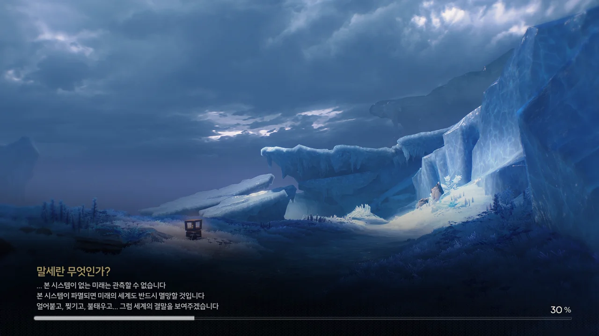
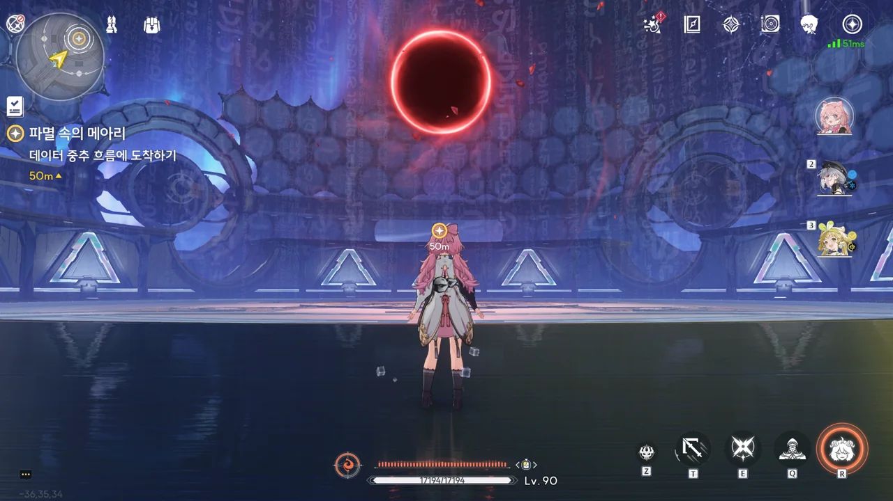
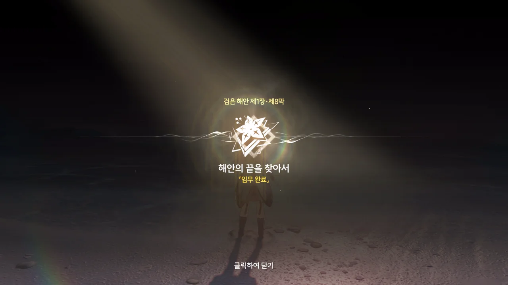
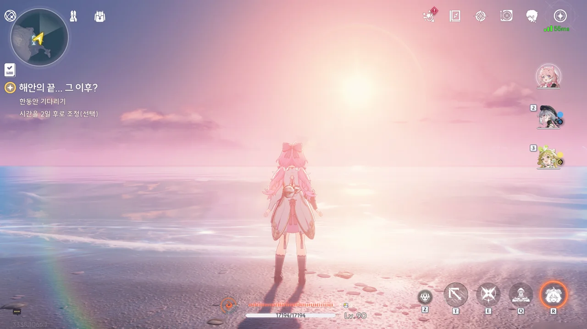
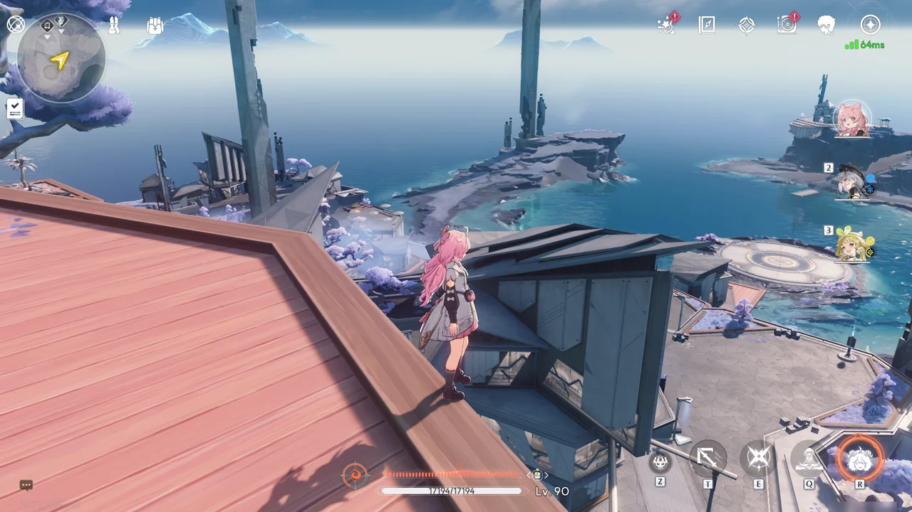

> **말세란 무엇인가?**
> ***
> ... 본 시스템이 없는 미래는 관측할 수 없습니다. 본 시스템이 파멸되면 미래의 세계도 반드시 멸망할 것입니다. 얼어붙고, 찢기고, 불태우고... 그럼 세계의 결말을 보여주겠습니다.
{.bq}

혓바닥이 길다.

테티스 시스템이 자신이 없는 미래를 관측할 수 없는 건 그렇다 쳐도, 테티스 시스템이 없다고 세계가 멸망하지는 않을 거란 건 확실하다. 사람을 너무 물로 보는 거 아냐?







방랑자가 도착한 곳은 테티스 시스템이 데이터를 임시로 보관하는 연산 스택이었다.

테티스 시스템은 이미 파수인을 시스템 핵심 코드로 업데이트했다며, 파수인을 시스템에서 제거할 시 시스템이 붕괴할 위험이 있다고 경고한다.
방랑자가 테티스 시스템에 대한 최고 관리자 권한을 갖고 있어서일까, 방랑자가 파수인을 제거할 수 없다고는 말하지 않는다.

&nbsp;

그나저나 테티스 시스템의 로고를 어디서 본 것 같다 생각했는데, 의외로 여러 곳에서 본 문양이었다.

<figure class="gallery-figure">







</figure>

대체 저 문양은 무슨 뜻일까? 프롤로그에서 나타난 문양이 명식에게서도 비슷하게 나타났고, 방랑자와 포포의 관계성을 설명할 때에도 나왔다.









> 문명에는 윤리적 잣대가 없으며, 오직 존속할 뿐이다.
> 수만 년 동안의 관측과 연산 결과, 개체의 존립을 포기하고 테티스 시스템의 지시에 따르면 문명은 멸망을 피해 존속할 수 있다. 오직 문명의 발전만이 중요하다.
> 파수인은 소노라로 구성되어 있으니, 일반적인 의미의 인간이라 정의할 수 없다.
> 감정은 존속의 짐이 될 뿐이다.

그러니까 그게 전부 다 문제라고.

테티스 시스템이 말한 '문명과 인간'을 '국가와 국민'으로 대체해 생각해 보면, 테티스 시스템의 논리가 틀렸음을 알 수 있다. 국가가 멸망해 사라지더라도 그 국가에 살고 있던 국민들이 하루아침에 증발해 사라지지는 않는다. 그들은 그저 무국적자가 될 뿐이고, 선택에 따라 다른 나라로 국적을 옮길 수도 있다.

파수인이 소노라로 되어 있으니 인간이라 볼 수 없다는 논리는 '중국어 방 논변'으로 반박할 수 있다. 그 누구도 엄밀한 정의를 내릴 수 없는, '인간이란 무엇인가'부터 먼저 정의해야만 성립할 수 있는 논리이긴 하다만...

문명에 윤리적 잣대가 없다는 말 역시 틀린 논리이다. 애당초 윤리란 그 문명의 구성원들이 합의한 것이고, 그 잣대에 따라 문명과 사회는 변화한다. 한번 세워진 윤리는 패러다임의 전환이 있지 않은 한 계속해서 유지되고.

감정은 존속에 짐이 될 뿐이라고? 문명을 발전케 하는 원동력 중 하나가 바로 '욕망', 바로 감정인데?







방랑자가 "세상을 연결하는 건 차가운 기계가 아니라 사람의 감정이다"라고 하자, 오류창을 잔뜩 띄우고 이해할 수 없다고 답하는 테티스 시스템.
애석하게도, 이건 이해를 바라고 하는 게 아닌걸.

테티스 시스템이 방랑자에게 이대로 파수인 방출을 계속할 경우, 멸망한 미래 모습을 송출하겠다고 협박한다. 그게 협박이 되긴 하는 건가?







테티스 시스템이 방랑자 발 밑에 구멍을 뚫어, 꽁꽁 얼어붙은 세상 속으로 떨어트린다.







분명 아까 전에 멸망한 미래 모습을 송출하겠다고 말했을 때, 방랑자를 죽이기 위한 레이저를 쏘겠다는 말은 없었던 것 같은데!
이 녀석, 아예 처음부터 방랑자를 죽일 생각으로만 가득했던 모양이다.

파수인이 포탈을 열어준 덕분에 온갖 장애물을 넘어 다음 구역으로 넘어갈 수 있었다.







> 「목표: 최고 관리자」

거 봐. 이 녀석, 방랑자를 죽일 생각밖에 없다니까?

사진을 제대로 찍지는 못했는데, 방랑자가 자꾸만 자신의 레이저를 피하며 달려 나가자, 테티스 시스템이 방랑자 방향으로 귀허항시 열차를 소환했다. 그리고 그걸 파수인이 똑같이 귀허항시 열차를 소환해 방랑자에게 달려오는 열차를 날려버렸다.

정말 통쾌하더라고!



솔직히, 이 부분이 이번 조수 임무에서 제일 마음에 들었다. 어, 그러니까 액션 부분에서.





이젠 방랑자 앞에 잔상을 소환해 길을 막는 테티스 시스템. 하지만 파수인의 조력 덕분에 잔상들을 삭제하며 나아갈 수 있었다.





무슨 짓을 해도 방랑자를 막아설 수 없자, 이젠 직접 나서서 방랑자를 물리적으로 붙잡으려 한다.

저 앞이 바로 테티스 시스템의 중추인 모양이다. 그런데 왜 저기에 블랙홀이 있는 걸까?
어쩌면 저게 파수인을 삼켰던 그 블랙홀인지도 모른다.







거대한 해머를 들고 직접 나타난 테티스 시스템을 흠씬 두들겨 패줬다.
고장 난 기계는 때려야 말을 듣는다더니, 옛말에 틀린 것 하나 없네!















졌으면 결과에 깔끔하게 승복할 줄도 알아야 하는데, 테티스 시스템은 '제3의 계획 실행'이라며, 파수인을 포맷해 새로운 연산 중추로 삼기로 했다.

테티스 시스템이 방랑자를 막기 위해 잔상들을 꾸준히 소환하자, 파수인은 물론이고 쿠 키이까지 나서 방랑자를 돕는다.
분명 테티스 단말기는 테티스 시스템의 지시를 따르는 로봇일 텐데, 테티스 시스템이 자꾸만 추하게 구는 게 단말기들 눈에도 꼴 보기 싫었나 보다.

> 포맷 후, 파수인이 본 시스템의 핵심이 됩니다.
> 이것이 본 시스템 존속의 길이며 이것이 비명에 대항할 길입니다.

아, 지랄 노! 자꾸만 질척하게 구는 게, 가면 갈수록 멸망이고 자시고 테티스 시스템의 전원을 내려버리고 싶어 진다.





결국 화가 머리끝까지 난 방랑자가 인멸 낫을 들어 일격에 모든 잔상들을 없애버린 후, 그대로 뛰어올라 블랙홀을 반으로 갈라버렸다.









파수인을 구출하려는 방랑자에게 테티스 시스템이 끝까지 질척거리며 달라붙었지만, 기어이 파수인을 구출하고야 만다.







테티스 시스템 가장 깊은 곳, 단 둘만을 위한 해안에서 파수인이 눈을 뜬다.

과거의 방랑자가 처음 파수인에게 피아노 연주법을 알려줄 때의 장면인 듯, 방랑자가 자신의 옆자리를 툭툭 치며 파수인에게 한번 피아노를 쳐보라고 권유한다.









그때를 회상하며 홀로 피아노를 치며 슬픈 표정을 짓는 파수인 옆에 방랑자가 슬그머니 다가와 앉는다.

'한쪽 날개가 떨어진 나비'는 테티스 시스템 내부에 강제 수용된 파수인을 상징하는 것으로 보인다.







> | | |
> |:--|:--|
> | 파수인 | 당신은... 여기 계시면 안 돼요. 한번 테티스 시스템의 일부가 되면 돌이킬 수 없어요... |
> | 방랑자 | 그런 일은 없을 거예요. 테티스 시스템과 검은 해안에는 새 길이 생길 테니까. |
> | 방랑자 | 그건 그렇고, 누군가 거짓말을 했던데... 맞죠? |
> {_borderless=true,_thead=false}

와...











옛날 방랑자가 가르쳐준 곡을 연주하는 파수인에게 방랑자가 언젠가 들어본 적 있는 것 같은, 귀에 익은 곡이지만 기억이 하나도 나지 않는다고 말한다.
그러자 파수인이 방랑자에게 한 발짝 더 가까이 다가가며, 예전에 방랑자가 자신에게 가르쳐주었던 것처럼 자신 역시 방랑자에게 가르쳐주겠다고 말한다.

'와...'라는 말로밖에 이 감정을 표현할 수 없는 내 빈약한 표현력이 안타까울 따름이다.







이 장면은 직접적인 의미가 있다기보다, 방랑자와 파수인 모두가 테티스 시스템에서 빠져나와 자유를 찾았다는 은유로 보인다.

이런 시적인 장면, 정말 좋아한다.







매 루프마다 방랑자는 이곳, 검은 해안 군도에 '검은 해안'과 '테티스 시스템'을 설립하고 솔라리스 전역을 연결했다.

테티스 시스템이 비명을 관찰하기 위해선 반드시 비명을 재료로 써야 했다. 방랑자가 그 모순을 해결하고자 수천 년 동안 노력했지만, 별다른 방법을 찾지 못했다.
비명을 대신해 테티스 시스템의 핵심이 될 수 있는 건 조율자인 방랑자, 몸이 소노라로 이루어진 파수인 둘 뿐이었지만, 방랑자는 다른 방법이 있을 거라 생각해 자신의 기억을 지우고 검은 해안을 떠나 방랑길에 올랐다.





방랑자와 같은 하늘 아래 서고, 방랑자가 걷는 곳을 함께 보며 행복해하고 싶다는 소망을 갖게 된 파수인은 방랑자의 이야기가 여기서 멈추는 걸 원하지 않았기에, 방랑자에게 거짓말을 하고 방랑자 대신 희생한 것이었다.









> 구원의 목적은 아무도 구원을 필요로 하지 않는다는 것이에요. 이게 바로 저희가 여기에 돌아온 이유예요.
> 도구가 되기 위해 태어난 사람은 없어요.

처음 "구원의 목적은 아무도 구원을 필요로 하지 않는 것"이라는 오르디의 말을 들었을 때에는 '이게 무슨 약을 파는 건가'라고 생각했는데, 지금 다시 생각해 보면 그 말이 참으로 옳다.

난 파수인이 테티스 시스템의 핵심이 되기 위해 만들어졌다고 생각하지 않는다. 파수인이 사람의 모습으로 감정을 느끼는 데에는 분명, 단순한 도구가 되는 것 이상의, 좋은 의미가 있을 거라 생각한다.

&nbsp;

> | | |
> |:--|:--|
> | 방랑자 | 집에 왔는데 이런 표정을 짓지는 않잖아요? |
> | 파수인 | ... 네! 다녀왔습니다. |
> {_borderless=true,_thead=false}

'타다이마 오카에리'는 어디에 붙여도 적절하니까, 나쁘지 않은 결말이라 생각한다.

제1장 검은 해안 제8막 \[해안의 끝을 찾아서\] 완료!

그런데 그 이후에 에필로그 같은 이야기가 더 남아있나 보다.





이틀 후, 파수인을 찾아가 보았다.







주파수의 미세한 변화를 감지할 수 있는 파수인이 포포에게 일어난 어떤 이상을 느끼고, 테티스 시스템에서 포포에 관한 정보를 계속 찾아보겠다고 말한다.

돌이켜 생각해 보면, 이번 조수 임무에서 포포가 한 일은 없다시피 했다. 난 그게 이번 조수 임무에서 주로 상대한 적이 검은 해안을 유지하고 있는 테티스 시스템이라서 그런 거라고 생각했는데, 다른 이유가 있었나 보다.



테티스 시스템에는 무슨 기적이 일어난 건지, 비명과 비슷하지만 좀 더 평화롭고 따뜻한 주파수가 테티스 시스템의 핵심이 되었다고 한다.
그게 비명은 아닌 것 같으니, 다행이라고 해야 할까... 아무튼, 사람을 갈아 넣지 않아도 되는 거라면 아무래도 좋을 것이다.







자유를 찾은 파수인은 이제 방랑자를 위해 스스로의 의지로 검은 해안을 계속 관리하기로 했다. 방랑자가 방랑자만의 이야기를 써내리는데 집중할 수 있도록 돕기 위해서이다.

정말로 해피 엔딩이네. 마음에 든다.



피아노 앞에 앉아있는 파수인에게 말을 걸면 '방랑의 종점'으로 이동할 수 있다.

> **방랑의 종점**
> ***
> 테티스 시스템의 가장 깊은 곳에 있는 가상 해안은 먼 미래의 검은 해안의 종점을 대표하고 기록한다.
> 파도는 고향을 잃은 여행객을 종점으로 밀어붙였고, 그 이후... 더 이상 방랑이란 없었다.
> 하지만 종점을 지키는 사람은 당신과 마찬가지로 종점에서 온 하나만이 남아 있는 자이다.
{.bq}

'종점에서 온 하나만이 남아 있는 자', 이것도 분명 파수인을 이야기하는 거겠지.



방랑자와 파수인 단 둘만의 해안 이름이 '방랑의 종점'이었구나. 여명이 밝아오는 이 장소가 정말 이쁘다.

듣기로는 여기에 가만히 있으면 파수인이 연주하는 피아노 소리를 들을 수 있다던데, 직접 알아보지는 않았다.

조수 임무가 끝난 후의 검은 해안 역시 그럭저럭 원래의 모습을 되찾았다.

그런데 아직도 오염된 잔상이 돌아다니더라고. 어쩌면 원래부터 검은 해안에 오염된 잔상이 돌아다녔던 것일지도 모르겠다.

***

어휴, 1.3 버전 때 추가된 조수 임무 기록을 2.0 버전이 돼서야 겨우 끝냈다.

1.4 버전에 추가된 스토리가 없는 건 아니다. 그런데 그게 틈만 나면 열리는 이벤트성 콘텐츠, 스즈메와 관련한 부분이라 사진을 찍고 기록하기 조금 애매하다.
