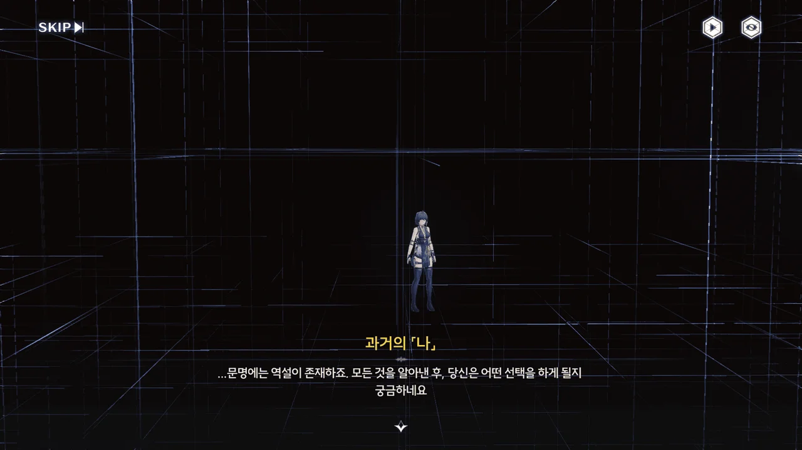
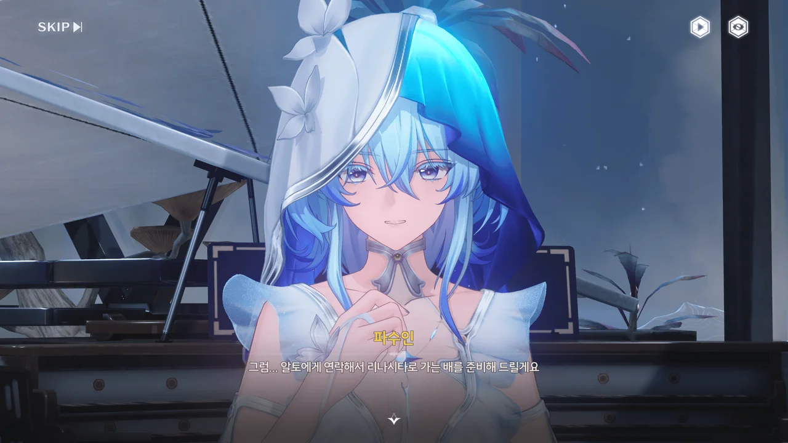
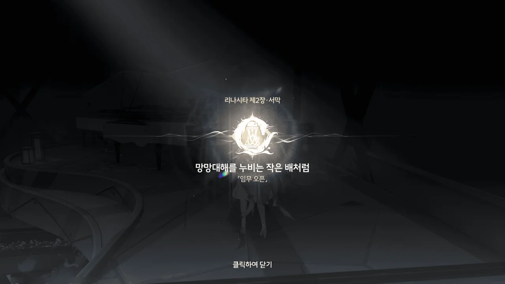
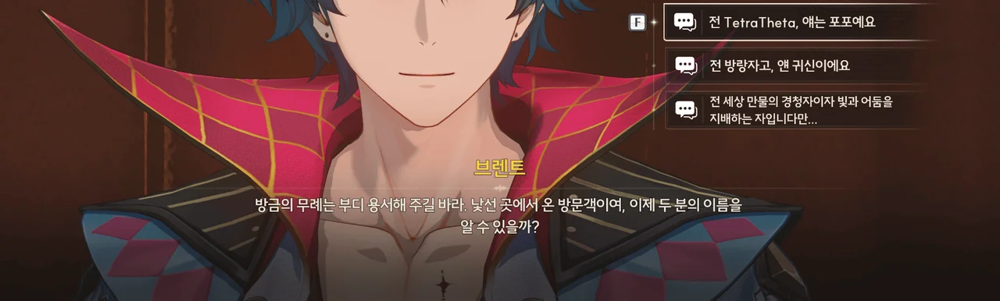
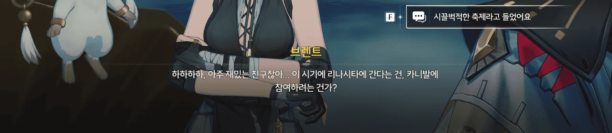
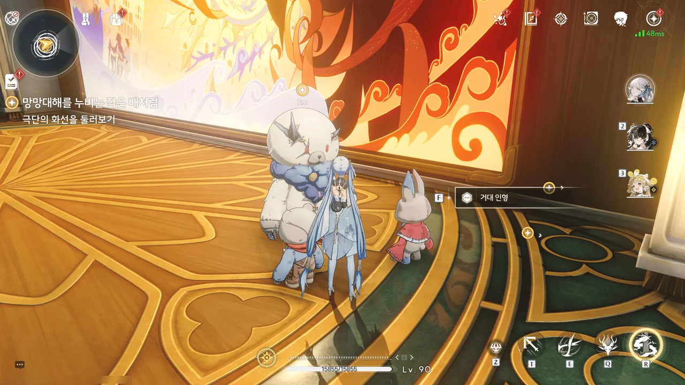
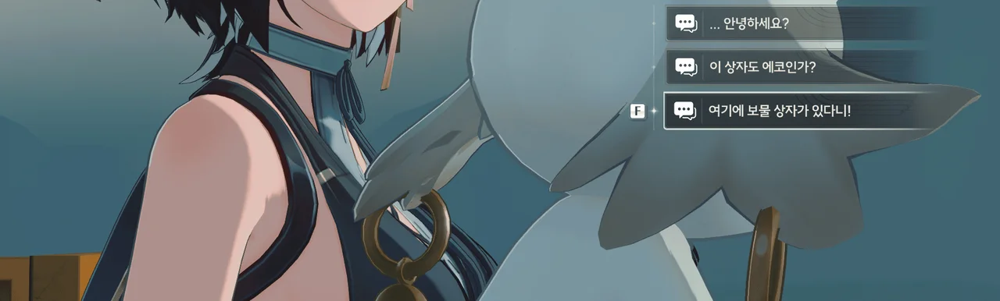
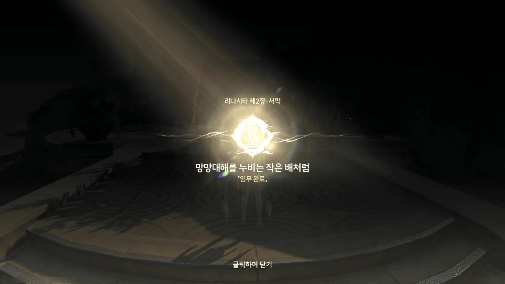

많은 고민을 했다.
예전처럼 사진을 찍고 글을 쓰며 조수 임무를 감상할 것인지, 사진을 찍지 않고 나 혼자 여유롭게 조수 임무를 감상할 것인가.

둘 다 나름의 장단점이 있다.
여태 했던 것처럼 사진을 계속 찍는다면 예전에 했던 임무 내용을 되돌아보기는 편하겠지만, 조수 임무를 진행할 때마다 쌓여가는 수천 장의 사진에 짓눌리게 될지도 모른다.
더 이상 사진 찍기를 포기하고 그때그때 조수 임무를 감상한다면 게임이 몹시 편하겠지만, \[명조\] 카테고리 아래 있는 대다수의 하위 카테고리가 그 존재 의미를 잃게 될 것이다.

그렇게 한참을 고민하다, 올해 1월 초에 찍고 여태껏 방치해 둔 사진부터 일단 처리해 보기로 결심했다.
사진을 찍은 이후로 버전이 몇 번 바뀌었는데, 그동안 번역이 눈에 띄게 나아졌을 것 같다는 생각은 들지 않는다.





파수인은 언제 봐도 참 이쁘다.





요즘이라고 할 것도 없지 않나? 적어도 내 기억 속의 포포는 나올 때마다 '배가 고프다' 아니면 '졸리다'라고 말한 것 같은데.

파수인이 방랑자 몸에서 감지한 이상 주파수 때문인지, 포포의 주파수가 갈수록 약해지고 있다고 한다.
파수인의 말을 들어 보면, 포포는 자신의 주파수가 약해지는 것보다 그로 인해 방랑자에게 무슨 해가 갈까를 더 걱정했던 모양이다. 대견한 녀석, 그런 생각을 하고 있었구나.





파수인이 테티스 아래층 공간 속에서 포포의 주파수 약화에 관련된 기록을 하나 찾아냈다고 한다.









기록 속에 있던 건 과거, 기억을 지우기 전의 방랑자가 남긴 메시지였다.

검은 해안에 있는 모든 데이터에 접근할 수 있는 권한이 있음에도 방랑자의 과거에 대해 제대로 된 정보를 찾아볼 수 없었던 이유는 바로 방랑자가 기억을 지우기 전, 자신과 관련한 모든 자료를 직접 지웠기 때문이다.

아무래도 과거에 대한 기록이 기억을 잃고 새로운 관점에서 세상을 바라보는 방랑자에게 방해가 될 것이라 생각했던 모양이다.



손등의 빛나는 성흔을 보며 '그'를 언급하는 걸 보면, 과거의 방랑자가 말하는 '그'는 포포를 말하는 것으로 보인다.

예전에 임페라토르와 한 약속이 있으니, 임페라토르를 찾아가 보라고 말하는 과거의 방랑자.



과거의 방랑자가 무언가 빛나는 별 같은 것을 방랑자에게 건네준다.
빛무리에 가려 잘 보이지 않지만, 가운데 있는 것의 모양이 포포의 눈과 이마에 있는 문양과 매우 흡사하게 생겼다.

문명에 역설이 존재한다고...? 대체 무슨 소리지?





과거의 방랑자가 말한 임페라토르는 리나시타 수호신이라고 한다.
음, 리나시타로 가는 이유가 바로 이것 때문이었구나.

&nbsp;

지금까지 있었던 일과 정보를 종합해 생각해 보면, 기억을 잃기 전의 방랑자는 참 많은 것을 예측하고 대비했다.

테티스 시스템 아래에 숨겨져 있던 '비망록'이 드러나는 조건은 방랑자가 제때 검은 해안에 돌아와 테티스 시스템을 온전히 복구하고 파수인을 구해내는 것이었다. 즉, 방랑자는 기억을 잃은 자신이 그렇게 할 것임을 이미 예측하고 있었다는 것이겠지.

방랑자와 붙어 다닐 포포의 주파수가 약해질 것을 예측하고 미리 임페라토르와 어떤 약속을 하기도 했다.

여태껏 묘사된, 과거의 방랑자의 모습은 그냥 팔방미인 먼치킨에 가까워 보인다.
그런데 그런 방랑자가 자신의 힘과 기억을 포기하면서까지 이루고자 했던 건 과연 무엇이었을까?
무한히 반복되는 루프의 탈출?



리나시타에는 포포처럼 오랫동안 실체화해 존재하는 에코도 많기에, 어쩌면 포포의 주파수 약화 문제를 해결할 뿐만 아니라 포포의 정체에 대해서도 알 수 있을지도 모른다고 한다.













리나시타의 도시, 라군나성의 유력 가문인 몬텔리 가문의 누군가~~카를로타~~가 검은 해안을 통해 방랑자를 리나시타 카니발에 초대했다.
리나시타에서 활동하는 데 불편함이 없도록, 아베라르도 은행에 방랑자의 활동 자금까지 넣어두었다고.

카니발을 보기 위해 방문하는 관광객을 위해 라군나 항구의 입항 규제가 일시적으로 완화된다는 언급을 보면, 평소 라군나 항구의 입항 규제는 까다롭고 복잡한 것으로 보인다.
즉, 몬텔리 가문의 초대장을 받아 카니발 관광을 명목으로 리나시타에 방문하는 것이 제일 깔끔하다는 말이다.

> 수호신께 가장 성대한 카니발을 올려라!
> 맛있는 음식과 좋은 술, 현란한 불꽃놀이와 가면무도회, 그리고 최고의 에코 공연까지!
> 부자든 거지든, 귀하든 천하든, 성대한 축제에 참여하라! 우리의 마음속에서 웃음과 노래가 그치지 않도록 하리라!

리나시타 카니발은 단순한 축제가 아니라, 그 자체로 수호신에게 바치는 제의와 같은 모양이다.





금주의 명식, 무상선주가 부활하려는 걸 막긴 했어도, 그 여파가 주변의 모든 나라에 미치는 것까지는 막을 수 없었다.
주변의 모든 나라가 명식과 관련한 주파수의 변동을 보였지만 오직 리나시타만 쥐 죽은 듯 조용했고, 이를 조사하려던 검은 해안은 리나시타에서 환영받지 못했다고 한다.

뭔가 냄새가 나는 것 같은데...
아무튼, 검은 해안은 현재 리나시타에서 환영받지 못하고 있으니, 검은 해안 멤버의 자격이 아닌 몬텔리 가문의 손님 자격으로 리나시타에 가는 것이 좋아 보인다.









파수인이 방랑자를 위해 리나시타로 향하는 공간 터널을 열려하기에 기겁하며 말린다.

뭐랄까... 동네 뒷산을 등산하는데 에베레스트 등반 장비를 들려주는 느낌이야...

리나시타로 가는 건 알토의 도움을 받기로 했다.



2.0 버전이 되면서 '이상 효과'라는 것이 추가되었다. 회절 방랑자의 스킬에도 '광학 효과'라는 이상 효과가 추가되었다.

페비랑 젠니가 아마 저 '광학 효과'라는 걸 쓰던 것으로 기억한다.

아무튼, 제2장 리나시타 서막 \[망망대해를 누비는 작은 배처럼\] 오픈!



> **은은한 향기가 나는 초대장**
> ***
> 은은한 향기가 나는 초대장. 편지 위의 실링 왁스는 「몬텔리 가문」의 문양이다
> ***
> 편지에는 「리나시타 카니발 개최를 앞둬」라는 내용 외에도 이 편지를 소지한 사람은 몬텔리 가문의 특별 초대 손님으로 간주돼 아베라르도 은행을 방문해 가문의 자금 선물을 받을 수 있다고 적혀 있다.
> 이런 과학기술 시대에 편지로 초대하는 것은 초대받는 사람으로 하게끔 그 속의 진심을 느끼고, 더 깊은 우정을 쌓을 수 있도록 희망하는 것이 아닐까.
{.bq}

실제와도 잘 들어맞는 이야기다. 무언가 정보를 전하고자 할 때, 손으로 쓴 편지만큼 고급진 게 없거든.







원래 계획은 검은 해안이 보유하고 있는 대형 선박을 이용하는 것이었나 보다. 하지만 검은 해안 멤버들이 솔라리스 전역에 걸친 명식의 동향을 조사하기 위해 남아 있는 대형 선박을 전부 빌려가 버렸고, 남은 건 알토 개인 소유의 요트 한 척뿐이다.

생긴 게 뭔가 범상치 않아 보인다고 말하자, 신 연방 만국박람회에 나온 신제품이라며 잔뜩 자랑한다.





이야, 리나시타까지 자동으로 항해할 수 있는 배였다니. 알토가 자랑할만했네.



> I've got a bad feeling about this...



일종의 법칙 같은 거다. '저기 뭔가가 오고 있는 거 같은데?'라는 생각이 들면 정말 그런 거니까 재빨리 도망치라고.

그런데 여긴 오갈 데 없는 배 위잖아? 망했군.



바다 밑에서 고래가 튀어 올라 배를 통째로 뒤집어엎어버렸다.

아, 나중에 알토에게 뭐라고 변명하지?
아니, 나중에 정말로 알토에게서 '리나시타에 제대로 도착한 거 맞지? 왜 연락이 없냐... 그나저나 그 배 어땠어? 죽여줬지?'라는 느낌의 편지가 왔다고.











그냥 단순히 재수가 없어서 얻어걸린 거라고 생각하고 싶었는데, 저 고래는 정말로 방랑자를 해치려고 한 거였다.

고래가 물에 빠진 방랑자를 한 입에 집어삼키려고 다가오자, 포포가 방랑자를 밀쳐 겨우 구해낸다.
방랑자는 옆을 스쳐 지나가는 고래의 옆구리에 칼을 박아 넣어, 이를 떨쳐내려고 고래가 수면 위로 다시 부상하는 반동을 이용해 무사히 바다에서 벗어난다.



그런데 고래가 꼬리로 자신을 내려치려 할 줄은 미처 예상치 못했나 보다.











그런 방랑자를 어떤 한 남자가 구해준 후, 자신의 배 위로 데려온다.

저 멀리 떠나가는 고래의 꼬리에는 붉은 꽃이 하나 매달려 있다.
저거... 저번에 잔성회의 여자가 들고 있던 꽃 같은데.









방금 그 녀석은 '회유의 고래'라 불리는 수생 잔상으로, 본래 온순한 성격이라 사람을 공격하지 않는다고 한다.
아마 꼬리에 붙은 그 꽃 때문에 성격이 난폭해진 것이겠지?



주파수 전문가인 포포의 말에 따르면 지금 저 '회유의 고래'는 슬픔과 분노에 사로잡혀 있다고 한다.



1\. 너 쪼꼬미 맞잖아.
2\. 너 동글동글하잖아.
3\. 그건 맞는 말이야.







이 남자의 이름은 '브렌트'. 퍼레이드 극단, 「우인 극단」의 선장이라고 한다.

리나시타가 '에코 랜드'라고 불린 게 허언이 아니라는 듯, 이 주변의 모든 것이 전부 에코라고 한다. 심지어 이 배까지!

그런데 「우인」이 과연 무슨 뜻일까? 내가 아는 '우인'은 원신의 '우인단'밖에 없는데 말이야.





음, 카니발에 가야 할 또 다른 이유가 생겼네.

카니발이 절정에 오른 순간, 임페라토르가 기적을 행하고 카니발 최고의 공연자에게 월계관을 씌워준다고 한다.

그러면 카니발을 열심히 즐기면 임페라토르와 만날 수 있는 게 아닌가 생각했는데, 하이헤븐에 거주하는 임페라토르를 직접 본 사람은 아무도 없고, 월계관을 받은 사람 역시 임페라토르의 목소리를 들을 기회를 얻는 것에 불과하다고 한다.

브렌트의 극단원 중 월계관을 받아 임페라토르의 목소리를 들은 사람이 있다고 하니, 카니발에 조금 기대를 걸어보아도 좋을 것 같다.



더군다나 이번 카니발은 무려 10년 만에 열리는 카니발이기에, 브렌트 역시 카니발에 참여할 생각이다.







또다시 바다안개가 몰려온다.

리나시타의 바다안개는 평범한 바다안개가 아닌, 비명 이상 현상이라고 한다.
그래서 안갯속에 숨은 대량의 잔상이 바다안개를 지나가는 배를 공격하여 파괴한다고 한다.





'라리오'? 이 에코-배의 이름인가?



전투가 모두 끝나고, 라군나에 도착할 때까지 마음껏 배를 구경해도 좋다는 브렌트의 허락을 받았다.



에코에게 포옹을 받는다니... 기분이 참 묘하다.





> *스스로 우호적이라고 여기는 울음소리를 낸다*

진짜 명조는 이런 약 빤 선택지가 나오는 게 너무 좋아... 그렇다고 그런 선택지를 고르진 않을 거지만.





와! 보물 상자다!

방랑자가 처음 이 배에 올라탔을 때, 누군가가 이 상자 안에서 방랑자를 지켜보고 있었다는 건 알고 있다. 그러니까 이 선택지를 골랐지.









뭐라고? 이 상자 안에 든 사람이 이 배의 일등항해사, 로코코라고...? 정말이지 기묘하다고밖에 말할 수 없네.
우호의 표시로 옛날 화폐를 받았다.

브렌트의 말을 듣고 잔뜩 우쭐해하는 포포가 귀엽다.







브렌트는 카니발이 열린 후에 라군나로 갈 생각이었기에, 방랑자를 환승 부두에 내려준다.

그나저나... 저거, 뒤에 카를로타 아냐?





주파수가 약해진 탓인가, 확실히 포포의 상태가 많이 안 좋아지긴 했다.
아까 전에도 연신 딸꾹질을 했었고, 이전보다 더 쉽게 지쳐 잠들곤 한다.

일명 '성스러운 이슬'이라 불리는 '넥타르 와인'은 정말 독한 술인가 보네. 한 방울이면 꿈에서 수호신과 만날 수 있다고 하는 걸 보면 말이야.

아무튼 방랑자와, 뒤에서 자꾸만 존재감을 과시하는 카를로타를 뒤로 하고 브렌트가 떠났다.





브렌트가 떠날 때까지 잠에서 깨지 못한 걸 보면 정말 피곤했나 보네.

포포의 상태가 더 심해지기 전에 임페라토르를 만날 수 있으면 좋으련만.







'순례자' 혹은 '우인'이라 불리는 사람들이 한데 모여 순례선을 타고 있다.
아까 브렌트도 '우인'이라는 말을 했던 것 같은데... 대체 저게 무슨 뜻일까?

순례자 중 한 명인 안드레아가 왜 경건한 순례에 성직자는 참여하지 않는 것이냐 따지자 성직자가 답하길, 성직자가 여기 남아있는 이유는 방황하는 사람들을 인도하기 위함이라고 한다.

응, 사이비 100% 확정. 말본새부터가 고상한 척하는 사이비의 냄새를 솔솔 풍기고 있다.





딱 봐도 '순례'를 떠나기 싫어하는 걸 억지로 시키는 느낌이라 방랑자가 나서려 하자, 곁에 있던 극작가, '크리스토포로'가 방랑자를 말린다.

저 종교가 알토가 말한 '수호신을 신성하게 여기는 종교'인가 보다. 그렇지 않고서야 일개 성직자가 저렇게 거대한 대검을 든 에코를 여럿 부리고 있을 리가 없잖아?

음, 앞으로의 이야기가 벌써 상상이 간다. 분명 부패한 종교를 뒤집어엎는 전개가 될 것 같은데.
오 좋아! 간다! 천국행 95개조 반박문이 간다!!





예상대로, 리나시타 카니발의 시초는 리나시타 사람들이 처음 이 땅을 밟고 수호신에게 숭배와 존경을 담아 연 카니발이었다.
임페라토르는 자신의 위력과 권력으로 민중을 굴복시키길 원하지 않았기에, 카니발의 마지막에 잠깐 나타나 기적을 베풀고, 월계관을 통해 사람들과 소통하여 가르침을 내리는 방식을 택했다고 한다.

순례선의 유래는 가장 경건한 신도가 배를 타고 자욱한 안개와 거센 파도를 넘어 수호신을 알현한 것이라고 한다.

음... 그렇다면 '가장 경건한 신도'가 어째서 '우인'으로 불리는 거지? 아까 안드레아가 따지는 걸 봐도, 지금 '우인'은 '가장 경건한 신도'를 뜻하는 게 아닌 것 같은데 말이다.

제2장 리나시타 서막 \[망망대해를 누비는 작은 배처럼\] 끝.

이제 본격적으로 리나시타의 이야기가 시작되는 건가...
