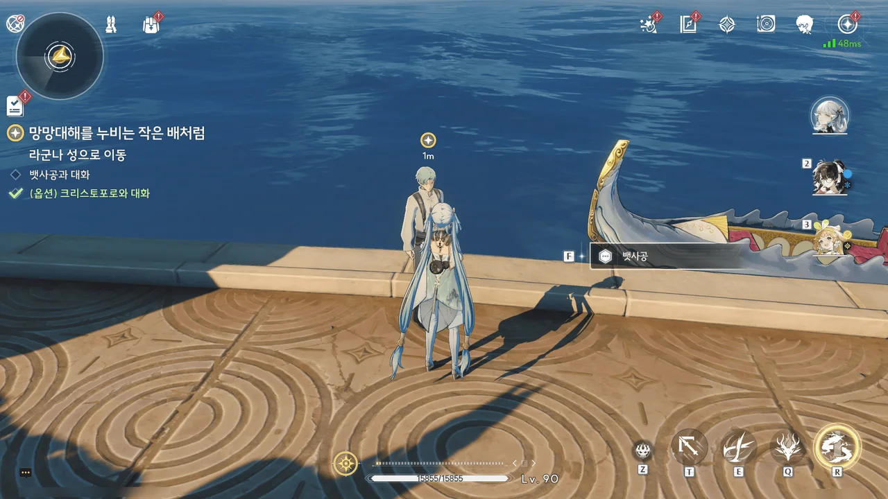
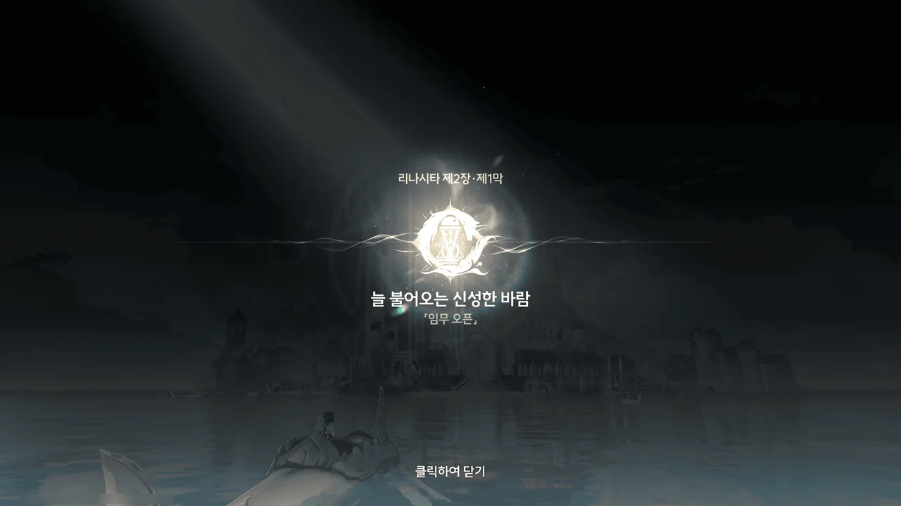
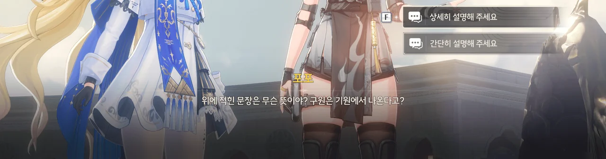
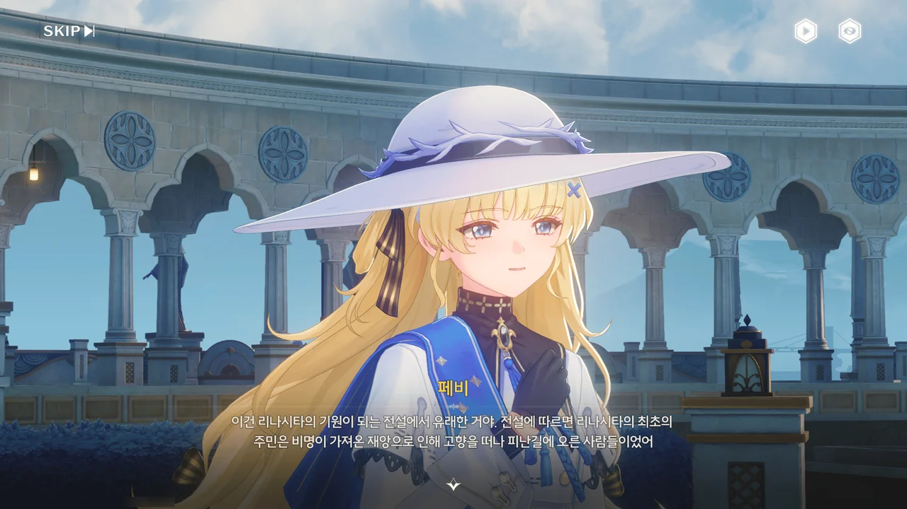
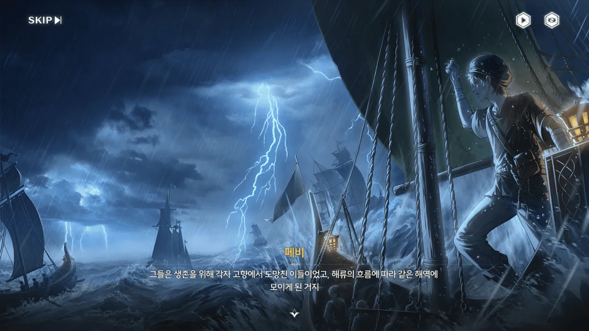
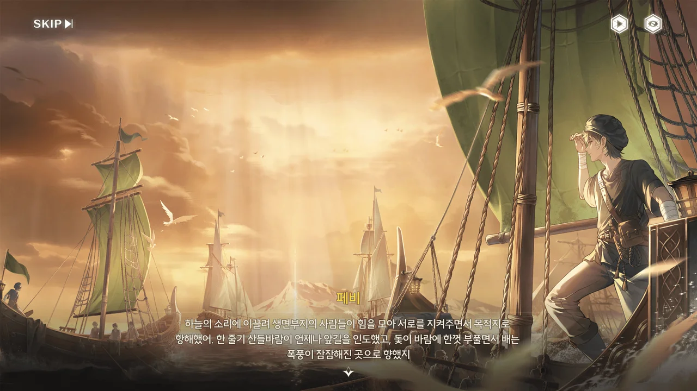
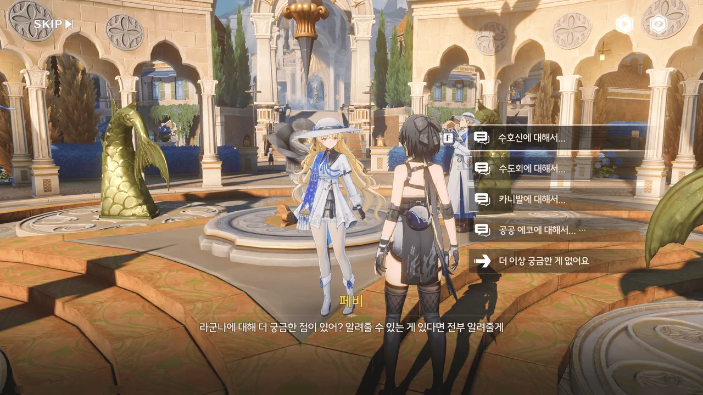







크리스토포로의 설명을 들어 보면, 현재 수도회는 선지자 펜리코의 행적을 악용해 자신들이 '우인'으로 규정지은 사람들을 순례선으로 귀양 보내는 듯하다.
게다가 "곤경 속에서 희망을 품는 것이 혼란에 빠져 죽는 것보다 낫다"라는 말로 보아, 저 순례선이 도달할 결말도 그리 좋지 않은 모양이고.





> 죄를 짓고 절망에 빠져 종말을 향해 나아가는 「우인」
> 고난을 겪다가 마침내 누명이 벗겨지고 구원받는 「의인」

뭔가 '우인' 쪽에 손이 갔다.
그냥 보기에는 '의인' 쪽이 더 내 마음에 드는 선택지이겠지만, 뭔가 그 뒤에 숨겨진 다른 의미가 있을 것만 같았거든.



대체 크리스토포로의 정체가 뭘까? 여태껏 나온 잔성회 사람들이 전부 붉은 옷을 입고 있었던 탓에, 크리스토포로도 잔성회가 아닐까 하는 의심이 든다.





라군나의 배는 모두 에코선이라고 한다. 아까 브렌트의 배, 라리오만 유별난 게 아니었구나.



제2장 리나시타 제1막 \[늘 불어오는 신성한 바람\] 시작.





파수인이 말했듯이, 리나시타에는 포포처럼 오랫동안 실체화해 존재하는 에코가 많으니, 어쩌면 정말 포포처럼 사람 말을 하는 에코를 만날 수 있을지도 모르겠네.

포포가 여럿 있을 거라고 생각되진 않아...



포포는 또 속이 좋지 않은 건지, 윽 하는 소리를 남기고 다시 방랑자의 성흔 속으로 들어간다.







방랑자에 대해 미리 보증을 서준 몬텔리 가문 덕분에 개인 단말기를 소지한 채로 리나시타에 입국할 수 있었다.

거 참 답답하네. 누가 봐도 이건 말이 안 되는 처사다.
거친 바다를 건너 이제 막 리나시타에 도착한, 그것도 리나시타에 처음 온 사람이 개인 단말기 신고가 필요한지 아닌지를 어떻게 알 수 있는데?
수도회가 일머리가 조금이라도 있었다면 입국 심사대 옆에 개인 단말기 신고 서류 등을 비치해 두었겠지만, 아무리 봐도 그렇게 한 것 같지가 않다.

이래서 종교쟁이들이란...
물론 저런 '종교쟁이' 이미지의 기반이 된 중세 교회는 단순한 종교 집단이 아닌, 해당 지역의 교육 · 행정 · 학문 · 정치 · 납세 · 치안 · 사회복지 등 지방 행정을 담당하던 곳이라, 저렇게까지 갑갑하지는 않았다고 한다.
순전히 미디어를 통해 생긴 이미지인 셈이지.



수도회에 귀의할 생각이 없다고 하자, 지금은 그런 말을 해도 결국 수도회에 귀의하게 될 것이라고 오만하게 말하는 성직자.

저 말을 들으면서 든 생각은 오직 '아, 그러셔요?' 밖에 없었다.



> 복음을 전하려면 존중과 인내심이 필요한 법. 갑작스러운 설교는 의심만 낳을 뿐이야.

같은 성직자인데 얘는 왜 이렇게 말을 이쁘게 잘하는 걸까. 설마 '굿 캅 배드 캅(Good Cop Bad Cop)' 전략은 아니겠지?



수도회가 카니발 축제에 어깃장을 놓은 모양이다.
카니발 축제 때에는 일시적으로 입국 규제가 완화된다고 파수인이 말했는데, 오히려 출입국 관리가 강화되고 심사 조례도 추가되었다지 않은가.

그래도 저렇게 정중하게 사과하는데 대놓고 불만을 표할 수는 없는 노릇이니...



라군나 사람들과 수도회에게 에코가 소중한 것과 개인 단말기를 미리 신고하는 것 사이에 대체 무슨 연관이 있는 거지?







그래도 입국 심사대를 지나자, 곳곳에서 제 역할을 하는 에코들이 눈에 들어온다.

뭐, 수도회의 에코들이 엄격 · 근엄 · 진지한 건 원래 그런가 보다 해야지. 원래 서브컬처에서의 종교는 쉽비스킷보다 더 딱딱하다고.



그런데 말하는 에코는 처음 보는 걸까? 포포를 본 페비의 반응이 뭔가 이상하다.





가면 쓴 에코가 다가와 방랑자에게 무언가를 건넨다. 오르골처럼 생긴 거 같은데, 이거.





객관적으로 에코를 보아야 「인도」의 의무를 완수하고 에코에 대한 지식을 더 잘 전파할 수 있다고 말은 하지만, 조금 전 에코, 「미스터 매직」에 대해 설명하는 페비의 모습은 누가 봐도 에코를 좋아하는 사람의 모습이었다.

저런 순수한 마음을 가진 사람이 나쁜 사람일 리 없어.
수도회는 썩었지만 페비는 그러지 않을 것이란 근거 없는 확신이 마음속에 자리 잡았다.

그리고 귀엽잖아.





금주에서 그랬던 것처럼, 중추 비콘에 단말기를 올렸다.
여기는 중추 비콘을 '기원 비콘'이라 부르는 모양이다.

> 강력하고 정의로운 나는 바다의 분노를 발아래 두고 왕좌에 오른다.
> 파도에 빠지고 싶지 않다면 구원은 기원에서 나온다는 사실을 명심해야 한다.

음... 뭔가 느낌이 좋지 않은 문구인데. 여태껏 들은 대로의 임페라토르가 할 법한 소리는 아닌 것 같잖아.









"구원은 기원에서 나온다"는 현재 전해지는 리나시타의 기원 전설에서 나온 말이라고 한다.

> 비명으로 인한 재앙 때문에 고향을 버리고 피난길에 오른 세계 각지의 사람들은 해류의 흐름에 따라 같은 해역에 도달하게 되었다.
> 흉포한 바다, 거센 폭풍, 덮쳐오는 잔상의 삼단 콤보에 죽음을 예상하던 사람들에게 어떤 목소리가 하늘에서 들려왔다.
> 그 목소리에 이끌려 사람들이 서로를 도와 항해한 끝에 도착한 곳이 바로 여기 '기원 비콘'이 위치한 섬이다.
> 기원 비콘은 사람들에게 에코에 대해 알려줬고, 사람들은 에코를 이용해 자신들만의 도시를 세울 수 있었다.
> 이 땅을 '리나시타'라 이름 지은 사람들은 자신들을 여기까지 인도한 하늘의 소리를 기념하기 위해 성당을 지었고, 그제야 수호신 임페라토르가 사람들 앞에 모습을 드러냈다.
{.bq}

다만 이 전설은 가장 널리 알려진 전설일 뿐, 실제로 어떤 경위를 통해 리나시타가 세워지게 된 것인지에 대해선 아직 제대로 밝혀진 바가 없다고 한다.







지금껏 수호신을 성공적으로 만난 건 수도회의 현직 「수좌」이자 수호신과 공명한 「선지자」, 펜리코가 유일하다고 한다.

음... 그러면 더 말이 이상해 지지 않나? 수도회가 이 꼬락서니가 된 걸 수호신이 그냥 보고만 있는다고?



돈은 언제나 옳다. 그러니 다음 행선지는 아베라르도 은행이다.









수호신 임페라토르는...

* 평화와 공평, 겸손과 자비의 신
* 하늘과 바다를 관장
* 모든 '존재'를 동등하게 돌봄
* 사람들을 '분열'과 '분쟁'에서 해방하고 편견을 없애 모든 사람을 하나로 '연결'하고자 함
* "나는 ... '동요'하지 않으니, ... '분리'되지 않는 자라."

글쎄... 통합이니 연결이니 하는 말만 들으면 제일 먼저 떠오르는 게 독재라서 말이다.









수도회의 정식 명칭은 「깊은 바다 수도회」이며, 중세 교회가 그랬던 것처럼 라군나를 실제로 관리하는 행정청의 성격도 띠고 있다.

라군나의 공공 에코를 관리하는 것 역시 수도회이며, 수도회는 「라 과디어」라는 에코 군대를 보유하고 있다.

당장 행정과 종교 모두를 손에 쥐었던 중세 교회가 면죄부를 팔아 돈을 벌며 타락한 것을 생각해 보면, 오히려 수도회가 타락하지 않은 게 더 이상한 전개일지도 모르겠다.











카니발에 담긴 뜻은 '육체와 작별하고 정신의 세계를 향해 나아간다'라고 한다. 이것도 뭔가... 묘하게 마음에 걸린다.









금주에서 비공명자도 단말기를 쓰는 장면이 있었던가? 그건 잘 기억이 나지 않는다.

아무튼, 금주에서는 공명자 단말기를 통해서만 에코를 다룰 수 있는데, 리나시타에서는 개조된 중추 비콘, '기원 비콘'을 통해 만인이 공공 에코를 사용할 수 있다고 한다.

다만 「라 과디어」 같은 특수 목적의 에코는 정해진 사람에게만 반응하며, 수도회 사람에게만 반응하는 에코는 보통 머리 위에 아우라가 있으니 그걸 보면 된다고 한다.

머리 위에 아우라... 윽, 헤일로...



