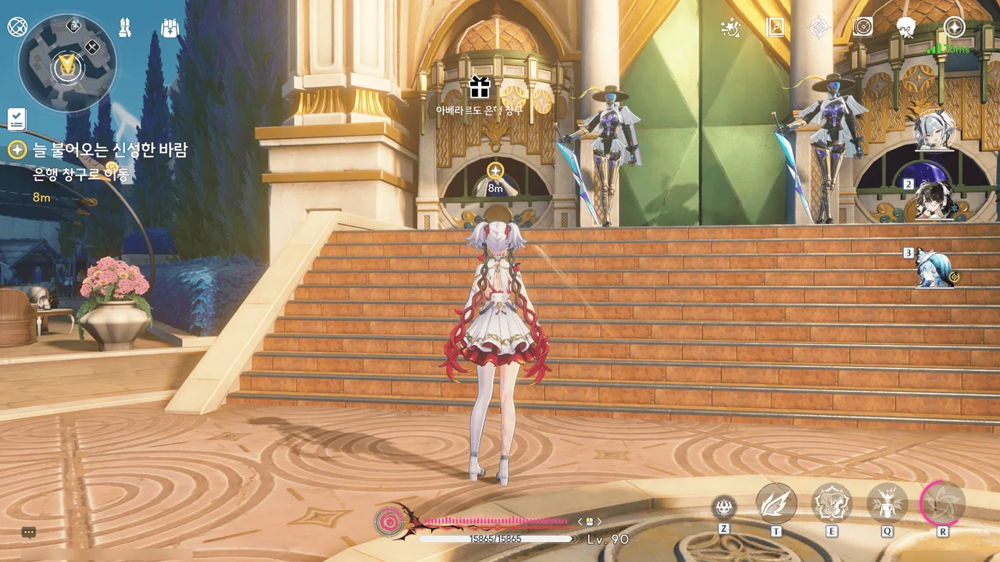
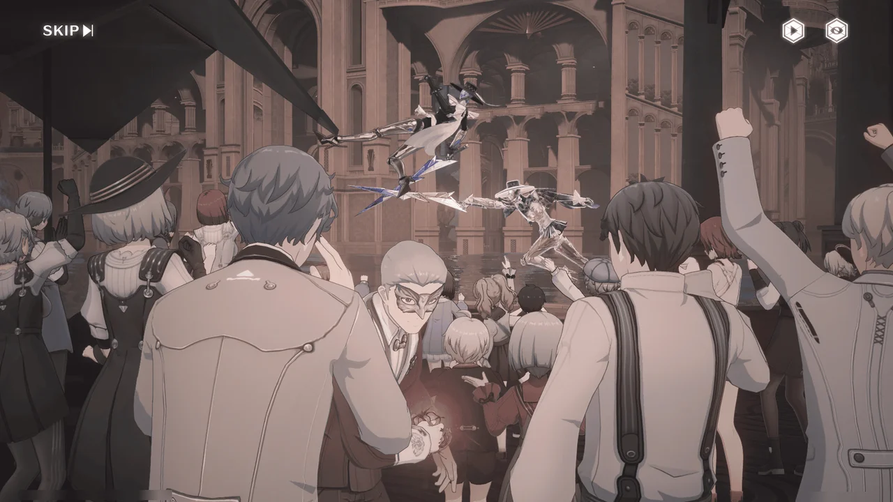



말을 하다 말고 잠드는 걸 보면, 포포의 몸상태가 이전보다 더 나빠진 것 같다.

... 이젠 하다 하다 은행 창구 밖으로 손이 나와 있네. 저것도 설마 에코인가?





젠니라는 은행 직원이 몬텔리 가문의 지시를 받아 방랑자의 자금 인출을 도우러 왔다.
설마 아베라르도 은행이 몬텔리 가문 소유인 건가?

포포를 에코나 애완동물 같은 방랑자의 소유물 취급하지 않고 별개의 인격체인 '동행인'이라 표현한 게 제법 마음에 든다.







은행 창구 밖으로 나온 손의 정체는 현금 자동 인출에 특화된 몬텔리 가문 소유의 에코, '메르쿠리우스'였다.

다른 지역이라면 인력이나 전자 기기를 썼을 법한 곳까지 에코를 쓰는 걸 보면, 어딘가 기분이 묘하다. 마치 바이오펑크를 보는 느낌이라고 해야 할까?

아베라르도 은행을 처음 이용하는 방랑자이지만, 몬텔리 가문의 귀빈 자격으로 리나시타에 온 것이기 때문에 처음부터 '골드 멤버십'을 부여받았다.
이 멤버십의 혜택을 볼 날이 올 지는 모르겠지만.





젠니가 맡은 역할은 방랑자의 자금 인출을 돕는 것만이 아니었다. 방랑자가 돈을 뽑고 나면, 방랑자가 라군나에 체류하는 동안 경호와 안내를 제공하기로 되어 있다고 한다.
진짜 VIP가 된 느낌이라 기분이 싱숭생숭하네...

그나저나 '뇌운의 비늘식 여행'은 대체 정체가 뭘까?
최대한 빠른 시간 내에 효율적이고 안전하게 관광지를 돌아볼 수 있다고 말하는 것으로 보아, 어떤 여행 패키지 이름이거나 비유적인 표현으로 추측된다.





젠니가 "기금을 입금해 드렸으니"라고 해서 순간 헛갈렸는데, 분명 방랑자가 아베라르도 은행에 온 건 자금을 *인출*하기 위함이었다. 그러니까 이렇게 돈가방을 받는 게 맞는 거다.

아까 포포가 배가 고프다고 한 걸 기억해 이 근처에 맛집이 있냐고 물었더니, 「마거리트 패밀리 레스토랑」을 추천받았다.

트로피칼 피자라... 나, 피자 엄청 좋아하는데. 맛있겠다.





갑자기 걸려온 전화를 받고 은행 일을 처리하는 젠니.

한국에서 '경매'는 법원에서 압류품을 대상으로 하는 경매가 대다수이기에, 왜 은행이 경매를 진행하는 건지 순간 이해하지 못했다.
뭐, 은행이 중개인이 되어 경매를 진행할 수도 있는 거겠지.







무슨 이유에서인지는 몰라도, 많은 수의 아베라르도 은행 직원들이 전출되는 바람에 은행 업무를 볼 인력이 부족해져, 젠니가 임시로 일부 업무를 떠맡았다고 한다.

은행, 그리고 그 뒤에 있는 몬텔리 가문 역시 맨입으로 젠니에게 일을 떠맡긴 건 아니고, 연차와 보상을 후하게 쳐주겠다는 약속을 하긴 했다.

뭐... 그러면 어쩔 수 없는 일이겠지.



쮸?

... 사람 돈 벌어먹는 일이 정말 어려운 일이라는 걸 다시 한번 깨닫게 된다.
어떻게 사람이 맨 정신으로 저런 말을 하고 다닐 수 있겠어? 자기 이름을 건 가게를 소유한 것으로 보아 성인으로 보이는데.







「직장인 피로회복 세트」와 「해피 홀리데이 세트」 중 무얼 먹을 거냐 묻는 걸 보면, 저 둘이 평소 젠니가 자주 찾던 메뉴인가 보다.
「직장인 피로회복 세트」라니... 대체 메뉴 구성이 어떻게 되어 있는 걸까?

일반적으로 추천 메뉴이라 함은 그 가게가 가장 잘할 수 있는 메뉴를 가리킨다. 그러니 잘 모를 때에는 추천 메뉴를 먹는 것이 제일 안전하다.

스테이크와 파스타... 진짜 생각만 해도 배가 고파지네.



자리에 앉아 잠시 기다리자, 마거리트가 음식을 직접 가져다준다.
파스타... 피자... 전부 내가 좋아하는 음식이잖아.





평소라면 방랑자가 따로 부르지 않아도 나와서 음식을 흡입했을 텐데, 지금은 방랑자가 불러야 나올 정도로 몸이 쇠약해진 모양이다.

그래도 음식을 보자마자 눈이 휘둥그레진 걸 보면, 식욕은 그리 떨어지지 않은 모양.







에코가 생활 곳곳에 스며들었을 리나시타 사람인 젠니가 보기에도 사람 말을 하고 방랑자 몸속에서 잠을 자는 포포가 신기한 걸 보면, '에코 랜드'라 불리는 리나시타에도 포포와 같은 에코는 없는 모양이다.







적어도 식문화에 있어서 리나시타와 가장 유사한 나라는 이탈리아와 프랑스가 아닐까 싶다.
신선한 해산물 요리에는 강한 조미료를 쓰지 않는다거나, 민물고기 요리를 먹은 다음에야 바닷물고기 요리를 먹는다는 이야기도 그렇고, 와인을 좋아하는 것 역시 꽤 비슷하다.

그나저나 저 노란색 음료가 이전에 브렌트가 말했던 '넥타르 와인'인가 보다. 이걸 식전주로 마시는 걸 보면, 처음 생각했던 것과 달리 도수는 그리 높지 않은 듯하고.
무슨 맛일까?



곧 있을 「카니발」을 위해 몬텔리 가문의 에코가 무대 리허설을 하고 있다.









리허설을 하던 도중, 에코에 무슨 붉은 기운이 돌더니만 갑자기 방랑자에게 달려들어 칼을 휘두른다.

공중에 뜬 에코 등에 있던 붉은색 꽃이 사라지자, 에코가 정신을 차린 건지 들고 있던 칼을 대번에 흩어버린다.

붉은색 꽃... 또 그 녀석인가?









> 제어... 통합... 진화... 만물의 결합...
> 어자, 오래 기다렸습니다... 저는 「임페라토르」. 「저」를 도와서, 길 잃은 자를... 이 세상으로 데려와 주십시오.

뭔가 좀 수상한데. '만물의 결합'이라는 대사가 나올 때 나온 삽화는 무언가 도가니 같은 곳에 갇혀 고통스러워하며 우는 사람들의 모습이었다.

저거, 「임페라토르」가 맞긴 해? 임페라토르로 위장한 무언가는 아니겠지, 설마?







아, 저 꽃 이름이 피안화였구나.

저 꽃, 굉장히 많이 봤지.
어디서 들은 건지는 잘 모르지만, 저걸 들고 다니는 잔성회 간부 이름이 '플로로'인 것까지 알고 있다.

저걸 제일 처음 본 게 금주 잡석고지에서였지, 아마.
거기서도 플로로가 잔상을 피안화로 조종하고 있었다.









방금 전 방랑자가 본 환상은 이전에도 몇 번 경험해 본 「공감」과 비슷하다고 한다.

추측하기에, 임페라토르와 수도회 사이의 관계는 그리 좋지 않은 모양이다.
만약 임페라토르와 수도회의 사이가 원만하거나 좋았다면 임페라토르가 직접 수도회에 신탁을 내려 메시지를 전달하는 것이 제일 무난했을 테니까. 설마 그것까지 하기 싫다고 고집부리는 수호신은 아닐 거 아냐.

아니면, 수도회가 임페라토르를 억압하고 조종하려 하는 것일 수도 있겠다. 딱히 증거는 없지만.



라군나 사람들은 공공 에코에 의존하기 때문에 공명자만이 단말기를 통해 쓸 수 있는 개인 에코에는 큰 관심이 없다고 한다.

개인 단말기와 개인 에코가 좋은 사업 아이템이 될 거라 생각한 몬텔리 가문은 이번에 재개최 되는 카니발을 통해 개인 단말기를 홍보하려 한다.









젠니를 고용한 몬텔리 가문의 '알베르토'가 젠니에게 연락해 현재 상황을 간략히 알려주었다.

몬텔리 가문 역시 왜 에코가 통제를 벗어나 방랑자와 주변을 공격한 건지 파악하지 못했으며, 이 일로 피해를 입은 방랑자에게 사과의 뜻을 전했다.

이 일이 퍼지면 개인 단말기 사업을 추진하고 있는 몬텔리 가문 입장에선 날벼락이 따로 없을 테니, 아마 필사적으로 이유를 조사하지 않을까?







조금 전 에코가 주변을 공격한 건 일종의 위장일 수도 있다는 가설이 나왔다.
에코가 리허설을 하다 말고 뚜벅뚜벅 걸어와 방랑자에게 메시지를 전하면 굉장히 이상하게 보일 테니, 일부러 에코가 통제를 잃어 주변을 공격한 것처럼 보이게 해 주변을 물린 후, 방랑자에게 메시지를 전했다는 것이다.

음... 그럴듯하긴 한데, 확신이 들지는 않는다. 역시 증거가 더 필요해.

선행 공약에 있는 지인의 공명 어빌리티가 이 일에 도움이 될지 모른다며, 젠니가 선행 공약으로 가볼 것을 제안한다.











10년 전 마지막 카니발이 열렸을 때, 에코 통제 불능과 같은 사고가 많이 일어났다. 그 일 이후, 펜리코 수좌는 카니발을 폐지했다.

수도회 사람은 그 일이 수호신의 분노와 징벌이라고 이야기하는데, 내 눈에는 그렇게 보이지 않는다.
지구 신화 속 신은 인간이 꼴 보기 싫다고 전 지구를 물로 뒤덮어 *정화*하는 버릇이 있어서 그런가?

라군나에서는 에코가 고장 나면 다시 데이터 스테이션에 넣어 초기화를 한다고 한다. 여태껏 본 에코는 외부 활동 시간이 짧아 고장 난 걸 못 본 건가?





10년 전 통제 불능 에코들이 마구잡이로 주변을 공격하고 파괴했던 것과 달리, 이번 통제 불능 에코는 무언가 목적성을 띠고 움직였던 것으로 보인다.

즉, 설사 10년 전 사고가 신의 분노였다고 하더라도, 이번 일은 누군가가 인위적으로 개입했다는 의미가 된다.

그 블레이드 댄서 에코가 초기화되기 전에 포획해서 증거가 될만한 걸 확보해야 한다.





피살리아 가문의 티모테오와 몬텔리 가문의 안토니오가 서로 싸우고 있다.
정황상, 티모테오가 강제로 계약을 깨고 몬텔리 가문에 해가 될만한 일을 한 모양이다.
게다가 티모테오는 조금 전 블레이드 댄서가 난동을 부린 걸 이미 알고 있다.

... 아무리 봐도 피살리아 가문이 수상쩍은걸.

















오, 이번에는 괜찮은 정보를 많이 얻었다.

일단, 방랑자가 리나시타에 오게 된 데에는 카를로타의 공이 큰 것으로 보인다.
초대장을 보낸 것도 카를로타이고, 방랑자가 「샛별 등대」에 도착한 것을 몰래 숨어 지켜본 것도 카를로타이다. 방랑자가 블레이드 댄서 난동 사건을 조사하려 하자, 편의를 봐준 것도 카를로타이고.
분명 방랑자에게 뭔가 바라는 게 있는 거겠지?

라군나성의 모든 공공 에코는 먼저 수도회가 자신들이 관리하는 데이터 스테이션에 흡수한 다음, 필요에 따라 도시 곳곳에 배치한 것이라고 한다.

수도회의 간섭 때문인지, 모든 공명자가 개인 단말기를 휴대하고 다니는 건 아니다. 개인 단말기 휴대가 허용된 건 극소수의 공명자뿐이다.
기원 비콘과 공공 에코의 존재 때문에 개인 에코의 수요조차 적은 편이고.

하지만 최근 리나시타 외부로 향하는 항로가 개발되어 공공 에코의 보호를 받을 수 없는 영역까지 진출하게 되자 개인 에코에 대한 수요가 점차 생겨나게 되었다.

몬텔리 가문은 이에 주목해 개인 단말기와 개인 에코 사업을 벌이고 있으나, 피살리아 가문에서 의도적으로 퍼트린 '수도회에 대한 불신', '수호신에 대한 모독'이라는 인식 때문에 사업이 지지부진하고 있다.

피살리아 가문은 거기에 한술 더 떠, 단말기 제조에 필요한 자원을 채굴하는 광산을 압박해 기존 공급 계약을 파기하도록 만들어 개인 단말기 생산에도 지장을 주고 있다.

안토니오는 피살리아 가문이 수도회와 결탁했기에 이런 일을 벌일 수 있는 거라고 의심하고 있다.





하지만 왜 피살리아 가문이 카니발 개최를 방해하고 있는지 알지 못한다.
아직까진 전부 심증에 불과하다.







젠니가 말한 선행 공약의 지인, 「조수 영상 스튜디오」 책임자 풀미네는 방랑자의 이름을 듣자마자 '이국의 구원자', '세계를 누비는 검은 번개' 같은 낯 뜨거운 칭호를 쏟아낸다.

음... 방랑자가 그렇게 유명했나?







풀미네의 공명 어빌리티는 특정 기간 동안 발생한 모든 일을 특수 필름으로 변환할 수 있는 「셀룰로이드 크로니클」이라고 한다.

과연, 젠니가 이번 일에 도움이 될 거라고 한 이유가 있었네.











블레이드 댄서는 이미 라군나성 바깥으로 도망쳤지만, 피안화를 손에 들고 있는 가면남의 사진을 얻었다.
말 못 하는 블레이드 댄서보다는 사람을 족치는 게 더 확실한 법이다.

라군나성에서 알아주는 가면 제작자, 나이알라에게서 정보를 얻어보기로 한다.
사생활을 중요시하는 귀족들의 특성상 직접 물어보지는 못하겠지만, 간접적으로 떠보는 것 정도는 할 수 있겠지.





젊은 여성~~카를로타~~가 나이알라에게서 「향수」, 「파운데이션」, 「주얼리 세트」를 받아 가려한다.
굳이 「」로 감싼 걸 보면, 단어 그대로의 뜻이 아니라 은어인가 보다.







웬 투명인간인가 했는데, 나이알라의 공명 어빌리티, 「가면의 유령」이라고 한다.
그녀의 가게, 「마스체라 미라지」 역시 단순한 가면 가게가 아니라 종합 주문 제작 공방인 모양이고.





음, 되려 의심을 사버렸다.

가면이란 자신의 개성을 표현하는 물건인데, 다른 사람의 가면과 똑같은 걸 주문 제작하는 사람이 나타난다면 충분히 의심이 갈만하지...





하지만 젊은 여성~~카를로타~~가 잘 넘겨준 덕분에, 그 가면의 주인이 피살리아 가문의 질베르토라는 사실을 알 수 있었다.





피살리아 가문은 본래 리나시타에서 제일 오래된 가문 중 하나였지만, 아주 오래전 리나시타에 전쟁을 일으킨 후 가문이 몰락하는 바람에 라군나성을 떠났다고 한다.
하지만 돈 많은 후원자라도 얻은 건지, 최근 몇 년 동안 매우 공격적으로 광석 사업을 벌이고 있다.

대부분의 피살리아 가문 사람들은 "제멋대로 행동하는" "쓰레기"인 데다, 매우 오만하다고.
나이알라가 질베르토를 기억하는 것 역시 그의 가면을 스물세 번이나 고쳐야 했기 때문이었다.



아무튼, 현재 방랑자를 초대한 몬텔리 가문과 반목하는 피살리아 가문 사람의 가면이니, 방랑자에게 추천하지 않는다는 조언을 받았다.



블레이드 댄서 난동에 대한 소문이 벌써 라군나성에 쫙 퍼진 건지, 만나는 사람마다 그 일을 언급하고 있다.

뭐, 아무튼... 이제 피살리아 가문 사람, 특히 그 질베르토를 조사하면 뭔가 더 나올 것이다.
피살리아 가문 저택이 머큐리 성당 옆에 있다니... 피살리아 가문을 수도회가 후원하고 있는 건 아니겠지, 설마?





젠니가 이 가게의 VIP 고객이라고?
순간 「마스체라 미라지」를 단순한 가면 가게로 생각해 '젠니는 가면을 참 좋아하는구나'라고 착각했다.
아마 다른 용무로 이 가게에 자주 방문한 거겠지.

&nbsp;

아, 나중에 알게 된 건데, '나이알라'라는 이름은 '니알라토텝', 정확히는 그 이름의 원본인 '나이알랏'에서 따온 거라고 하더라.
처음에는 '번역 정말 더럽게 못했네'라고 생각했는데, 오히려 번역을 잘한 거였어...
