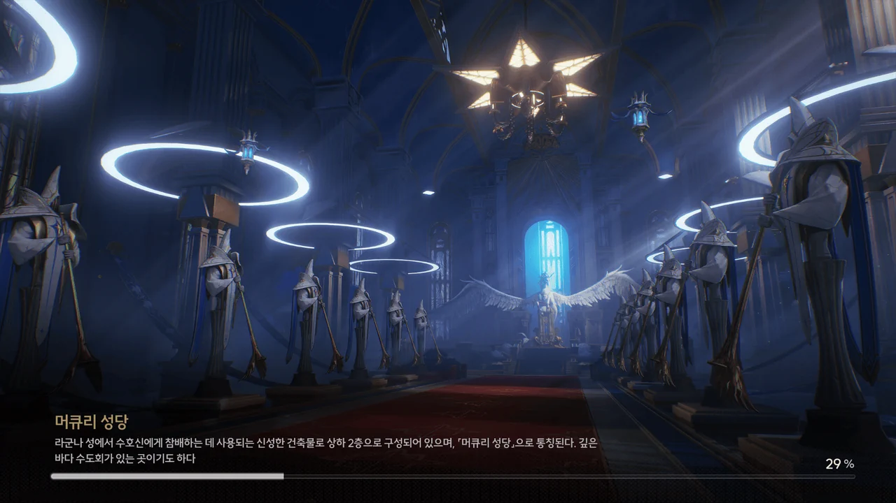
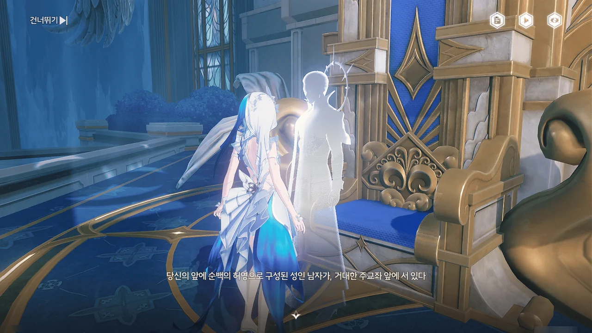
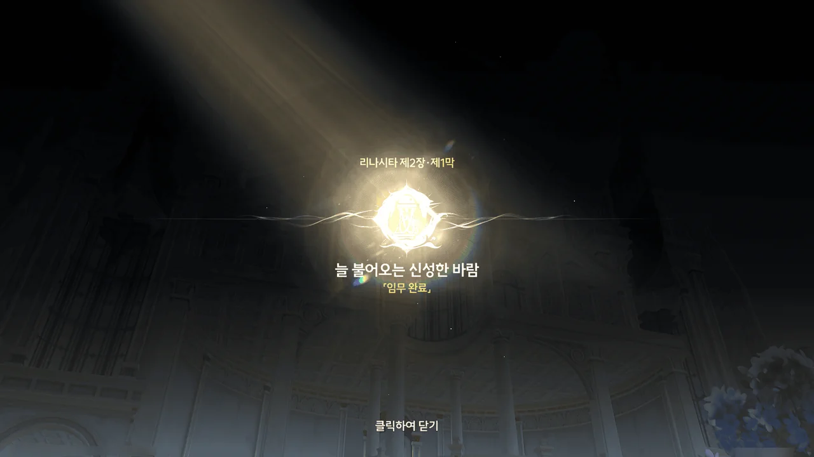





리나시타 사람들은 수호신이 폭풍을 잠재우고 파도를 잔잔하게 해서 바다에 나온 사람들의 생명을 구한다고 믿기에, 수호신 조각상 주변에 밤낮으로 타오르는 촛불을 두르고 그 앞을 지나갈 때마다 조각상을 향해 경의를 표한다고 한다.

아, 그래서 저기가 저렇게 밝은 거였어? 난 그냥 조명인 줄 알았지.



포포가 수호신 조각상을 보고 느낌이 이상하다고 말한 걸 보면, 임페라토르에게 문제가 있는 건 맞는 것 같다.
임페라토르가 사람들이 생각하는 그런 수호신이 아니라거나 뭐 그런 것 있지 않은가.







평범하게 배에서 내려 계단이나 엘리베이터를 탈 거라 생각했는데, 천장이 열려 폭포가 만들어지고, 그 폭포를 에코선이 그대로 타고 오른다!

와... 엄청 멋지잖아, 이거!





내 예상대로, 피살리아 가문 저택은 성당 바로 옆에 있었다.

라군나성을 관리하는 수도회의 본거지, 성당 바로 옆에 대가문의 저택이 있다? 이건 아무리 봐도 수도회가 피살리아 가문 뒷배라고 말하는 거잖아...

마침 에코 난동 사건 때 피안화를 들고 있었던 피살리아 가문의 질베르토가 성당 안으로 들어가는 모습이 포착되었다.

> **머큐리 성당**
> ***
> 라군나성에서 수호신에게 참배하는 데 사용되는 신성한 건축물로 상하 2층으로 구성되어 있으며, 「머큐리 성당」으로 통칭된다. 깊은 바다 수도회가 있는 곳이기도 하다.
{.bq}









몬텔리 가문의 일원으로 위장해 피안화로 에코 난동 사건을 일으킨 건 예상대로 피살리아 가문의 질베르토가 맞았다. 그리고 그 피안화를 지원해 준 건 다름 아닌 수도회였고.
일단 피살리아 가문, 수도회, 잔성회가 한데 묶였다는 건 잘 알겠다.

질베르토가 말하는 '단결', '융합'을 듣고 미술가 지망생 콧수염이 떠오른 건 결코 착각이 아닐 것이다. 윽! 레벤스라움...



조금 전까지 질베르토와 대화하고 있었음에도, 질베르토를 본 적 있냐는 말에 본 적 없다고 대답하는 알렉시스 사제.
뭐, 한통속이니까 당연한 말이겠지.













앞서 만났던 성직자처럼, 알렉시스 사제 역시 10년 전 사건은 향락에 빠진 사람들을 향한 수호신의 경고이자 징벌이었다고 말한다. 그리고 그 '신의 징벌'을 진정시킨 건 현 수좌, 펜리코이고.

음... 그러면 여태까지 얻은, 펜리코에 대한 정보를 잠깐 정리해 보자.

* 깊은 바다 수도회의 수좌
* 수호신과 공명한 「선지자」
* '수호신의 징벌'을 진정시켜 10년 전 대참사를 끝냄

... 수상하다. 이유는 잘 모르겠지만, 내 직감이 '펜리코가 수상하다'라고 속삭이고 있다.

&nbsp;

겉으로는 '우린 카니발 개최를 반대한 적 없어요'라고 말하고 있지만, 알렉시스 사제의 말은 아무리 봐도 수도회가 카니발 개최를 반대하고 있다는 것으로밖에 보이지 않는다.

수도회가 직접 카니발 개최를 막지 않고 피살리아 가문을 이용해 간접적으로 카니발에 어깃장을 놓는 이유는 뻔하다.

지나친 향락을 경계해야 한다는 이유로 수호신을 향한 제의인 카니발을 무려 10년 동안이나 막아온 수도회이다. 10년이면 강산도 변한다고, '이제 슬슬 카니발을 다시 열어도 좋지 않을까?'라는 여론이 생기는 건 절대로 막을 수 없다.

그런 상황에서 라군나성의 유력 가문인 몬텔리 가문이 카니발을 열겠다며 라군나성 곳곳에서 공연 준비를 하고 있다. 사람들 역시 10년 만에 열리는 카니발을 잔뜩 기대하고 있고.

여태껏 들먹여온 이유로는 카니발 개최를 막을 수 없다.

10년 전 사건? 무려 10년 전 사건이다. 게다가 카니발의 본질은 '수호신을 향한 제의'이지.
만약 누군가가 '수호신을 향한 제의를 무작정 틀어막는 수도회가 정말 수호신을 섬기고 있는 게 맞긴 한 건가?'라는 선동을 퍼트린다면? 이건 뭘 해도 외통수가 될 거 같은데.

입을 틀어막으면 '수도회가 진실을 숨기려 악을 쓰고 있다'는 선동으로 맞받아치면 된다. 제법 그럴싸한 주장이기에, 사람들 마음속에 수도회를 향한 의심이 스며들기 좋을 거고.
그냥 가만히 내버려 둬도 결과는 똑같다. 사람들이 수도회를 의심하게 된다.

사람들을 우인으로 낙인찍어 순례선으로 추방하는 것에도 한계가 있다. 추방하는 사람이 많아질수록 그 한계점에 더 빨리 도달하게 될 거고.
수도회를 의심했다는 이유로 추방당하는 사람이 도시 전체 인구의 10%만 되어도 이미 큰일이다.

음, 아무리 생각해도 수도회 전체가 라군나성의 공공의 적이 되는 결말밖에 보이지 않아...





급한 일이 생겼다며 먼저 자리를 뜨는 알렉시스 사제가 "듣는 것은 모두 헛되니, 직접 보아야 믿을 수 있다"며 수도회를 마음껏 둘러봐도 좋다고 이야기한다.

의궤에 사용되는 성물을 건드리지 말라고 했지만, 그게 정확히 뭔지 이야기하지 않았으니 무슨 일이 생겨도 방랑자 책임은 없는 것으로 하자. 계율 역시 마찬가지고.
원래 이런 건 저쪽이 제대로 설명해야 하는 거다.





> 그 사제가 「마음대로」 해도 좋다고 했으니까, 그 호의를 저버리지 않도록 찾아봐야겠죠.

그래, 바로 그거야!







펜리코가 왜 자신의 투영을 여기에 가져다 둔 건지는 잘 모르겠다.
수도회 전체가 의심되는 마당이니, 아무래도 감시를 위한 게 아닐까 싶긴 한데.



옥좌 뒤 거대한 문을 지나자, 거대한 화원이 나타난다.





길을 따라 도착한 곳은 고해소로 올라가는 엘리베이터였다.





알렉시스 사제, 급하게 달려오다!

그 옆에 플로로가 나타난 걸 보면, 수도회가 잔성회와 결탁한 건 100% 확실하다.
앞으로 수도회 사람이 하는 말은 일단 조금 거르는 것으로...

제2장 리나시타 제1막 \[늘 불어오는 신성한 바람\] 끝.
