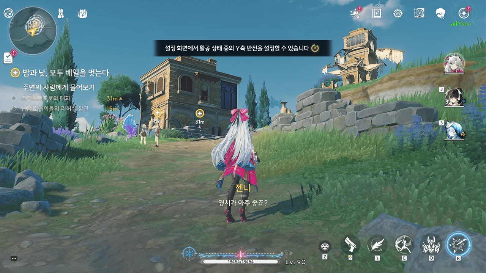
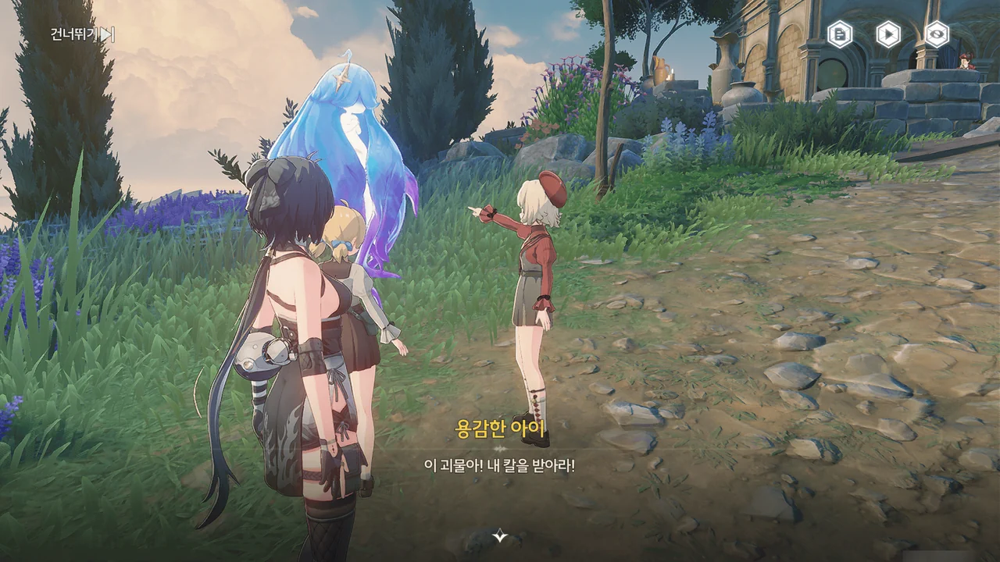
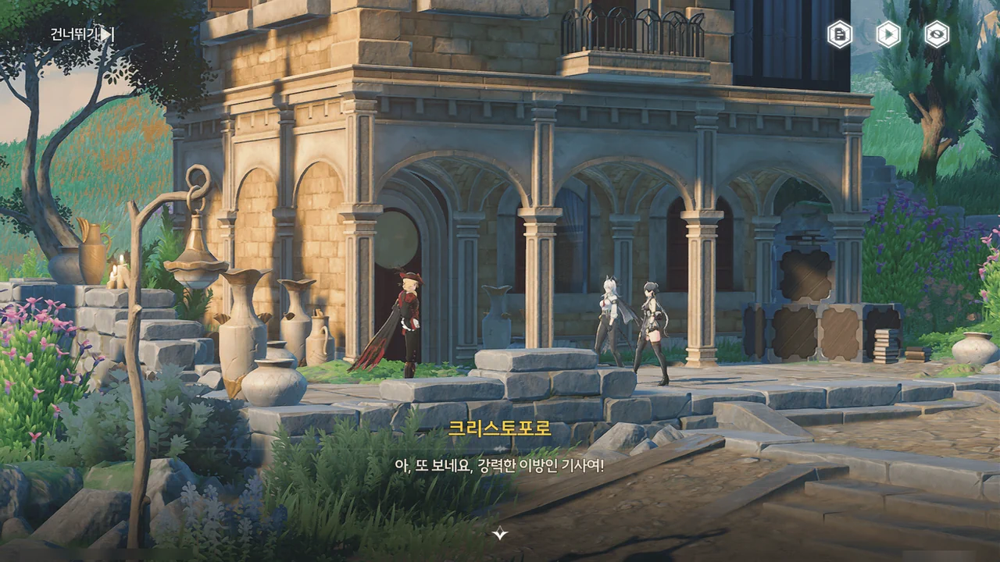





> | | |
> |:--|:--|
> | ??? | 고해할 것 있음? |
> | 방랑자 | ㄴㄴ |
> | ??? | ㄹㅇ? |
> | 방랑자 | ㄹㅇ! |
> | ??? | ㅇㅋ |
> {_borderless=true,_thead=false}

뭔가 헛웃음이 나오더라.
고해소로 가는 엘리베이터에서 고해할 게 없다고 당당하게 이야기하는 방랑자나, 그렇다고 순순히 위로 올려 보내주는 엘리베이터나. 둘 다 뭔가 웃기더라고.











조금 전까지만 해도 성당 지하 정원에 있었는데, 엘리베이터를 타고 올라가니 드넓은 리나시타의 풍경이 방랑자를 반겨준다.
어... 이걸 어떻게 해석해야 하는 거지? 이쁘긴 한데!

제2장 리나시타 제2막 \[밤과 낮, 모두 베일을 벗는다\] 시작.















젠니가 자신의 상사이자 아베라르도 은행의 책임자인 알베로토 ― 알베르토의 오기인 건지, 진짜 이름이 알베로토인 건지는 아직 잘 모른다 ― 에게 상황 보고를 하고 있다.

자금이나 인력을 전폭 지원하겠다는 말이나, 평소 신중하던 사람이 상부의 압박으로 직접적인 지시를 내렸다는 걸 보면, 정말 이번 사건으로 몬텔리 가문 발등에 불이 떨어진 모양이다.





질베르토의 흔적이 갑자기 끊겼다.

젠니가 상공의 케루브를 발견하고, 질베르토가 이를 이용해 어디론가 향했을 것이라 추측한다.



오... 이렇게 활공을 처음 안내해 준다고?

리나시타가 열린 첫 주에 이미 이곳저곳을 다 돌아다니며 활공 게이지 상한선을 한껏 올려둔 터라, 활공 게이지 걱정 없이 마음껏 날 수 있었다.

활공, 이거 재미있더라고.
왜 금주에서는 활공으로 날아다닐 수 없는 것인가! 금주를 돌아다닐 때 우직하게 달려야 한다는 게 이만저만 불편한 게 아니다.



케루브가 안내한 곳은 성녀의 고향이자 풍차와 꽃밭으로 유명한 「바람 부는 물가」이다.

정황상 질베르토가 향한 곳은 바로 여기다. 그런데 대체 그는 왜 여기에 온 거지?







아이 둘이 에코를 앞에 두고 연극 같은 걸 연습하고 있다.

성녀가 흑조를 막기 위해 자신을 희생한 장면을 묘사한 것으로 보인다.















크리스토포로를 또 만났다.

크리스토포로는 희생의 성녀, 「플뢰르 드 리스」를 소재로 한 시나리오를 쓰던 중, 성녀의 성격을 묘사하는데 어려움을 겪었다.
그래서 성녀가 어린 시절을 보낸 고향에서 그녀의 유년기 시절 흔적을 찾아보려 했으나, 이미 대부분의 정보가 소실되는 바람에 적당히 상상력을 발휘해 시나리오를 쓸 수밖에 없었다고 한다.
그게 방금 아이들이 연습하던 연극이었고.

크리스토포로가 시나리오 대본을 주긴 했는데, 지금 당장은 볼 생각이 없다.
지금 열심히 조수 임무를 달려야 하거든...









질베르토가 이 마을에 온 것을 크리스트포로가 보았다고 한다. 피살리아 가문 귀족들은 성 밖에 자주 나오지 않기에 눈여겨보았다고.

질베르토가 이 마을에 나타난 이후, '에코의 마을'이라 불릴 정도로 에코가 많던 마을의 에코가 하나둘씩 사라졌다고 한다.

이거... 아무리 봐도 질베트로가 범인인 것 같지...?







에코의 안내를 따라 도착한 곳에는 이상 주파수 오염이 있었다.

대체 뭔 짓을 하고 다닌 거야, 이 녀석은?











이상 주파수 오염으로 덮인 폐허 꼭대기 위에는 피살리아 가문의 비밀 기호 ― 방랑자가 그걸 대체 어떻게 알아본건지에 대해서는 논외로 하고 ― 가 그러져 있다. 저번에 봤던 피안화는 덤이고.

심지어 피안화를 회수하자, 폭주한 에코가 방랑자를 덮친다.

... 설마 이 모든 게 함정이었던 건 아니겠지?









방랑자가 라군나성과 폐허에서 에코들에게 습격당한 일을 크리스토포로에게 알려주자, 공공 에코는 수호신이 리나시타에 내린 선물이기에 함부로 인간을 공격하지 않는다며 믿기 어려워한다.

하지만 이미 그런 일이 일어났는걸. 믿을 수밖에.







아까 주운 피안화를 주파수 전문가인 포포에게 먹여보자, 강력한 공명자와 관련 있는 물건이라는 결론이 나왔다.
음, 잔성회 간부를 하려면 보통 강한 게 아니어야 할 테니, 제법 그럴싸하다.

강력한 공명자가 아닌 질베트로가 에코를 조종할 수 있었던 건 순전히 플로로가 건네준 피안화 덕분이었던 것으로 보인다.







젠니는 이 일을 폭로해 피살리아 가문과의 협상에서 이익을 볼 생각인 것 같은데... 왠지 그게 그렇게 쉽게 될 것 같지가 않다.

피살리아 가문은 수도회는 물론이요 잔성회와 까지 연결점이 있으니, 그냥 권력이나 힘으로 협상 테이블을 엎어버릴 수도 있을 것 같아 보이거든... 몬텔리 가문이 정보를 풀어버려도 중상모략이라며 받아칠 것 같아 보이기도 하고...

포포가 페비를 발견하고 "좋은 생각이 떠올랐다"며 군침을 삼키고 있다. 대체 뭔 짓을 하려고!
