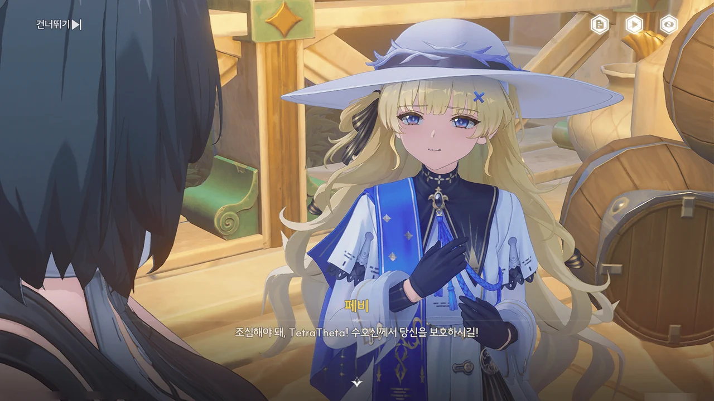









페비가 '리비아', '브레노'에게 '벱페'의 행방을 묻고 있다.
페비가 에코들에게 이름을 지어준 모양인데, 항구에서 봤던 대로, 정말 에코를 좋아하나 보다.

포포가 페비의 등 뒤에 몰래 다가가 쿡쿡 찌르는, 실없는 장난을 친다.
장난을 걸 정도면 상태가 그럭저럭 괜찮아진 건가?









> | | |
> |:--|:--|
> | 젠니 | 젠니라고 합니다, 존경하는 성직자님. 아베라르도 은행에서 일하고 있습니다. |
> | 페비 | ... 처음 보는 얼굴인데. |
> | 젠니 | 아... 그건 제가 성당에 잘 나가지 않아서... 지, 지금은 그보다 상당히 시급한 일이 있습니다. |
> {_borderless=true,_thead=false}

이 웃긴 대화에서 두 가지 사실을 유추할 수 있다.

1. 젠니는 평소 성당에 잘 나가지 않는다.
2. 페비는 성당에 자주 오는 사람들의 얼굴을 기억하고 있다.

1번은 뭐 그럴 수 있다고 생각한다. 젠니에게도 나름의 사정이 있을 테니까.
하지만 2번은 피부에 서늘한 감각이 드는 말이다.

페비가 성당에 자주 오는 사람들의 얼굴을 기억한다는 건 두 가지를 의미한다.

1. 페비는 성당에서 일어나는 **모든** 행사에 성실하게 참여했다.
2. 페비는 성당에 방문한 사람들의 얼굴 하나하나를 전부 살펴봤다.

물론 내가 너무 지나치게 생각하고 있는 걸 수도 있지만...







페비가 찾고 있는 '벱페'도 마을의 다른 에코들처럼 실종된 모양이다.

페비에게 최근 있었던 에코 실종 및 폭주 사건의 용의자가 피살리아 가문의 질베르토임을 알려주자, 평소 수호신을 아주 경건하게 여기던 피살리아 가문의 사람이 수호신이 하사한 에코를 모욕할 리 없다며 믿기 어려워한다.









알렉시스 사제가 평소에 저 피안화를 옷에 달고 다녔다고? 대체 무슨 생각인 거지?

교리에 따르면, 임페라토르는 사람들에게 하늘과 땅, 바다와 식량, 그리고 에코를 하사했다.
그러니 질베르토가 벌인, 에코를 고의로 폭주시킨 행위는 수호신의 하사품을 훼손한 것과 같다고 볼 수 있다.
페비가 두 팔 걷어붙이고 조사에 뛰어드는 건 당연하다고 할 수밖에.

페비가 조사에 참여하는 건 여러모로 이득이 된다.

수도회가 피살리아 가문의 뒤를 봐주고 있다는 건 극비에 가깝다. 수도회는 언제나 중립을 지켜야 하니까. 그렇지 않으면 수도회의 권위가 손상된다.

그런 수도회의 성직자인 페비가 조사에 참여해 이를 증언했으니, 이번 조사의 결론은 곧 수도회가 내린 결론이라고도 볼 수 있다.

그런 상황에서 피살리아 가문이 수도회가 내린 결론과 마찬가지인 이번 조사 결과에 제대로 반박할 수가 있을까?
자칫하다간 피살리아 가문이 수도회를 믿지 못하는 게 아니냐는 의혹을 살 수도 있다. 수도회 역시 입장상 수도회에게 반기를 드는 것으로 보이는 피살리아 가문을 그냥 넘어갈 수 없게 되고.

그나저나 "기도조차 하지 않는 이단자로 취급하면서, 리나시타에서 쫓아내지만 않으면 돼요"라니... 설마 그걸 걱정하고 있었던 거야, 젠니?





'벱페'로 보이는 에코가 황급히 어디론가 도망가고 있다. 대체 저기에 무슨 일이 있었기에 저렇게 정신없이 도망치는 거지?











질베르토가 짐더미 앞에서 만반의 준비를 끝냈다며, 누군가에게 기도를 올린다.

질베르토가 기도를 올리는 대상은 우리가 아는 그 임페라토르가 아닌 것 같다.
임페라토르가 '심연에 숨은 신', '파도와 비밀의 왕'일리가 없잖아. 그런 언급은 뭐랄까... 명식에 더 어울리는 표현 아냐?
게다가 질베르토의 얼굴을 봐라. 증오인지 분노인지 모를 것에 가득 차, 라군나성을 구름 바다로 쓸어버리겠다고 말하는 저 얼굴이 입에 담은 게 수호신 임페라토르라고?

뭐, 아무튼... 몰래 숨어 지켜보고 있던 걸 질베르토에게 들켰다.







방랑자가 자신의 뒤를 밟았다는 걸 확인한 질베르토가 방랑자가 지금껏 보아온 것은 '파도 아래 진실'에 비하면 하찮은 것이라며, 자신이 소환한 에코를 잔상으로 바꿔버린다.

뭐라고 해야 할까... 참 하는 행동이 싸구려 악당 그 자체다.
교리상 에코를 수호신의 하사품으로 생각하여 끔찍하게 여기는 게 바로 수도회의 성직자다. 그런데 그 성직자 앞에서 지금 '수호신의 하사품'을 잔상으로 바꿔버린 거잖아.
이건 페비가 분노 버프를 잔뜩 받고 질베르토의 뚝배기를 그대로 깨버려도 무죄 아닐까?

아, "피할 수 없는 희생" 운운하는 것도 싸구려 악당답다. 내가 그 단어를 입에 담는 녀석치고 제대로 된 녀석을 여태껏 본 적이 없거든.







"아니, 이럴 수가"라니. 당연한 결과였잖아.

그런데 질베르토가 뭔가 더 꿍꿍이를 숨겨놓은 듯하다.









에코들이 무언가에 홀린 듯, 구름 바다 쪽으로 이동하고 있다.
그걸 본 질베르토는 로렐라이가 라군나성을 구름 바다로 뒤덮을 것이라며 광소한다.

로렐라이는 물의 경지 한가운데에 있는 구름 정원에 살고 있는 강력한 울림 생물로, 과거 베키오 아카데미를 폐허로 만들고 라군나성을 위협한 구름 바다를 제압했다고 한다.

그러니까 로렐라이가 구름 바다 제어를 확 풀어버리면 억눌려있던 구름 바다가 라군나성을 뒤덮을 수 있다는 말이다.





뭐, 이렇게 될 줄 알았다.

젠니는 몬텔리 가문 사람들이 도착하기 전까지 질베르토를 감시해야 한다.
페비는 질베르토와 동행해 그의 악행에 대해 증언함으로써 피살리아 가문의 반발을 막아야 한다.
결국 로렐라이를 보러 가는 건 방랑자 혼자가 되었다.

명식의 직접적인 지원을 받는 무망자를 기염과 함께 두들겨 팬 방랑자이니, 로렐라이에게 지는 일은 없을 거라고 생각한다.
로렐라이도 뭐... 두들겨 패다 보면 고쳐지지 않을까?
