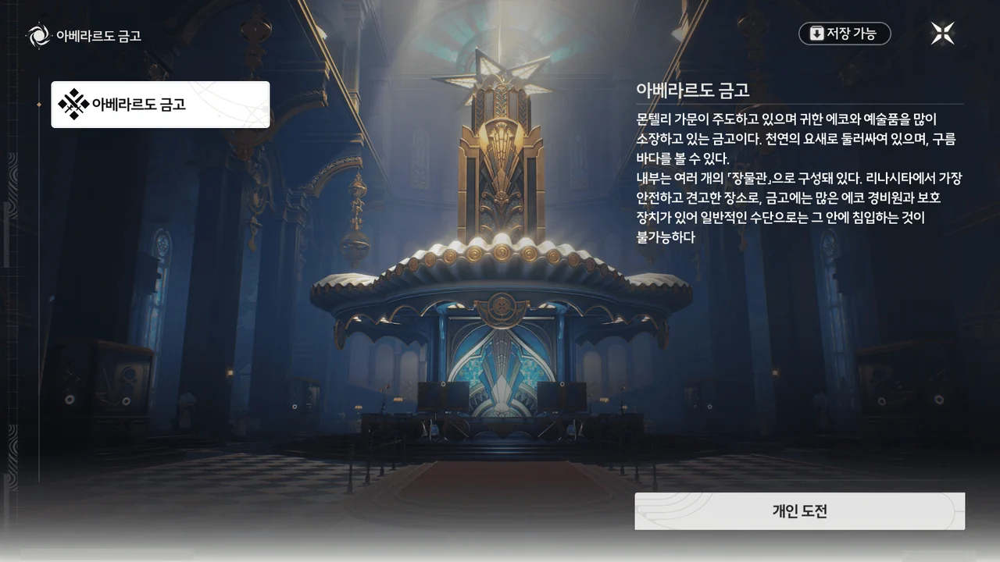

> **아베라르도 금고**
> ***
> 몬텔리 가문이 주도하고 있으며 귀한 에코와 예술품을 많이 소장하고 있는 금고이다. 천연의 요새로 둘러싸여 있으며, 구름 바다를 볼 수 있다.
> 내부는 여러 개의 「장물관」으로 구성돼 있다. 리나시타에서 가장 안전하고 견고한 장소로, 금고에는 많은 에코 경비원과 보호 장치가 있어 일반적인 수단으로는 그 안에 침입하는 것이 불가능하다.
{.bq}







아베라르도 금고에 들어오자마자 카를로타가 젠니에게 증거품을 보관실에 보관한 후, 「메이크업실」에서 「주얼리 세트」와 「향수」를 가져다 달라고 한다.

나이알라의 가게, 「마스체라 미라지」 앞에서 카를로타와 만났을 때, 카를로타는 나이알라에게서 「향수」, 「파운데이션」, 「주얼리 세트」를 받아갔었다.
굳이 단어를 「」로 감싼 걸로 보아, 그것들이 정말로 화장품을 의미하는 것이 아니라 다른 무언가를 의미하는 것이리라 추측했었고.

젠니의 반응을 보니, 정말 그런가 보다.











> 깊은 바다 수도회와 피살리아 가문의 배후에 어두운 그림자가 숨어 있다는 건 알았을 거야.
> 몬텔리 가문은 그들과 약간의... 그다지 유쾌하지 않은 교제를 하고 있어. 진짜 의도는 아직 드러나지 않았지만, 분명 다른 두 세력이 원하는 바와 일치하는 거겠지.

이건 둘 중 하나다. 내 국어 실력이 매우 모자라거나, 명조 번역을 맡은 사람의 한국어 실력이 매우 모자라거나.

저 문단을 처음 읽었을 때, 나는 몬텔리 가문 역시 수도회와 피살리아 가문처럼 잔성회에 붙어먹은 줄로 알았다.

그런데 한참을 문장 요소를 뜯어 가며 다시 읽으니, 대명사와 생략된 주어를 다음과 같이 치환해 풀어 해석해야 하더라.

> 몬텔리 가문은 잔성회와 약간의... 그다지 유쾌하지 않은 교제를 하고 있어. 잔성회의 진짜 의도는 아직 드러나지 않았지만, 분명 깊은 바다 수도회와 피살리아 가문이 원하는 바와 일치하는 거겠지.

'그다지 유쾌하지 않은 교제'는 사이가 좋지 않아 서로 반목하는 상황을 돌려 말할 때 자주 쓰이는 문구이니 이해하기 쉬웠지만, 나머지는 조금... 까다로웠다.

한국어의 특징 중 하나가 바로 주어와 목적어를 생략 가능하고, 그로 인해 오해가 발생할 수 있다는 건데, 그걸 왜 대체 제대로 고려하지 않은 거지? 이건 번역가 문제가 맞다고 생각한다.











응? 왜 크리스토포로가 여기에 있는 거야? 어째 좀 자주 만나는 것 같네.

크리스토포로는 오늘 있을 경매에서 소실된 지 오래된 고대 시나리오 원고가 있는지 보러 왔다고 한다.

크리스토포로가 한번 읽어보라고 건네준 원고는 아직 읽지 않아서 솔직하게 대답했다. 실망하는 크리스토포로의 모습을 보니 조금 미안해지는데...





음... 읽어봐도 잘 모르겠어! 정말로.

글을 읽고 손발이 오그라드는 걸 보면, 역시 나와 연극은 잘 맞지 않나 보다.





본래 계획은 카를로타의 숙부, 코폴라에게 수집한 증거를 보여주고 잔성회에 대해 이야기하는 것이었는데, 코폴라가 지금 아베라르도 금고에 없다고 한다.

분명 오늘 경매 때문에 아베라르도 금고에 몬텔리 가문 상층부가 전부 모일 예정이라 들었는데... 그만큼 일이 바쁘다는 건가?















질베르토를 심문한 결과, 몬텔리 가문에 내통자가 있음이 밝혀졌다. 그들은 현재 잔성회의 후원을 받아 금고 조율실에서 무언가를 벌이고 있고.

방랑자가 수도회와 피살리아 가문에 불리한 증거를 아베라르도 금고에 가져왔으니, 잔성회 세력의 다음 행보는 불 보듯 뻔하다. 분명 몬텔리 가문의 배신자를 통해 그 증거를 인멸하려 하겠지.

그래서 카를로타는 배신자들이 증거물에 정신 팔린 틈을 타, 그들을 급습할 계획을 세웠다.

&nbsp;

그런데... 대체 왜 크리스토포로가 방랑자와 카를로타의 대화를 뒤에서 몰래 보고 있는 걸까?
이상하게 방랑자와 자주 만나는 것도 그렇고... 설마 크리스토포로는 잔성회 간부인 걸까? 일단 옷부터 빨갛잖아.







당연한 일이겠지만, 방랑자와 카를로타가 조율실로 향한 틈을 타 배신자들이 증거물을 없애는 걸 막기 위해 젠니를 보관실 경비로 세웠다.







내부에 배신자가 나타날 것을 우려한 몬텔리 가문은 아베라르도 금고를 지을 때 방어 장치를 이중으로 설계한 후, 대부분의 가문 구성원에게 방어 장치 중 하나의 해제 방법만 알려주었다고 한다.
금고에 보관된 재물을 노린 배신자들이 동료를 금고에 가둬 재물을 독차지하려는 욕심에 서로를 재차 배신하는 걸 노린 것이다.





방랑자를 필드에 내버려 두고 다른 캐릭터를 조작하는 건 이번이 처음이지 않나? 뭔가 생소하면서 새롭네...





카를로타가 말한 「주얼리 세트」는 탐색 모듈의 '보조기-사격'을 뜻하는 은어라고 한다.
카를로타의 공명 어빌리티는 보석처럼 생긴 결정체를 생성하는 것이니, 이를 발사할 수 있는 '보조기-사격'을 '주얼리 세트'라고 부르는 건 나름 의미 있는 은유였던 것이다.



카를로타가 발사하는 결정체는 감시 카메라뿐만 아니라 블레이드 댄서 역시 얼릴 수 있다.





금고의 장식품으로 사용하는 스캐터 프리즘으로 카를로타의 공명 어빌리티를 강화할 수 있다.



「향수」 역시 다른 무언가를 뜻하는 은어이지만, '무기'의 일종이라는 단서밖에 얻지 못했다.

당장 생각나는 건 독이나 수면 효과를 가진 연막을 내뿜는 연막 수류탄 정도려나...



스캐터 프리즘을 터트리면 블레이드 댄서를 반영구적으로 얼릴 수 있다.





이제야 방랑자 앞에 있던 문을 열 수 있다.









카를로타가 기믹을 이용한 퍼즐 쪽이었다면, 방랑자는 단순한 전투다.
별의별 에코가 다 나오더라고.















방랑자가 금고 시설을 조작해 카를로타가 반대편으로 넘어갈 수 있는 길을 만들어주었다.

음... 이런 걸 뭐라고 부르더라? 플레이어가 주변 환경을 조작해 화면 내 캐릭터가 앞으로 이동할 수 있게 만드는 그런 부류의 게임...
아마 어드벤처 게임의 하위분류 중 하나였던 것 같은데, 아무튼 그런 게임을 하는 느낌이었다.
옛날에 플래시 게임으로 많이 했는데.



카를로타도 심심하지 말라고 전투를 넣어줬네.















카를로타가 방랑자 앞의 문을 열고 방랑자와 합류하려던 순간, 바닥이 꺼지며 어디론가 추락해 버렸다. 대체 왜 금고 지하에 이런, 소노라 내부처럼 생긴 폐허가 있는 건지는 잘 모르겠지만.

그나저나 경계치가 100이 되면 에코 경비원을 소환하고 경계치 50을 깎아야 하기 때문에 경계치를 100 대신 99로 강제 설정해 둔 것이 제법 재미있다.
에코 경비원이 소환될 때 경계치 50이 깎이는 건 어떻게 알았냐고? 나도 알고 싶지 않았어...







부리나케 달려간 방랑자 눈에 점점 닫히는 문과 그 너머에서 이쪽을 향해 날아오는 카를로타가 보인다.
방랑자가 자신의 직검을 던져 문이 닫히는 걸 조금이나마 늦췄고, 그 틈을 타 카를로타가 문에 끼이지 않고 무사히 이쪽으로 넘어올 수 있었다.

카를로타를 안듯이 받는 방랑자는 덤이고.







카를로타는 몬텔리 가문의 차녀이지만, 가문 내에서의 실질적인 역할은 가문 내외의 위협을 비밀리에 처리하는 암살자, 히트맨이다. 당연히 무력이 높을 수밖에.







배신자들이 미리 조율실 앞에 깔아 둔 에코 경비원은 별다른 문제가 되지 않았다.

예전에 들은 이야기인데, 조율실 앞의 블레이드 댄서 *쌍둥이*는 아토믹 하트에 등장하는 '쌍둥이' 로봇의 오마주라고 하더라.
그 게임도 언젠간 한번 하긴 해야 하는데...









몬텔리 가문의 배신자인 조율사들은 잔상의 주파수를 해체한 후 역방향으로 재구성하는 연구를 진행하고 있었다.

잔성회의 후원을 받아 진행하는 연구이니, 울음새 늪에 있었던 '직정' 유적지에서 있었던 일처럼, 좋지 않은 결과만을 만들어낼 것이 뻔하다.









조율사들이 위에서 시켜서 한 일이라 애써 변명하지만, 이들이 몬텔리 가문에 들어올 때 한 맹세에 따르면 그건 핑곗거리도 못 되는 모양이다.

조율사들이 조작해 언제든 잔상으로 변할 수 있게 된 에코가 카니발에서 잔상으로 변해 사람들을 습격하면, 카니발이 엉망이 되는 것은 물론이요 카니발 개최를 주도한 몬텔리 가문 역시 큰 손해를 보게 된다.

그런데 이들이 하는 말을 들어보면, 그런 일이 일어날 수 있다는 걸 이미 잘 알고 있었던 것 같거든.





조율사들에게 지시를 내린 건 몬텔리 가문의 고위 인사 중 하나로, 암호화된 회선으로만 연락했기에 현재로서는 그 정체를 알 수 없다.

조율사들의 조작을 통해 언제든 잔상으로 변해 폭주할 수 있는 에코는 이미 셀 수 없이 많이 만들어졌고, 그중 일부가 이미 카니발 집회 장소에 인도되었다고 한다.
정상 에코와 육안으로 구분하기 몹시 어렵다고 하니, 아마 카니발에서 쓸 에코 전부를 교체하게 될 것 같네.







일단 몬텔리 가문의 배신자 이야기는 일단 여기서 끝이다. 가문 상층부에 또 다른 배신자가 있다는 걸 알게 되긴 했지만, 그걸 지금 해결할 수는 없으니까.
아마 그건 다른 유형의 임무에서 해결하게 될 것 같네. 카를로타 얽힌 별 임무나 기록, 위험한 임무 같은 것 말이다.

몬텔리 가문의 장인이 회수한 에코를 수리하던 중, 흥미로운 걸 발견했다고 한다.
