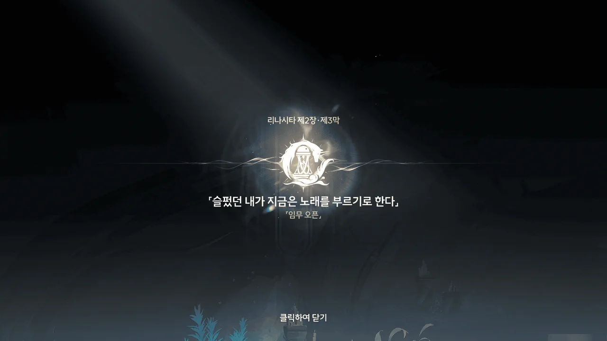











겨우 골룡의 방해를 뚫고 다리를 다 건넜나 싶었는데, 방랑자가 다리를 건넌 게 그렇게도 싫었는지, 이번엔 골룡이 방랑자에게 브레스를 쏜다.

포포가 그걸 대신 흡수해 방랑자를 구하려 했으나, 브레스의 압력이 너무 센 탓에 브레스에 밀려 방랑자와 함께 다리 밑으로 떨어졌다.

잠시 후, 방랑자가 눈을 떴을 때에는 포포가 이미 성흔 속으로 돌아간 후였다.















수변에 누워있던 방랑자를 약자라 생각한 건지, '심판하는 전사'가 떼로 달려든다.

<figure>

> 팔에 커다란 낫이 선 인간형 잔상. 약한 상대를 선호하며 약자만을 찾아 그들의 생사여탈을 심판한다.
> ***
> '심판하는 전사' 플레이버 텍스트
{.bq}

<figcaption class="gallery-figcaption">한마디로 그냥 '약자멸시 Pussy'다.</figcaption>
</figure>

그때 웬 여행가방이 날아오더니, 그 안에서 로코코가 튀어나왔다.

로코코와 여행가방은 인근에 있던 잔상들을 여행가방 안에서 쏟아져 나온 주먹과 로켓으로 모두 쓸어버렸고, 그 폭발의 반동을 타고 방랑자 앞까지 통통 튀어왔다.

여행가방 안에서 튀어나온 건 '펠로'라고 하는 녀석인데, 설지의 '우담'처럼 로코코의 공명 어빌리티가 울림 생물의 형태로 구현된 게 아닐까 생각한다.

&nbsp;

아, 공식 설정상, 게임에서 로코코가 장착하는 권갑 무기는 사실 로코코가 착용하는 게 아니라 펠로가 착용하는 것이라고 한다.



그래서 로코코 무기 탭을 열어보면 이렇게 로코코가 아닌 펠로가 권갑을 끼고 있다.







저번에 배에서 봤을 때에도 느낀 거지만, 로코코는 감정 표현이 매우 서툴다. 외부로 표출되는 감정에 큰 진폭이 없어 잔잔하기만 하다.
하지만 펠로는 무슨 생각을 하는지 표정에 다 드러난다고 해야 할까, '얼굴에 다 보인다'.

로코코가 들고 다니는 저 여행가방의 주인은 틀림없이 로코코일 거라 생각했는데, 그 주인은 로코코가 아닌 펠로였다. 펠로가 사는 곳도 바로 저 여행가방 안이고.
왜 그런가 해서 로코코 캐릭터 스토리를 찾아 읽어보았는데, 해변에 난파한 순례선 근처에 정신을 잃고 쓰러진 로코코 앞에 나타난 게 바로 펠로와 여행상자였다고 한다.

그나저나 대체 방랑자는 무슨 페로몬을 뿌리고 다니길래, 온갖 생물들이 방랑자를 좋아하는 걸까?









고작해야 방랑자 머리 크기 정도밖에 안 되는 포포가 안간힘을 쓰며 방랑자를 질질 끄는 모습이 정말 대견스럽다.

> 왜 갑자기 뛰쳐나온 거지... 먹을 만한 주파수를 감지한 건가? 그런데 왜 먹질 못한 걸까...

그런데 방랑자가 하는 생각 꼬락서니 하고는.
그 커다란 용이 쏜 브레스도 막아 줘, 물에 빠진 방랑자도 구해줘... 다 해줬잖아!





방랑자를 공격한 건 「탄식 무덤의 섬」의 원생 잔상인 「탄식의 고룡」이라고 한다.

본래 이 섬은 수도회가 순례를 위해 사용하던 성소였으나, 흑조 이후 발생한 수많은 잔향과 구름 바다에서 퍼져온 울림 구름에 이끌려 흘러 들어온 잔상 때문에 섬의 환경이 변화해 지금과 같은 모습이 되었다고 한다.



카를로타와 헤어지기 전, 카를로타가 말했던 「무덤」이 바로 이 섬을 뜻하는 것이었다.

본래 계획은 카를로타가 보낸 사람들이 이 섬에서 방랑자를 맞이하는 것이었지만, 탄식의 고룡이 깽판을 치는 바람에 계획이 꼬인 모양이다.















탄식 무덤의 섬을 뒤덮고 있는 바다 안개는 잔향을 수집하는 특성을 지니고 있어, 다양한 이유로 발생한 잔향이 흩어지지 않고 서로 합쳐져 잔상으로 변한다고 한다.

로코코가 여기 온 이유는 순례선 조난자들을 구출하기 위해 바다 안갯속으로 떠났다가 여태껏 돌아오지 않은 브렌트를 찾기 위해서라고 한다.
그러다가 우연찮게 방랑자를 만난 거네, 그럼.

로코코가 잔상을 막을 수 있는 아이템이라며 가방에서 이런저런 무기를 꺼내서 주는데, 보자마자 든 생각은 '저거 아무리 봐도 3성 무기인 것 같은데'였다.
그런데 방랑자가 평소 들고 다니는 무기는 내 기억대로라면 1성 무기이니, 아무래도 상관없지 않을까 싶다.

로코코 혼자 돌아다니는 게 마음에 걸려, 로코코와 함께 브렌트를 찾아보기로 했다.
일단 목표는 바다 안개에서 유일하게 안전한 구역, 등대이다.

제2장 리나시타 제3막 \[슬펐던 내가 지금은 노래를 부르기로 한다\] 시작.





저 고룡 녀석은 무슨 억하심정이 있길래 방랑자를 이리도 괴롭히는 걸까.





엎친데 덮친 격으로, 바다 안개에 포함된 대량의 오염된 울림 에너지 때문에 방랑자의 공명 어빌리티가 불안정하다고 한다.

그야말로 억까가 가득한 섬이네.
이 섬은 바다 안개 때문에 잔상, 그리고 제법 강력한 잔상이 다른 지역에 비해 더 자주 나오는 곳이다.
비공명자는 애당초 잔상과 제대로 된 싸움을 할 수 없는데, 잔상과 전투가 가능한 공명자마저도 바다 안개 때문에 공명 어빌리티 사용에 제약이 걸린다.
게다가 여기서 죽은 사람들이 남긴 잔향은 바다 안개에 의해 잔상으로 변해버린다.

... 이렇게 적고 나니까 금주에서도 비슷한 일이 있었던 것 같은데...
금주에서 비슷한 일을 일으켰던 게 명식이었으니, 아마 이 바다 안개, 그리고 바다 안개의 원인이 된 흑조 역시 명식이 일으켰던 게 아닐까?





바다 안개 때문에 아직 흩어지지 못한 잔향이 방랑자 일행을 어디론가 인도한다.











금빛 허영의 안내를 따라갔다가 하마터면 고룡과 마주칠 뻔했다.

고룡이 바위 뒤에 숨은 방랑자 일행을 발견하지 못해 무사히 넘어갈 수 있었지만, 숨어있는 내내 나는 저 금빛 허영이 방랑자 일행을 엿 먹이려고 일부러 고룡이 오는 방향으로 방랑자 일행을 안내한 게 아닐까 하는 의심을 떨쳐내지 못했다.













하지만 실제로 그 금빛 허영과 마주쳐 대화해 보니, 금빛 허영은 정말로 로코코를 걱정하고 있었으며, 홀로 남은 로코코가 외로워할까 봐 *성불*하지 못하고 여태껏 남아 있었던 것이었다.







탄식 무덤의 섬에서 죽은 사람들이 남긴 잔향 중 일부는 생전의 의지에 따라 다른 잔향과 융합되는 걸 거부하고 길 잃은 사람들을 바다 안개 밖으로 안내하기도 한다고 한다.
물론, 시간이 오래 지나면 잔향에 남은 의지가 희미해져, 다른 비슷한 신세의 잔향과 합쳐져 잔상이 되어버리지만.

로코코가 「바다반디석」을 들고 다니는 건 잔향이 물건에 달라붙는 성질을 이용해, 죽은 사람들의 잔향이 고룡에게 먹혀 사라지는 걸 막기 위해서였고.







역시나.

라군나에서 법을 어긴 사람들은 법원 역할을 하는 「사면원」으로 보내져 재판을 받게 되지만, 계율과 교리를 어긴 사람들은 수도회에 의해 「우인」이라는 칭호를 받고 속죄의 명목으로 순례선에 강제로 태워지게 된다고 한다.

나중에 수도회의 초대 수좌가 되는 나폴리 2세는 첫 흑조가 왔을 때 낡은 목선을 타고 해류의 안내를 받아 수호신을 알현했고, 이후 수도회를 창립했다고 한다.
수도회가 우인들을 순례선에 태워 보내는 것은 초대 수좌가 걸었던 길을 다시 걸으며 참회

하지만 흑조의 영향 때문에 모든 배는 인위적으로 항로를 바꾸지 않는 한 탄식 무덤의 섬으로 오게 되어 있고, 결과적으로 순례선에 탄 사람들은 탄식 무덤의 섬에 표류하게 된다.

... 그러면 초대 수좌는 대체 어떻게 수호신을 만난 거지?
해류가 모든 배를 탄식 무덤의 섬으로 이끄는 건 흑조의 영향 때문이니, 나폴리 2세가 탄 목선 역시 탄식 무덤의 섬에 도착했어야 한다.
그런데 여기엔 수호신은커녕 사람을 잡아 찢을 생각으로 가득한 잔상밖에 없잖아.









표류한 순례선에 남은 사람이 없기에 등대로 이동하던 중, 브렌트의 목소리가 들린다.

잔상을 귀신이라 부르는 브렌트의 관점은 그리 틀린 게 아니라 볼 수 있다. 잔상을 구성하는 주파수의 출처는 대개 여기서 죽은 사람들이 남긴 잔향일 테니.











브렌트가 「커튼콜 답례」를 하느라 정신이 팔린 사이, 브렌드의 등을 공격하려던 잔상을 로코코가 순식간에 처리한다.

그러면서 하는 말이 조금 무섭다.

> 천만에요. 「커튼콜 답례」 때 동작이 좀 더 크고, 머리를 왼쪽으로 10 센티미터 정도만 더 기울였다면... 펑, 하고 터지는 건 저 잔상이 아니라 브렌트의 머리였을 텐데 말이죠.

방랑자 역시 로코코의 촌철살인급 발언을 듣고 기겁했다.

그나저나... 내기할 때 빼고 운이 좋은 거면 그냥 운이 없는 거 아냐?







브렌트가 구조한 사람은 다름 아닌 안드레아였다. 방랑자가 처음 리나시타에 도착했을 때, 순례선에 강제로 태워진 우인 중 한 명이었지.

안드레아는 평생 수호신을 착실히 믿으며 열심히 일해왔지만, 수도회는 속세의 향락을 버리고 천국의 부를 쌓아야 수호신의 가호를 받을 수 있다며 갈수록 무거운 세금을 부과했다고 한다.
하지만 정작 안드레아의 상선단이 해적의 약탈로 전멸하자 수도회는 그 또한 수호신이 내린 고난이니 마땅히 받아들여야 한다며 안드레아를 돕는 걸 거절했다.

뭐... 더 이상 안 봐도 견적이 다 나왔다.

&nbsp;

"속세의 향락을 버리고 천국의 부를 쌓는다"는 말에서 제일 먼저 떠올린 건 다름 아닌 면죄부였다.

> 모금함에 동전이 짤랑하고 떨어지는 순간 영혼이 연옥에서 천국으로 날아오른다.
> ***
> 도미니코회 수도자 요한 테첼의 설교문으로 알려진 글 中
{.bq}

실제로 테첼이 저런 발언을 한 것인지는 확실치 않다고 알고 있다.
다만 한 가지 확실한 건, 루터가 주장한, 테첼의 또 다른 설교 내용인 "성모 마리아를 범했더라도 면죄부는 그 죄를 씻어준다"는 근거 없는 풍문에 불과하다는 것이다.
당시 교회 및 시민 당국은 테첼이 그런 발언을 한 적 없다고 증언했으며, 현재 루터교회조차 루터의 해당 주장은 근거가 없다고 보고 있으니까.
하지만 모금함 동전 설교 내용을 부정하는 글은 없는 걸 보면, 테첼이 면죄부를 팔 때 모금함 동전 소리를 운운한 건 틀림없는 모양이다.

내 눈에는 "속세의 향락을 버리고 천국의 부를 쌓는다"는 말과 면죄부가 똑같이 보이거든.









브렌트의 극단, 「우인 극단」 역시 수도회가 추방한 「우인」들로 구성된 퍼레이드 극단이었다.

그나저나 순례선에는 식량과 물을 따고 싣지 않는 건가? "허기와 갈증의 시련"을 말하는 걸 보면 배에 식량이나 물이 없는 것 같다.
정말 그런 거라면 수도회는 정말로 죽으라는 의미로 사람들을 순례선에 태워 보낸 것이라는 말인데...

정말 가면 갈수록 수도회에 대한 정이 뚝뚝 떨어져 가네.

> 「구원의 길」 같은 건 여기에 존재하지 않아요.
> 그게 아니라면... 내가 봐 온 과거의 순례지가 왜 연옥의 모습을 하고 있겠어?

멋진 말이다.



심지어 수도회에서는 우인들을 확실히 죽일 생각으로, 우인들에게 "섬머리의 제사장에게 기도하면 수호신의 용서를 받을 수 있다"라고 거짓말을 했다.

안드레아를 제외한 나머지 사람들은 그 말을 철석같이 믿고 이미 산꼭대기로 향한 상태.











사람들을 구하기 위해 케루브를 타고 산꼭대기로 향한다.

상자 속으로 쏙 들어가는 로코코를 보면, 대체 상자 안이 어떻게 되어 있는 건지 정말 궁금해진다. 무슨 아공간 같은 게 있는 건가?
