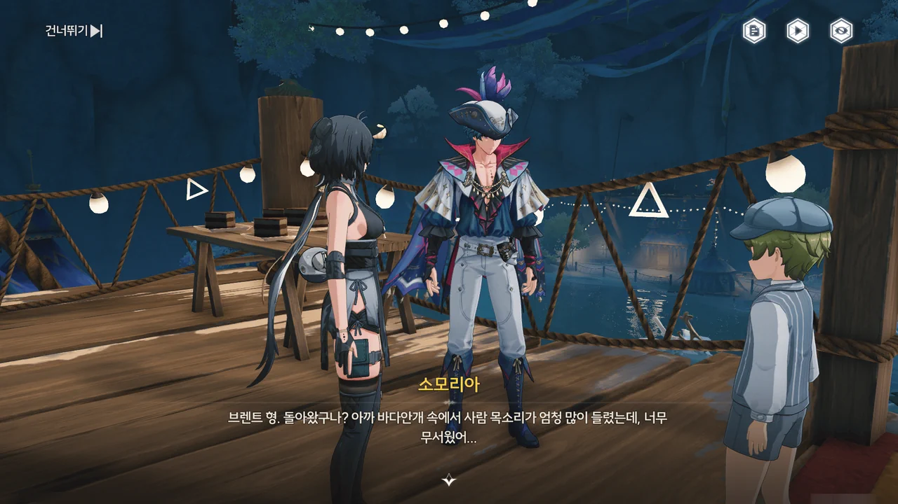
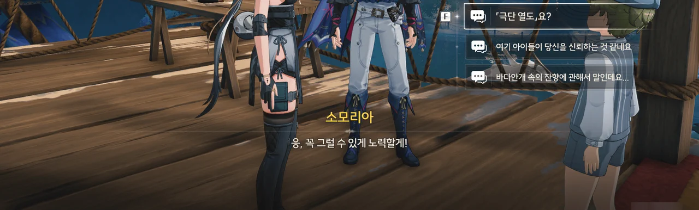
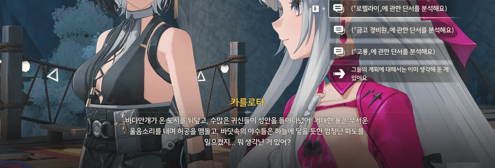
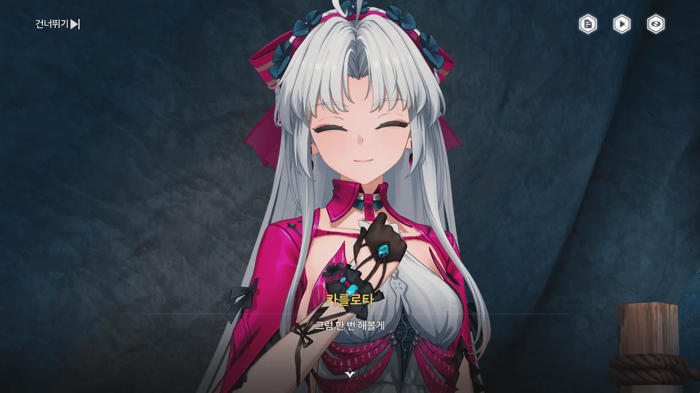
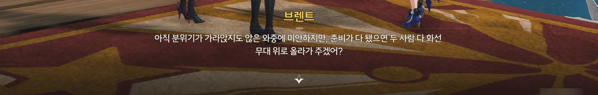





명조의 번역 수준에 또 한 번 머리를 탁 칠 수밖에 없다.

"섬머리의 제사장한테 기도를 하면"이라는 대사를 듣고, 난 '제사장'이 '제사를 집도하는 사람'을 뜻하는 祭司長인 줄 알았다.
그야, '한테'는 '에게'의 구어적 표현이고, '에게'는 사람이나 동물 따위에게 붙는 조사니까.

그런데 '뱃머리 제사지'라는 지역 이름이나, 로코코와 브렌트의 대사를 보면 아무래도 저 '제사장'은 '제사를 보는 장소'라는 뜻의 祭祀場인 것 같다. 정작 한국어 사전에서 祭祀場의 뜻은 '제사 때 쓸 제물을 마련하기 위해 보는 장'이지만.

그럴 거면 앞선 대사를 "제장에서"라고 번역했어야 할 거 아냐, 이 멍청이들아!
아니면 차라리 오역이긴 해도 그럭저럭 말이 되는 "제사장에서"라고 번역을 하던가...







"섬머리의 제장에서 기도를 하면 수호신의 용서를 받을 수 있다"라는 말이 모든 우인을 탄식의 고룡에게 먹이로 바쳐 죽일 의도로 한 거짓말이었음을 아직 깨닫지 못한 한 우인이 탄식의 고룡에게 맞아 죽을 뻔한 걸 브렌트가 잽싸게 구해준다.







먹을 걸 눈앞에서 뺏긴 탄식의 고룡은 *당연히* 분노했다. 그래서 네가 뭘 할 수 있지?

> | | |
> |:--|:--|
> | 브렌트 | 보통 명령을 내리는 건, 항해사보다는 선장 쪽 아닌가? |
> | 로코코 | 불만이 있다면 브렌트가 술을 숨겨놓은 곳을 극단 멤버들한테 폭로할 거예요. |
> | 브렌트 | 맡겨만 주시죠, 일등 항해사님! |
> {_borderless=true,_thead=false}

ㅋㅋㅋㅋㅋㅋ 정말 둘이 잘 어울린다니까 ㅋㅋㅋㅋㅋㅋ

뭐라고 해야 할까, 브렌트가 '일은 그럭저럭 잘하는데 빈틈이 송송 뚫린 대장'이고, 로코코가 '그 빈틈을 꼼꼼하게 메꾸고 보조하는 서포터'라는 느낌이다.











방랑자가 탄식의 고룡, 게르히넘을 쓰러트리고 마무리를 지으려던 찰나, 포포가 다시 나타났다.

그렇지 않아도 상태가 좋지 않았던 포포는 다리 위에서 탄식의 고룡이 쏜 브레스를 흡수하다 그만 속에 탈이 나고 만 것이었다.
그런데도 그 좋지 않은 몸을 이끌고 물에 빠진 방랑자를 낑낑대며 물가로 옮겼단 거잖아... 이 기특한 녀석.

아무튼, 몸이 어느 정도 회복된 포포는 방랑자에게 금주에서 했던 것처럼 탄식의 고룡과 '공감'해보라고 한다.

방랑자가 금주에서 잔상과 '공감'한 적이 있나 싶어서 예전에 쓴 글을 잠시 검색해 보았는데, 아무리 봐도 포포가 말하는 '공감'은 '공명'인 것 같다. 당장 명조의 오역 중에 '공명 스킬'을 '공감 스킬'이라 번역해 둔 것이 있었거든.
이 놈들, 아직도 번역 오락가락하는 거, 안 고쳤다.









수도회의 누군가가 게르히넘을 제압하고 머리 위에 가시관을 씌워 게르히넘을 조종했다.

본래 게르히넘의 몸은 탄식 무덤의 섬에 널려 있는 잔상을 흡수하는 것만으로 충분히 유지될 수 있었다.
하지만 수도회가 게르히넘을 가시관으로 억압하고 조종하는 바람에 게르히넘의 주파수가 빠르게 약해졌고, 결국 게르히넘은 살아남기 위해 주변의 모든 것을 닥치는 대로 공격해 흡수하는 '수도회의 사형 집행자'가 된 것이다.

또 수도회 너야?
금주에서 흉참한 일이 생길 때마다 잔성회를 지목하면 대부분 들어맞았듯이, 리나시타에서는 흉참한 일이 생길 때마다 수도회를 지목하면 대강 들어맞는 느낌이다.











심지어 이번 일에는 수도회뿐만 아니라 잔성회도 개입했다.

리나시타로 향하던 중, 회유의 고래가 방랑자를 공격할 때 회유의 고래 꼬리에 플로로의 피안화가 붙어있는 걸 보고 '아, 잔성회가 리나시타에서도 무슨 일을 벌였구나'라고 생각했었는데, 그 꽃이 게르히넘에게도 붙어있었다.





아무리 봐도 잔성회와 수도회의 목적은 이번 카니발을 엉망으로 만드는 것으로 보인다.

마침 카니발에서 「영광의 월계관」을 얻은 사람이 우인 극단의 아지트에 머물고 있다기에, 브렌트와 함께 거기로 향하기로 한다.







놀랍게도, 우인 극단의 아지트는 탄식 무덤의 섬에 위치해 있었다.
바다안개 때문에 인적이 드물고, 수도회의 사람 역시 쉽게 올 수 없는 곳이라 여러모로 안성맞춤인 곳이라고.
다만 바다안개가 불러오는 잔상이 골칫거리라고 한다.

브렌트가 말한, 월계관을 얻은 사람의 이름은 '바도리오'.
브렌트와 로코코가 남은 골칫거리를 처리하는 동안, 극단을 둘러보기로 했다.









브렌트가 소모리아라는 이름의 꼬마를 돌보고 있다.
「자신의 선장」이라... 제법 멋진 소리를 하잖아.

「전설의 선장 스패로우」... 아무리 봐도 이거, '캐리비안의 해적'에 나오는 '잭 스패로우'를 말하는 것 같은데.



캐릭터도, 테마곡도 정말 내 마음에 들었는데 말이다.





「극단 열도」는 등불꽃을 원료로 한 술이었다.

괜히 브렌트가 "용감한 선장이 되면 자신만의 「극단 열도」를 가질 수 있다"라며 말을 얼버무린 게 아니었네.

그래, 미성년자의 음주는 몸에 나쁘다고.







> 선장으로서 가장 중요한 것은 선원들의 「항로 표지」가 되는 거니까. 두렵거나 슬픈 표정을 보여서는 안 돼.

그게 리더로서의 책무라는 거겠지, 아마?







앞서 짐작했던 것이지만, 탄식 무덤에 섬에 도착하는 모든 우인이 우인 극단에게 구조받는 결말을 맞지는 못했다.

대부분은 극단을 만나기도 전에 잔상에 의해 목숨을 잃었고, 그들이 남긴 주파수는 그대로 탄식 무덤의 섬에 남게 되었다.













브렌트가 「우인 극단」은 우인들의 종착지가 아닌, 하나의 경유지일 뿐이라고 말한다.

자신이 하고 싶은 일을 찾아 떠나기로 한 사람들은 자신의 이름과 이야기를 극단에 남긴 다음, 자신의 배를 타고 훌쩍 먼바다로 떠났다.
그 후 그들이 어떻게 되었는지는 아는 사람이 없지만...

브렌트가 추방된 이유는 정말 치졸하기 그지없었다.
라군나성의 그 누구도 수호신의 모습을 본 적이 없는데 어째서 다들 성당 앞의 조각상을 수호신의 모습으로 여기는 것인지 물어봤다는 이유 하나만으로, 수도회는 어린아이를 순례선에 태워 내쫓았다.
정작 그 당사자는 순례선을 타고 떠나는 게 위대한 모험이라고 생각했지만.

같은 순례선에 탄 다른 우인들이 브렌트에게 부족한 물자를 나눠주고 그의 동심을 지켜준 덕분에 브렌트는 무사히 자랄 수 있었다.
하지만 순례선에 탄 우인들은 시간이 갈수록 점점 하나하나 사라져 갔고, 그 모습을 보며 브렌트는 다시는 선량한 사람들이 눈물을 흘리지 않게 하겠다고 다짐했다.

탄식 무덤의 섬에 도착한 후, 브렌트와 우인들은 잔상들을 몰아내고 다른 순례선의 잔해를 끌어모아 안전한 항구를 건설했으며, 거기서 「우인 극단」이 시작되었다.







나는 수도회가 우인들이 다시 라군나성으로 돌아오는 걸 금지했을 거라 생각하고 있었다.
애당초 수도회가 우인들을 순례선에 태워 보내는 건 탄식 무덤의 섬에 가서 잔상이나 탄식의 고룡에게 먹혀 죽으라는 의도였으니까 말이다.
하지만 바도리오의 말을 들어보면, 그렇지는 않은 것 같다.

그래서 곰곰이 생각해 보니, 수도회가 우인들의 라군나성 재입성을 막을 명분이 전혀 없었다.

실제 의도가 어찌 되었건, 수도회가 우인들을 순례선에 태워 보내는 건 어디까지나 초대 수좌의 행적을 따라 하는 것이다. 순례선은 해류 때문에 초대 수좌가 도착했던 탄식 무덤의 섬으로 갈 수밖에 없으니까.

(성지)순례는 '성지를 향해 건너가는 행위'와 '성지에 대해 예경(禮敬)을 표하는 행위'로 구성되어 있다.
따라서 순례선이 성지인 탄식 무덤의 섬에 도착한 순간, 우인들의 순례는 완료된다. 따라서 수도회가 내린 '처벌' 역시 끝이 나게 된다.
그 이후에 사람들이 잔상이나 고룡에 먹혀 죽는 건 어디까지나 '안타까운 사고'일뿐이고.

수도회가 라군나성에 돌아온 우인들에게 감시를 붙이는 이유는 아마 자그마한 꼬투리라도 잡아 그들을 다시 순례선에 태워 내쫓을 궁리를 하는 것일지도 모르겠다.













이 할아버지, 생각보다 훨씬 더 유쾌한 사람이었다.

카니발에서 우승한 후 하늘에서 내려온 월계관을 쓰고 수호신과 대화할 기회를 얻은 바도리오가 수호신과 한 대화가 정말 압권이다.

> | | |
> |:--|:--|
> | 바도리오 | 오늘 저녁으로 뭘 먹을까요? |
> | 임페라토르 | 몸은 정신을 담는 그릇이니 해로운 음식을 많이 먹어선 안 됩니다. 저라면 「푸른 가지 월계 샐러드」를 먹을 것입니다. |
> {_borderless=true,_thead=false}

무려 수호신에게 '오늘 저녁 메뉴 추천 좀'을 시전 한 바도리오도 그렇고, 거기에 진지하게 '몸에 좋은 샐러드'라고 답한 임페라토르도 그렇고... 정말 다들 미쳤어...

성녀가 사라진 후, 수도회는 성녀를 애도한다는 명목 아래 카니발을 경전 연극 행사로 바꿔버렸다.
이에 항의하기 위해, 바도리오는 카니발에서 상연되고 있던 수도회의 연극에 「구름 제조기」로 만든 금분홍색 꽃을 잔뜩 뿌려 방해했고, 그 죄로 라군나성에서 추방당했다.

정말 인생이 다이나믹한 할아버지였네.







수도회가 자신의 뜻을 거스른 우인들을 직접 처형하지 않고 순례선에 태워 탄식 무덤의 섬으로 보내 죽게 만드는 데에는 다 이유가 있다.

만약 수도회가 죄인을 직접 처형할 경우, 다양한 반발에 직면하게 될 것이다.

1. 왜 수호신이 아닌 수도회가 나서서 죄인을 처형하는가?
   물론 교리를 들먹이며 '수호신이 위임한 것이다'라고 주장할 수는 있겠지만...
2. 수도회에 의해 처형당한 죄인이 사실 억울한 누명을 쓰고 처형당한 것이라면, 과연 누가 이에 대한 책임을 져야 하는가?
   사형이라는 것은 결코 되돌릴 수 없는 것이다. 억울한 죽음에 관련된 모두를 처형한다고 해서 죽은 사람이 되돌아오는 건 아니다.

그래서 가톨릭 교회에서도 가장 무거운 벌로 내린 것이 '파문'이었다.
뭐, 여기에도 '파문당한 사람은 교회와 마을의 공동체원이 아니니 이방인이고, 때려잡아도 된다'라는 당시의 *상식*이 함정으로 자리 잡고는 있지만.

게다가 처형 방식이 어떻게 되었건, 사람이 죽는다는 건 사람들에게 강렬한 기억을 심어준다.

하지만 죄인을 순례선에 태워 탄식 무덤의 섬으로 보내는 건 수도회의 손을 더럽히지 않는 깔끔한 처형 방식이다.

일단 '죄인을 초대 수좌가 걸었던 길을 똑같이 걷게 해 참회할 수 있도록 한다'라는, 보기 매우 좋은 핑계가 있다.
우인이 순례 도중 혹은 순례가 끝난 후 잔상에게 먹혀 죽어도 '어디까지나 사고로 일어난 불행한 일이랍니다!', '저런! 안타까운 일이네요!'라며 둘러댈 수 있다.

게다가 사람이 아무도 보지 못하는 곳에서 조용히 죽어 사라졌기에, 강렬한 기억을 남기기는커녕 '그런 일이 있었지' 정도의 기억만 남기게 된다.





음... 이걸 뭐라 해야 할지 잘 모르겠다. 은은한 광기 같달까...

아니, 아무리 공연을 위해서라지만, 내려올 대책 없이 대뜸 몸에 풍선을 묶어 공중에 떠오르는 건 그냥 미친 거잖아요...





산 정상에서 탄식의 고룡과 했던 전투 때문에 동굴의 구조가 불안정해졌다.

구름 제조기를 통해 구름 쿠션을 만들어 바도리오가 안전하게 내려올 수 있도록 해야 한다.



레비토라는 이름의 극단원이 노래를 부르고 있다.







라군나 뱃사공의 노래는 뱃사공이 내릴 때는 천천히, 들 때는 빨리 노를 젓는 것처럼 3분의 4박자로 되어 있지만, 극단의 뱃노래는 선원들이 한마음으로 번갈아가며 노를 젓는 것처럼 4분의 4박자로 되어 있다고 한다.













레비토는 본래 수도회의 경전 연극을 위한 곡을 쓰던 작곡가였다.
하지만 그런 틀에 박힌 딱딱한 멜로디는 진정한 음악이 아니라 생각하게 되었고, 신을 향한 영감과 깨달음을 찾기 위해 스스로 순례선에 올랐다고 한다.
본인도 인정했듯이, 정말 바보 같은 짓이었지만.

극단의 공연에는 수도회의 경전 연극처럼 영혼에 대한 반성이나 숙고가 없지만, 사람들이 이해하기 쉬운 평범한 인간의 본성, 타고난 동경과 존엄을 주제로 한 덕택에 모든 것이 밝고 아름답다고 한다.





구름 제조기 부품을 탁자로 쓰라며 레비토에게 준 건 다름 아닌 로코코였다.

정말 알뜰살뜰하게 썼네.



티나라는 이름의 극단원이 정렬적인 목소리로 노래를 부르고 있다.
조수 임무 특성상, 거의 모든 대사가 더빙이 되어 있기에 손발이 조금 오그라들었다.
난... 정말 연극과 안 맞는 것 같아...







티나는 극단의 소프라노 가수 겸 조타수이다.

오랜 항해 경험 끝에, 그녀는 어떤 에코들이 특정 조성이나 음계에 대해 더 예민하게 반응한다는 걸 알아내었고, 에코선과 공명하여 더 수월하게 조종하기 위해, 그리고 극단의 노래를 위해 목을 푸는 중이었다.

티나가 말한 「바다 요괴」 역시 명조의 대표적인 오역 중 하나이다. 제대로 된 번역은 '세이렌'이다.
세이렌의 중국어 명칭인 '海妖'을 직역한 탓에 이렇게 되었다고 한다.







뭔가 대단한 마음가짐이네.
수도회가 무슨 핑계로 자신을 추방한 것인지에 대해서는 완전히 관심을 끄고 현재를 즐기고 있다.





구름 제조기의 공진 장치를 음정 및 리듬 교정에 썼다고...?



바티르라는 이름의 남자가 낚시를 하고 있다.





바티르는 오늘 저녁에 먹을 생선을 낚고 있었다.

다른 섬에서 순회공연을 할 때 현지의 음식을 사 먹기도 하지만, 극단원들이 주로 먹는 음식은 이렇게 낚시로 낚아 올리는 생선이라고 한다.









라군나성에 살던 초보 어부인 바티르는 제사에 쓰이는 물고기인 '오러슈티피시'를 잡은 죄로 추방당했다고 한다.

해적 이야기가 나오는 걸 보면, 라군나성에서 추방당한 우인은 넷 중 하나의 상황에 처하게 되는 모양이다.

1. 순례 도중, 혹은 탄식 무덤의 섬에서 잔상에게 사망
2. 해적으로 전직
3. 「우인 극단」 극단원으로 전직
4. 생존 후 라군나성으로 복귀





바티르는 구름 제조기 손잡이를 트롤 어선용 로크로 썼다.

극단의 물자 상황은 매우 좋지 않다. 대부분의 자원 수급을 난파한 순례선 등에 의존하기 때문이다.
구름 제조기 부품을 이리저리 돌려 쓰는 것에서 짐작하긴 했지만, 여기도 상황이 보는 것만큼 녹록한 건 아닌 모양이다.







대체 구름 제조기의 공진 장치는 뭐로 만들었기에 음정 및 리듬 교정에 쓸 수 있고, 사람들의 노래와 공명해 출력이 높아지는 거야?





아무튼, 풍선을 조금씩 터트려 바도리오를 조심스레 구름 위에 내려놓았다.









천장에 매달린 장식이 진동을 이기지 못하고 바도리오를 향해 떨어진다.

그리고 그 장식은 어디선가 날아온 총알에 격추되어 사라졌다.
카를로타가 장식을 향해 총을 쏜 것이다.









방랑자와 헤어진 사이, 카를로타 역시 '골칫거리'를 모두 해결하고 왔다.
이 일에 몬텔리 가문의 가주가 직접 나섰으며, 코폴라 역시 구출하는 데 성공했다고 한다.





로렐라이가 말했다시피, 방랑자가 수호신과 만나는 가장 빠른 방법은 카니발에서 우승해 월계관을 쓰는 것이다.

그리고 수도회와 잔성회는 카니발이 정상적으로 진행되는 걸 막으려 하고 있고.





탄식 무덤의 섬을 덮고 있는 바다안개의 근원은 '물의 경지'에 있는 울림 구름이다.

잔성회의 계획은 로렐라이를 조종해 라군나성을 울림 구름으로 덮어 수많은 에코를 폭주시키는 것이었으나, 방랑자가 이를 성공적으로 저지했다.







수도회 혹은 잔성회와 내통한, 몬텔리 가문의 '배신자'들은 플로로의 피안화를 이용해 에코를 잔상으로 되돌리는 실험을 하고 있었다.

그들의 계획은 카니발에 쓰이는 에코를 의도적으로 잔상으로 변형, 폭주시키는 것이었으나, 카를로타와 방랑자가 이를 미연에 차단했다.







10년 전, 흑조 사태 이후, 수도회는 탄식 무덤의 섬을 금지 구역으로 지정했다.

수도회의 계획은 게르히넘을 피안화를 통해 조종하여 카니발이 진행 중인 라군나성을 습격하는 것이었으나, 우인 극단과 방랑자가 게르히넘을 쓰러트리고 피안화를 회수했다.













정황상, 수도회의 최종 목적은 10년 전 일어난 흑조 사건을 재현해, 사람들의 반발을 억누르고 라군나성의 지배 구도를 확고히 함에 있는 것 같다.
게다가 카니발이 성공적으로 끝나면 현 수좌, 펜리코가 수호신의 공명자라는 거짓말이 완전히 들통나게 되기에, 수도회는 카니발을 방해하는 데 필사적일 수밖에 없다.

수도회와 잔성회가 세운 대부분의 계획은 이미 방랑자와 동료들의 손에 파훼되었다.
하지만 회유의 고래 건은 아직 해결되지 않았고, 현재 회유의 고래의 행방을 알 수 없기에 카니발 당일에 임기응변으로 해결해야만 하는 상황이다.















그래서 나온 협동 제안.

우인 극단의 목표는 카니발을 위한 멋진 공연을 펼쳐, 카니발을 가장 순수했던 시절로 되돌리는 것이다.
방랑자의 목표는 카니발에서 우승해 월계관을 얻어, 수호신과 소통하는 것이다.
카를로타의 목표는 카니발의 성공적인 개최를 통해 개인 단말기 사업을 홍보하고, 겸사겸사 수도회의 민낯을 까발리는 것이다.

이건 단순히 즉흥적으로 나온 계획이 아니다.
아마 방랑자를 검은 해안을 통해 리나시타로 초대했을 때부터 이런 식으로 일이 흘러갈 것을 예측한 것이겠지...

카를로타, 무서운 사람!
