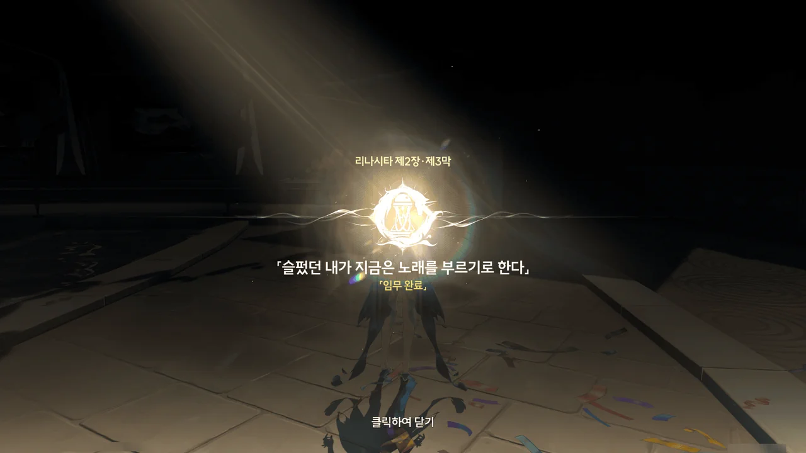









누군가가 물 위에 서서 춤을 추고 있다.

사람이 물 위를 걸어 다니는 게 일반적인 일이 아니라는 건 잘 알고 있지만, 조금 전까지 있었던 일이 워낙 비현실적이어서일까, '리나시타에서는 다들 물 위를 걸어 다닐 수 있는 거 아닐까'하는 생각마저 들 정도로 자연스럽다.







방랑자가 커튼콜 답례 때 했던 춤의 스텝을 알려달라기에, 그녀의 손을 잡으려 했다.
그런데 그녀의 성흔이 계속 반짝이는 것이 아닌가.

성흔이 반짝인다는 건 그 사람이 공명의 힘을 강하게 사용하고 있다는 뜻인데... 대체 무슨 상황이지?







카를로타가 다가오는 걸 발견한 그녀가 여기 오래 있을 수 없다는 핑계를 대고 급하게 사라진다.

방랑자가 이름을 묻자 '카르티시아'라고 답한 후, 다음 기회에 방랑자와 함께 공연할 수 있기를 바란다는 말을 남기고 사라졌다.









카를로타를 비롯한 다른 사람들 눈에는 방랑자가 벽과 대화하는 것으로 보였다고 한다.
그러니까 다른 사람들 눈에는 카르티시아가 보이지 않았다는 건가?
아니, 분명 조금 전까지만 해도 저 다리 위에 서있었는데...

아직 카니발 축제가 다 끝난 것도 아니고, 수도회와 수호신에 대한 의문점을 정리할 시간도 필요하니, 카르티시아 수색은 조금 미루기로 했다.





이번 카니발이 자그마치 10년 만에 열리는 카니발이었던가?
다들 웃고 떠들며 축제를 즐기는 모습이 정말 보기 좋다.







한숨 자고 일어나니, 카를로타가 수호신과 관련한 새로운 단서를 정리했으니 가문의 「접선 아지트」로 와달라고 연락했다.













성공적인 카니발 축제 개최와 공연 성공을 다 함께 모여 축하하고 있다.
브렌트는 넥타르 와인을 잔뜩 마시고 이미 취한 모양이다. 너, 의외로 술이 약했던 거냐...

그리고 그 모습을 수도회 성직자 하나가 뒤에서 몰래 지켜보고 있다.
수도회가 늘상 지껄이는 것 중 하나가 '지나친 향락을 주의하라'이니, 독실한 교인이라면 이런 술가게에 발을 들일 리가 없다.
그럼 뭐겠어? 뭔가 트집을 잡으려고 뒤에서 몰래 지켜보는 거겠지.













카를로타가 알아낸 바에 따르면, '카르티시아'는 성녀 '플뢰르 드 리스'가 성녀 자리에 오르기 전에 사용한 이름이라고 한다. 그런데 성녀는 20년 전에 죽었다.
수호신의 위치에 대해서는 '거꾸로 매달린 높은 탑'이라는 뿐이고.

애도 성역에서 발견한 스테인드글라스에 그려진 이야기에 따르면, 리나시타에는 신적 존재가 둘 있었다. 하나가 수호신이었으니, 다른 하나는 자연스럽게 명식이 된다.

피살리아 가문의 질베르토에게서 뽑아낸 정보에 따르면, 현재 피살리아 가문이 믿고 있는 신은 수호신 「임페라토르」가 아닌 심해의 명식 「레비아탄」이라고 한다.
명식은 문명과 정신을 파괴하려는 욕망을 갖고 있으며 절망을 자신의 식량으로 삼는 잔상이다. 그런 잔상을 섬기다니, 미친 건가? 아니, 오히려 미쳤기에 명식을 섬기는 것일 수도 있겠다.







이야기를 잠자코 듣고 있던 성직자가 일어나 방랑자에게 다가오더니, 펜리코 수좌가 방랑자를 머큐리 성당에 초대했다고 알려준다.

다들 펜리코가 좋지 못한 의도로 방랑자를 초대했을 거라 의심하지만, 방랑자도 마침 펜리코에게 직접 물어볼 것이 있었기에 초대를 수락했다.



















펜리코가 말하는 걸 들어보면, 성직자라기보다는 정치인을 보는 느낌이다. 이런저런 핑계를 대는 것도 그렇고...

브렌트를 비롯한 「우인 극단」은 영구적으로 라군나성에서 공연할 수 있는 자격을 얻게 되었다고 한다.
그들이 한때 속죄가 필요한 '우인'으로 지정되었던 건 예상했던 대로 별 문제가 되지 않았다. 탄식 무덤의 섬에 도착한 것으로 그들의 순례가 완료되어 죗값을 치른 것이 되었으니까.

방랑자가 임페라토르를 만나고 싶다고 하자, 현재 임페라토르는 20년 전의 흑조 사건으로 인해 입은 상처를 회복 중이라 만날 수 없으니, 대신 할 말을 전해주겠다고 한다.
아, 네...

널리 알려진 대로, 성녀 '플뢰르 드 리스'는 20년 전 발생한 흑조 사건을 해결한 후 *영원한 신의 품으로 돌아갔다*고 한다.
또한, 초대 수좌 나폴리 2세가 남긴 말대로, 수호신은 인간들의 신앙 차이로 인해 둘로 나뉘었고, 수호신의 찢어진 몸에서 흘러내린 '신의 피'가 흑조의 본질이라고 말한다.
성녀가 20년 전의 흑조 사건을 해결한 건 성녀가 수호신과 **재공명**하여 그 힘을 수호신에게 돌려주어, 수호신이 흑조를 멈출 수 있게 도운 것이라고 하고.
펜리코의 주장에 따르면, 수호신이 펜리코와 공명한 건 인간 대변인이 필요하기도 했고, 흑조의 여독을 해소하기 위해서라고 한다.

하지만 금주 승소산에서의 일에서 확인했듯이, 수호신이 재공명(2차 공명)을 하기 위해선 방랑자의 승인이 있어야 한다.
그러니 맨 처음 리나시타에 와서 생각한, 펜리코가 사기를 치고 있다는 의심은 매우 합당하다.







여전히 방랑자가 의심을 풀지 않자, 펜리코는 그 누구에게도 말하지 않았던 20년 전의 *진실*을 방랑자에게 말해준다.

사실 플뢰르 드 리스는 수호신의 적, 명식에 의해 창조된, 명식의 공명자이며 그 때문에 20년 전의 흑조 사건을 막을 수 있었다는 것이다.

음... 이건 일단 머릿속 어딘가에 적어두자.









수도회가 사람들을 추방하는 건 *정도*를 벗어난 개인을 숙청하여 *순수하고 통일된 의지*를 확고히 하기 위해서이다.

하지만 초대 수좌 나폴리 2세의 행적을 존경하기에, 추방된 사람들에게 순례라는, 속죄의 기회를 주는 것이라고 한다.









수도회가 카니발을 반대하는 이유는 이해하기 어렵다.
카니발을 여는 것이 왜 *연결*에 방해가 된다는 거지? 그리고 그게 왜 *존속*과 엮이는 거고?









말은 아주 번드르르하게 하네.

라군나성은 리나시타의 이름을 듣고 찾아온 모든 여행객을 수호신의 공정의 이념 아래 너그러이 맞이하는 열린 도시이니, 방문객으로 찾아온 잔성회를 막을 이유가 없었다고 한다.

그러면서 잔성회를 막아준 방랑자를 치하하는 모습을 보여, 방랑자의 입을 막았다.









펜리코가 정보를 준 건 맞지만, 무언가 핵심적인 정보를 빠트렸다는 느낌이 강하게 든다.

거기서 더 캐물어봤자 제대로 된 답을 해줄 것 같지는 않으니, 다른 곳에서 추가적인 정보를 얻어야 한다.

***

















아잇, 젠장. 설마 했더니 정말 크리스토포로가 잔성회 간부였던 거야?

플로로와 크리스토포로의 대화를 보면, 라군나성에서 있었던 일은 전부 크리스토포로의 각본대로였던 모양이다.

> 진실을 눈치챈 이방인이 신을 향해 예리한 칼을 빼 들었다. 깊게 잠든 신들도 그 족쇄에서 벗어나 각자의 본모습을 드러낸다.
{.bq}

다만 카니발 연극 중 있었던, 헤카테를 비롯한 환상 부분은 크리스토포로의 각본에서 벗어난, 플로로의 독단적인 행동이었고.
플로로는 크리스토포로가 이야기의 다음 장면을 알려주지 않아 임의대로 행동한 것뿐이라고 둘러댄다.

플로로가 사람들을 직접적으로 조종해 일을 꾸미는 스타일이라면, 크리스토포로는 자신의 시나리오에 맞는 사람을 적절한 때와 장소에 배치하는 것으로 이야기를 자연스럽게 꾸미는 스타일로 보인다.

플로로가 잔성회와 함께하는 동기는 잘 모르겠지만, 크리스토포로는 '인간 찬가'를 보기 위해서 잔성회와 함께 한다는 느낌이 든다. 물론 제정신은 아닌 것 같지만...

제2장 리나시타 제3막 \[슬펐던 내가 지금은 노래를 부르기로 한다\] 끝.

&nbsp;

지금 리나시타 스토리가 제7막까지 공개되었는데, 난 이제야 제3막 스토리를 끝내고 있네...
남은 스토리는 대체 언제 글을 다 쓸 수 있을까?
