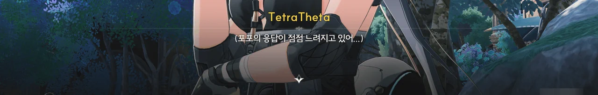
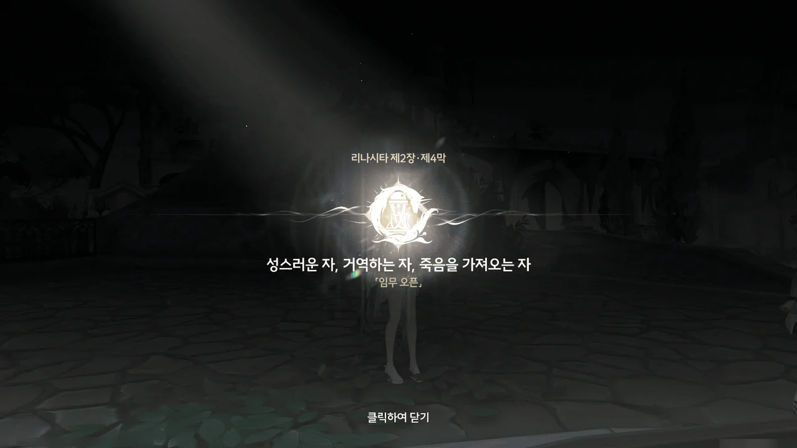



포포의 '건강' ― 에코에게 건강이란 개념이 있는가는 차치하고 ― 문제는 아직 해결되지 않았다.
오히려 포포의 상태가 이전보다 악화되어, 방랑자의 부름에 답하는 속도도 늦어졌다.

당연한 일이긴 하다. 방랑자가 리나시타에 온 근본적인 이유는 용태가 좋지 않은 포포를 호전시키기 위해 리나시타의 수호신, 임페라토르를 만나는 것이었는데, 여태껏 이루어낸 건 임페라토르의 메시지를 듣는 것밖에 없었으니까.







포포가 자신이 직접 하늘로 올라가 임페라토르가 갇힌 탑을 찾아보는 게 어떻겠냐는 제안을 한다.

임페라토르가 갇혀있는 곳은 "구름과 안개를 뚫고 뭇별 위로 날아오르면 보이는" 탑이다.

저 "구름"이 정확히 어떤 구름을 말하는 건지는 모르겠지만, 지표면과 가장 가까운 곳에 생성되는 하층운의 고도가 약 2km 정도이고, 가장 높은 곳에 생성되는 상층운의 최대 고도가 13km이다.

포포의 상태가 최상이라고 하더라도 저 높이까지 올라가긴 힘들 것 같은데. 지금 포포의 상태가 좋지 않기도 하고.











일단 시도는 해보자는 포포의 말대로 에글라 타운에 왔다.
난데없이 들려오는 노랫소리를 따라가 보니, 누군가가 난간에 기대 피리를 불고 있었다.

그녀는 카를로타의 부탁으로 방랑자를 찾아 나선 음유시인, 샤콘이었다.
방랑자를 찾아 돌아다니다 갑자기 찾아온 영감을 차마 그대로 지나치지 못해 머릿속에 떠오른 노래를 그대로 피리로 불었는데, 그 노랫소리 덕분에 방랑자와 만날 수 있었다.
기묘한 우연이네.







카를로타는 방랑자가 「카르티시아」를 만났다는 이야기를 듣고 즉시 사람들을 곳곳에 보내 카르티시아를 찾았지만, 그 어디에서도 카르티시아의 흔적을 찾을 수 없었다.
그래서 카를로타는 과거의 상황을 재현할 수 있는 공명 어빌리티를 가진 샤콘에게 부탁해, 당시의 상황에 대한 추가적인 단서를 얻고자 했다.









방랑자가 카르티시아를 처음 만났을 때의 일을 소상하게 들은 샤콘이 악기를 꺼내 노래를 연주하기 시작한다.
그러자 방랑자의 눈앞에 라군나성에서 처음 카르티시아를 만났을 때의 장면이 펼쳐지는 것이 아닌가.
심지어 방랑자는 장면 속 방랑자와 별개로 존재하고 있다.

카를로타가 괜히 샤콘을 부른 게 아니었구나.
이렇게 과거에 있었던 일을 제삼자의 입장에서 볼 수 있다면 분명 추가 단서 수집에 도움이 될 테니까.







샤콘이 공명 어빌리티로 만든 공간 속에서 실제 카르티시아와 다시 한번 만나게 되었다.
게다가 처음 만났을 때와 마찬가지로, 서로의 성흔이 마치 공명하듯 빛나고 있고 말이다.
방랑자의 눈이 노란색 성흔 모양으로 빛나는 게 저번에도 그랬는지는 잘 기억나지 않지만...

방랑자의 말처럼, 샤콘의 공명 어빌리티가 예기치 못한 이유로 인해 '오작동'하는 모양이다.







자신을 어떻게 찾은 거냐 묻는 카르티시아에게 임페라토르가 귀띔해 주었다고 답하자, 카르티시아가 그러면 자신이 수호신의 공명자가 맞는지 알려줄 수 있냐고 묻는다.
공명자가 자신이 무엇과 공명한 건지 모르는 경우가 있나...?

알고 보니 카르티시아는 과거에 대한 기억이 거의 없었다.
그녀가 그나마 명백하게 기억하고 있는 건 자신이 무언가의 공명자가 되어 「플뢰르 드 리스」라는 새 이름을 받았다는 것뿐이고, 그 외의 기억에는 빠진 부분이 많다고 한다.
가령, 그녀가 무언가와 싸웠다는 건 기억하지만, 그것과 어떻게 싸웠는지, 그리고 그 결과가 어떻게 되었는지는 전혀 기억하지 못하는 것이다.
그래서 여태껏 자신이 수호신의 공명자인 건지 찾고 있었던 건가?

카르티시아는 수호신의 공명자일 수도, 명식의 공명자일 수도 있다.
수호신 임페라토르는 카르티시아를 '길 잃은 자'라고 불렀고, 수도회의 현임 수좌인 펜리코는 그녀를 '명식의 공명자'라고 불렀다.
임페라토르의 말은 카르티시아의 공명 대상이 누구인지에 대한 답이 될 수 없고, 펜리코의 말은 완전히 믿기 어렵다.







방랑자가 왜 수호신을 찾는 건지 카르티시아가 묻자, 방랑자는 포포를 꺼내 보여준다.

포포와 방랑자의 주파수가 완벽하게 분리된 상황이 신기하긴 하지만, 방랑자와 카르티시아의 대화에서 조금 이해가 되지 않는 부분이 생겼다.

> | | |
> |:--|:--|
> | 카르티시아 | 이 에코가... 바로 당신의 몸과 뒤얽힌 주파수인가요? |
> | 방랑자 | 포포를 감지할 수 있나요? |
> | 카르티시아 | 네... 저도 비슷한 일을 겪어서요. 비록 지금은 공명 어빌리티가 없지만요. |
> {_borderless=true,_thead=false}

대체 왜 카르티시아는 방랑자와 포포의 서로 뒤얽힌 주파수를 보고 방랑자가 수호신을 찾는 이유를 납득한 걸까? 수호신에게 어떤 능력이 있길래?
그리고 카르티시아는 왜 자신의 주파수 뒤얽힘을 해소한 이후로 공명 어빌리티를 잃은 걸까?





임페라토르가 달리 남긴 말은 없었냐고 카르티시아가 묻자, 임페라토르가 밝힌, 하늘에 거꾸로 매달린 높은 탑에 속박된 상태를 말해주었다.

카르티시아의 말에 따르면, 지금 방랑자 눈앞에 있는 카르티시아는 주파수 ― 어쩌면 분체와 가까운 ― 이고, 그 실체는 높은 하늘에 거꾸로 매달린 소노라 안에 있다고 한다.
그 소노라 안에는 세 개의 봉인으로 입구를 막아둔 높은 탑이 있는데, 그 안에 있는 무언가가 자꾸 카르티시아를 부른다고 한다.

임페라토르가 말한 '높은 탑'이 소노라 안에 있었다면 여태껏 방랑자와 카를로타가 그 탑을 찾지 못한 것이 말이 된다. 소노라 밖에서는 소노라의 입구만 관찰할 수 있으니까.









그런데 갑자기 포포가 폭탄 발언을 했다. 바로 카르티시아에게서 명식의 냄새가 난다는 것이다.

적어도 주파수 분류에 있어 포포는 전문가라고 할 수 있다.
그런데 그런 그가 카르티시아에게서 명식의 냄새가 난다고 말했다는 건 펜리코의 말처럼 그녀가 명식의 공명자임을 뒷받침해 주는 근거가 될 수 있다.
하지만 동시에 방랑자의 말처럼, 그녀가 명식과 싸우다 받은 영향 때문일 수도 있고...

> | | |
> |:--|:--|
> | 카르티시아 | 이 특수한 에코는 수호신의 치료가 필요하니까요. |
> {_borderless=true,_thead=false}

좋아. 임페라토르의 능력이 뭔진 몰라도, 포포를 '치료'의 형태로 도울 수 있다는 정보를 얻었다.
그게 정확히 뭔진 잘 모르겠지만.



자신이 명식의 공명자일지도 모른다는 이야기를 듣고도 카르티시아는 덤덤한 모습이다.
그녀는 소노라에서 혼자 갇혀 지내며 자신의 정체에 대해 수도 없이 많은 가능성을 생각해 보았고, 그 모든 가능성에 대해 마음의 준비를 했다고 한다.







정황상 카르티시아가 갇힌 소노라 안에 임페라토르로 추정되는 무언가도 같이 갇혀 있는 것 같다. 한번 가봐야 할 것 같은데?

카르티시아가 있는 장소의 일부분은 지상에 있으나, 그 외곽이 장벽으로 둘러싸인 탓에 외부와 완벽히 단절되어 있다.
장벽을 함부로 부술 수도 없는 것이, 장벽을 부숴 소노라를 무너트리면 그 안에 있는 유적과 잔상이 리나시타로 추락할 거고, 라군나성에 큰 피해를 입힐 것이다.





다만 간혹 장벽 밖에서 "바다 깊은 곳에 사는 해파리 같은 느낌의 사람"이 서성이는 인기척이 느껴졌다고 하니, 그 사람을 찾아가 보는 게 좋을 것 같다.

그나저나 해파리 같은 느낌의 사람이라니, 대체 어떤 느낌인 거지?





카르티시아와 방랑자가 서로 이 공간에서 만날 수 있었던 건 둘 사이의 공명 때문이었던 모양이다.



왜 이 노래가 생각난 건지는 잘 모르겠다.





샤콘의 공명 어빌리티는 이렇게 꿈을 꾸게 하는 게 아니었나 보다.
그럼 원래는 어떤 형태로 사건을 재현하는 거지?

> 아... 자장가가 아닌 곡을 듣고 잠든 거라면 너무 충격인데...

뭐... 그렇겠지.













아무튼, 오작동이긴 해도 샤콘 덕분에 임페라토르의 위치에 대한 정보를 얻을 수 있었으니, 샤콘의 공이 크다 하겠다.









그때 피살리아 가문의 '세바스찬'이라는 사람이 찾아와, 방랑자가 피살리아 가문에 대해 가진, 좋지 않은 오해를 풀기 위해 피살리아 저택으로 초대한다는 피살리아 가주의 말을 전한다.
하지만 지금 카를로타가 피살리아 가문과 협상하는 중이기에, 지금 당장은 어렵다고 답변했다.

이름이 '세바스찬'이라길래 자연스럽게 집사일 것이라 생각했는데, 세바스찬의 말 그 어디에도 그가 집사라는 말은 없었다.
아! 이 얼마나 무서운 고정관념이란 말인가!











샤콘의 말에 따르면, 피살리아 가주는 밖에 나오는 일이 거의 없고, 심지어 공적인 자리에도 모습을 드러내지 않는 사람이라고 한다. 그 이름을 아는 사람조차 없어 다들 '피살리아 가주'라고 부르고 있고.
하지만 가주의 별명인 '가장 오래된 어둠', '독약 부인', '사람의 마음을 조종하는 환상의 해파리' ― 마지막은 그냥 샤콘이 갖다 붙인 것 같지만 ― 을 보면, 성별이 여자인 모양이다.

피살리아 가문은 처음 리나시타 군도에 상륙해 리나시타의 질서를 확립한 최초의 가문 중 하나로, 수도회보다 더 오래된 가문이다.
피살리아 가문에는 심해 식물에서 독을 추출해 정제하는 기술이 대대로 전해져 내려오고 있으며, 소문에 따르면 상대의 독약을 마시고 살아남은 자를 가주로 임명하는 전통이 있다고 한다.

현임 피살리아 가주는 정상적인 방법으로 가주에 임명된 게 아니라 선임 가주를 독살하고 그 자리에 앉은 거라는 이야기가 있으며, 사람의 마음을 조종하는 능력이 있어 저도 모르는 사이에 그녀가 원하는 대로 따르게 된다는 이야기도 있다.

피살리아 가주에 대한 마지막 두 이야기는 별로 신빙성이 없는 것 같으니 일단 제쳐두고...
'해파리'라는 키워드가 카르티시아가 했던 말과 일치하고 있다. 그럼... 만나봐야겠네.

제2장 리나시타 제4막 \[성스러운 자, 거역하는 자, 죽음을 가져오는 자\] 시작!
