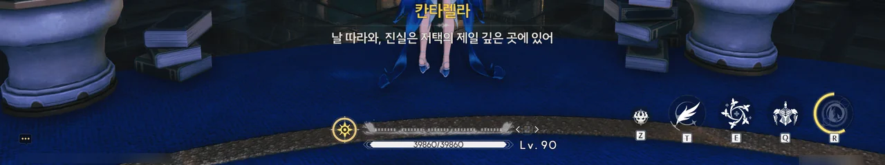
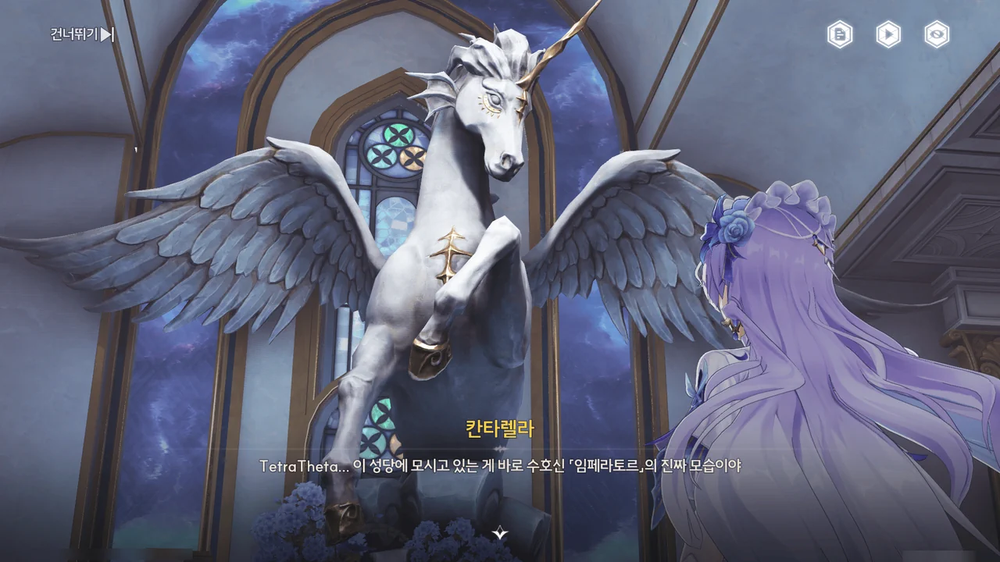





당연한 일이겠지만, 피살리아 가문이 방랑자를 초대했다는 정보는 카를로타에게도 전해졌다.

피살리아 가문이 초대한 건 오직 방랑자뿐이었기에, 카를로타는 방랑자와 동행할 수 없다.
하는 수 없이 카를로타는 방랑자가 위험에 처할 경우 정면 돌파를 해서라도 구하러 가겠다는 말과 함께 방랑자가 피살리아 가문에 있는 동안 카르티시아에 대해 조금 더 조사해 보겠다고 전한다.

> **포르티비노 성**
> ***
> 교외의 절벽에 위치한 어둡고 오래된 신비로운 성.
> 주변에는 심해 생물과도 같은 식생이 분포돼 있고 내부에는 기이한 소장품들이 모여있다.
> 그 매혹성과 괴이함은 마치 끝이 보이지 않는 소용돌이와도 같으며 그에게 경모함을 가진 사람들을 그 속으로 초대한다.
{.bq}





















피살리아 가문의 성, 포르티비노 성에 도착하자, 마치 기다렸다는 듯이 피살리아 가주, 칸타렐라가 방랑자를 맞는다.

'카니발의 왕'이라니... 어색하다고 해야 할까, 껄끄럽다고 해야 할까. 아무튼 떫은 어감의 단어다.
차라리 그냥 이름으로 불리는 게 낫겠네.





자세한 이야기는 자신의 서재에서 하자는 칸타렐라의 제안에 따라, 그녀의 서재로 이동한다.
피살리아 가문이 수도회와 결탁하고 있다는 걸 증명하듯, 저택 곳곳에 수도회의 복장을 입은 사람들이 보인다.
몬텔리 가문 소유의 아베라르도 금고에서는 볼 수 없었던 광경이기도 하다.

칸타렐라가 자신의 서재로 가자고 할 때 정말로 칸타렐라가 걸어서 서재로 이동할 줄은 몰랐다.
덕분에 칸타렐라를 기다리며 주변을 조금 둘러볼 수 있었다. 별 소득은 없었지만.







서재의 문이 닫히고, 칸타렐라는 질베르토의 일에 대한 사과의 의미라며 방랑자에게 차를 권한다.

차에 독을 탄 게 아닐까 하는 마음에 차를 부드럽게 거절했더니 "그럼 좋지 않은 감정은 이 찻잔처럼 잠시 치워둘까?"라며 태연하게 대응하는 칸타렐라의 모습을 보고 조금 감탄했다.

'접대의 관습'이 리나시타에도 적용되는지는 잘 모른다.
하지만 만약 '접대의 관습'이 리나시타에도 있다면, 칸타렐라가 방랑자에게 먹을 것, 혹은 마실 것을 권했다는 건 그녀에게 방랑자를 해칠 의도가 없다는 뜻이 된다.
그리고 방랑자가 그걸 거절했다는 건 '나는 이 집의 손님이 아니다', '나는 이 집의 잠재적 적이다'라고 선언하는 것과 같고.

그러니 자칫 무례하게 보일 수도 있는 행동을 부드럽게 넘긴 칸타렐라에 감탄할 수밖에.















칸타렐라가 방랑자를 초대한 건 중재자 역할을 부탁하고 싶어서였다. 누구 사이의 중재자를 말하는 거지?
현재 피살리아 가문은 수호신 「임페라토르」가 아닌 명식 「레비아탄」을 섬기고 있는 것으로 알고 있다. 즉, 칸타렐라의 요청은 명식과 다른 누군가의 중재자를 부탁하는 것으로 보일 수도 있다는 말이다.

이를 지적하자, 칸타렐라는 명확한 답을 내놓는 대신 충격적인 이야기를 꺼낸다.
바로 라군나에 대한 명식의 침입이 이미 끝났다는 것이다.

그녀의 말에 따르면 명식 레비아탄은 「동화」하고 「융합」하는 능력을 가졌다. 잘못된 신앙을 이용해 사람들의 정신을 오염시키고, 끝내는 문명 자체를 수확하는 명식인 것이다.
두 차례의 '수확' ― 두 차례의 흑조 사건을 말하는 걸까? ― 은 어찌 막을 수 있었지만, 명식의 라군나 침입이 이미 완료된 이상 라군나 사람들은 아무것도 모른 채 명식의 입 속으로 걸어 들어가고 있을 뿐이라고 말한다.

꽤 그럴듯한 이야기이지만 그 말을 하는 게 다름 아닌 피살리아 가문의 가주라 그런가, 쉬이 믿기지 않는다.
게다가 그녀의 말은 피살리아 가문뿐만 아니라 수도회 역시 수호신이 아닌 명식을 섬기고 있다는 말로도 들리거든.

그 의혹에 대해 칸타렐라는 "맞기도 하고 아니기도 해"라는 알쏭달쏭한 대답을 내놓았다.

> 명식은 진실을 지키고 있는 자들을 가만두지 않거든. 그래서 우리도 늘 그 속삭임의 위험 속에 있지.
> 마음에 허점이 생기는 순간, 자아를 잃은 꼭두각시로 변하게 되니까.

임페라토르만 최면 앱을 갖고 있는 줄 알았는데, 레비아탄도 최면 앱을 갖고 있었나 보다.
뭐지? 리나시타는 최면 앱이 기본 패시브인 건가?









칸타렐라는 더 이상 숨길 게 없다며, 저택 제일 깊은 곳에 있는 진실을 보여주겠다고 말한다.

포르티비노 성에 도착했을 때 본 수호신 조각상은 수도회가 피살리아 가문에 증정한 것이지만, 피살리아 가문은 조각상을 마치 방치하듯 제대로 관리하지 않았다. 어째서일까?

성 곳곳에 심어져 있는 식물은 정신을 안정시키는 효과를 지닌 '비올라카'라는 이름의 식물이었다.
성 곳곳에 정신을 안정시키는 식물을 심어야 할 정도로 명식의 공격이 거세었던 걸까?



> 여기까지 온 이상... 이젠 발을 빼고 싶어도 보내 주지 않을 거야.

호오...





밀실에 들어서자 보이는 것은 꼬리 부분이 파손된 수호신의 조각상이었다.



조각상의 발굽 부분이 빛나자, 방랑자가 두통을 호소한다.
그 모습을 본 칸타렐라는 명식이 진실을 알게 된 방랑자를 「주시」 한 것이라고 알려준다.

조각상이라는 매개체만으로 방랑자에게 두통을 안겨줄 수 있다고? 젠장, 타■레놀이 필요해!



칸타렐라는 현재 널리 알려진 「임페라토르」의 '마두어신(馬頭魚身)' 모습은 '바람을 뚫는 준마' 임페라토르가 '물속을 헤엄치는 물고기 떼' 레비아탄의 침식을 받아 이화(異化)한 모습이라고 알려준다.

아, 그래서 명식의 침식을 받아 변이 한 물고기 꼬리 부분을 떼버린 거구나?





칸타렐라가 방랑자에게 부탁한 건 바로 금주의 수호신, 「용의 별자리」가 리나시타에 방문해 「임페라토르」를 구하도록 설득해 달라는 것이었다.

하지만... 힘든 일이지. 방랑자의 세 선택지 모두가 옳은 말이다.
가장 중요한 건 「용의 별자리」 역시 최상의 상태가 아니라는 것이다. 금희와의 2차 공명으로 힘을 어느 정도 회복하긴 했어도 이전과 같이 완벽한 상태는 아니다. 자칫하다간 임페라토르가 당했던 것처럼 용의 별자리 역시 레비아탄에 침식될 우려가 있다.
게다가 수호신은 자신이 맡은 지역을 함부로 비울 수 없다. 그게 가능했으면 임페라토르부터가 자리를 잠시 피해 레비아탄의 침식을 막았을 거다.
지역을 떠난다는 건 그 지역을 '수호'한다는 역할과 어긋나는 것이기도 하고.

그 말을 들은 칸타렐라가 방랑자에게 포르티비노 성에 며칠간 묵을 것을 제안한다.
설마 칸타렐라는 그 기간 동안 방랑자를 설득할 생각인 걸까?



















방랑자가 칸타렐라에게 애도 성역의 스테인드글라스에서 본, 한 성녀가 임페라토르의 공명자로 나타나 리나시타를 구할 것이라는 예언 내용을 말해준다.
그 말을 들은 칸타렐라는 거기 적힌 내용이 완전히 꾸며낸 이야기는 아니라고 알려준다.

수호신이 공명자를 택하는 건 카니발에서 열리는 대관식이 아니라 방랑자 앞에 놓인 신권의 검, 「티르바인」을 통해서이다.
레비아탄의 권능은 「동화」와 「융합」이고, 임페라토르의 권능은 「분리」와 「공간」이다.
임페라토르는 자신의 권능으로 자신의 힘 일부를 분리해 수호신의 공명자를 택하는 도구, 티르바인으로 빚어내었다. 티르바인과 임페라토르의 주파수는 동일하기에 티르바인의 공명자는 곧 임페라토르의 공명자가 된다.

다만 수호신의 공명자로 알려진 카르티시아는 정작 티르바인과 공명한 적이 없기에, 그녀가 대체 무엇과 공명한 것인지 칸타렐라 역시 잘 모른다고 한다.
정말 카르티시아는 명식과 공명한 걸까? 어쩌면 칸타렐라의 말처럼 명식과 동화한 수호신의 공명자, 즉 명식-수호신의 공동 공명자일 수도 있겠다.

피살리아 가문은 매년 「성녀의 시련」을 통해 강한 의지를 가진 공명자를 일부러 오버클럭 상태에 빠트린 다음 티르바인과 공명하도록 했다.
그중 티르바인과 공명하는 데 성공한 사람은 단 한 명도 없었지만, 그 과정에서 진실의 파편을 목격하는 사람이 종종 나오곤 했다.
칸타렐라 역시 그중 하나로, 그녀가 본 건 '명식과 융합해 이화한 수호신의 몸'과 '하늘에 거꾸로 매달린 유적'이었다.

「성녀의 시련」에서 수호신이 있는 소노라 내부에 들어가기 위해선 반드시 티르바인이 필요하다는 걸 깨닫게 된 칸타렐라가 정신을 차리고 보니, 손에 자신의 필체로 '성녀는 이미 죽었다'라는 문구가 적혀 있었다.

리나시타를 구했어야 할 성녀가 이미 죽었기에, 칸타렐라는 어그러진 예언을 대신해 라군나를 명식의 손에서 구해낼 방법을 여태껏 애타게 찾고 있었다. 「용의 별자리」를 이용하는 것 역시 그 방법 중 하나고.















칸타렐라가 말한 '하늘에 거꾸로 매달린 유적에 갇힌 수호신'은 카르티시아와 임페라토르 역시 언급했던 내용이다.
즉, 칸타렐라가 말한 내용은 충분히 신뢰할 만하다.

2차 공명은 공명자로 하여금 자신의 한계를 뛰어넘는 능력을 발휘하게 해 준다. 수호신의 공명자가 2차 공명에 성공할 경우, 수호신의 권능을 잠시나마 쓰는 것이 가능할 정도이다.
「용의 별자리」가 금희와 2차 공명을 시도했던 이유가 바로 이 때문이었다. 부상을 입어 약해진 「용의 별자리」는 「시간」 권능으로 자신의 부상을 '역행'시킬 수 없지만, 2차 공명으로 인해 한계 너머의 힘을 쓸 수 있는 금희는 가능하기 때문이다.

그렇다면 임페라토르가 2차 공명을 시도한 이유는 자신의 공명자가 「분리」의 권능으로 자신과 레비아탄을 분리하길 원해서였을까?

방랑자가 티르바인과 공명을 시도하자, 아무런 지장 없이 티르바인이 방랑자와 공명한다.













> 피살리아가 신으로 모시는 수호신 「임페라토르」, 그리고 수호신의 어자인 방랑자라...
> 그럼 이제 널 「나의 신」이라고 불러야 할까?

칸타렐라가 말은 저렇게 하지, 속으로는 굉장히 놀랐을 거다.
조금 부적절한 비유겠지만, 여태껏 야훼만을 믿고 있었는데 눈앞에 야훼의 창조주가 나타난 격이니...

'어자'의 뜻이 '마차 혹은 말을 부리는 사람'이니, '주인'과도 같은 의미가 된다.
그래서 「용의 별자리」가 2차 공명을 할 때 방랑자의 '허가'가 필요했던 거고.

&nbsp;

티르바인은 당분간 방랑자가 갖고 다니게 되었다.
카르티시아와 임페라토르가 갇힌 소노라를 여는 데 필요하기도 하거니와, 방랑자 손에서만 그 힘을 발휘할 수 있기 때문이다.



소노라의 입구까지 가는 데에는 피살리아 지하에 마련된 케이블카를 이용하기로 했다.
이 성 지하에 대체 왜 그런 게 있는 거야?



> **「티르바인」**
> ***
> 수호신 「임페라토르」가 자신의 힘의 일부를 봉인해 놓은 신권의 검이자 공명자를 택하는 도구이기도 하다.
> ***
> 신권의 검 ― 「티르바인」.
> 수호신 「임페라토르」가 자신의 힘의 일부를 봉인해 놓은 신권의 검이자 공명자를 택하는 도구이기도 하다.
> 가까이 다가가면 바람의 소리가 들리는 것 같다.
{.bq}







포르티비노 성 지하에 케이블카가 있는 이유는 금방 들을 수 있었다.

피살리아 가문은 수도회와의 피상적인 조화를 위해 가문의 젊은이들을 수도회 아카데미, 「아비놀륨」으로 보내곤 했다. 이를 위해 성 지하에 아비놀륨으로 향하는 케이블카를 설치했고.
그러다 아비놀륨 자리에 카르티시아와 임페라토르가 갇힌 소노라가 생겨버린 거고.

하지만 엘리베이터는 칸타렐라가 편의를 위해 따로 추가한 것이라고 한다.
