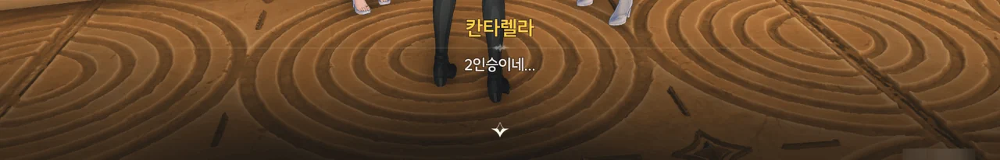

















듣던 소문대로라면 피살리아 가문의 가주, 칸타렐라는 '독약에 능하며 이전 가주를 독살한 신비주의자', 즉 '악당'으로 분류할 수 있는 사람이다. 그 정보를 알려준 게 카를로타 ― 피살리아 가문과 반목하는 몬텔리 가문의 영애 ― 의 친구, 샤콘인 건 고려해야겠지만.
그런데 칸타렐라와 대화를 나누어 보니, 세간의 소문이란 건 역시 믿을 것이 못되었던 모양이다.

조금 의외였던 건, 칸타렐라에게 붙은 소문 모두가 완전한 허구는 아니라는 점이다.

칸타렐라가 외출하는 일이 거의 없는 신비주의자라는 소문이 붙은 이유는 그녀가 수호신 문제를 해결하기 위해 여태껏 리나시타 바깥을 돌아다녔기 때문이다. 그러다가 '황룡 명정에 있는 한 친구' ― 보나 마나 장리겠지 ― 에게서 방랑자에 대한 이야기를 듣고 리나시타에 돌아온 거고.
칸타렐라가 줄곧 리나시타 바깥에 있었기에, 그 사정을 모르는 리나시타 사람들은 리나시타에 모습을 드러내지 않은 그녀를 두고 그녀가 외출하는 일이 극히 드물다고 착각한 것이다.

명식은 명식과 수호신에 대한 진실을 알고 있는 피살리아 가문을 몇백 년 동안 호시탐탐 노려왔다.
그래서 피살리아 가문의 가주 계승식은 거듭되는 명식의 정신 공격에 갈수록 쇠약해져 가는 가주가 결국 자아 없는 꼭두각시로 전락하는 일을 막기 위해 후임 가주가 직접 배합한 독약으로 전임 가주를 안락사하는 방식으로 진행된다.
하지만 칸타렐라가 가주 계승식을 진행하는 동안 어떤 사고가 발생했고, 그 일이 바깥에 퍼진 탓에 칸타렐라에게 독약과 관련한 소문이 잔뜩 붙은 것이었다.

















20년 전, 수도회가 건설한 아카데미, 아비놀륨에서 성녀가 대관식을 하는 날, 두 번째 흑조가 발생했다. 본래라면 첫 번째 흑조가 그랬던 것처럼 흑조가 아비놀륨 주변으로 퍼져나갔겠지만, 어찌 된 영문인지 두 번째 흑조는 아비놀륨 바깥으로 퍼지지 않았다고 한다. 대신, 아비놀륨이 사람들 눈에 보이지 않을 만큼 높은 하늘 위로 올라가 사라졌다.

두 번째 흑조 발생 당시 아비놀륨 외곽 수역의 관람선에 타고 있었던 덕택에 흑조에 휩쓸리지 않으면서도 그 모든 과정을 지켜볼 수 있었던 칸타렐라는 「성녀의 시련」에서 「티르바인」과 공명하며 아비놀륨의 행방과 그 내부의 상황을 잠깐이나마 엿보게 되었고, 누군가가 아비놀륨 안에서 어떤 조치를 취한 덕분에 두 번째 흑조가 아비놀륨 바깥으로 흘러넘치지 않았다는 것을 알게 되었다.

하지만 그게 정확히 누가 한 일인지는 칸타렐라 역시 알 수 없었다.
카르티시아가 한 일일 수도, 수호신이 한 일일 수도 있는 것이다.







아비놀륨으로 향하는 소노라는 굳게 닫혀 있으며, 이를 열기 위해선 성녀만이 뽑을 수 있는 「티르바인」이 필요하다.
하지만 「성녀의 시련」을 겪은 칸타렐라는 자기 자신에게 '성녀는 이미 죽었다'라는 메시지를 남겼다. 성녀가 없으니 티르바인을 뽑을 수 없는 것이다.

하지만 저 소노라는 수호신의 힘으로 만든 것으로 추측된다. 명식이 아비놀륨을 하늘 위로 띄우고 흑조가 흘러넘치는 걸 막을 리가 없으니까.
'그렇다면 다른 수호신의 힘을 통해 소노라를 열 수 있지 않을까?'라는 생각을 한 칸타렐라는 여태껏 리나시타 바깥을 돌아다니며 각국의 수호신들에게 도움을 요청해 왔다. 번번이 거절만 당했지만.

하지만 지금은 방랑자가 성녀 대신 티르바인을 뽑았으니, 다른 수호신의 도움을 구할 필요가 없는 것이다.











방랑자가 「티르바인」을 소노라를 감싼 결계에 꽂자, 서로 모습이 다른 세 검의 환상이 방랑자의 머릿속을 스친다.









경계 안에서 방랑자 일행을 기다리고 있던 건 다름 아닌 카르티시아였다.

어릴 적 카니발에서 카르티시아의 공연을 본 적 있는 칸타렐라는 어떻게 20년이란 시간이 지났음에도 카르티시아의 모습이 그때 그대로인지 궁금해한다.





본래 「티르바인」을 본 적 없는 카르티시아는 방랑자 일행이 소노라로 들어올 때 머릿속에 흘러 들어온 기억 덕분에 티르바인을 알아볼 수 있었다.
수호신이 남긴 검, 티르바인과 공명할 때와 비슷한 현상이다.









카르티시아가 「티르바인」과 공명을 시도해 보지만, 방랑자 때와 다르게 아무런 반응이 없다. 이는 곧 카르티시아는 수호신 임페라토르의 공명자가 아니라는 뜻이다.

하지만 그게 카르티시아가 명식 레비아탄의 공명자라는 뜻은 아니다. 지금 수호신과 명식은 서로 합쳐져 기괴한 형상을 취하고 있으니까. 수호신의 공명자와 수호신/명식의 공명자는 따로 계산하는 것일 수도 있고...

카르티시아는 분명 두 번째 흑조를 겪은 사람이지만, 이상하게 아는 정보가 없었다.

일단 세 검의 이름에 대한 정보를 확보했다.

* 신권의 검 「티르바인」
* 이권의 검 「호그니스」
* 인권의 검 「아우티르」

저 '이권'이 利權은 아닌 것 같고... 설마 異權은 아니겠지?













세 개의 검을 해당하는 석좌에 넣으면 중앙 탑에 있는 봉인을 열 수 있을 거라고 한다.
하지만 자신이 명식의 공명자일까 걱정하는 카르티시아는 그게 수호신이 아닌 명식이 바라는 바가 아닐까 걱정하여 주저하고 있다.

결국 보다 못한 칸타렐라가 '안 할 거면 저리 비켜서 잠자코 보고나 있던가'라며 카르티시아를 몰아붙인다.
진심으로 한 말은 아니고, 카르티시아에게 *용기*를 불어넣어 주기 위한 말이었다고 한다.





「티르바인」을 석좌에 꽂자, 방랑자 일행이 있던 탑이 마치 엘리베이터처럼 공중으로 치솟는다.

아니, 이런 식으로 올라가게 될 거라고는 전혀 상상조차 못 했는데!











엘리베이터(?)를 타고 도착한 곳은 공중에 떠 있는 거대한 구조물이었다. 설마 여기가 그 아비놀륨인 건가?

그런데 놀랍게도, 이곳의 중력은 거꾸로 뒤집혀 있었다.





아비놀륨이 중력과 함께 통째로 뒤집혀 있는 이유는 이곳에 있는 잔상, 흑조, 그리고 아비놀륨 그 자체가 지상으로 떨어지지 않도록 하기 위함이라고 한다.
이렇게 중력이 뒤집힌 상태라면 여기서 뭔가가 떨어진다고 해도 지상이 아닌 하늘로 '떨어질' 테니까.



카르티시아가 방랑자 일행에게 이곳의 중력에 적응할 겸, 곤돌라 「파옴」에게 가자고 한다.



그전에 일단 「티르바인」은 회수하고.



작은 연못 한가운데에 '올라가기'라는 프롬프트가 뜨길래 뭐지 싶었는데, 연못 자체가 위로 올라가는 것이었다.

오...



아무것도 없던 수로 바닥에서 곤돌라 에코가 튀어나왔다. 그러니까... 이게 그 「파옴」이란 거지?







곤돌라는 2인승인데 여기 인원은 세 명이다. 결국 칸타렐라와 따로 떨어져 행동하게 되었다.
