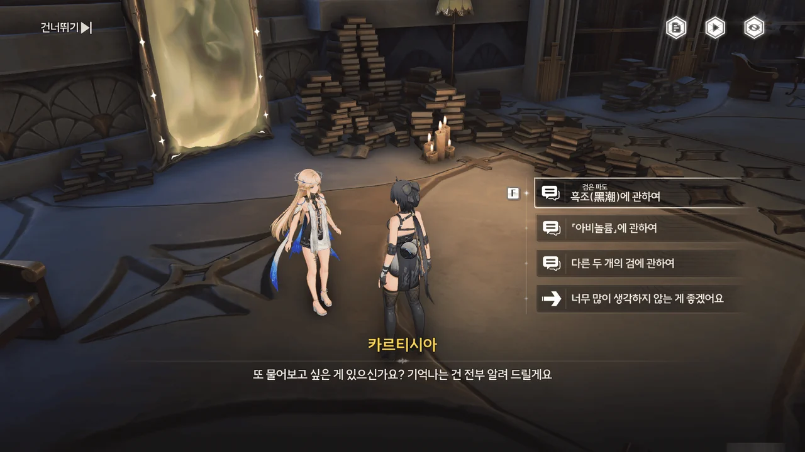





> 두려워요... 하지만 답 자체가 아니라 그 답을 영영 얻지 못할까 봐 두려운 거예요.

별 것 아닌 문장인데, 왜 이렇게 가슴에 와닿는 걸까.



















ㅋㅋㅋㅋㅋㅋ 아 ㅋㅋㅋ 잘 모르겠고, 카르티시아가 정말 귀여웠다.
사실 카르티시아를 뽑을 생각이 전혀 없었는데, 이 장면을 보고 나니 카르티시아가 조금 뽑고 싶어 지더라고. 결국 뽑았지만...

그런데 카르티시아의 시상(視像)이 이상하다.
세상이 온통 흑백인 것도 그렇고, 방랑자의 얼굴을 보지 못하는 것도 그렇고... 대체 무슨 의미인 걸까?

<figure class="gallery-figure">

<picture></picture>

<figcaption class="gallery-figcaption">
산화의 시상(視像) 속 방랑자
</figcaption></figure>

산화는 공명 어빌리티로 인해 주파수를 직접 관찰할 수 있는데, 그녀가 본 방랑자의 모습은 위와 같았다. 카르티시아처럼 사람 얼굴이 안 보이지는 않았다는 말이다.

음... 대체 뭐지? 설마 카르티시아가 안면인식장애를 갖고 있는 건 아닐 테고...







흑조로 이루어진 가시덤불이 길을 막고 있다.
자신을 불태울 수 있는, 수도회의 초대 수좌가 첫 번째 흑조를 정화할 때 사용한 울림의 불씨가 마음에 들지 않았는지, 불씨를 꺼내가지 못하도록 불씨가 든 조각상을 흑조 가시넝쿨로 칭칭 감아두었다.







포포가 이를 처리할 수 있으면 좋았겠지만, 현재 포포의 상태가 좋지 않기에 카르티시아가 대신 가시넝쿨을 정화하기로 했다.

카르티시아가 포포 대신 나섰다는 걸 보면, 카르티시아 역시 포포처럼 주파수를 흡수하는 능력이 있는 걸까?



'카르티시아에게 협조 요청하기' 프롬프트를 누르면 정말로 옆에 카르티시아가 나타나 가시넝쿨을 정화해 없애준다.







가시넝쿨이 모두 사라지자 나타난 울림의 불씨를 가시덤불에 집어던지자, 가시덤불에 핀 꽃이 가시덤불과 함께 산산조각 났다.



또다시 흑조 가시덤불이 길을 막고 있다.











카르티시아가 중력 전환기에 힘을 불어넣자, 방랑자에게 적용되는 중력의 방향을 바꿀 수 있었다.

> 특수 화살표는 항상 현재 카르티시아가 가리키는 중력 방향을 가리킵니다.

그런데 대체 이게 무슨 말이지...? 설마 특수 화살표 방향이 *올바른* 방향이라는 걸까?



공터에 가만히 서있는 조각상을 내려다보며 '아, 분명 저 석상들, 내가 공터에 내려가면 다시 살아나서 날 공격하겠지'라고 생각했다.
아니나 다를까, 정말 그러더라고.



아니, 갑자기 여기서 스피드런을 한다고? 덕분에 사진 찍으랴, 조각상 정화 하랴, 아주 바쁘게 뛰어다녔다.



두 번째 흑조 가시덤불도 깔끔하게 폭파!



난 이렇게 곤돌라 에코가 폭포를 타고 위아래로 이동하는 게 아직도 적응이 잘 안 돼...





다행스럽게도, 흑조를 흡수한 카르티시아에게 큰 문제는 없다고 한다.

카르티시아의 말처럼, 카르티시아가 누구의 공명자인지는 여전히 알 수 없다.
여태껏 모은 정보는 카르티시아가 명식의 공명자일 수 있다고 말하고 있지만, 명식의 공명자가 명식에서 나온 흑조를 흡수해 정화할 수 있을 리가 없잖아.



카르티시아는 이번에도 역시 귀여웠다.





놀랍게도, 이 수로 안에 있는 것 역시 흑조라고 한다.
정확히 무엇이 흑조를 바꾼 건진 몰라도, 지금 수로 안을 흐르고 있는 흑조는 안에서 헤엄을 쳐도 안전한, 평범한 물 그 자체이다.









이번엔 조각상이 하늘에 거꾸로 떠있는 탓에, 중력 전환기를 거쳐 왕복할 시간이 부족하다.

하지만 근처에 있는 흑석 장치를 이용해 카르티시아의 공명 어빌리티를 잠시 강화하면 공중에서 강화된 공명 어빌리티를 발동해 여러 조각상들을 한꺼번에 정화할 수 있을 것이라고 한다.

그리고 그 모습은 정말 멋졌다.





... 정말 괜찮은 것 맞지?



아무튼 이번 가시덤불 꽃도 가볍게 격파했다.







카르티시아는 과거를 완전히 잊는 건 자기 자신을 죽이는 것과 다름이 없기에, 깨어있는 악당이 될지언정 아무것도 모른 채 헤매는 사람이 되지 않겠다고 말한다.

... 생각해 보면, 방랑자 역시 과거의 기억을 완전히 잊은 상태다. 저 대사를 처음 들을 때에는 단순히 좋은 대사라고 생각했는데 말이야...











칸타렐라와 다시 합류했다.

칸타렐라에게 농담 한 번 했다가 '고급 영양제' 3개를 받게 되었다.

파티에 힐이 필요할 때에는 비콘으로 이동하거나 파수인의 E 스킬을 써서 체력을 회복했기에 이런 아이템의 존재를 완전히 잊고 있었다.
음, 나중에 약제 제작 쪽도 해봐야 하나...









여기가 바로 카르티시아가 말한 구원의 탑이다.

「티르바인」을 꽂을 자리에 푸른빛 대신 붉은빛이 있어 확인해 보니, 천장에 거꾸로 매달린 또 다른 석좌에서 빛을 뽑아 와 꽂아야 하는 모양이다.

빛으로 이루어진 책장 위를 걷는 건... 제법 흥미로웠다.







천장에서 푸른빛을 뽑아 와 석좌에 돌려놓은 후, 「티르바인」을 꽂자, 탑 입구를 막고 있던 세 가시덤불 꽃 중 하나가 사라졌다.

꽃이 세 송이였던 이유가 바로 검이 세 자루였기 때문이었구나.











카르티시아가 성녀로 임명될 때의 장면인 걸까?

'최초의 바다', '연결'이라고 말하는 걸 보면, 역시 수도회는 이미 저 때부터 명식에게 먹혔던 모양이다.
수도회 이름부터가 '깊은 바다 수도회'이니, 이상할 건 없는 셈인가?



이 환상을 본 게 방랑자뿐만은 아니었던 모양이다. 칸타렐라와 카르티시아 역시 방랑자처럼 머리를 싸매고 있네.













그런데 갑자기 포포가 튀어나와, "복잡하고 큰", "엄청 커다란 푸른 공"의 주파수가 방랑자 성흔 속에 떨어졌다고 난리다. 「티르바인」을 보며 "금주에서 만난 그 커다란 녀석" ― 금주의 수호신 ― 처럼 부자연스러운 냄새가 난다고도 하고.

티르바인은 수호신 임페라토르가 자신의 권능을 이용해 자신의 권능 일부를 검의 모습으로 빚어낸 것이다. 그러니 금주의 수호신, 「용의 뿔」과 비슷한 '냄새'가 날 수 있다.
하지만 그 권능이 티르바인에서 분리되어 방랑자의 성흔에 들어간 모양이다.

티르바인에 의해 성녀로 선택받은 임페라토르의 공명자는 임페라토르가 갖고 있는 분리의 권능을 쓸 수 있다. 아비놀륨에 들어올 수 있는 것 역시 티르바인을 든 성녀밖에 없을 테니, 임페라토르의 본래 계획은 아마 성녀로 하여금 레비아탄과 융합한 자신을 '분리'해 자신을 원래 모습으로 되돌리는 것이었을 것이다.

그런데 칸타렐라가 남긴 메모에 따르면, 성녀는 이미 죽었다. 즉, 임페라토르의 계획은 이미 끝장났다는 소리다. 음, 좋지 않아...











그래도 여기까지 와서 발을 돌릴 수는 없는 노릇이다. 이대로 카르티시아의 안내를 따라 계속 전진하는 수밖에...

방랑자와 카르티시아는 흑조가 강림하기 이전의, 카르티시아의 대관식이 열리던 모습을 보았지만, 칸타렐라는 모호하게 쪼개진, 소노라의 다른 곳의 장면을 보았다고 한다.

분명 여태까지는 셋 모두가 같은 장면을 보았던 것 같은데, 이번엔 무슨 차이가 있었던 걸까?







일단 날이 어두워졌기에, 한숨 자고 내일 다시 탐색을 이어나가기로 했다.





















피살리아 가문은 카를로타와 함께 보았던, 스테인드글라스에 묘사된 두 세력 중 하나의 맹주였다고 한다. 그러면 몬텔리 가문은 반대쪽 세력의 맹주였던 걸까?

피살리아 가문이 이끌던 세력은 투쟁에서 패배한 후 해산당했으며 피살리아 가문 역시 라군나 성을 떠나게 되었다고 한다.
하지만 피살리아 가문이 라군나 성을 떠나기 전, 피살리아 가주와 수도회의 수좌, 나폴리 2세는 밀담을 나누었고, 거기서 피살리아 가주는 나폴리 2세의 순례에 대한 진실을 알게 되었다.

나폴리 2세가 흑조를 지나 목적지에 도착해 본 장면은 성소가 아닌 캄캄한 전쟁터였고, 그를 이끌었던, 신의 계시라 생각했던 목소리는 수호신 임페라토르의 것이 아닌 명식 레비아탄의 것이었다.
신앙을 이용해 정신 오염을 퍼트리는 레비아탄은 자신의 목소리를 듣고 이를 사람들에게 대신 전파해 줄 꼭두각시가 필요했었고, 이를 듣고 자신에게 찾아온 사람을 꼭두각시로 삼을 계획이었던 것이다.

명식이 수호신과 라군나 성을 목표로 일으킨 수확, 첫 번째 흑조로부터 라군나 성을 지키기 위해 임페라토르는 자신의 권능 중 일부를 분리해 나폴리 2세에게 맡겼다.
그리고 그 틈을 타 레비아탄이 임페라토르를 침식하고 동화해 지금의 모습으로 만들었다.

나폴리 2세는 임페라토르의 권능 중 일부를 등불에 넣어 흑조를 정화했고, 남은 힘은 「티르바인」에 넣어두었다. 이는 피살리아 가문에 전달되어 예언 속 성녀를 판별하는 데 사용될 예정이었다.
하지만 나폴리 2세가 임페라토르로부터 받은 힘만으로는 레비아탄의 정신 오염을 견딜 수 없었고, 나폴리 2세는 시간이 지남에 따라 자신의 뜻이 아닌, 레비아탄의 뜻대로 행동하는 일이 잦아졌다.
그래서 더 늦기 전에 나폴리 2세는 피살리아 가문을 찾아 티르바인과 함께 순례 때 있었던 일의 진상을 피살리아 가주에게 알려주었다.

피살리아 가문만으로는 수도회를 막을 수 없었기에, 피살리아 가문은 이 일에 대해 함구하고 겉으로는 수도회와 협력하는 모습을 보여왔던 것이었다.
물론, 그 와중에 명식에게 지배당해 정말로 명식을 위해 행동하는 사람이 나오기도 했다.









가문에 전해져 내려오는 기록을 보기 전부터 멀리서나마 카르티시아를 보아 온 칸타렐라 역시 그녀가 어떤 업적을 세웠는지 잘 알고 있기에 그녀를 믿고 싶어 한다.

하지만 그 생각이 온전히 자신만의 생각인 건지, 아니면 명식의 속삭임 때문인지 알 수 없기에, 칸타렐라는 카르티시아를 엄격히 대하고 있다.







피살리아 가문에 전해져 내려온, 성녀의 시련은 의지가 확고한 후보자가 수호신의 공명자인지 확인하는 시험이다. 그런데 그 결과가 고작 '성녀는 이미 죽었다'라는, 백년대계가 완전히 실패했다는 것이었다.

칸타렐라 입장에서는 참담하기 그지없겠지.









칸타렐라는 더 이상 가만히 앉아 기다리지 않고, 이전에 방문했던 곳을 다시 한번 찾아가 혹시나 빠트린 것이 있나 확인해 보겠다고 말한다.

그러면서 '특제 파니니'를 건네준다. 음식만큼 독을 타기 좋은 게 없기에, 칸타렐라는 가주가 되었어도 늘 자기 음식을 갖고 다닌다고 한다.













모든 흑조의 종착점, '순회의 천국'은 말만 '천국'이지, 지옥이 따로 없다.
아, 물론 아픔도 굶주림도 고민도 무료함도 없이 지칠 줄 모르는 신도들이 영원히 찬가를 부른다는 점에서 '천국'과 일통 하는 점이 있긴 하다. 전혀 긍정적인 의미는 아니지만.

흑조가 직접적인 영향을 미치는 건 기본적으로 흑조가 닿은 영역에 한하지만, 흑조에 영향을 받은 생명체에는 입과 혀가 생겨나 밤낮으로 레비아탄을 맹목적으로 찬송하는 찬가를 부르게 된다. 이들에게 필요한 건 오직 맹목적인 어리석음을 전파하는 것이기에, 귀와 눈은 사라진다고 한다.

그 '신도'들이 부르는 찬가를 듣는 사람은 저도 모르는 사이에 레비아탄을 섬기게 되고, 그렇게 정신이 완전히 타락한 사람들은 잠 못 이루는 여정 속에서 끊임없이 찬가를 부르며 흑조 속으로 들어가 하나가 된다.

레비아탄과 철저히 동화된 지역은 검은 구름에 이끌려 또 다른 '순례'를 시작하고, 모든 생명체를 동화할 때까지 끊임없이 이동하며 '복음'을 전파하게 된다.

그래서 흑조의 종착점을 '순회의 천국'으로 부르는 거구나.











이전에도 이미 보았듯이, 아비놀륨은 수도회가 바다 위의 섬에 건설한, 공명자를 위한 아카데미의 이름이었다. 용 형태의 에코를 기르기 위한 목적도 있었다는 건 처음 듣는 이야기이긴 하다만.
수도회에서 세운 교육기관인 만큼, 아비놀륨에서는 수도회의 역사, 지리, 전투 기술 등을 가르쳤다고 한다.









신권의 검 「티르바인」, 이권의 검 「호그니스」, 인권의 검 「아우티르」 중 아우티르는 카르티시아가 갖고 있던 검이라고 한다.
대체 왜 카르티시아가 갖고 있던 검이 봉인을 푸는 열쇠가 된 건지는 잘 모르겠지만.





&nbsp;









포포가 알아낸 바에 따르면, 방랑자의 성흔 속에 떨어진 '푸른 공'은 뭔가가 섞여 있기도 한, 무언가 커다란 주파수의 일부이기에 포포가 흡수할 수 없다고 한다.

무언가가 섞였다는 건 레비아탄의 주파수일 거고, 커다란 주파수의 일부라는 건 그게 임페라토르의 주파수 중 일부이기 때문일 거다.

다만 나머지 두 검을 석좌에 꽂을 때에도 비슷하게 주파수가 흘러 들어올 거라고 하는 건 아주 조금 걱정이 되네. 포포가 주파수에 깔리는 건 아니겠지?
