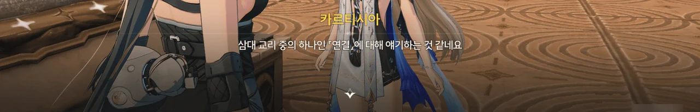















칸타렐라가 어제 본 것 중 신경 쓰이는 게 있다며, 방랑자에게서 「티르바인」을 빌려갔다.

현재 티르바인에 담긴 수호신의 권능은 방랑자의 성흔에 흡수된 후라, 지금의 티르바인은 빈 껍데기나 다름없을 텐데... 대체 무슨 생각인 걸까?



지금의 카르티시아에겐 전투 능력이 전무한 모양이다. 그러고 보면 여태껏 카르티시아가 직접적으로 전투에 나선 적은 없었지...







「호그니스」가 보관되어 있을 이곳은 원래 성직자들이 교리 수행을 시험하던 곳이자, 용의 모습을 한 에코들의 정원이었다고 한다.







길이 끊어진 채 곳곳에 흩어져 있는 주변의 구조물과 비석에 적힌 수도회의 삼대 교리 중 하나인 '연결'을 볼 때, 저 구조물들을 하나로 이어야 「호그니스」를 회수할 수 있을 것 같다.

















대체 무슨 원리인지는 잘 모르겠지만, 거대한 조각상 앞에 놓인 발판을 힘껏 짓누르면 그와 연결된 구조물이 그에 맞게 이동하며 서로 연결된다.



> 기관을 찾는 것보단 빠르니까요.

오늘의 PRO TIP: '머리가 모자라면 몸이 고생한다'의 대우는 '몸이 강력하면 머리가 고생하지 않는다'이다.







탄식 무덤의 섬에서 만난 「게르히넘」은 카르티시아가 타고 다니던 용이었다고 한다.

음... 그러니까 여기 돌아다니는 작은 용이 커서 된 게 그 게르히넘이었다는 건가?



「호그니스」를 찾긴 했는데, 수직으로 선 바닥에 꽂혀 있어 접근할 수 없다. 중력 전환기가 근처에 있긴 한데, 가시덤불이 중력 전환기로 가는 길을 막고 있다.

그럼 태워야지.



> 등이 포근해... 크흠! 괜찮아요.

... 귀엽네, 카르티시아.









중력 전환기를 통해 「호그니스」에 도착하긴 했는데, 아직 모든 지형이 연결되지 않은 탓인지, 칼을 뽑을 수가 없다.

이후로는 여태껏 했던 일의 반복이다. 카르티시아의 정화를 통해 '울림의 불씨'를 막고 있는 가시넝쿨을 없앤 다음, 길을 막고 있는 가시덤불을 불태우고 거대한 조각상을 내리치면 된다.







남은 조각상으로 가는 길에 활공과 전투가 추가된 걸 빼면, 이전과 크게 달라진 건 없다.

활강 도중 아무리 애를 써도 계속 경로에서 벗어나길래 도움말을 다시 읽어 보았는데, 경로에 이미 안착한 경우에는 아무런 조작을 하지 않아도 알아서 경로에 따라 방향을 전환한다고 적혀 있었다.
그 말대로 아무런 조작을 하지 않으니 경로가 안내하는 곳으로 부드럽게 이동하더라고...



아무튼, 모든 지형을 원래 모습대로 끼워 맞추는 데에 성공했다.
바로 그게 열쇠였던 걸까, 호그니스를 단단히 붙들고 있던 잠금 역시 사라졌다.





&nbsp;







내가 무슨 흐름을 놓치고 있는 건가 싶다.
여기 박혀 있는 「호그니스」에 별다른 함정이 설치되어 있을 것 같진 않아 보이던데...

지금껏 명조의 감성과 내 감성이 서로 일치하지 않는 경우가 단 한 번도 없었던 건 아닌지라 별생각 없이 넘어갈 수는 있지만, 이런 상황이 생길 때마다 몰입감이 한 단계 떨어지는 건 어쩔 수 없다.



> **「호그니스」**
> ***
> 긴 검에는 깊은 바다처럼 그윽한 기운이 풍긴다
> ***
> 이권의 검 ― 「호그니스」.
> 정체를 알 수 없는 긴 검. 카르티시아의 기억에 따르면 거꾸로 선 탑의 봉인을 푸는 중요한 열쇠인 듯하다.
> 긴 검에는 깊은 바다처럼 그윽한 기운이 풍긴다.
{.bq}

생김새나 플레이버 텍스트를 보아하니 명식 「레비아탄」과 연관된 검으로 보이는데... 그러면 저기 저 '이권'은 利權인 걸까, 아니면 異權인 걸까?









카르티시아에게 크리스토포로가 쓴 대본을 읽어주자, 자신은 그렇게 말을 하지 않는다며 몹시 부끄러워한다. 그래, 그건 내가 봐도 손발이 오그라드는 대사이긴 했어...





「호그니스」를 석좌에 꽂자, 탑을 감싸고 있던 꽃 하나가 사라졌다. 이제 남은 건 하나인가.











카르티시아를 '익숙한 **소녀**', 「레비아탄」의 침식으로 인해 이화(異化)한 「임페라토르」를 '마두어신의 **괴물**'이라고 하는 대사 스크립트를 보면서 든 생각이 하나 있다. 어쩌면 저게 둘의 본질이 아닐까 하는 그런 생각.

수호신의 모습을 일부 취하고 있지만 수호신의 말이 아닌 명식의 말을 하고 있는 저것은 그저 *괴물*일 뿐이고, 자신이 한 맹세를 지키기 위해 신으로 모시던 것에 칼을 겨눈 *소녀*가 바로 카르티시아이니까.









「게르히넘」의 행방을 묻는 카르티시아에게 "좋은 곳으로 갔다"라고 말해주었다.

「안나」, 「카시도모」, 「옴나트」가 누구인지는 몰라도, 아마 게르히넘처럼 카르티시아와 친하게 지내던 에코가 아니었을까?





카르티시아가 자신이 누구의 공명자이건 간에, 누구의 편에 서서 누굴 향해 칼을 휘둘러야 할지 명확히 깨달았다고 말한다.

순간 '저렇게 말하고 정작 나중에 가서 명식 편에 붙는 거 아냐?'라는 생각이 머릿속을 스쳐 지나갔지만, 그런 재미없는 전개가 나올 리는 없을 것이다. 아마 정말로 그런 전개가 된다면 쿠로 게임즈는 이미 불타 없어졌을 걸.









「호그니스」 안에 담겨있던 건 명식의 권능이었다.

「티르바인」에 수호신의 권능, '분리'를 담은 건 이해할 수 있지만, 대체 왜 명식의 권능을 「호그니스」에 담아 후대에 전달한 건지는 알 수가 없다. 명식의 주파수는 수호신과 그 공명자에게 피해를 줄 뿐이니까.

아무래도 카르티시아 말처럼 나머지 검을 확인해 봐야 알 수 있을 것 같다.



일단 하루 쉬었다가 내일 다시 출발하기로 했다.









본래 용 모습을 한 에코는 리나시타 사람들이 섬에 상륙하기 전부터 존재하던 잔상으로, 집단을 이룰 정도로 지능이 뛰어난 존재였으나, 수도회가 오랜 시간을 들여 길들인 끝에 수도회의 에코로 전락하고 말았다고 한다.

게르히넘은 그들의 왕이자 카르티시아의 친구 중 흑조를 뚫을 수 있을 거라 여겨진 유일한 친구였으나, 방랑자가 보았던 것처럼, 결국 흑조에 먹혀 사람들을 습격하는 존재로 전락하고 말았다.









그러게...

카르티시아가 공명한 건 수호신도, 명식도 아닌, 그 둘이 합쳐진 존재이다. 그렇다면 카르티시아는 수호신의 공명자인 걸까, 아니면 명식의 공명자인 걸까?





평소 파티의 체력은 힐러 캐릭터의 스킬을 통해 채웠기 때문에, 음식을 요리해 들고 다니지 않았다. 그게 지금 와서 발목을 잡을 줄이야!

여기서 카르티시아에게 맛있는 음식을 주었으면 어떤 대화를 들을 수 있었을까?











수호신의 권능뿐만 아니라 명식의 권능 또한 분리될 수 있음을 칸타렐라에게 알려주었다.
이제 카르티시아를 믿을 수 있는 거냐는 방랑자의 말에 칸타렐라는 "항상 긴장을 늦춰서는 안 돼"라며 아직 완전히 확신할 수 없다고 답한다.

이전에도 느낀 거지만, 갈수록 방랑자에 이입하기가 힘들어진다. 이걸 뭐라고 해야 할까, 지금의 방랑자는 칸타렐라가 카르티시아를 완전한 아군으로 인식하도록 만드는 데에 집착하고 있는 것처럼 느껴진다.









수호신 「임페라토르」의 권능은 분리이고, 명식 「레비아탄」의 권능은 융합과 동화이다. 그런데 포포는 이전에 흡수한 두 주파수 사이에 무언가 연관이 있어 보인다고 말하고 있다.

서로 정반대의 개념이라는 것 외에는 딱히 연관성이 없어 보이는데... 역시 이건 나머지 검을 찾아봐야 알 수 있는 걸까?
